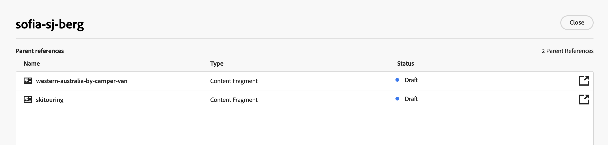
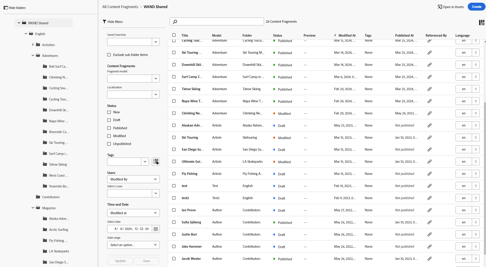

# 管理內容片段 {#managing-content-fragments}

瞭解如何管理您的 **內容片段** 在Adobe Experience Manager (AEM)as a Cloud Service中，從 [內容片段主控台](#content-fragments-console)、和 [內容片段編輯器](/help/sites-cloud/administering/content-fragments/authoring.md#content-fragment-editor). 這些內容片段可用作Headless內容的基礎，或用於編寫頁面。

>[!NOTE]
>
>您的專案團隊可視需要自訂主控台和編輯器。 另請參閱 [自訂內容片段控制檯和編輯器](/help/implementing/developing/extending/content-fragments-console-and-editor.md) 以取得更多詳細資料。

定義您的 [內容片段模型](#creating-a-content-model) 您可以使用這些專案來：

* [建立您的內容片段](#creating-a-content-fragment).
* 然後開啟 [內容片段編輯器](#opening-the-fragment-editor) 至 [編寫您的內容並管理您的變數](#editing-the-content-of-your-fragment).
* [管理標記](#manage-tags)
* [檢視和編輯屬性（中繼資料）](#viewing-and-editing-properties)
* [檢視結構樹](/help/sites-cloud/administering/content-fragments/authoring.md#structure-tree)

>[!NOTE]
>
>可以使用內容片段：
>
>* 的 [搭配GraphQL使用內容片段的Headless內容傳送](/help/sites-cloud/administering/content-fragments/content-delivery-with-graphql.md)，
>* 編寫頁面時；請參閱 [使用內容片段編寫頁面](/help/sites-cloud/authoring/fundamentals/content-fragments.md).

>[!NOTE]
>
>內容片段儲存為 **資產**. 主要受下列專案管理： **內容片段** 主控台，但也可從 [資產](/help/assets/content-fragments/content-fragments-managing.md) 主控台。

## 內容片段主控台 {#content-fragments-console}

內容片段主控台專用於管理、搜尋和建立內容片段。 它已針對在Headless內容中使用進行了最佳化，但在建立用於頁面編寫的內容片段時也會使用。

內容片段控制檯提供對片段和相關工作的直接存取。 主控台可直接從全域導覽的頂層存取。

如需進一步的詳細資訊，請參閱：

* [內容片段主控台的基本結構和處理](#basic-structure-handling-content-fragments-console)

* [提供的有關您的內容片段的資訊](#information-content-fragments)

* [內容片段控制檯中內容片段的動作](#actions-selected-content-fragment)

* [選取主控台中顯示的欄](#select-columns-console)

* [在內容片段控制檯中搜尋和篩選](#filtering-fragments)

* 一系列 [鍵盤快速鍵](/help/sites-cloud/administering/content-fragments/keyboard-shortcuts.md) 可在此主控台中使用

>[!NOTE]
>
>此主控台僅顯示內容片段。 它不會顯示其他資產型別，例如影像和影片。

>[!CAUTION]
>
>此主控台為 *僅限* 可於線上Adobe Experience Manager (AEM)as a Cloud Service取得。

### 主控台的基本結構和處理 {#basic-structure-handling-content-fragments-console}

選取 **內容片段** 將在新索引標籤中開啟主控台。

您可以看到有三個主要區域：

* 頂端工具列
   * 提供標準AEM功能
   * 也會顯示您的IMS組織
   * 提供各種 [動作](#actions-unselected)
* 左側面板
   * 您可以在此隱藏或顯示資料夾樹狀結構
   * 您可以選取樹的特定分支
   * 這可以調整大小以顯示巢狀資料夾
* 主要/右側面板 — 從這裡，您可以：
   * 檢視樹狀結構所選分支中的所有內容片段清單：
      * 所選資料夾的內容片段，以及所有子資料夾都會顯示：
         * 階層連結會指出位置，也可用來變更位置：
      * [顯示有關每個片段的資訊](#information-content-fragments)
         * [您可以選取要顯示哪些欄](#select-columns-console)
      * [各種資訊欄位](#information-content-fragments) 關於內容片段提供連結；根據欄位，這些連結可以：
         * 在編輯器中開啟適當的片段
         * 顯示參考的相關資訊
         * 顯示片段語言版本的相關資訊
      * [其他特定資訊欄位](#information-content-fragments) 關於內容片段可用於 [快速篩選](#fast-filtering)：
         * 在欄中選取值，並立即套用為篩選器
         * 支援快速篩選 **模型**， **狀態**， **修改者**， **標籤** 和 **發佈者** 欄。
      * 在欄標題上使用滑鼠游標時，下拉式動作選擇器和寬度滑桿隨即顯示。 這些功能可讓您：
         * 排序 — 選取適合的遞增或遞減動作。這將根據該欄排序整個表格。 排序功能只適用於適當的欄。
         * 調整欄大小 — 使用動作或寬度滑桿
      * 選取一或多個片段以供進一步使用 [動作](#actions-selected-content-fragment)
   * 使用 [搜尋](#searching-fragments) 方塊
   * 開啟 [篩選器面板](#filtering-fragments)

### 動作 {#actions}

在主控台中，您可以直接或在選取特定片段後使用一系列動作：

* 可直接執行各種動作 [可從主控台取得](#actions-unselected)
* 您可以 [選取一或多個內容片段以顯示適當的動作](#actions-selected-content-fragment)

#### 動作（未選取） {#actions-unselected}

某些動作可從控制檯使用 — 無需選取特定內容片段：

* **[建立](#creating-a-content-fragment)** 新的內容片段
* [篩選](#filtering-fragments) 根據謂詞選擇內容片段，並儲存篩選器以供將來使用
* [搜尋](#searching-fragments) 內容片段
* [自訂表格檢視以顯示選取的資訊欄](#select-columns-console)
* 使用 **在Assets中開啟** 直接開啟中的目前位置 **資產** 主控台

  >[!NOTE]
  >
  >此 **資產** 控制檯是用來存取資產，例如影像、影片等。  此主控台可以存取：
  >
  >* 使用 **在Assets中開啟** 連結（在內容片段主控台中）
  >* 直接從全域 **導覽** 窗格

#### （所選）內容片段的動作 {#actions-selected-content-fragment}

選取特定片段將開啟工具列，其焦點為該片段可用的動作。 您也可以選取多個片段 — 動作的選擇將據此調整。

* **[在新編輯器中開啟](#editing-the-content-of-your-fragment)**
* **[開啟](/help/assets/content-fragments/content-fragments-variations.md)** （在原始編輯器中）
* **[發佈](#publishing-and-previewing-a-fragment)** (和&#x200B;**[取消發佈](#unpublishing-a-fragment)**)
* **[管理標記](#manage-tags)**
* **[複製](/help/assets/manage-digital-assets.md)**
* **[移動](/help/assets/manage-digital-assets.md)**
* **[重新命名](/help/assets/manage-digital-assets.md)**
* **[刪除](#deleting-a-fragment)**

<!--
* **[Replace](#find-and-replace)**
-->

>[!NOTE]
>
>使用 **開啟** 以開啟所選片段於 *原始* 編輯者。

>[!NOTE]
>
>「發佈」、「取消發佈」、「刪除」、「移動」、「重新命名」和「複製」等動作會分別觸發非同步作業。 可以透過 AEM 非同步作業 UI 監視該作業的進度。

### 提供的有關您的內容片段的資訊 {#information-content-fragments}

主控台的主/右側面板（表格檢視）提供一系列有關您的內容片段的資訊。 有些專案也會提供進一步動作和/或資訊的直接連結：

* **名稱**
   * 提供在編輯器中開啟片段的連結。
* **模型**
   * 僅供參考。
   * 可用於 [快速篩選](#fast-filtering)
* **資料夾**
   * 提供可在主控台中開啟資料夾的連結。
將游標停留在資料夾名稱上將顯示 JCR 路徑。
* **狀態**
   * 僅供參考。
   * 可用於 [快速篩選](#fast-filtering)
* **預覽**
   * 僅供參考：
      * **同步中**：內容片段在網站上同步 **作者** 和 **預覽** 服務。
      * **不同步**：內容片段在上的不同步 **作者** 和 **預覽** 服務。 您需要 **發佈** 至 **預覽** 以確保兩個執行個體恢復同步。
      * 空白：內容片段不存在於 **預覽** 服務。
* **修改時間**
   * 僅供參考。
* **修改者:**
   * 僅供參考。
   * 可用於 [快速篩選](#fast-filtering).
* **標記**
   * 僅供參考。
   * 顯示與內容片段相關的所有標籤；主要變數和任何變數。
   * 可用於 [快速篩選](#fast-filtering).
* **發佈時間**
   * 僅供參考。
* **發佈者**
   * 僅供參考。
   * 可用於 [快速篩選](#fast-filtering).
* **引用者**:
   * 提供開啟對話方塊的連結，其中列出所有 [父引用](#parent-references-fragment)  片段；包括參照內容片段、體驗片段和頁面。 若要開啟特定參照，請按一下 **標題** 在對話方塊中。

     

* **語言**：表示任何 [語言](#language-copies-fragment) 份數

   * 表示內容片段的地區設定，以及本機/的總數[語言](#language-copies-fragment)  與內容片段相關聯的復本。

     

   * 按一下/點選計數，開啟顯示所有語言副本的對話方塊。 若要開啟特定語言副本，請按一下 **標題** 在對話方塊中。

     

## 建立內容片段 {#creating-content-fragments}

在建立內容片段之前，必須先建立基礎內容片段模式。

### 建立內容模型 {#creating-a-content-model}

[內容片段模型](/help/sites-cloud/administering/content-fragments/content-fragment-models.md) 必須先啟用並建立，才可使用結構化內容建立內容片段。

### 建立內容片段 {#creating-a-content-fragment}

若要建立內容片段：

1. 從 **內容片段** 主控台，選取 **建立** （右上方）。

   >[!NOTE]
   >
   >要預先定義新片段的位置，您可以導航到要建立片段的資料夾，也可以在建立過程中指定位置。

1. 此 **新內容片段** 對話方塊將會開啟，您可以從此處指定：

   * **位置**  — 這將會以目前位置自動完成，但您可以視需要選取其他位置
   * **內容片段模型**  — 從下拉式清單中選取要作為片段基礎的模式
   * **標題**
   * **名稱**  — 這將根據以下專案自動完成： **標題**，但如有需要，可加以編輯
   * **說明**

   

1. 選取 **建立**，或 **建立並開啟** 以保留您的定義。

## 內容片段的狀態 {#statuses-content-fragments}

內容片段在存在期間可以有數個狀態，如所示 [內容片段主控台](/help/sites-cloud/administering/content-fragments/managing.md#content-fragments-console) 和 [內容片段編輯器](/help/sites-cloud/administering/content-fragments/authoring.md)：

* **新增** （灰色）已建立新的內容片段，但沒有內容，因為它從未在內容片段編輯器中編輯或開啟。
* **草稿** （藍色）有人在內容片段編輯器中編輯或開啟（新）內容片段 — 但尚未發佈。
* **已發佈** （綠色）內容片段已發佈。
* **已修改** （橘色）內容片段在發佈後（但在發佈修改之前）已進行編輯。
* **已取消發佈** （紅色）已取消發佈內容片段。

## 編輯片段的內容（和變數） {#editing-the-content-of-your-fragment}

>[!IMPORTANT]
>
>如需完整詳細資訊， [請參閱編寫內容片段](/help/sites-cloud/administering/content-fragments/authoring.md)

若要開啟片段進行編輯：

1. 使用 **內容片段** 控制檯以導覽至您的內容片段位置。
1. 開啟片段進行編輯，方法是選取片段，然後 **在新編輯器中開啟** 工具列中的。

1. 片段編輯器將會開啟。 選取您需要的專案 **變數** amd會視需要進行變更（會自動儲存）：

   

## 檢視和管理標籤 {#manage-tags}

從內容片段主控台，您可以檢視任何在 **標籤** 欄；確認之後 [欄顯示](#select-columns-console).

### 管理標籤（主控台） {#manage-tags-console}

若要管理標籤：

1. 導覽至內容片段主控台。
1. 選取內容片段。
1. 選取 **管理標籤** （在工具列中）。
1. 使用標籤選取器來選取要套用的標籤，或移除標籤：

   

1. **儲存** 更新。 這會將您帶回主控台。

### 檢視和編輯標籤（編輯器） {#viewing-and-editing-tags}

您也可以使用檢視及編輯套用至片段的標籤 [屬性](/help/sites-cloud/administering/content-fragments/authoring.md) 標籤進行編輯。 顯示的資訊不盡相同： **主要** 和任何 **變數**.

## 檢視和編輯屬性（編輯器） {#viewing-and-editing-properties}

您可以使用檢視和編輯片段的屬性（中繼資料）。 [屬性](/help/sites-cloud/administering/content-fragments/authoring.md) 標籤進行編輯。 顯示的資訊不盡相同： **主要** 和任何 **變數**.

## 發佈和預覽片段 {#publishing-and-previewing-a-fragment}

您可以將內容片段發佈至：

* 此 **[發佈服務](/help/headless/deployment/architecture.md)**  — 完整公開存取

* 此 **[預覽服務](/help/headless/deployment/architecture.md)**  — 在完整可用之前預覽內容

  >[!CAUTION]
  >
  >發佈內容片段至 **預覽服務** 只能從內容片段主控台使用 **發佈** 動作。

  >[!NOTE]
  >
  >如需預覽環境的詳細資訊，請參閱：
  >
  >* [管理環境](/help/implementing/cloud-manager/manage-environments.md#access-preview-service)
  >* [設定預覽階層的 OSGi 設定](/help/implementing/preview-tier/preview-tier-configuring-osgi.md#configuring-osgi-settings-for-the-preview-tier)
  >* [使用 Developer Console 偵錯預覽](/help/implementing/preview-tier/preview-tier-configuring-osgi.md#debugging-preview-using-the-developer-console)

>[!CAUTION]
>
>如果您的片段以模型為基礎，則您應確保 [模型已發佈](/help/sites-cloud/administering/content-fragments/content-fragment-models.md#publishing-a-content-fragment-model).
>
>如果您發佈的內容片段尚未發佈模式，選擇清單會指出這一點，模式會與片段一起發佈。

### 發佈 {#publishing}

您可以使用以下工具發佈您的內容片段 **發佈** 選項來自：

* 的工具列 [內容片段主控台](#actions-selected-content-fragment)

   * 從清單中選取一或多個片段。

* 的工具列 [內容片段編輯器](/help/sites-cloud/administering/content-fragments/authoring.md#content-fragment-editor)

選取 **發佈** 動作：

1. 選取下列任一選項以開啟適當的對話方塊：

   * **現在**  — 選取 **發佈服務**，或 **預覽服務**；確認後，片段將立即發佈
   * **排程**  — 除了必要的服務之外，您還可以選擇片段的發佈日期和時間

1. 在對話方塊中提供所有詳細資料。 例如，對於已排程的發佈請求：

   

   >[!NOTE]
   >
   >必要時，您需要指定要發佈的參照。 依預設，參考資料也會發佈到預覽服務，以確保內容中沒有中斷。

1. 確認發佈動作。

發佈後，片段狀態將更新並顯示在編輯器和控制檯中。 如果您已指定排程發佈，則會顯示資訊。

>[!NOTE]
>
>此外，當您 [發佈使用片段的頁面](/help/sites-cloud/authoring/fundamentals/content-fragments.md#publishing)；片段將會列在頁面參考中。

## 取消發佈片段 {#unpublishing-a-fragment}

您可以取消發佈內容片段：

* 的工具列 [內容片段主控台](#actions-selected-content-fragment)

   * 從清單中選取一或多個片段。

* 的工具列 [內容片段編輯器](/help/sites-cloud/administering/content-fragments/authoring.md#content-fragment-editor)

在這兩種情況下，選取 **取消發佈** ，然後按一下 **現在** 或 **已排程**.

當相關對話方塊開啟時，您可以選取適當的服務：

>[!NOTE]
>
>此 **取消發佈** 只有在已發佈的片段可用時，動作才會顯示。

>[!CAUTION]
>
>如果片段已從其他片段或頁面引用，您將看到警告訊息，並需要確認您要繼續。

<!--
## Find and Replace {#find-and-replace}

The **Replace** option is available to find, and replace, specified text in your selected Content Fragment:

-->

## 刪除片段 {#deleting-a-fragment}

若要刪除片段：

1. 在 **內容片段** 主控台導覽至內容片段的位置。
1. 選取片段。
1. 選取 **刪除** 工具列中的。
1. 確認 **刪除** 動作。

>[!NOTE]
>
>此 **刪除** 目前發佈的片段無法使用，必須先取消發佈這些片段。

## 尋找片段的父參照 {#parent-references-fragment}

上層參考的詳細資訊可從以下網址存取：

* **引用** 內容片段控制檯的欄
* 此 [內容片段編輯器頂端工具列中的父參考連結](/help/sites-cloud/administering/content-fragments/authoring.md#view-parent-references)

兩者都提供開啟對話方塊的連結，其中列出該片段的所有父參照，包括參照內容片段、體驗片段和頁面。 若要開啟特定參照，請按一下 **標題**&#x200B;或連結圖示。

例如：

## 尋找片段的語言副本 {#language-copies-fragment}

可以從以下位置存取語言副本的詳細資料：

* 此 **語言** 的欄 [內容片段主控台](#information-content-fragments)
* 此 [內容片段編輯器的語言副本索引標籤](/help/sites-cloud/administering/content-fragments/authoring.md#view-language-copies)

圖示會指出內容片段的地區設定，以及與內容片段相關的地區設定/語言副本總數。 例如，從主控台：

按一下/點選計數，開啟顯示所有語言副本的對話方塊。 若要開啟特定語言副本，請按一下 **標題** 在對話方塊中。

## 選取主控台中顯示的欄 {#select-columns-console}

與其他主控台一樣，您可以設定可見且可動作的欄：

這會顯示您可以隱藏或顯示的欄清單：

## 篩選片段 {#filtering-fragments}

「篩選器」面板提供：

* 述詞選擇；
   * 包括內容片段模式、本地化、標籤、狀態列位等
   * 可以選取並組合一個或多個述詞來建立篩選器
* 機會 **儲存** 您的設定
* 擷取已儲存搜尋篩選器以供重複使用的選項

選取後， **篩選依據** 選項隨即顯示（在「搜尋」方塊下）。 可以從那裡取消選取它們。 例如：

### 快速篩選 {#fast-filtering}

您也可以按一下清單中的特定欄值來選取述詞。 您可以選取一或多個值來組合述詞。

例如，選取 **已發佈** 在 **狀態** 欄：

>[!NOTE]
>
>僅支援快速篩選 **模型**， **狀態**， **修改者**， **標籤**、和 **發佈者** 欄。

選取後，將顯示為篩選述詞，清單將據此篩選：

## 搜尋片段 {#searching-fragments}

搜尋方塊支援全文檢索搜尋。 在搜尋方塊中輸入搜尋字詞：

將提供選取的結果：

搜尋方塊也可讓您快速存取 **最近使用的內容片段** 和 **已儲存的搜尋**：

