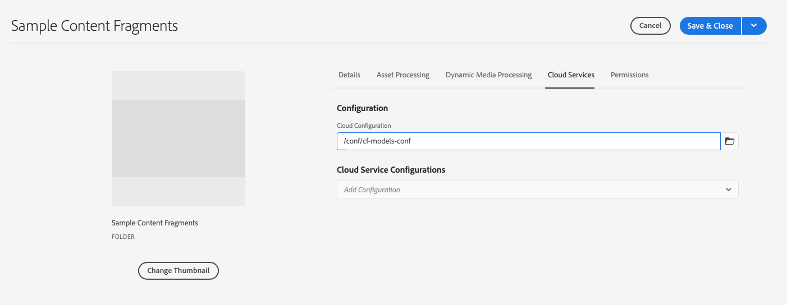

# 內容片段 — 設定 {#content-fragments-setup}

Adobe Experience Manager (AEM) as a Cloud Service中的內容片段可讓您準備內容，以準備用於多個位置和多個管道。 這非常適合於Headless傳送和頁面編寫。

要為內容片段功能啟用執行個體，您需要啟用：

* **內容片段模型**  — 必要

  >[!CAUTION]
  >
  >如果您未啟用 **內容片段模型**：
  >
  >* 此 **建立** 選項無法用於建立模型。
  >* 您將無法 [選取Sites設定以建立相關的端點](/help/headless/graphql-api/graphql-endpoint.md).

* **GraphQL持續查詢**  — 選填

設定您的執行個體已完成：

* 作者： [在設定瀏覽器中啟用功能](#enable-content-fragment-functionality-configuration-browser)
* 則 [將設定套用至個別資產資料夾](#apply-the-configuration-to-your-folder)

## 在設定瀏覽器中啟用內容片段功能 {#enable-content-fragment-functionality-configuration-browser}

若要使用內容片段功能、內容片段模型和GraphQL持續查詢，請 **必須** 首先透過 **設定瀏覽器**：

>[!NOTE]
>
>如需詳細資訊，請參閱 [設定瀏覽器](/help/implementing/developing/introduction/configurations.md#using-configuration-browser).

>[!NOTE]
>
>[子組態](/help/implementing/developing/introduction/configurations.md#configuration-resolution) （巢狀內嵌於其他設定的設定）完全支援與內容片段、內容片段模型和GraphQL查詢搭配使用。
>
>請注意：
>
>* 在子組態中建立模型後，無法將模型移動或複製到另一個子組態。
>
>* GraphQL端點將（仍然）以父（根）設定為基礎。
>
>* 將（仍）儲存與父（根）設定相關的持續查詢。

1. 導覽至「 **工具**」、「 **一般**」，然後開啟「 **設定瀏覽器**」。

1. 使用 **建立** 若要開啟對話方塊，您可以：

   1. 指定 **標題**.
   1. 建立後， **名稱** 會成為存放庫中的節點名稱。
您可以輸入名稱。 如果您將欄位留空，它將會根據標題自動產生，然後依據以下欄位進行調整 [AEM命名慣例](/help/implementing/developing/introduction/naming-conventions.md)；您可以視需要調整結果。
   1. 若要啟用其使用，請選取
      * **內容片段模型**
      * **GraphQL 持續性查詢**

      

1. 選取 **建立** 以儲存定義。

## 將設定套用至資料夾 {#apply-the-configuration-to-your-folder}

設定時 **全域** 會啟用內容片段功能，然後套用至任何資產資料夾 — 可透過存取 **資產** 主控台。

若要搭配可比的「資產」資料夾使用其他設定（因此不包括全域），您必須定義連線。 選取適當的 **設定** 在 **Cloud Service** 的標籤 **資料夾屬性** 的對應資料夾。

