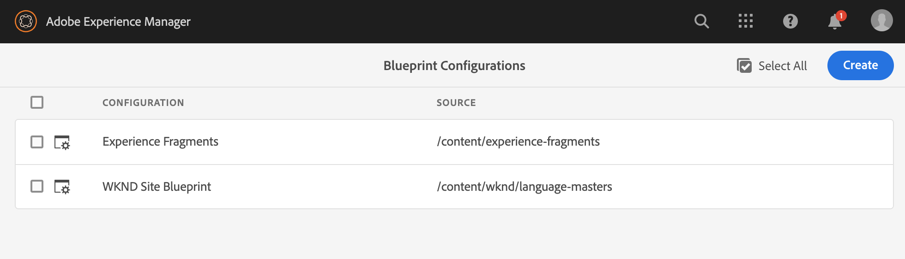
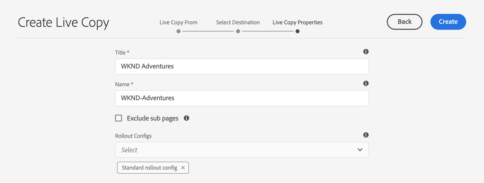
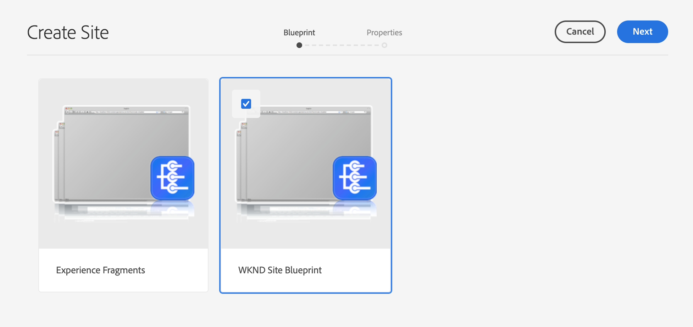
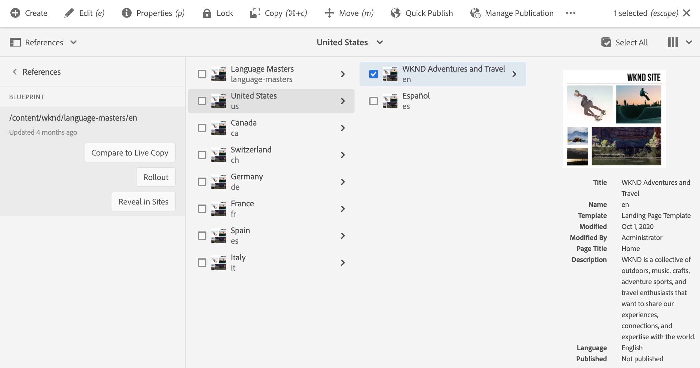
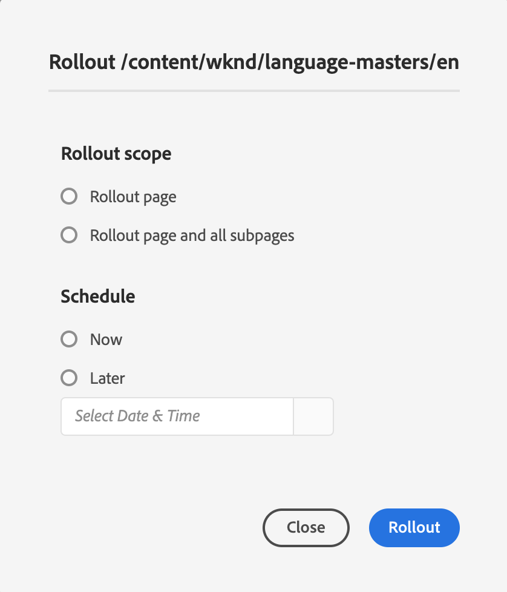
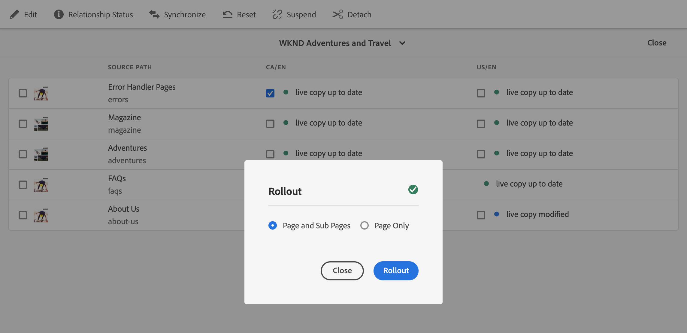
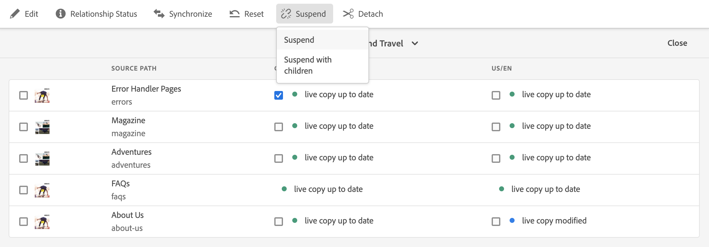
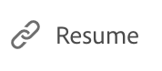
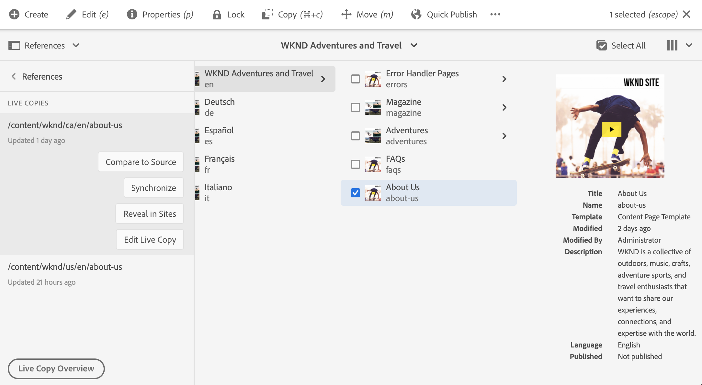

# 建立和同步Live Copy {#creating-and-synchronizing-live-copies}

您可以從頁面或Blueprint設定建立即時副本，以便在您的網站上重複使用該內容。 管理繼承和同步，您可以控制內容的變更傳播方式。

## 管理Blueprint設定 {#managing-blueprint-configurations}

Blueprint設定可識別您要用作一或多個Live Copy頁面之來源的現有網站。

>[!TIP]
>
>Blueprint設定可讓您將內容變更推送至Live Copy。 請參閱 [即時副本 — 源、藍圖和Blueprint配置](overview.md#source-blueprints-and-blueprint-configurations).

建立Blueprint設定時，您會選取定義Blueprint內部結構的範本。 預設的Blueprint範本假設來源網站具有下列特性：

* 網站有根頁面。
* 根目錄的直接子頁面是網站的語言分支。 建立即時副本時，會將語言顯示為要納入副本中的選用內容。
* 每個語言分支的根具有一個或多個子頁。 建立即時副本時，會顯示子頁面，以便您納入即時副本中。

>[!NOTE]
>
>不同的結構需要不同的Blueprint範本。

建立Blueprint設定後，請設定下列屬性：

* **名稱**:Blueprint配置的名稱
* **源路徑**:您用作來源之網站的根頁面路徑(Blueprint)
* **說明**. （可選）Blueprint配置的說明，顯示在建立網站時要選擇的Blueprint配置清單中

使用Blueprint設定時，您可將其與轉出設定建立關聯，此設定可決定來源/Blueprint的即時副本同步方式。 請參閱 [指定要使用的轉出設定](live-copy-sync-config.md#specifying-the-rollout-configurations-to-use).

### 建立和編輯Blueprint設定 {#creating-editing-blueprint-configurations}

Blueprint設定視為不可修改的資料，因此在執行階段無法編輯。 因此，任何設定變更都必須透過Git，使用CI/CD管道部署。

如需詳細資訊，請參閱文章 [Adobe Experience Manager(AEM)as a Cloud Service的重大變更。](/help/release-notes/aem-cloud-changes.md)

下列步驟僅供本機開發執行個體的管理員用於測試和開發用途。 任何AEMaaCS雲端例項都無法使用這些選項。

#### 在本機建立Blueprint設定 {#creating-a-blueprint-configuration}

要建立Blueprint配置：

1. [導覽](/help/sites-cloud/authoring/getting-started/basic-handling.md#global-navigation) 到 **工具** ，然後選取 **網站** 功能表。
1. 選擇 **藍圖** 開啟 **Blueprint設定** 主控台：

   

1. 選擇 **建立**。
1. 選取Blueprint範本，然後 **下一個** 繼續。
1. 選擇要用作Blueprint的源頁面；then **下一個** 繼續。
1. 定義：

   * **標題**:blueprint的強制標題
   * **說明**:可選的說明，以提供詳細資訊。

1. **建立** 將根據您的規範建立blueprint配置。

### 在本機編輯或刪除Blueprint設定{#editing-or-deleting-a-blueprint-configuration}

您可以編輯或刪除現有的Blueprint設定：

1. [導覽](/help/sites-cloud/authoring/getting-started/basic-handling.md#global-navigation) 到 **工具** ，然後選取 **網站** 功能表。
1. 選擇 **藍圖** 開啟 **Blueprint設定** 主控台：

   

1. 選取所需的Blueprint設定 — 工具列中會提供適當的動作：

   * **屬性**;您可以使用它來檢視，然後編輯設定的屬性。
   * **刪除**

## 建立即時副本 {#creating-a-live-copy}

建立即時副本的方式有很多。

### 建立頁面的即時副本 {#creating-a-live-copy-of-a-page}

您可以建立任何頁面或分支的即時副本。 當您建立「即時副本」時，可以指定用於同步內容的轉出設定：

* 選取的轉出設定會套用至「即時副本」頁面及其子頁面。
* 如果您未指定任何轉出設定，MSM會決定要使用的轉出設定。 請參閱 [指定要使用的轉出設定](live-copy-sync-config.md#specifying-the-rollout-configurations-to-use).

您可以建立任何頁面的即時副本：

* 由 [Blueprint設定](#creating-a-blueprint-configuration)
* 和與配置無連接的頁
* 在其他Live Copy的頁面中([巢狀即時副本](overview.md#nested-live-copies))

唯一的差異在於 **轉出** 源/blueprint頁面上的命令取決於blueprint配置是否引用源：

* 如果您從來源頁面建立即時副本，而 **is** 在blueprint設定中參考，則「轉出」命令將可在來源/blueprint頁面上使用。
* 如果您從來源頁面建立即時副本，而 **不是** 在blueprint設定中參考，則「轉出」命令將無法在來源/blueprint頁面上使用。

若要建立即時副本：

1. 在 **網站** 主控台選取 **建立**，然後 **Live Copy**.

   

1. 選取來源頁面，然後按一下或點選 **下一個**. 例如：

   

1. 指定即時副本的目標路徑（開啟即時副本的父資料夾/頁面），然後按一下或點選 **下一個**.

   

   >[!NOTE]
   >
   >目標路徑不能在源路徑內。

1. 輸入：

   * a **標題** ，以取得Advertising Cloud的說明。
   * a **名稱**，即用於URL中。

   

1. 使用 **排除子頁面** 核取方塊：

   * 已選取：僅建立所選頁面的即時副本（淺層即時副本）
   * 未選擇：建立包含所選頁面所有子系的即時副本（深層即時副本）

1. （選用）若要指定要用於即時副本的一或多個轉出設定，請使用 **轉出設定** 下拉式清單中選取。 選取的設定會顯示在下拉式選取器下方。
1. 按一下或點選 **建立**. 將會顯示確認訊息，您可從此處選取 **開啟** 或 **完成**.

### 從Blueprint設定建立網站的即時副本 {#creating-a-live-copy-of-a-site-from-a-blueprint-configuration}

使用Blueprint設定建立Live Copy，以根據Blueprint（來源）內容建立網站。 當您從Blueprint設定建立Live Copy時，請選取要複製的Blueprint來源的一或多個語言分支，然後選取要從語言分支複製的章節。 請參閱 [建立Blueprint設定](#creating-a-blueprint-configuration).

如果您從Live Copy中忽略某些語言分支，稍後可以新增這些分支。 請參閱 [在即時副本中建立即時副本（Blueprint設定）](#creating-a-live-copy-inside-a-live-copy-blueprint-configuration) 以取得詳細資訊。

>[!CAUTION]
>
>當Blueprint來源包含指向不同分支中某段落的連結和引用時，目標不會在Live Copy頁面中更新，而會保持指向原始目標。

建立網站時，請提供下列屬性的值：

* **初始語言**:要包含在即時副本中的Blueprint來源的語言分支
* **初始章節**:要包含在Live Copy中的Blueprint語言分支的子頁面
* **目的地路徑**:即時副本網站的根頁面位置
* **標題**:即時副本網站的根頁面標題
* **名稱**:（選用）儲存即時副本根頁面的JCR節點名稱（預設值以標題為基礎）
* **網站擁有者**:（選用）負責即時副本的一方的相關資訊
* **Live Copy**:選擇此選項可與源站點建立即時關係。 如果未選擇此選項，則將建立Blueprint的副本，但隨後不會與源同步。
* **轉出設定**:（選用）選取一或多個轉出設定，以用於同步即時副本。 依預設，轉出設定繼承自Blueprint。 請參閱 [指定要使用的轉出設定](live-copy-sync-config.md#specifying-the-rollout-configurations-to-use) 以取得更多詳細資訊。

若要從Blueprint設定建立網站的即時副本：

1. 在 **網站** 主控台，選取 **建立**，然後 **網站** 從下拉式選取器。
1. 選取要作為即時副本來源的Blueprint設定，然後繼續 **下一個**:

   

1. 使用 **初始語言** 選取器，指定要用於即時副本的blueprint網站語言。

   預設會選取所有可用語言。 若要移除語言，請按一下或點選 **X** 顯示在語言旁邊。

   例如：

   

1. 使用 **初始章節** 下拉式清單，選取要包含在即時副本中的blueprint區段。 預設會包含所有可用章節，但可移除。
1. 提供剩餘屬性的值，然後選取 **建立**. 在確認對話方塊中，選取 **完成** 返回 **網站** 主控台，或 **開啟網站** 以開啟網站的根頁面。

### 在即時副本中建立即時副本（Blueprint設定） {#creating-a-live-copy-inside-a-live-copy-blueprint-configuration}

當您在現有即時副本內建立即時副本時（使用Blueprint設定建立），您可以插入任何原本建立即時副本時未包含的語言副本或章節。

## 監控您的Live Copy {#monitoring-your-live-copy}

### 查看即時副本的狀態 {#seeing-the-status-of-a-live-copy}

Live Copy頁面的屬性會顯示有關Live Copy的下列資訊：

* **來源**:即時副本頁面的來源頁面
* **狀態**:Live Copy的同步狀態，包括Live Copy是否與源更新、上次同步發生的時間以及執行同步的人員
* **設定**:

   * 頁面是否仍受即時副本繼承的約束
   * 設定是否繼承自上層頁面
   * 即時副本使用的任何轉出設定

要查看屬性，請執行以下操作：

1. 在 **網站** 主控台，選取「即時副本」頁面並開啟屬性。
1. 選取 **Live Copy** 標籤。

   例如：

   

   請參閱 [使用即時副本概述](live-copy-overview.md#using-the-live-copy-overview) 如需詳細資訊，請參閱即時副本概述主控台一文。

### 查看Blueprint頁面的即時副本 {#seeing-the-live-copies-of-a-blueprint-page}

Blueprint頁面（在Blueprint設定中參照）提供您一份Live Copy頁面清單，這些頁面會以目前(Blueprint)頁面作為來源。 使用此清單來追蹤即時副本。 清單會顯示在 **Blueprint** 的 [頁面屬性](/help/sites-cloud/authoring/fundamentals/page-properties.md).

## 同步您的即時副本 {#synchronizing-your-live-copy}

有許多方法可同步您的即時副本。

### 展開Blueprint {#rolling-out-a-blueprint}

展開Blueprint頁面，將內容變更推送至Live Copy。 A **轉出** 動作會執行使用的轉出設定 [轉出時](live-copy-sync-config.md#rollout-triggers) 觸發。

>[!NOTE]
>
>如果在Blueprint分支和相依的Live Copy分支中建立了具有相同頁面名稱的新頁面，則可能會發生衝突。
>
>此類 [轉出時需要處理和解決衝突](rollout-conflicts.md).

#### 從頁面屬性轉出Blueprint {#rolling-out-a-blueprint-from-page-properties}

1. 在 **網站** 主控台，在blueprint中選取頁面並開啟屬性。
1. 開啟 **Blueprint** 標籤。
1. 選擇 **轉出**.

   

1. 指定頁面和任何子頁面，然後使用勾號確認：

   

1. 指定是否應立即執行轉出工作(**現在**)，或&#x200B;**稍後**)。

   

轉出會以非同步作業處理，並可在 [***非同步作業狀態** 頁面。](/help/operations/asynchronous-jobs.md#monitor-the-status-of-asynchronous-operations)

#### 從參考邊欄展開Blueprint {#roll-out-a-blueprint-from-the-reference-rail}

1. 在 **網站** 主控台，選取即時副本中的頁面並開啟 **[參考](/help/sites-cloud/authoring/getting-started/basic-handling.md#references)** 面板（從工具列）。
1. 選取 **Blueprint** 選項，顯示與此頁關聯的藍圖。
1. 從清單中選取所需的Blueprint。
1. 按一下或點選 **轉出**.

   

1. 系統會要求您確認轉出的詳細資訊：

   * **轉出範圍**:

      指定範圍是僅針對所選頁面，還是應包含子頁面。

   * **計劃**:

      指定是否應立即執行轉出工作(**現在**)或稍後日期/時間(**稍後**)。

      

1. 確認這些詳細資料後，請選取 **轉出** 來執行動作。

轉出會以非同步作業處理，並可在 [**非同步作業狀態** 頁面。](/help/operations/asynchronous-jobs.md#monitor-the-status-of-asynchronous-operations)

#### 從即時副本概述中展開Blueprint {#roll-out-a-blueprint-from-the-live-copy-overview}

此 [**轉出** 動作也可從即時副本概述中取得](live-copy-overview.md#using-the-live-copy-overview)，當選取Blueprint頁面時。

1. 開啟 [即時副本概述](live-copy-overview.md#using-the-live-copy-overview) 並選擇「Blueprint頁」。
1. 選擇 **轉出** 的上界。

   

1. 指定頁面和任何子頁面，然後使用勾號確認：

   

1. 指定是否應立即執行轉出工作(**現在**)，或&#x200B;**稍後**)。

   

轉出會以非同步作業處理，並可在 [**非同步作業狀態** 頁面。](/help/operations/asynchronous-jobs.md#monitor-the-status-of-asynchronous-operations)

### 同步即時副本 {#synchronizing-a-live-copy}

同步「即時副本」頁面，以從來源提取內容變更至「即時副本」。

#### 從頁面屬性同步即時副本 {#synchronize-a-live-copy-from-page-properties}

同步即時副本，以從來源提取變更至即時副本。

>[!NOTE]
>
>同步會執行使用 [轉出時](live-copy-sync-config.md#rollout-triggers) 觸發。

1. 在 **網站** 主控台，選取「即時副本」頁面並開啟屬性。
1. 開啟 **Live Copy** 標籤。
1. 按一下或點選 **同步**.

   

   請求確認，請使用 **同步** 繼續。

#### 從即時副本概述同步即時副本 {#synchronize-a-live-copy-from-the-live-copy-overview}

此 [「即時副本概述」中也提供同步操作](live-copy-overview.md#using-the-live-copy-overview)，即選取即時副本頁面時。

1. 開啟 [即時副本概述](live-copy-overview.md#using-the-live-copy-overview) 並選擇「即時副本」頁。
1. 選擇 **同步** 的上界。
1. 確認 **轉出** 在指定是否要包括之後，在對話方塊中執行動作：

   * **頁面和子頁面**
   * **僅頁面**

   

## 變更即時副本內容 {#changing-live-copy-content}

若要變更即時副本內容，您可以：

* 將段落新增至頁面。
* 中斷任何頁面或元件的即時副本繼承，以更新現有內容。

>[!TIP]
>
>如果您在即時副本中手動建立新頁面，則新頁面是即時副本的本機頁面，這表示它沒有附加的對應來源頁面。
>
>若要建立屬於關係一部分的本機頁面，最佳作法是在來源中建立本機頁面並執行深層轉出。 這會將頁面在本機建立為Live Copy。

>[!NOTE]
>
>如果在Blueprint分支和相依的Live Copy分支中建立了具有相同頁面名稱的新頁面，則可能會發生衝突。
>
>此類 [轉出時需要處理和解決衝突](rollout-conflicts.md).

### 將元件新增至即時副本頁面 {#adding-components-to-a-live-copy-page}

您隨時都可以將元件新增至Live Copy頁面。 即時副本及其段落系統的繼承狀態無法控制您新增元件的能力。

當「即時副本」頁面與來源頁面同步時，新增的元件維持不變。 另請參閱 [變更即時副本頁面上的元件順序。](#changing-the-order-of-components-on-a-live-copy-page)

>[!TIP]
>
>在本機對標示為容器的元件所做的變更，將不會由轉出時的Blueprint內容覆寫。 請參閱 [MSM最佳實務](best-practices.md#components-and-container-synchronization) 以取得更多資訊。

### 暫停頁面的繼承 {#suspending-inheritance-for-a-page}

建立Live Copy時，Live Copy設定會儲存在複製頁面的根頁面上。 根頁面的所有子頁面都會繼承Live Copy設定。 Live Copy頁面上的元件也會繼承Live Copy設定。

您可以暫停「即時副本」頁面的「即時副本」繼承，以便變更頁面屬性和元件。 暫停繼承時，頁面屬性和元件不再與源同步。

>[!TIP]
>
>您也可以 [分離即時副本](#detaching-a-live-copy) 從其藍圖中刪除所有連接。 與暫停繼承不同，分離操作是永久的且不可逆的。

#### 暫停頁面屬性的繼承 {#suspending-inheritance-from-page-properties}

暫停頁面上的繼承：

1. 使用 **檢視屬性** 命令 **網站** 主控台或使用 **頁面資訊** 」。
1. 按一下或點選 **Live Copy** 標籤。
1. 選擇 **暫停** 的上界。 然後，您可以選取以下任一項：

   * **暫停**:僅暫停當前頁。
   * **暫停與子代**:將當前頁面與任何子頁面一起暫停。

1. 選擇 **暫停** 在確認對話方塊上。

#### 暫停即時副本的繼承概述 {#suspending-inheritance-from-the-live-copy-overview}

此 [「即時副本概述」中也提供「暫停」動作](live-copy-overview.md#using-the-live-copy-overview)，即選取即時副本頁面時。

1. 開啟 [即時副本概述](live-copy-overview.md#using-the-live-copy-overview) 並選擇「即時副本」頁。
1. 選擇 **暫停** 的上界。
1. 從以下項目中選取適當的選項：

   * **擱置**
   * **暫停子項**

   

1. 確認 **暫停** 中的動作 **暫停即時副本** 對話框：

   

### 繼續頁面的繼承 {#resuming-inheritance-for-a-page}

暫停頁面的即時副本繼承是暫時動作。 一旦暫停 **繼續** 動作可供使用，可讓您重新建立即時關係。

當您重新啟用繼承時，頁面不會自動與來源同步。 如果需要，您可以請求同步，可以：

* 在 **繼續**/**還原** 對話；例如：

   

* 稍後階段，手動選取同步動作。

>[!NOTE]
>
>當您重新啟用繼承時，頁面不會自動與來源同步。 如果需要，您可以在繼續或稍後手動請求同步。

#### 繼續從頁面屬性繼承 {#resuming-inheritance-from-page-properties}

一次 [暫停](#suspending-inheritance-from-page-properties) the **繼續** 動作會變成頁面屬性的工具列中：

選取後，會顯示對話方塊。 您可以視需要選取同步，然後確認動作。

#### 從即時副本概觀繼續即時副本頁面 {#resume-a-live-copy-page-from-the-live-copy-overview}

此 [「即時副本概述」也提供「繼續」動作](live-copy-overview.md#using-the-live-copy-overview)，即選取即時副本頁面時。

1. 開啟 [即時副本概述](live-copy-overview.md#using-the-live-copy-overview) 並選擇已掛起的即時副本頁。 頁面將顯示為 **已取消繼承**.
1. 選擇 **繼續** 的上界。
1. 指出您是否要在還原繼承後同步頁面，然後確認 **繼續** 中的動作 **繼續即時副本** 對話框。

### 變更繼承深度（淺層/深層） {#changing-inheritance-depth-shallow-deep}

在現有的Live Copy上，您可以變更頁面的深度，亦即是否包含子頁面。

* 切換為淺層即時副本：

   * 會立即生效，而且是不可逆的。

   * 從Live Copy中顯式刪除子頁。 如果撤消，則無法保留對子項的進一步修改。

   * 將刪除任何子體 `LiveRelationships` 即使有巢狀 `LiveCopies`.

* 切換至深層即時副本：

   * 未修改子頁。
   * 若要查看切換的效果，您可以進行轉出，任何內容修改都會根據轉出設定套用。

* 切換為淺層即時副本，然後切換回深層：

   * 將淺層Live Copy的所有子項視為手動建立，因此會使用 `[oldname]_msm_moved name`.

要指定或更改深度：

1. 使用 **檢視屬性** 命令 **網站** 主控台或使用 **頁面資訊** 」。
1. 按一下或點選 **Live Copy** 標籤。
1. 在 **設定** 部分，設定或清除 **即時副本繼承** 選項（取決於是否包含子頁面）:

   * 已勾選 — 深層即時副本（包含子頁面）
   * 未勾選 — 淺層即時副本（排除子頁面）

   >[!CAUTION]
   >
   >切換為淺層即時副本將立即生效，且不可逆。
   >
   >請參閱 [即時副本 — 組成](overview.md#live-copies-composition) 以取得更多資訊。

1. 按一下或點選 **儲存** 以保留更新。

### 取消元件的繼承 {#cancelling-inheritance-for-a-component}

取消元件的「即時副本」繼承，使元件不再與源元件同步。 您可以在稍後視需要啟用繼承。

>[!NOTE]
>
>當您重新啟用繼承時，元件不會自動與源同步。 如果需要，可以手動請求同步。

取消繼承以更改元件內容或刪除元件：

1. 按一下或點選您要取消繼承的元件。

   

1. 在元件工具列上，按一下或點選 **取消繼承** 表徵圖。

   

1. 在「取消繼承」對話方塊中，使用確認動作 **是**.

   元件工具列會更新為包含所有（適當）的編輯命令。

### 重新啟用元件的繼承 {#re-enabling-inheritance-for-a-component}

若要啟用元件的繼承，請按一下或點選 **重新啟用繼承** 圖示。

### 變更即時副本頁面上的元件順序 {#changing-the-order-of-components-on-a-live-copy-page}

如果「即時副本」包含屬於段落系統的元件，則該段落系統的繼承遵循以下規則：

* 可修改繼承段落系統中的元件順序，即使建立繼承。
* 轉出時，元件的順序將從Blueprint中還原。 如果新元件在轉出前已新增至即時副本，則會重新排序這些元件以及上方新增的元件。
* 如果取消段落系統的繼承，轉出時不會還原元件順序，且會維持即時副本中的原樣。

>[!NOTE]
>
>在還原段落系統上取消的繼承時，元件的順序 **不會自動還原** 從藍圖里。 如果需要，可以手動請求同步。

使用以下過程取消段落系統的繼承。

1. 開啟「即時副本」頁面。
1. 將現有元件拖曳至頁面上的新位置。
1. 在 **取消繼承** 對話框，確認操作 **是**.

### 覆寫即時副本頁面的屬性 {#overriding-properties-of-a-live-copy-page}

Live Copy頁面的頁面屬性預設會繼承自來源頁面，且無法編輯。

當您需要變更即時副本的屬性值時，可以取消屬性的繼承。 連結圖示表示已為屬性啟用繼承。

取消繼承時，可以更改屬性值。 斷開連結表徵圖表示繼承被取消。

您稍後可以視需要重新啟用屬性的繼承。

>[!NOTE]
>
>當您重新啟用繼承時，「即時副本」頁面屬性不會自動與來源屬性同步。 如果需要，可以手動請求同步。

1. 使用 **檢視屬性** 選項 **網站** 主控台或 **頁面資訊** 表徵圖。
1. 若要取消屬性的繼承，請按一下或點選屬性右側的連結圖示。

   

1. 在 **取消繼承** 確認對話方塊，按一下或點選 **是**.

### 還原即時副本頁面的屬性 {#revert-properties-of-a-live-copy-page}

若要啟用屬性的繼承，請按一下或點選 **還原繼承** 表徵圖。

### 重設即時副本頁面 {#resetting-a-live-copy-page}

您可以重設「即時副本」頁面，以便：

* 刪除所有繼承取消和
* 將頁面傳回與來源頁面相同的狀態。

重設會影響您對頁面屬性、段落系統和元件所做的變更。

#### 從頁面屬性重設即時副本頁面 {#reset-a-live-copy-page-from-the-page-properties}

1. 在 **網站** 主控台，選取「即時副本」頁面並選取 **檢視屬性**.
1. 開啟 **Live Copy** 標籤。
1. 選擇 **重設** 的上界。

   

1. 在 **重設Live Copy** 對話框，使用確認 **重設**.

#### 從Live Copy概述重設Live Copy頁面 {#reset-a-live-copy-page-from-the-live-copy-overview}

此 [**重設** 動作也可從即時副本概述中取得](live-copy-overview.md#using-the-live-copy-overview)，即選取即時副本頁面時。

1. 開啟 [即時副本概述](live-copy-overview.md#using-the-live-copy-overview) 並選擇「即時副本」頁。
1. 選擇 **重設** 的上界。
1. 確認 **重設** 中的動作 **重設Live Copy** 對話框：

   

## 比較即時副本頁面與Blueprint頁面 {#comparing-a-live-copy-page-with-a-blueprint-page}

若要追蹤您所做的變更，您可以在 **參考** 並與其Live Copy頁面進行比較：

1. 在 **網站** 主控台， [導覽至Blueprint或「即時副本」頁面，並加以選取。](/help/sites-cloud/authoring/getting-started/basic-handling.md#viewing-and-selecting-resources)
1. 開啟 **[參考](/help/sites-cloud/authoring/getting-started/basic-handling.md#references)** 面板，並視內容選取其中一項：

   * **Blueprint**
   * **即時副本**

1. 根據上下文選擇以下任一選項，選擇您的特定即時副本：

   * **與 Blueprint 比較**
   * **與即時副本比較**

   例如：

   

1. 「即時副本」和Blueprint頁面將並排開啟。

   如需使用比較功能的完整資訊，請參閱 [頁面差異](/help/sites-cloud/authoring/features/page-diff.md).

## 分離即時副本 {#detaching-a-live-copy}

分離動作會永久移除即時副本與其來源/藍圖頁面之間的即時關係。 所有與MSM相關的屬性會從Live Copy中移除，而Live Copy頁面會變成獨立副本。

>[!CAUTION]
>
>分離即時副本後，無法恢復即時關係。
>
>要刪除與以後恢復的選項的即時關係，您可以 [取消即時副本繼承](#suspending-inheritance-for-a-page) ，以取得Advertising Cloud的說明。

您使用的樹狀結構內的哪個位置有可能 **分離**:

* **即時副本的根頁上的分離**

   在即時副本的根頁面上執行此操作時，會移除Blueprint的所有頁面與其即時副本之間的即時關係。

   Blueprint中頁面的進一步變更 **不會** 會影響即時副本。

* **在即時副本的子頁上分離**

   在Live Copy中的子頁面（或分支）上執行此操作時：

   * 該子頁面（或分支）的即時關係會移除，且
   * 即時副本分支中的（子）頁面會視為已手動建立。

   不過，子頁面仍受上層分支的即時關係所限制，因此Blueprint頁面的進一步轉出將同時進行：

   1. 重新命名分離的頁面：

      * 這是因為MSM會將它們視為手動建立的頁面，而造成衝突，因為這些頁面的名稱與它嘗試建立的Live Copy頁面相同。
   1. 以原始名稱建立新的Live Copy頁面，其中包含轉出的變更。

   >[!NOTE]
   >
   >請參閱 [MSM轉出衝突](rollout-conflicts.md) 以了解這些情況的詳情。

### 從「頁面屬性」中分離「即時副本」頁面 {#detach-a-live-copy-page-from-the-page-properties}

要分離即時副本，請執行以下操作：

1. 在 **網站** 主控台，選取「即時副本」頁面，然後按一下或點選 **檢視屬性**.
1. 開啟 **Live Copy** 標籤。
1. 在工具列上，選取 **分離**.

   

1. 將顯示確認對話框，請選擇 **分離** 以完成動作。

### 從「即時副本概述」中分離即時副本頁面 {#detach-a-live-copy-page-from-the-live-copy-overview}

此 [「即時副本概述」中也提供分離操作](live-copy-overview.md#using-the-live-copy-overview)，即選取即時副本頁面時。

1. 開啟 [即時副本概述](live-copy-overview.md#using-the-live-copy-overview) 並選擇「即時副本」頁。
1. 選擇 **分離** 的上界。
1. 確認 **分離** 中的動作 **分離即時副本** 對話框：

   
