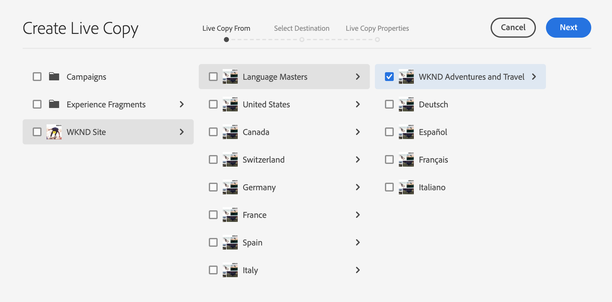
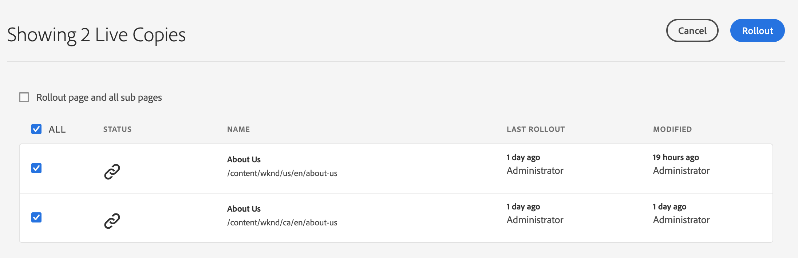

# 建立和同步即時拷貝{#creating-and-synchronizing-live-copies}

您可以從頁面或藍圖設定建立即時副本，以便在整個網站上重複使用該內容。 管理繼承和同步，您可以控制內容的變更傳播方式。

## 管理Blueprint配置{#managing-blueprint-configurations}

Blueprint設定可識別您要用作一或多個即時副本頁面來源的現有網站。

>[!TIP]
>
>Blueprint設定可讓您將內容變更推送至即時副本。 請參閱[即時副本——源、藍圖和藍圖配置](overview.md#source-blueprints-and-blueprint-configurations)。

當您建立Blueprint設定時，您會選取範本，以定義Blueprint的內部結構。 預設的Blueprint範本假設來源網站具有下列特性：

* 網站有根頁面。
* 根目錄的直接子頁面是網站的語言分支。 建立即時副本時，這些語言會顯示為要包含在副本中的選用內容。
* 每個語言分支的根目錄有一個或多個子頁。 建立即時副本時，會顯示子頁面，以便您加入即時副本。

>[!NOTE]
>
>不同的結構需要不同的藍圖範本。

建立Blueprint設定後，請設定下列屬性：

* **名稱**:Blueprint設定的名稱
* **源路徑**:您用作來源之網站的根頁面路徑(Blueprint)
* **說明**. （可選）藍圖設定的說明，此描述會顯示在建立網站時要選擇的藍圖設定清單中

當您的Blueprint設定被使用時，您可將它與轉出設定建立關聯，此設定可決定來源/Blueprint的即時副本同步化方式。 請參閱[指定要使用的轉出配置](live-copy-sync-config.md#specifying-the-rollout-configurations-to-use)。

### 建立Blueprint配置{#creating-a-blueprint-configuration}

要建立Blueprint配置：

1. [導](/help/sites-cloud/authoring/getting-started/basic-handling.md#global-navigation) 覽至「工 **** 具」選單，然後選取「工 **** 具」選單。
1. 選擇&#x200B;**Blueprints**&#x200B;以開啟&#x200B;**Blueprint Configurations**&#x200B;控制台：

   

1. 選擇 **建立**。
1. 選擇藍圖模板，然後選擇&#x200B;**Next**&#x200B;繼續。
1. 選取要用作藍圖的來源頁面；然後&#x200B;**Next**&#x200B;繼續。
1. 定義：

   * **標題**:藍圖的必備標題
   * **說明**:提供詳細資訊的選用說明。

1. **Create將** 根據您的規格建立藍圖設定。

### 編輯或刪除Blueprint配置{#editing-or-deleting-a-blueprint-configuration}

您可以編輯或刪除現有的Blueprint設定：

1. [導](/help/sites-cloud/authoring/getting-started/basic-handling.md#global-navigation) 覽至「工 **** 具」選單，然後選取「工 **** 具」選單。
1. 選擇&#x200B;**Blueprints**&#x200B;以開啟&#x200B;**Blueprint Configurations**&#x200B;控制台：

   

1. 選擇所需的Blueprint配置——工具欄中將提供相應的操作：

   * **屬性**;您可以使用它來查看，然後編輯配置的屬性。
   * **刪除**

## 建立即時副本{#creating-a-live-copy}

建立即時副本的方式有許多。

### 建立頁面的即時副本{#creating-a-live-copy-of-a-page}

您可以建立任何頁面或分支的即時副本。 當您建立即時副本時，可以指定轉出設定，以用於同步內容：

* 選取的轉出設定會套用至即時副本頁面及其子頁面。
* 如果您未指定任何轉出設定，MSM會決定要使用哪些轉出設定。 請參閱[指定要使用的轉出配置](live-copy-sync-config.md#specifying-the-rollout-configurations-to-use)。

您可以建立任何頁面的即時副本：

* [blueprint configuration](#creating-a-blueprint-configuration)參考的頁面
* 與配置無連接的頁面
* 其他即時副本（[巢狀即時副本](overview.md#nested-live-copies)）頁面內的即時副本

唯一的區別是，源／藍圖頁上的&#x200B;**Rovolt**&#x200B;命令的可用性取決於藍圖配置是否引用了源：

* 如果您從Blueprint設定中參考的&#x200B;**為**&#x200B;來源頁面建立即時副本，則Rovolt命令將可在來源/Blueprint頁面上使用。
* 如果您從Blueprint設定中未&#x200B;**參考的來源頁面建立即時副本，則來源/Blueprint頁面上將無法使用Rolovate命令。**

若要建立即時副本：

1. 在&#x200B;**Sites**&#x200B;控制台中，選擇&#x200B;**建立**，然後選擇&#x200B;**即時副本**。

   

1. 選擇源頁面，然後按一下或點選&#x200B;**Next**。 例如：

   

1. 指定即時副本的目標路徑（開啟即時副本的父資料夾／頁面），然後按一下或點選&#x200B;**Next**。

   

   >[!NOTE]
   >
   >目標路徑不能位於源路徑中。

1. 輸入：

   * a **頁面的標題**。
   * a **名稱**，用於URL。

   

1. 使用&#x200B;**排除子頁面**&#x200B;核取方塊：

   * 已選取：僅建立選取頁面的即時副本（淺層即時副本）
   * 未選取：建立包含所選頁面之所有子項的即時副本（深度即時副本）

1. （可選）若要指定要用於即時副本的一或多個轉出配置，請使用&#x200B;**轉出配置**&#x200B;下拉清單來選擇它們。 選取的組態會顯示在下拉式選取器下方。
1. 按一下或點選「**建立**」。 將會顯示確認消息，您可以從此處選擇&#x200B;**Open**&#x200B;或&#x200B;**Done**。

### 從Blueprint Configuration {#creating-a-live-copy-of-a-site-from-a-blueprint-configuration}建立網站的即時副本

使用Blueprint設定建立即時副本，以根據Blueprint（來源）內容建立網站。 當您從Blueprint設定建立即時副本時，請選取要複製之Blueprint來源的一或多個語言分支，然後選取要從語言分支複製的章節。 請參閱[建立藍圖組態](#creating-a-blueprint-configuration)。

如果您在即時副本中省略某些語言分支，您稍後可以加入。 如需詳細資訊，請參閱[在即時副本中建立即時副本(Blueprint Configuration)](#creating-a-live-copy-inside-a-live-copy-blueprint-configuration)。

>[!CAUTION]
>
>當藍圖來源包含指向不同分支中某個段落的連結和參考時，「即時副本」頁面不會更新目標，但仍會指向原始目標。

建立網站時，請提供下列屬性的值：

* **初始語言**:要包含在即時副本中之Blueprint來源的語言分支
* **初始章節**:要包含在即時副本中的Blueprint語言分支的子頁面
* **目標路徑**:即時副本網站的根頁面位置
* **標題**:即時副本網站的根頁面標題
* **名稱**:（可選）儲存即時副本根頁面的JCR節點名稱（預設值以標題為基礎）
* **網站擁有者**:（可選）有關負責即時副本的一方的資訊
* **即時副本**:選擇此選項可建立與來源網站的即時關係。如果未選擇此選項，則會建立Blueprint的副本，但隨後不會與源同步。
* **轉出設定**:（可選）選取一或多個轉出設定，以用於同步即時副本。依預設，轉出設定會繼承自Blueprint。 如需詳細資訊，請參閱[指定要使用的轉出組態](live-copy-sync-config.md#specifying-the-rollout-configurations-to-use)。

要從Blueprint配置建立站點的即時副本，請：

1. 在&#x200B;**Sites**&#x200B;控制台中，從下拉式選擇器中選擇&#x200B;**Create**，然後選擇&#x200B;**Site**。
1. 選擇要用作即時副本源的Blueprint配置，然後繼續&#x200B;**Next**:

   

1. 使用&#x200B;**初始語言**&#x200B;選擇器指定藍圖網站用於即時副本的語言。

   預設會選取所有可用語言。 若要移除語言，請按一下或點選語言旁顯示的&#x200B;**X**。

   例如：

   

1. 使用&#x200B;**初始章節**&#x200B;下拉式清單，選取要包含在即時副本中的藍圖章節。 預設會包含所有可用章節，但可移除。
1. 提供其餘屬性的值，然後選擇&#x200B;**Create**。 在確認對話框中，選擇&#x200B;**Done**&#x200B;返回到&#x200B;**Sites**&#x200B;控制台，或選擇&#x200B;**Open Site**&#x200B;開啟站點的根頁。

### 在即時副本中建立即時副本(Blueprint Configuration){#creating-a-live-copy-inside-a-live-copy-blueprint-configuration}

當您在現有即時副本中建立即時副本時（使用Blueprint設定建立），您可以插入原始建立即時副本時未包含的任何語言副本或章節。

## 監控即時副本{#monitoring-your-live-copy}

### 查看即時副本的狀態{#seeing-the-status-of-a-live-copy}

「即時副本」頁面的屬性會顯示下列有關即時副本的資訊：

* **來源**:「即時副本」頁面的來源頁面
* **狀態**:即時副本的同步狀態包括即時副本是否與源同步為最新、上次同步發生時間以及執行同步的人員
* **設定**:

   * 頁面是否仍受「即時副本」繼承的約束
   * 配置是否繼承自父頁
   * 即時副本使用的任何轉出設定

要查看屬性：

1. 在&#x200B;**Sites**&#x200B;控制台中，選擇「即時複製」頁並開啟屬性。
1. 選擇&#x200B;**即時副本**&#x200B;標籤。

   例如：

   

   如需詳細資訊，請參閱「即時副本概觀控制台」中的「使用即時副本概觀」一節。

### 查看Blueprint頁面的即時副本{#seeing-the-live-copies-of-a-blueprint-page}

Blueprint頁面（在Blueprint設定中參考）提供您使用目前(Blueprint)頁面做為來源的即時副本頁面清單。 使用此清單來追蹤即時副本。 該清單顯示在[頁面屬性](/help/sites-cloud/authoring/fundamentals/page-properties.md)的&#x200B;**Blueprint**&#x200B;頁籤上。

## 同步即時副本{#synchronizing-your-live-copy}

您有多種同步即時副本的方法。

### 推出Blueprint {#rolling-out-a-blueprint}

展開藍圖頁面，將內容變更推播至即時副本。 **Rovolt**&#x200B;動作執行使用[On Rovolt](live-copy-sync-config.md#rollout-triggers)觸發器的轉出配置。

>[!NOTE]
>
>如果在Blueprint分支和相依即時副本分支中建立具有相同頁面名稱的新頁面，則可能會發生衝突。
>
>此類[衝突需要在推出時處理並解決。](rollout-conflicts.md)

#### 從頁面屬性{#rolling-out-a-blueprint-from-page-properties}推出Blueprint

1. 在&#x200B;**Sites**&#x200B;控制台中，選擇Blueprint中的頁面並開啟屬性。
1. 開啟&#x200B;**Blueprint**&#x200B;標籤。
1. 選擇&#x200B;**Rovolt**。

   

1. 指定頁面和任何子頁面，然後使用核取標籤進行確認：

   

1. 指定轉出作業應立即執行(**Now**)或在其他日期／時間(**Later**)。

   

統計作為非同步作業處理，並可在[***非同步作業狀態**&#x200B;頁面上檢查。](/help/operations/asynchronous-jobs.md#monitor-the-status-of-asynchronous-operations)

#### 從參考邊欄{#roll-out-a-blueprint-from-the-reference-rail}推出藍圖

1. 在&#x200B;**Sites**&#x200B;控制台中，選擇即時副本中的頁面，並開啟&#x200B;**[References](/help/sites-cloud/authoring/getting-started/basic-handling.md#references)**&#x200B;面板（從工具列）。
1. 從清單中選擇&#x200B;**Blueprint**&#x200B;選項，以顯示與此頁關聯的藍圖。
1. 從清單中選取所需的藍圖。
1. 按一下或點選&#x200B;**Rovolt**。

   

1. 系統會要求您確認推出的詳細資訊：

   * **轉出範圍**:

      指定範圍是僅針對所選頁面，還是應包含子頁面。

   * **計劃**:

      指定應立即執行轉出作業(**Now**)還是在較晚的日期／時間(**Later**)。

      

1. 確認這些詳細資訊後，選擇&#x200B;**Rovolt**&#x200B;以執行操作。

統計將作為非同步作業處理，並可在&#x200B;[**非同步作業狀態**&#x200B;頁面上檢查。](/help/operations/asynchronous-jobs.md#monitor-the-status-of-asynchronous-operations)

#### 從即時副本概述{#roll-out-a-blueprint-from-the-live-copy-overview}推出Blueprint

當選取「Blueprint」（藍圖）頁面時，「即時副本概述」(Live Copy Overview)也提供&#x200B;[**Rovolt**&#x200B;動作。](live-copy-overview.md#using-the-live-copy-overview)

1. 開啟[即時副本概述](live-copy-overview.md#using-the-live-copy-overview)並選取Blueprint頁面。
1. 從工具列選擇&#x200B;**Rolovate**。

   

1. 指定頁面和任何子頁面，然後使用核取標籤進行確認：

   

1. 指定轉出作業應立即執行(**Now**)或在其他日期／時間(**Later**)。

   

統計將作為非同步作業處理，並可在&#x200B;[**非同步作業狀態**&#x200B;頁面上檢查。](/help/operations/asynchronous-jobs.md#monitor-the-status-of-asynchronous-operations)

### 同步即時副本{#synchronizing-a-live-copy}

同步「即時副本」頁面，從來源提取內容變更至即時副本。

#### 從頁面屬性同步即時副本{#synchronize-a-live-copy-from-page-properties}

同步即時副本，將變更從來源提取至即時副本。

>[!NOTE]
>
>同步化會執行使用[On Rolovat](live-copy-sync-config.md#rollout-triggers)觸發器的轉出設定。

1. 在&#x200B;**Sites**&#x200B;控制台中，選擇「即時複製」頁並開啟屬性。
1. 開啟&#x200B;**即時副本**&#x200B;標籤。
1. 按一下或點選&#x200B;**Synchronize**。

   

   將請求確認，請使用&#x200B;**Sync**&#x200B;繼續。

#### 從即時副本概述{#synchronize-a-live-copy-from-the-live-copy-overview}同步即時副本

選擇「即時副本」頁面時，「即時副本概述」(Live Copy Overview)](live-copy-overview.md#using-the-live-copy-overview)也提供「同步化」([Synchronize)操作。

1. 開啟[即時副本概觀](live-copy-overview.md#using-the-live-copy-overview)並選取即時副本頁面。
1. 從工具欄中選擇&#x200B;**Synchronize**。
1. 指定是否要包括：****

   * **頁面和子頁面**
   * **僅頁面**

   

## 變更即時副本內容{#changing-live-copy-content}

若要變更即時副本內容，您可以：

* 將段落新增至頁面。
* 中斷任何頁面或元件的即時副本繼承，以更新現有內容。

>[!TIP]
>
>如果您在即時副本中手動建立新頁面，則新頁面是即時副本的本機頁面，這表示新頁面沒有附加至的對應來源頁面。
>
>建立屬於關係一部分的本機頁面的最佳實務是在來源中建立本機頁面，並執行深入推展。 這會將頁面建立為本機即時副本。

>[!NOTE]
>
>如果在Blueprint分支和相依即時副本分支中建立具有相同頁面名稱的新頁面，則可能會發生衝突。
>
>此類[衝突需要在推出時處理並解決。](rollout-conflicts.md)

### 新增元件至即時副本頁面{#adding-components-to-a-live-copy-page}

您可以隨時將元件新增至即時副本頁面。 即時副本及其段落系統的繼承狀態無法控制您新增元件的能力。

當「即時副本」頁面與來源頁面同步時，新增的元件仍維持不變。 另請參閱[變更即時副本頁面上的元件順序。](#changing-the-order-of-components-on-a-live-copy-page)

>[!TIP]
>
>轉出時，對標示為容器的元件進行的本機變更不會被Blueprint的內容覆寫。 如需詳細資訊，請參閱[MSM最佳實務](best-practices.md#components-and-container-synchronization)。

### 暫停頁面{#suspending-inheritance-for-a-page}的繼承

當您建立即時副本時，即時副本設定會儲存在複製頁面的根頁面上。 根頁面的所有子頁面都繼承即時副本配置。 「即時副本」頁面上的元件也會繼承即時副本設定。

您可以暫停「即時副本」頁面的「即時副本」繼承，以便變更頁面屬性和元件。 暫停繼承時，頁面屬性和元件不再與源同步。

>[!TIP]
>
>您也可以[將即時副本](#detaching-a-live-copy)從其藍圖中分離，以刪除所有連接。 與暫停繼承不同，分離操作是永久的和不可逆的。

#### 暫停頁面屬性的繼承{#suspending-inheritance-from-page-properties}

要暫停頁面上的繼承：

1. 使用&#x200B;**Sites**&#x200B;控制台的&#x200B;**檢視屬性**&#x200B;命令或使用頁面工具列上的&#x200B;**頁面資訊**&#x200B;開啟即時副本頁面的屬性。
1. 按一下或點選&#x200B;**即時副本**&#x200B;頁籤。
1. 從工具欄中選擇&#x200B;**暫停**。 然後，您可以選擇以下任一選項：

   * **暫停**:僅暫停目前頁面。
   * **暫停(含子項**):來暫停目前頁面和任何子頁面。

1. 在確認對話框上選擇&#x200B;**暫停**。

#### 暫停從即時副本概述{#suspending-inheritance-from-the-live-copy-overview}的繼承

選擇「即時副本」頁面時，「即時副本概述」(Live Copy Overview)](live-copy-overview.md#using-the-live-copy-overview)也提供「暫停」(Suspend)操作。[

1. 開啟[即時副本概觀](live-copy-overview.md#using-the-live-copy-overview)並選取即時副本頁面。
1. 從工具欄中選擇&#x200B;**暫停**。
1. 從以下位置選擇適當的選項：

   * **擱置**
   * **暫停子項**

   

1. 在&#x200B;**暫停即時副本**&#x200B;對話方塊中確認&#x200B;**暫停**&#x200B;動作：

   

### 繼續繼承頁面{#resuming-inheritance-for-a-page}

暫停頁面的即時副本繼承是暫時動作。 暫停後，**Resume**&#x200B;動作便可使用，讓您重新建立即時關係。

當您重新啟用繼承時，頁面不會自動與來源同步。 如果需要，可以請求同步：

* 在&#x200B;**恢復**/**恢復**&#x200B;對話框中；例如：

   

* 在稍後階段，手動選擇同步操作。

>[!NOTE]
>
>當您重新啟用繼承時，頁面不會自動與來源同步。 如果需要，您可以在恢復或以後手動請求同步。

#### 繼續繼承頁面屬性{#resuming-inheritance-from-page-properties}

一旦[suspended](#suspending-inheritance-from-page-properties)**Resume**&#x200B;動作變成頁面屬性的工具列：

選中後，將顯示該對話框。 如果需要，可以選擇同步，然後確認操作。

#### 從即時副本概述{#resume-a-live-copy-page-from-the-live-copy-overview}繼續即時副本頁面

選擇「即時副本」頁面時，「即時副本概述」(Live Copy Overview)](live-copy-overview.md#using-the-live-copy-overview)也提供「繼續」(Resume)操作。[

1. 開啟[即時副本概述](live-copy-overview.md#using-the-live-copy-overview)，並選取已暫停的即時副本頁面。 該頁將顯示為&#x200B;**INHERITANCE CANCELLED**。
1. 從工具欄中選擇&#x200B;**Resume**。
1. 指出在回復繼承後是否要同步頁面，然後在&#x200B;**繼續即時副本**&#x200B;對話方塊中確認&#x200B;**繼續**&#x200B;動作。

### 更改繼承深度（淺／深）{#changing-inheritance-depth-shallow-deep}

在現有的即時副本中，您可以變更頁面的深度，例如是否包含子頁面。

* 切換為淺層即時副本：

   * 將會立即生效，且不可逆。

   * 從即時副本中明確移除子頁面。 如果撤消，則無法保留對子代的進一步修改。

   * 即使有嵌套`LiveCopies`，也會移除任何子體`LiveRelationships`。

* 切換至深度即時副本：

   * 保留子頁面未受影響。
   * 若要查看切換的效果，您可以進行推出，任何內容修改都會根據推出配置進行套用。

* 切換為淺層即時副本，然後回到深層：

   * 將（先前）淺層即時副本的所有子項視為已手動建立，因此使用`[oldname]_msm_moved name`將其移走。

要指定或更改深度：

1. 使用&#x200B;**Sites**&#x200B;控制台的&#x200B;**檢視屬性**&#x200B;命令或使用頁面工具列上的&#x200B;**頁面資訊**&#x200B;開啟即時副本頁面的屬性。
1. 按一下或點選&#x200B;**即時副本**&#x200B;頁籤。
1. 在&#x200B;**Configuration**&#x200B;區段中，根據是否包含子頁，設定或清除&#x200B;**即時副本繼承**&#x200B;選項：

   * 勾選——深入即時副本（包含子頁面）
   * 未勾選——淺層即時副本（排除子頁面）

   >[!CAUTION]
   >
   >切換為淺層即時副本將立即生效，且不可逆。
   >
   >如需詳細資訊，請參閱[即時副本——構圖](overview.md#live-copies-composition)。

1. 按一下或點選&#x200B;**儲存**&#x200B;以保存更新。

### 取消元件{#cancelling-inheritance-for-a-component}的繼承

取消元件的即時副本繼承，使元件不再與源元件同步。 如有需要，您可以在稍後啟用繼承。

>[!NOTE]
>
>當您重新啟用繼承時，元件不會自動與來源同步。 如果需要，可以手動請求同步。

取消繼承以更改元件內容或刪除元件：

1. 按一下或點選要取消繼承的元件。

   

1. 在元件工具欄上，按一下或點選&#x200B;**取消繼承**&#x200B;表徵圖。

   

1. 在「取消繼承」對話框中，使用&#x200B;**Yes**&#x200B;確認操作。

   元件工具列會更新為包含所有（適當）編輯命令。

### 重新啟用元件{#re-enabling-inheritance-for-a-component}的繼承

要為元件啟用繼承，請按一下或點選元件工具欄上的&#x200B;**重新啟用繼承**&#x200B;表徵圖。

### 變更即時副本頁面上的元件順序{#changing-the-order-of-components-on-a-live-copy-page}

如果即時副本包含屬於段落系統一部分的元件，該段落系統的繼承會遵循下列規則：

* 可修改繼承段落系統中的元件順序，即使已建立繼承。
* 在推出時，元件順序將從Blueprint中還原。 如果新元件在轉出前已新增至即時副本，則會重新排序這些元件，並加入上述元件。
* 如果取消段落系統的繼承，在轉出時，元件順序將不會復原，而且會保留在即時副本中。

>[!NOTE]
>
>在回復段落系統上取消的繼承時，不會自動從藍圖中恢復&#x200B;**元件順序。**&#x200B;如果需要，可以手動請求同步。

請按下列步驟取消段落系統的繼承。

1. 開啟「即時副本」頁面。
1. 將現有元件拖曳至頁面上的新位置。
1. 在&#x200B;**取消繼承**&#x200B;對話框中，使用&#x200B;**是**&#x200B;確認操作。

### 覆寫即時副本頁面的屬性{#overriding-properties-of-a-live-copy-page}

「即時副本」頁面的頁面屬性預設會繼承自來源頁面，且不可編輯。

當您需要變更即時副本的屬性值時，可以取消屬性的繼承。 連結表徵圖表示已為屬性啟用繼承。

取消繼承時，可以更改屬性值。 斷開連結表徵圖表示繼承已取消。

您稍後可以視需要重新啟用屬性的繼承。

>[!NOTE]
>
>當您重新啟用繼承時，「即時副本」頁面屬性不會自動與source屬性同步。 如果需要，可以手動請求同步。

1. 使用頁面工具列上的&#x200B;**Sites**&#x200B;控制台的&#x200B;**檢視屬性**&#x200B;選項或&#x200B;**頁面資訊**&#x200B;圖示，開啟即時副本頁面的屬性。
1. 若要取消屬性的繼承，請按一下或點選出現在屬性右側的連結圖示。

   

1. 在&#x200B;**取消繼承**&#x200B;確認對話方塊中，按一下或點選&#x200B;**是**。

### 還原即時副本頁面{#revert-properties-of-a-live-copy-page}的屬性

要啟用屬性的繼承，請按一下或點選屬性旁邊顯示的&#x200B;**恢復繼承**&#x200B;表徵圖。

### 重設即時副本頁面{#resetting-a-live-copy-page}

您可以重設即時副本頁面，以便：

* 刪除所有繼承取消和
* 將頁面傳回與來源頁面相同的狀態。

重設會影響您對頁面屬性、段落系統和元件所做的變更。

#### 從頁面屬性{#reset-a-live-copy-page-from-the-page-properties}重設即時副本頁面

1. 在&#x200B;**Sites**&#x200B;控制台中，選擇「即時複製」頁並選擇&#x200B;**查看屬性**。
1. 開啟&#x200B;**即時副本**&#x200B;標籤。
1. 從工具欄中選擇&#x200B;**Reset**。

   

1. 在&#x200B;**重設即時副本**&#x200B;對話方塊中，使用&#x200B;**重設**&#x200B;確認。

#### 從即時副本概述{#reset-a-live-copy-page-from-the-live-copy-overview}重設即時副本頁面

選擇「即時副本」頁面時，「即時副本概述」(Live Copy Overview)中也提供&#x200B;[**Reset**&#x200B;動作。](live-copy-overview.md#using-the-live-copy-overview)

1. 開啟[即時副本概觀](live-copy-overview.md#using-the-live-copy-overview)並選取即時副本頁面。
1. 從工具欄中選擇&#x200B;**Reset**。
1. 在&#x200B;**重設即時副本**&#x200B;對話方塊中確認&#x200B;**Reset**&#x200B;動作：

   

## 比較即時副本頁面與Blueprint頁面{#comparing-a-live-copy-page-with-a-blueprint-page}

若要追蹤您所做的變更，您可以在&#x200B;**參考**&#x200B;中檢視藍圖頁面，並與其即時副本頁面進行比較：

1. 在&#x200B;**Sites**&#x200B;控制台中，[瀏覽至藍圖或即時副本頁面並加以選取。](/help/sites-cloud/authoring/getting-started/basic-handling.md#viewing-and-selecting-resources)
1. 開啟&#x200B;**[References](/help/sites-cloud/authoring/getting-started/basic-handling.md#references)**&#x200B;面板，並依上下文選擇：

   * **Blueprint**
   * **即時副本**

1. 根據上下文選擇，選擇您的特定即時副本：

   * **與 Blueprint 比較**
   * **與即時副本比較**

   例如：

   

1. 「即時副本」和「藍圖」頁面將並排開啟。

   有關使用比較功能的完整資訊，請參見[頁面差異](/help/sites-cloud/authoring/features/page-diff.md)。

## 分離即時副本{#detaching-a-live-copy}

分離動作會永久移除即時副本與其來源／藍圖頁面之間的即時關係。 所有與MSM相關的屬性都會從即時副本中移除，而即時副本頁面會變成獨立副本。

>[!CAUTION]
>
>在分離即時副本後，您無法重新建立即時關係。
>
>若要移除即時關係並選擇稍後重新安裝，您可以[取消頁面的即時副本繼承](#suspending-inheritance-for-a-page)。

使用&#x200B;**Detach**&#x200B;的樹中的哪個位置有含義：

* **即時副本的根頁面上分離**

   當此操作在即時副本的根頁面上執行時，它會移除藍圖的所有頁面與其即時副本之間的即時關係。

   藍圖&#x200B;**中頁面的進一步變更不會**&#x200B;影響即時副本。

* **在即時副本的子頁面上分離**

   在即時副本的子頁面（或分支）上執行此操作時：

   * 該子頁面（或分支）的即時關係會移除，且
   * 即時副本分支中的（子）頁面會被視為已手動建立。

   不過，子頁面仍受父分支的即時關係所約束，因此藍圖頁面的進一步推出將同時：

   1. 重新命名已分離的頁面：

      * 這是因為MSM會將它們視為手動建立的頁面，而這些頁面會造成衝突，因為它們的名稱與它嘗試建立的即時副本頁面相同。
   1. 使用原始名稱建立新的即時副本頁面，其中包含轉出的變更。

   >[!NOTE]
   >
   >如需此類情況的詳細資訊，請參閱[MSM Polloct Conflicts](rollout-conflicts.md)。

### 從頁面屬性{#detach-a-live-copy-page-from-the-page-properties}中分離即時副本頁面

要分離即時副本，請執行以下操作：

1. 在&#x200B;**Sites**&#x200B;控制台中，選擇「即時副本」頁面，然後按一下或點選「查看屬性」**。**
1. 開啟&#x200B;**即時副本**&#x200B;標籤。
1. 在工具欄上，選擇&#x200B;**Detach**。

   

1. 將顯示確認對話框，選擇&#x200B;**Detach**&#x200B;以完成操作。

### 從即時副本概述{#detach-a-live-copy-page-from-the-live-copy-overview}中分離即時副本頁面

選擇「即時副本」頁面時，「即時副本概述」(Live Copy Overview)](live-copy-overview.md#using-the-live-copy-overview)也提供「分離」(Detach)操作。[

1. 開啟[即時副本概觀](live-copy-overview.md#using-the-live-copy-overview)並選取即時副本頁面。
1. 從工具欄中選擇&#x200B;**Detach**。
1. 在&#x200B;**分離即時副本**&#x200B;對話框中確認&#x200B;**分離**&#x200B;操作：

   
