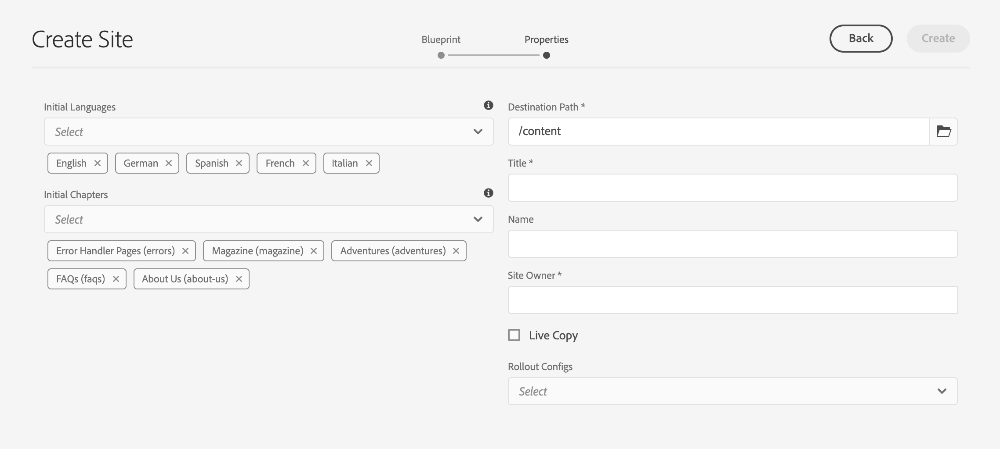
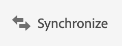

# 建立和同步 Live Copies {#creating-and-synchronizing-live-copies}

您可以從頁面或Blueprint設定建立即時副本，以在您的網站上重複使用該內容。 管理繼承和同步，您可以控制內容的變更的傳播方式。

## 管理Blueprint設定 {#managing-blueprint-configurations}

Blueprint設定會識別您要當作一或多個即時副本頁面來源的現有網站。

>[!TIP]
>
>Blueprint設定可讓您將內容變更推送至即時副本。 檢視[即時副本 — Source、Blueprint和Blueprint設定](overview.md#source-blueprints-and-blueprint-configurations)。

建立Blueprint設定時，您可以選取定義Blueprint內部結構的範本。 預設Blueprint範本假設來源網站具有下列特性：

* 網站具有根頁面。
* 根的直接子頁面是網站的語言分支。 建立即時副本時，語言會以選用內容的形式呈現以包含在副本中。
* 每個語言分支的根都有一個或多個子頁面。 建立即時副本時，子頁面會出現，這樣您就可以包含在即時副本中。

>[!NOTE]
>
>不同的結構需要不同的Blueprint範本。

建立Blueprint設定後，您可以設定以下屬性：

* **名稱**：藍圖設定的名稱
* **Source路徑**：您當作來源的網站根頁面路徑(Blueprint)
* **描述**。 （可選） Blueprint設定的說明，這會顯示在建立網站時可從中進行選擇的Blueprint設定清單中

使用您的Blueprint設定時，您可以將其與轉出設定建立關聯，以決定來源/Blueprint的即時副本同步的方式。 請參閱[指定要使用的轉出設定](live-copy-sync-config.md#specifying-the-rollout-configurations-to-use)。

### 建立和編輯Blueprint設定 {#creating-editing-blueprint-configurations}

Blueprint設定會視為不可變資料，因此在執行階段不可編輯。 因此，任何設定變更都必須使用CI/CD管道透過Git部署。

如需詳細資訊，請參閱文章[Adobe Experience Manager (AEM) as a Cloud Service重大變更](/help/release-notes/aem-cloud-changes.md)。

下列步驟僅供管理員在本機開發執行個體上用於測試和開發目的。 這些選項在任何AEMaaCS雲端例項中均無法使用。

#### 在本機建立Blueprint設定 {#creating-a-blueprint-configuration}

若要建立Blueprint設定：

1. [瀏覽](/help/sites-cloud/authoring/basic-handling.md#global-navigation)至&#x200B;**工具**&#x200B;功能表，然後選取&#x200B;**網站**&#x200B;功能表。
1. 選取&#x200B;**藍圖**&#x200B;以開啟&#x200B;**藍圖設定**&#x200B;主控台：

   

1. 選取「**建立**」。
1. 選取Blueprint範本，然後選取&#x200B;**下一步**&#x200B;以繼續。
1. 選取要用作Blueprint的來源頁面；然後&#x200B;**下一步**&#x200B;以繼續。
1. 定義：

   * **標題**： Blueprint的必要標題
   * **描述**：提供詳細資訊的可選描述。

1. **建立**&#x200B;將根據您的規格建立Blueprint組態。

### 在本機編輯或刪除Blueprint設定{#editing-or-deleting-a-blueprint-configuration}

您可以編輯或刪除現有的Blueprint設定：

1. [瀏覽](/help/sites-cloud/authoring/basic-handling.md#global-navigation)至&#x200B;**工具**&#x200B;功能表，然後選取&#x200B;**網站**&#x200B;功能表。
1. 選取&#x200B;**藍圖**&#x200B;以開啟&#x200B;**藍圖設定**&#x200B;主控台：

   

1. 選取所需的Blueprint設定 — 工具列中會顯示適當的動作：

   * **屬性**；您可以使用此項來檢視並編輯設定的屬性。
   * **刪除**

## 建立即時副本 {#creating-a-live-copy}

建立即時副本有數種方式。

### 建立頁面的即時副本 {#creating-a-live-copy-of-a-page}

您可以建立任何頁面或分支的即時副本。 建立即時副本時，您可以指定用於同步內容的轉出設定：

* 所選的轉出設定會套用至即時副本頁面及其子頁面。
* 如果您未指定任何轉出設定，MSM會決定要使用的轉出設定。 請參閱[指定要使用的轉出設定](live-copy-sync-config.md#specifying-the-rollout-configurations-to-use)。

您可以建立任何頁面的即時副本：

* 由[Blueprint設定](#creating-a-blueprint-configuration)參考的頁面
* 以及與設定無連線的頁面
* 其他即時副本頁面中的即時副本（[巢狀即時副本](overview.md#nested-live-copies)）

唯一的差異是，在來源/Blueprint頁面上&#x200B;**轉出**&#x200B;命令的可用性取決於Blueprint設定是否參考了來源：

* 如果您從Blueprint設定中參照的&#x200B;**是**&#x200B;的來源頁面建立即時副本，則轉出命令適用於來源/Blueprint頁面。
* 如果您從Blueprint設定中未參照&#x200B;**的**&#x200B;來源頁面建立即時副本，則轉出命令將不適用於來源/Blueprint頁面。

若要建立即時副本：

1. 在&#x200B;**網站**&#x200B;主控台中，選取&#x200B;**建立**，然後選取&#x200B;**即時副本**。

   

1. 選取來源頁面，然後選取&#x200B;**下一步**。 例如：

   

1. 指定即時副本的目的地路徑（開啟即時副本的父資料夾/頁面），然後選取&#x200B;**下一步**。

   

   >[!NOTE]
   >
   >目的地路徑不能位於來源路徑內。

1. 輸入：

   * 頁面的&#x200B;**標題**。
   * URL中使用的&#x200B;**名稱**。

   

1. 使用&#x200B;**排除子頁面**&#x200B;核取方塊：

   * 選取：僅建立所選頁面的即時副本（淺層即時副本）
   * 未選取：建立包含所選頁面所有子系的即時副本（深層即時副本）

1. （可選）若要指定一個或多個轉出設定以用於即時副本，請使用&#x200B;**轉出設定**&#x200B;下拉式清單來選取它們。 選取的設定會顯示在下拉式選取器的下方。
1. 選擇 **建立**。顯示確認訊息，您可以從這裡選取&#x200B;**開啟**&#x200B;或&#x200B;**完成**。

   >[!NOTE]
   >
   >可能會出現錯誤對話方塊，並顯示「無法提交表單」訊息。 發生此情況是因為網路逾時。 但是，建立即時副本的流程正在背景中執行。 請稍候幾分鐘，然後檢查即時副本的頁面是否正確建立。

### 從Blueprint設定建立網站的即時副本 {#creating-a-live-copy-of-a-site-from-a-blueprint-configuration}

使用Blueprint設定建立即時副本，以根據Blueprint （來源）內容建立網站。 從Blueprint設定建立即時副本時，選取要複製的Blueprint來源的一或多個語言分支，然後從語言分支選取要複製的章節。 請參閱[建立Blueprint組態](#creating-a-blueprint-configuration)。

如果您在即時副本中省略一些語言分支，您可以稍後新增它們。 如需詳細資訊，請參閱[在即時副本（Blueprint設定）](#creating-a-live-copy-inside-a-live-copy-blueprint-configuration)中建立即時副本。

>[!CAUTION]
>
>當Blueprint來源包含以不同分支中的段落為目標的連結和參照時，即時副本頁面中的目標不會更新，而是仍指向原始目的地。

建立網站時，請提供下列屬性的值：

* **初始語言**：要包含在即時副本中的Blueprint來源的語言分支
* **初始章節**：要包含在即時副本中的Blueprint語言分支的子頁面
* **目的地路徑**：即時副本網站的根頁面位置
* **標題**：即時副本網站的根頁面標題
* **名稱**： （選用）儲存即時副本根頁面的JCR節點名稱（預設值是根據標題）
* **網站擁有者**： （選擇性）負責即時副本之當事方的相關資訊
* **即時副本**：選取此選項以建立與來源網站的即時關係。 如果您未選取此選項，則會建立Blueprint的復本，但之後不會與來源同步。
* **轉出設定**： （選擇性）選取一或多個轉出設定，以用於同步化即時副本。 依預設，轉出設定是從Blueprint繼承。 如需詳細資訊，請參閱[指定要使用的轉出設定](live-copy-sync-config.md#specifying-the-rollout-configurations-to-use)。

若要從Blueprint設定建立網站的即時副本：

1. 在&#x200B;**Sites**&#x200B;主控台中，從下拉式選取器中選取&#x200B;**建立**，然後選取&#x200B;**網站**。
1. 選取要做為即時副本來源的Blueprint設定，並繼續&#x200B;**下一步**：

   

1. 使用&#x200B;**初始語言**&#x200B;選取器來指定要用於即時副本的Blueprint網站語言。

   預設會選取所有可用語言。 若要移除語言，請選取該語言旁邊顯示的&#x200B;**X**。

   例如：

   

1. 使用&#x200B;**初始章節**&#x200B;下拉式清單來選取要包含在即時副本中的Blueprint區段。 預設會包含所有可用章節，但可將其移除。
1. 提供其餘屬性的值，然後選取&#x200B;**建立**。 在確認對話方塊中，選取&#x200B;**完成**&#x200B;以返回&#x200B;**網站**&#x200B;主控台，或選取&#x200B;**開啟網站**&#x200B;以開啟網站的根頁面。

### 在即時副本中建立即時副本（Blueprint設定） {#creating-a-live-copy-inside-a-live-copy-blueprint-configuration}

當您在現有即時副本（使用Blueprint設定建立）中建立即時副本時，可以插入最初建立即時副本時未包含的任何語言副本或章節。

## 監視您的即時副本 {#monitoring-your-live-copy}

### 檢視即時副本的狀態 {#seeing-the-status-of-a-live-copy}

即時副本頁面的屬性會顯示有關即時副本的下列資訊：

* **Source**：即時副本頁面的來源頁面
* **狀態**：即時副本的同步處理狀態，包括即時副本是否與來源保持同步、上次同步發生的時間以及同步處理的執行者
* **組態**：

   * 頁面是否仍受即時副本繼承的約束
   * 設定是否繼承自父頁面
   * Live Copy使用的任何轉出設定

若要檢視屬性：

1. 在&#x200B;**網站**&#x200B;主控台中，選取即時副本頁面並開啟屬性。
1. 選取&#x200B;**即時副本**&#x200B;索引標籤。

   例如：

   頁面屬性中的

   如需詳細資訊，請參閱文章即時副本概觀控制檯中的[使用即時副本概觀](live-copy-overview.md#using-the-live-copy-overview)一節。

### 檢視Blueprint頁面的即時副本 {#seeing-the-live-copies-of-a-blueprint-page}

Blueprint頁面（在Blueprint設定中參照）為您提供使用目前(Blueprint)頁面作為來源的即時副本頁面清單。 使用此清單來追蹤即時副本。 清單會顯示在[頁面屬性的&#x200B;**Blueprint**&#x200B;標籤上。](/help/sites-cloud/authoring/sites-console/page-properties.md)

## 同步您的即時副本 {#synchronizing-your-live-copy}

有數種方式可同步您的即時副本。

### 轉出Blueprint {#rolling-out-a-blueprint}

轉出Blueprint頁面以將內容變更推送至即時副本。 **轉出**&#x200B;動作會執行使用[轉出](live-copy-sync-config.md#rollout-triggers)觸發器的轉出設定。

>[!NOTE]
>
>如果在Blueprint分支和相依即時副本分支中同時建立具有相同頁面名稱的新頁面，則可能會發生衝突。
>
>轉出[&#128279;](rollout-conflicts.md)時需要處理和解決這類衝突。

#### 從頁面屬性轉出Blueprint {#rolling-out-a-blueprint-from-page-properties}

1. 在&#x200B;**網站**&#x200B;主控台中，選取Blueprint中的頁面並開啟屬性。
1. 開啟&#x200B;**Blueprint**&#x200B;標籤。
1. 選取&#x200B;**轉出**。

   

1. 指定頁面及任何子頁面，然後使用核取記號確認：

   

1. 指定轉出工作應立即執行（**現在**）還是在其他日期/時間執行（**稍後**）。

   

轉出會以非同步工作方式處理，並可在[***非同步工作狀態**&#x200B;頁面](/help/operations/asynchronous-jobs.md#monitor-the-status-of-asynchronous-operations)上檢視。

#### 從參考邊欄轉出Blueprint {#roll-out-a-blueprint-from-the-reference-rail}

1. 在&#x200B;**網站**&#x200B;主控台中，選取即時副本中的頁面，並從工具列開啟&#x200B;**[參考](/help/sites-cloud/authoring/basic-handling.md#references)**&#x200B;面板。
1. 從清單中選取&#x200B;**Blueprint**&#x200B;選項，以顯示與此頁面關聯的藍圖。
1. 從清單中選取所需的Blueprint。
1. 選取&#x200B;**轉出**。

   從參考邊欄

1. 系統會要求您確認轉出的詳細資訊：

   * **轉出範圍**：

     指定範圍是僅針對所選頁面，還是應包含子頁面。

   * **排程**：

     指定轉出工作應該立即執行（**現在**）還是在稍後的日期/時間執行（**稍後**）。

     

1. 確認這些詳細資料後，請選取&#x200B;**轉出**&#x200B;以執行動作。

轉出會以非同步工作方式處理，並可在&#x200B;[**非同步工作狀態**&#x200B;頁面](/help/operations/asynchronous-jobs.md#monitor-the-status-of-asynchronous-operations)上檢視。

#### 從即時副本概觀轉出Blueprint {#roll-out-a-blueprint-from-the-live-copy-overview}

選取Blueprint頁面時，[**轉出**&#x200B;動作也可從即時副本總覽](live-copy-overview.md#using-the-live-copy-overview)中使用。

1. 開啟[即時副本總覽](live-copy-overview.md#using-the-live-copy-overview)並選取Blueprint頁面。
1. 從工具列選取&#x200B;**轉出**。

   

1. 指定頁面及任何子頁面，然後使用核取記號確認：

   

1. 指定轉出工作應立即執行（**現在**）還是在其他日期/時間執行（**稍後**）。

   

轉出會以非同步工作方式處理，並可在&#x200B;[**非同步工作狀態**&#x200B;頁面](/help/operations/asynchronous-jobs.md#monitor-the-status-of-asynchronous-operations)上檢視。

### 同步即時副本 {#synchronizing-a-live-copy}

同步即時副本頁面，以將內容變更從來源提取到即時副本。

#### 從頁面屬性同步即時副本 {#synchronize-a-live-copy-from-page-properties}

同步即時副本，以將變更從來源提取到即時副本。

>[!NOTE]
>
>同步處理會執行使用[轉出](live-copy-sync-config.md#rollout-triggers)觸發器的轉出設定。

1. 在&#x200B;**網站**&#x200B;主控台中，選取即時副本頁面並開啟屬性。
1. 開啟&#x200B;**即時副本**&#x200B;標籤。
1. 選取&#x200B;**同步處理**。

   

   已要求確認，請使用&#x200B;**同步**&#x200B;以繼續。

#### 從即時副本概述同步即時副本 {#synchronize-a-live-copy-from-the-live-copy-overview}

選取即時副本頁面時，也可從即時副本綜覽[&#128279;](live-copy-overview.md#using-the-live-copy-overview)使用同步動作。

1. 開啟[即時副本總覽](live-copy-overview.md#using-the-live-copy-overview)並選取即時副本頁面。
1. 從工具列選取&#x200B;**同步處理**。
1. 指定是否要包含之後，在對話方塊中確認&#x200B;**轉出**&#x200B;動作：

   * **頁和子頁**
   * **僅頁面**

   

## 變更即時副本內容 {#changing-live-copy-content}

若要變更即時副本內容，您可以：

* 將段落新增至頁面。
* 中斷任何頁面或元件的即時副本繼承來更新現有內容。

>[!TIP]
>
>如果您在即時副本中手動建立頁面，則新頁面為即時副本的本機頁面，這表示它沒有附加至的對應來源頁面。
>
>為了建立屬於關係一部分的本機頁面，最佳做法是在來源中建立本機頁面，並執行深層轉出。 這會將頁面在本機建立為即時副本。

>[!NOTE]
>
>如果在Blueprint分支和相依即時副本分支中同時建立具有相同頁面名稱的新頁面，則可能會發生衝突。
>
>轉出[&#128279;](rollout-conflicts.md)時需要處理和解決這類衝突。

### 將元件新增至即時副本頁面 {#adding-components-to-a-live-copy-page}

您可以隨時新增元件至即時副本頁面。 即時副本及其段落系統的繼承狀態不會控制您新增元件的能力。

當即時副本頁面與來源頁面同步時，新增的元件將維持不變。 另請參閱[變更即時副本頁面上的元件順序](#changing-the-order-of-components-on-a-live-copy-page)。

>[!TIP]
>
>在本機對標示為容器的元件進行的變更不會由轉出時的Blueprint內容覆寫。 如需詳細資訊，請參閱[MSM最佳實務](best-practices.md#components-and-container-synchronization)。

### 暫停頁面的繼承 {#suspending-inheritance-for-a-page}

建立即時副本時，即時副本設定會儲存在已複製頁面的根頁面上。 根頁面的所有子頁面都會繼承即時副本設定。 即時副本頁面上的元件也會繼承即時副本設定。

您可以暫停即時副本頁面的即時副本繼承，以便變更頁面屬性和元件。 當您暫停繼承時，頁面屬性和元件將不再與來源同步。

>[!TIP]
>
>您也可以[從其Blueprint分離即時副本](#detaching-a-live-copy)以移除所有連線。 與暫停繼承不同，分離動作是永久且不可逆的。

#### 暫停來自頁面屬性的繼承 {#suspending-inheritance-from-page-properties}

若要暫停頁面上的繼承，請執行下列動作：

1. 使用&#x200B;**Sites**&#x200B;主控台的&#x200B;**檢視屬性**&#x200B;命令或頁面工具列上的&#x200B;**頁面資訊**，開啟即時副本頁面的屬性。
1. 選取&#x200B;**即時副本**&#x200B;索引標籤。
1. 從工具列選取&#x200B;**暫停**。 然後，您可以選取：

   * **暫停**：僅暫停目前頁面。
   * **與子項一起暫停**：暫停目前頁面與任何子頁面。

1. 在確認對話方塊上選取&#x200B;**暫停**。

#### 暫停來自即時副本概觀的繼承 {#suspending-inheritance-from-the-live-copy-overview}

選取即時副本頁面時，[暫停動作也可從即時副本概觀](live-copy-overview.md#using-the-live-copy-overview)中使用。

1. 開啟[即時副本總覽](live-copy-overview.md#using-the-live-copy-overview)並選取即時副本頁面。
1. 從工具列選取&#x200B;**暫停**。
1. 從下列專案選取適當的選項：

   * **暫停**
   * **與子系一起暫停**

   

1. 在&#x200B;**暫停即時副本**&#x200B;對話方塊中確認&#x200B;**暫停**&#x200B;動作：

   

### 恢復頁面的繼承 {#resuming-inheritance-for-a-page}

暫停頁面的即時副本繼承是暫時的動作。 在暫停後，**繼續**&#x200B;動作將變為可用，可讓您恢復即時關係。

當您重新啟用繼承時，頁面不會自動與來源同步。 如果需要，您可以請求同步，方法是：

* 在&#x200B;**繼續**/**回覆**&#x200B;對話方塊中；例如：

  

* 在稍後階段，透過手動選取同步化動作。

>[!NOTE]
>
>當您重新啟用繼承時，頁面不會自動與來源同步。 如果需要，您可以在恢復時或稍後手動要求同步。

#### 繼續頁面屬性的繼承 {#resuming-inheritance-from-page-properties}

一旦[暫停](#suspending-inheritance-from-page-properties) **繼續**&#x200B;動作在頁面屬性的工具列中變成：

選取時，會顯示對話方塊。 您可以視需要選取同步，然後確認動作。

#### 從即時副本概觀繼續即時副本頁面 {#resume-a-live-copy-page-from-the-live-copy-overview}

選取即時副本頁面時，也可從即時副本綜覽[&#128279;](live-copy-overview.md#using-the-live-copy-overview)使用繼續動作。

1. 開啟[即時副本總覽](live-copy-overview.md#using-the-live-copy-overview)，並選取暫停的即時副本頁面。 此頁面顯示為&#x200B;**繼承已取消**。
1. 從工具列選取&#x200B;**繼續**。
1. 指示您是否要在恢復繼承後同步頁面，然後在&#x200B;**繼續即時副本**&#x200B;對話方塊中確認&#x200B;**繼續**&#x200B;動作。

### 變更繼承深度（淺/深） {#changing-inheritance-depth-shallow-deep}

您可以在現有的即時副本上變更頁面的深度，也就是是否包含子頁面。

* 切換到淺層即時副本：

   * 將立即生效且不可還原。

   * 明確將子頁面從即時副本中分離。 如果還原，則無法保留對子項所做的進一步修改。

   * 將移除任何下階`LiveRelationships`，即使有巢狀`LiveCopies`亦然。

* 切換到深層即時副本：

   * 保留子頁面不變。
   * 若要檢視切換的效果，您可以進行轉出，系統會根據轉出設定套用任何內容修改。

* 切換至淺層即時副本，然後回到深：

   * 將（先前的）淺層即時副本的所有子項視為手動建立，因此使用`[oldname]_msm_moved name`將其移開。

若要指定或變更深度，請執行下列動作：

1. 使用&#x200B;**Sites**&#x200B;主控台的&#x200B;**檢視屬性**&#x200B;命令或頁面工具列上的&#x200B;**頁面資訊**，開啟即時副本頁面的屬性。
1. 選取&#x200B;**即時副本**&#x200B;索引標籤。
1. 在&#x200B;**組態**&#x200B;區段中，根據是否包含子頁面來設定或清除&#x200B;**即時副本繼承**&#x200B;選項：

   * 勾選 — 深層即時副本（包含子頁面）
   * 未勾選 — 淺層即時副本（排除子頁面）

   >[!CAUTION]
   >
   >切換至淺層即時副本將立即生效且不可還原。
   >
   >如需詳細資訊，請參閱[即時副本 — 構成](overview.md#live-copies-composition)。

1. 選取&#x200B;**儲存**&#x200B;以保留您的更新。

### 取消元件的繼承 {#cancelling-inheritance-for-a-component}

取消元件的即時副本繼承，使元件不再與來源元件同步。 如有需要，您可在稍後啟用繼承。

>[!NOTE]
>
>當您重新啟用繼承時，元件不會自動與來源同步。 如有需要，您可以手動要求同步。

取消繼承以變更元件內容或刪除元件：

1. 選取您要取消繼承的元件。

   元件工具列中的

1. 在元件工具列上，選取&#x200B;**取消繼承**&#x200B;圖示。

   

1. 在[取消繼承]對話方塊中，使用&#x200B;**是**&#x200B;確認動作。

   元件工具列已更新為包含所有（適當的）編輯指令。

### 重新啟用元件的繼承 {#re-enabling-inheritance-for-a-component}

若要啟用元件的繼承，請選取元件工具列上的&#x200B;**重新啟用繼承**&#x200B;圖示。

### 變更即時副本頁面上的元件順序 {#changing-the-order-of-components-on-a-live-copy-page}

如果即時副本包含屬於段落系統一部分的元件，則該段落系統的繼承會遵循下列規則：

* 即使建立了繼承，也可以修改繼承的段落系統中的元件順序。
* 轉出時，元件順序會從Blueprint還原。 如果在轉出前已將新元件新增到即時副本，則這些新元件會與其上方新增的元件一起重新排序。
* 如果取消段落系統的繼承，轉出時元件順序將不會恢復，並將在即時副本中保持原樣。

>[!NOTE]
>
>在段落系統上還原取消的繼承時，元件&#x200B;**的順序將不會自動從Blueprint還原**。 如有需要，您可以手動要求同步。

請使用下列步驟來取消段落系統的繼承。

1. 開啟即時副本頁面。
1. 將現有元件拖曳至頁面上的新位置。
1. 在&#x200B;**取消繼承**&#x200B;對話方塊中，以&#x200B;**是**&#x200B;確認動作。

### 覆寫即時副本頁面的屬性 {#overriding-properties-of-a-live-copy-page}

依預設，即時副本頁面的頁面屬性繼承自來源頁面，且不可編輯。

當您需要變更即時副本的屬性值時，可以取消屬性的繼承。 連結圖示表示屬性已啟用繼承。

當您取消繼承時，可以變更屬性值。 中斷連結圖示表示繼承已取消。

您稍後可視需要重新啟用屬性的繼承。

>[!NOTE]
>
>當您重新啟用繼承時，即時副本頁面屬性不會自動與來源屬性同步。 如有需要，您可以手動要求同步。

1. 使用&#x200B;**網站**&#x200B;主控台的&#x200B;**檢視屬性**&#x200B;選項或頁面工具列上的&#x200B;**頁面資訊**&#x200B;圖示，開啟即時副本頁面的屬性。
1. 若要取消屬性的繼承，請選取屬性右側顯示的連結圖示。

   

1. 在&#x200B;**取消繼承**&#x200B;確認對話方塊中，選取&#x200B;**是**。

### 還原即時副本頁面的屬性 {#revert-properties-of-a-live-copy-page}

若要啟用屬性的繼承，請選取屬性旁邊顯示的&#x200B;**還原繼承**&#x200B;圖示。

### 重設即時副本頁面 {#resetting-a-live-copy-page}

您可以重設即時副本頁面以執行下列動作：

* 移除所有繼承取消並
* 將頁面傳回與來源頁面相同的狀態。

重設會影響您對頁面屬性、段落系統和元件所做的變更。

#### 從頁面屬性重設即時副本頁面 {#reset-a-live-copy-page-from-the-page-properties}

1. 在&#x200B;**網站**&#x200B;主控台中，選取即時副本頁面並選取&#x200B;**檢視屬性**。
1. 開啟&#x200B;**即時副本**&#x200B;標籤。
1. 從工具列選取&#x200B;**重設**。

   

1. 在&#x200B;**重設即時副本**&#x200B;對話方塊中，使用&#x200B;**重設**&#x200B;確認。

#### 從即時副本概觀重設即時副本頁面 {#reset-a-live-copy-page-from-the-live-copy-overview}

選取即時副本頁面時，[**重設**&#x200B;動作也可從即時副本總覽](live-copy-overview.md#using-the-live-copy-overview)中使用。

1. 開啟[即時副本總覽](live-copy-overview.md#using-the-live-copy-overview)並選取即時副本頁面。
1. 從工具列選取&#x200B;**重設**。
1. 在&#x200B;**重設即時副本**&#x200B;對話方塊中確認&#x200B;**重設**&#x200B;動作：

   

## 比較即時副本頁面與Blueprint頁面 {#comparing-a-live-copy-page-with-a-blueprint-page}

若要追蹤您所做的變更，您可以在&#x200B;**參考**&#x200B;中檢視Blueprint頁面，並將其與其即時副本頁面比較：

1. 在&#x200B;**網站**&#x200B;主控台中，[導覽至Blueprint或即時副本頁面並選取它](/help/sites-cloud/authoring/basic-handling.md#viewing-and-selecting-resources)。
1. 開啟&#x200B;**[參考](/help/sites-cloud/authoring/basic-handling.md#references)**&#x200B;面板，並根據內容選取：

   * **藍圖**
   * **即時副本**

1. 根據內容選取您特定的即時副本，請選取：

   * **與Blueprint比較**
   * **與即時副本比較**

   例如：

   

1. 即時副本和Blueprint頁面會並排開啟。

   如需使用比較功能的完整資訊，請參閱[頁面差異](/help/sites-cloud/authoring/sites-console/page-diff.md)。

## 分離 Live Copy {#detaching-a-live-copy}

分離動作會永久移除即時副本與其來源/Blueprint頁面之間的即時關係。 Live Copy 中與 MSM 相關的所有屬性都會移除，Live Copy 頁面會成為獨立副本。

>[!CAUTION]
>
>分離即時副本後，您無法恢復即時關係。
>
>若要移除即時關係並選擇稍後恢復它，您可以[取消頁面的即時副本繼承](#suspending-inheritance-for-a-page)。

在樹狀結構中使用&#x200B;**Detach**&#x200B;的位置上會有影響：

* 在即時副本的根頁面上中斷連結&#x200B;**&#x200B;**

  在即時副本的根頁面上執行此操作時，它會移除Blueprint的所有頁面與其即時副本之間的即時關係。

  對Blueprint **中頁面所做的進一步變更將不會**&#x200B;影響即時副本。

* 在即時副本的子頁面上&#x200B;**中斷連結**

  在即時副本的子頁面（或分支）上執行此操作時：

   * 隨即會移除該子頁面（或分支）的即時關係，並且
   * 即時副本分支中的（子）頁面會被視為已手動建立。

  但是，子頁面仍受父分支的即時關係約束，因此藍圖頁面的進一步轉出將：

   1. 重新命名分離的頁面：

      * 這是因為MSM將它們視為手動建立的頁面，這些頁面因具有與它嘗試建立的即時副本頁面相同的名稱而造成衝突。

   1. 以原始名稱建立新的即時副本頁面，其中包含轉出的變更。

  >[!NOTE]
  >
  >請參閱[MSM轉出衝突](rollout-conflicts.md)以瞭解這類情況的詳細資料。

### 從頁面屬性分離即時副本頁面 {#detach-a-live-copy-page-from-the-page-properties}

若要分離即時副本：

1. 在&#x200B;**網站**&#x200B;主控台中，選取即時副本頁面並選取&#x200B;**檢視屬性**。
1. 開啟&#x200B;**即時副本**&#x200B;標籤。
1. 在工具列上，選取&#x200B;**分離**。

   

1. 顯示確認對話方塊，選取&#x200B;**分離**&#x200B;以完成動作。

### 從即時副本概觀分離即時副本頁面 {#detach-a-live-copy-page-from-the-live-copy-overview}

選取即時副本頁面時，[分離動作也可從即時副本概觀](live-copy-overview.md#using-the-live-copy-overview)中使用。

1. 開啟[即時副本總覽](live-copy-overview.md#using-the-live-copy-overview)並選取即時副本頁面。
1. 從工具列選取&#x200B;**分離**。
1. 在&#x200B;**分離即時副本**&#x200B;對話方塊中確認&#x200B;**分離**&#x200B;動作：

   
