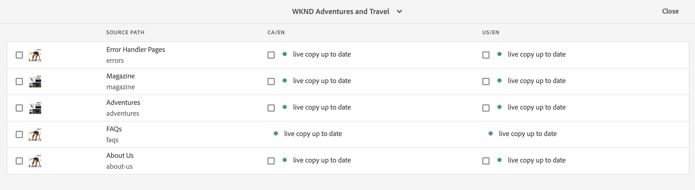

# Live Copy概述主控台 {#live-copy-overview-console}

**Live Copy概述**&#x200B;主控台可讓您：

* 檢視/管理整個網站的繼承。
   * 檢視Blueprint樹狀結構和對應的Live Copy結構，及其繼承狀態
   * 變更繼承狀態，例如暫停和繼續
   * 檢視Blueprint和Live Copy屬性
* 執行轉出動作。

## 開啟即時副本概述 {#opening-the-live-copy-overview}

您可以從以下位置開啟「即時副本概述」：

* [參考Blueprint頁面的側面板（網站主控台）](#opening-live-copy-overview-references-for-a-blueprint-page)
* [Blueprint頁面的屬性](#opening-live-copy-overview-properties-of-a-blueprint-page)

### Blueprint頁面的參考 {#references-to-a-blueprint-page}

您可以從&#x200B;**Sites**&#x200B;控制台的&#x200B;**References**&#x200B;側面板開啟&#x200B;**Live Copy概述**:

1. 在&#x200B;**Sites**&#x200B;控制台中，[導航到您的Blueprint頁並選擇它。](/help/sites-cloud/authoring/getting-started/basic-handling.md#viewing-and-selecting-resources)
1. 開啟&#x200B;**[References](/help/sites-cloud/authoring/getting-started/basic-handling.md#references)**&#x200B;邊欄，然後選取&#x200B;**Live Copys**。

   

   >[!TIP]
   >
   >您也可以先開啟參照，然後選取Blueprint。

1. 選擇「即時副本概述」(**Live Copy Overview**)以顯示並使用與所選藍圖相關的所有即時副本的概述。
1. 使用&#x200B;**關閉**&#x200B;退出並返回&#x200B;**Sites**&#x200B;控制台。

### Blueprint頁面的屬性 {#properties-of-a-blueprint-page}

檢視Blueprint頁面的屬性時，可以開啟&#x200B;**即時副本概述**:

1. 開啟適當Blueprint頁面的&#x200B;**屬性**。
1. 開啟&#x200B;**Blueprint**&#x200B;標籤 — 頂端工具列會顯示&#x200B;**即時副本概述**&#x200B;選項：

   

1. 選取「**即時副本概述**」 ，以顯示並使用與目前Blueprint相關的所有即時副本的概觀。

1. 使用&#x200B;**關閉**&#x200B;退出並返回&#x200B;**Sites**&#x200B;控制台。

## 使用即時副本概述 {#using-the-live-copy-overview}

**Live Copy概述**&#x200B;窗口提供和概述與選定頁面相關的Live Copy的狀態。

轉出取決於特定轉出設定中定義的同步動作。 某些動作取決於內容的修改。 不過，也有許多動作與內容修改無關，而與頁面啟動等事件有關。 此類事件不會修改內容，但會修改與內容相關的內部屬性。

狀態欄位也取決於特定轉出設定中定義的同步動作，並指出自上次成功轉出以來，Blueprint或Live Copy是否有任何此類動作。 狀態欄位只會反映特定轉出設定中的動作。 如果尚未對即時副本執行任何成功轉出，則狀態將一律顯示為最新。

例如，轉出設定定義為`targetActivate`。 因此，轉出將完全取決於啟動事件。 狀態欄位只會指出自上次成功轉出以來，是否發生任何啟動事件。

**Live Copy概述**&#x200B;也可用於對Live Copy執行動作：

1. 開啟&#x200B;**即時副本概述**。
1. 選取所需的Blueprint或Live Copy頁面，工具列將會更新以顯示可用的動作。 可用的[actions](overview.md#terms-used)取決於您選取的是[blueprint](#actions-for-a-blueprint-page)或[即時副本](#actions-for-a-live-copy-page)頁面。

### Blueprint頁面的動作 {#actions-for-a-blueprint-page}

選取Blueprint頁面時，可執行下列動作：

* **編輯**  — 開啟Blueprint頁面進行編輯。
* **[轉出](overview.md#rollout-and-synchronize)**  — 執行轉出以從來源推送變更至即時副本。

### 即時副本頁面的動作 {#actions-for-a-live-copy-page}

選取「即時副本」頁面時，可使用下列動作：

* **編輯**  — 開啟「即時副本」頁面進行編輯。
* **[關係狀態](#relationship-status)**  — 檢視狀態和繼承的相關資訊。
* **[同步](overview.md#rollout-and-synchronize)**  — 同步即時副本，以從來源提取變更至即時副本。
* **[重設](creating-live-copies.md#resetting-a-live-copy-page)**  — 重設即時副本頁面以移除所有繼承取消，並將頁面傳回與來源頁面相同的狀態。
* **[暫停](overview.md#suspending-and-cancelling-inheritance-and-synchronization)**  — 暫時停用即時副本與其Blueprint頁面之間的即時關係。
* **[恢復](creating-live-copies.md#resuming-inheritance-for-a-page)**  — 恢復允許您恢復已暫停的關係。
* **[分離](overview.md#detaching-a-live-copy)**  — 永久移除即時副本與其Blueprint頁面之間的即時關係。

## 關係狀態 {#relationship-status}

**關係狀態**&#x200B;控制台有兩個頁簽，提供一系列功能。

* [關係狀態](#relationship-status-tab)
* [即時副本](#live-copy-tab)

### 關係狀態 {#relationship-status-tab}

此索引標籤提供Blueprint與Live Copy之間關係狀態的詳細資訊。

### 即時副本 {#live-copy-tab}

此索引標籤可讓您檢視和編輯Live Copy設定。

