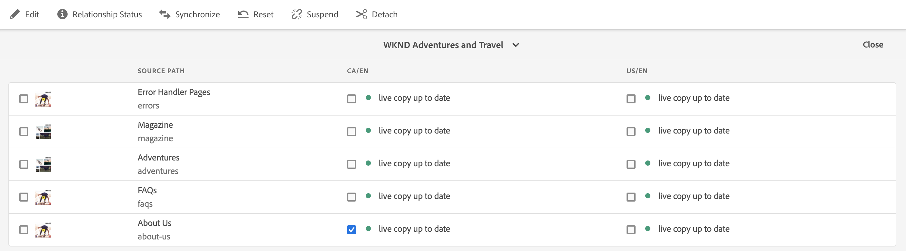

# Live Copy概述控制台 {#live-copy-overview-console}

的 **即時複製概述** console允許您：

* 查看/管理整個站點的繼承。
   * 查看藍圖樹和相應的「即時複製」結構及其繼承狀態
   * 更改繼承狀態，如掛起和繼續
   * 查看藍圖和即時複製屬性
* 執行推廣操作。

## 開啟即時複製概述 {#opening-the-live-copy-overview}

您可以從以下位置開啟「即時複製概述」：

* [藍圖頁的參考側面板（站點控制台）](#opening-live-copy-overview-references-for-a-blueprint-page)
* [藍圖頁的屬性](#opening-live-copy-overview-properties-of-a-blueprint-page)

### 藍圖頁的引用 {#references-to-a-blueprint-page}

的 **即時複製概述** 可以從 **引用** 側面板 **站點** 控制台：

1. 在 **站點** 控制台， [導航到您的藍圖頁面並選擇它。](/help/sites-cloud/authoring/getting-started/basic-handling.md#viewing-and-selecting-resources)
1. 開啟 **[引用](/help/sites-cloud/authoring/getting-started/basic-handling.md#references)** 導軌和選擇 **即時拷貝**。

   

   >[!TIP]
   >
   >也可先開啟參照，然後選取藍圖。

1. 選擇 **即時複製概述** 顯示和使用與所選藍圖相關的所有即時副本的概覽。
1. 使用 **關閉** 退出並返回 **站點** 控制台。

### 藍圖頁的屬性 {#properties-of-a-blueprint-page}

的 **即時複製概述** 可在查看藍圖頁面的屬性時開啟：

1. 開啟 **屬性** 頁。
1. 開啟 **藍圖** 頁籤 **即時複製概述** 的下界。

   

1. 選擇 **即時複製概述** 顯示和使用與當前藍圖相關的所有即時副本的概覽。

1. 使用 **關閉** 退出並返回 **站點** 控制台。

## 使用即時複製概述 {#using-the-live-copy-overview}

的 **即時複製概述** 窗口提供和概述與所選頁面相關的即時副本的狀態。

轉出取決於在特定轉出配置中定義的同步操作。 某些操作取決於對內容的修改。 但是，還有許多操作不依賴於對內容的修改，而依賴於頁面激活等事件。 此類事件不會修改內容，但會修改與內容相關的內部屬性。

狀態欄位還取決於在特定部署配置中定義的同步操作，並指明自上次成功部署以來藍圖或即時拷貝中是否存在任何此類操作。 狀態欄位將僅反映特定部署配置中的操作。 如果尚未在即時拷貝上成功部署，則狀態將始終顯示為最新。

例如，部署配置定義為 `targetActivate`。 因此，推廣將僅取決於激活事件。 狀態欄位將僅指示自上次成功部署以來是否發生了任何激活事件。

的 **即時複製概述** 也可用於對Live Copy執行操作：

1. 開啟 **即時複製概述**。
1. 選擇所需的藍圖或「即時複製」頁面，工具欄將更新以顯示可用操作。 的 [動作](overview.md#terms-used) 可用取決於是否選擇 [藍圖](#actions-for-a-blueprint-page) 或 [即時拷貝](#actions-for-a-live-copy-page) 的子菜單。

### 藍圖頁的操作 {#actions-for-a-blueprint-page}

選擇藍圖頁面時，可執行以下操作：

* **編輯**  — 開啟藍圖頁面進行編輯。
* **[推廣](overview.md#rollout-and-synchronize)**  — 執行推廣，將更改從源推送到即時拷貝。

### 即時複製頁面的操作 {#actions-for-a-live-copy-page}

選擇「即時複製」頁時，可以執行以下操作：

* **編輯**  — 開啟「即時複製」頁面進行編輯。
* **[關係狀態](#relationship-status)**  — 查看有關狀態和繼承的資訊。
* **[同步](overview.md#rollout-and-synchronize)**  — 同步即時拷貝以將更改從源拉入即時拷貝。
* **[重置](creating-live-copies.md#resetting-a-live-copy-page)**  — 重置「即時複製」頁以刪除所有繼承取消項，並將頁返回到與源頁相同的狀態。
* **[掛起](overview.md#suspending-and-cancelling-inheritance-and-synchronization)**  — 臨時停用即時副本與其藍圖頁面之間的即時關係。
* **[繼續](creating-live-copies.md#resuming-inheritance-for-a-page)**  — 恢復允許您恢復掛起的關係。
* **[分離](overview.md#detaching-a-live-copy)**  — 永久刪除即時副本與其藍圖頁面之間的即時關係。

## 關係狀態 {#relationship-status}

的 **關係狀態** console有兩個頁籤，提供一系列功能。

* [關係狀態](#relationship-status-tab)
* [即時副本](#live-copy-tab)

### 關係狀態 {#relationship-status-tab}

此頁籤提供有關藍圖與即時拷貝之間關係狀態的詳細資訊。

### 即時副本 {#live-copy-tab}

此頁籤允許您查看和編輯Live Copy配置。

