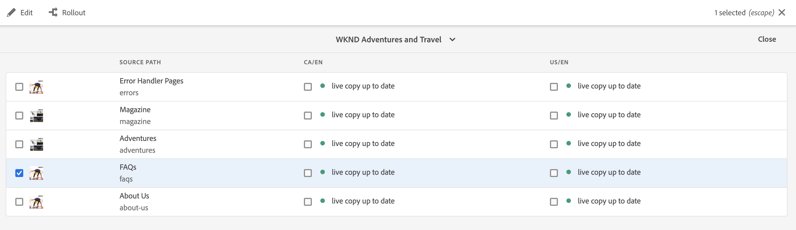

# 即時副本概述控制台{#live-copy-overview-console}

使用&#x200B;**即時副本概述**&#x200B;控制台，您可以：

* 檢視／管理整個網站的繼承。
   * 檢視藍圖樹和對應的即時副本結構，以及其繼承狀態
   * 更改繼承狀態，如暫停和繼續
   * 檢視Blueprint和即時副本屬性
* 執行轉出動作。

## 開啟即時副本概述{#opening-the-live-copy-overview}

您可以從以下位置開啟即時副本概述：

* [藍圖頁面的參考側面板（網站主控台）](#opening-live-copy-overview-references-for-a-blueprint-page)
* [Blueprint頁面的屬性](#opening-live-copy-overview-properties-of-a-blueprint-page)

### 藍圖頁面{#references-to-a-blueprint-page}的參考

**即時副本概述**&#x200B;可從&#x200B;**Sites**&#x200B;控制台的&#x200B;**參考**&#x200B;側面板開啟：

1. 在&#x200B;**Sites**&#x200B;控制台中，[瀏覽到您的Blueprint頁並選擇它。](/help/sites-cloud/authoring/getting-started/basic-handling.md#viewing-and-selecting-resources)
1. 開啟&#x200B;**[References](/help/sites-cloud/authoring/getting-started/basic-handling.md#references)**&#x200B;邊欄，然後選擇&#x200B;**Live Copies**。

   

   >[!TIP]
   >
   >您也可以先開啟參照，然後選取藍圖。

1. 選擇&#x200B;**即時副本概述**&#x200B;以顯示並使用與所選藍圖相關的所有即時副本概述。
1. 使用&#x200B;**Close**&#x200B;退出並返回到&#x200B;**Sites**&#x200B;控制台。

### Blueprint頁面{#properties-of-a-blueprint-page}的屬性

在檢視Blueprint頁面的屬性時，可以開啟&#x200B;**即時副本概述**:

1. 開啟&#x200B;**屬性**&#x200B;以取得適當的藍圖頁面。
1. 開啟&#x200B;**Blueprint**&#x200B;標籤-**即時副本概述**&#x200B;選項會顯示在頂端工具列：

   

1. 選擇&#x200B;**即時副本概述**&#x200B;以顯示並使用與當前藍圖相關的所有即時副本概述。

1. 使用&#x200B;**Close**&#x200B;退出並返回到&#x200B;**Sites**&#x200B;控制台。

## 使用即時副本概述{#using-the-live-copy-overview}

**即時副本概述**&#x200B;窗口提供和概述與選定頁面相關的即時副本的狀態。

轉出取決於特定轉出配置中定義的同步操作。 某些動作會依賴內容的修改。 不過，也有許多動作與內容修改無關，而與頁面啟動等事件有關。 這些事件不會修改內容，但會修改與內容相關的內部屬性。

狀態欄位也取決於特定轉出設定中定義的同步動作，並指出自從上次成功轉出後，藍圖或即時副本是否有任何此類動作。 狀態欄位只會反映特定轉出設定中的動作。 如果尚未在即時副本上執行任何成功的轉出，則狀態將一律顯示為最新。

例如，轉出配置定義為`targetActivate`。 因此，推出將完全取決於啟動事件。 狀態欄位只會指出自上次成功推出以來是否發生任何啟動事件。

**即時副本概述**&#x200B;也可用於對即時副本執行操作：

1. 開啟&#x200B;**即時副本概述**。
1. 選擇所需的Blueprint或「即時副本」頁面，工具列將會更新以顯示可用的動作。 可用的[動作](overview.md#terms-used)取決於您選擇的是[blueprint](#actions-for-a-blueprint-page)還是[即時副本](#actions-for-a-live-copy-page)頁面。

### 藍圖頁面{#actions-for-a-blueprint-page}的動作

當您選取藍圖頁面時，可執行下列動作：

* **編輯** -開啟藍圖頁面進行編輯。
* **[轉出](overview.md#rollout-and-synchronize)** -執行轉出，將變更從來源推送至即時副本。

### 即時副本頁面的動作{#actions-for-a-live-copy-page}

當您選取「即時副本」頁面時，可執行下列動作：

* **編輯** -開啟即時副本頁面進行編輯。
* **[關係狀態](#relationship-status)** -查看有關狀態和繼承的資訊。
* **[同步](overview.md#rollout-and-synchronize)** -同步即時副本，從來源提取變更至即時副本。
* **[重設](creating-live-copies.md#resetting-a-live-copy-page)** -重設「即時副本」頁面，以移除所有繼承取消，並將頁面傳回與來源頁面相同的狀態。
* **[暫停](overview.md#suspending-and-cancelling-inheritance-and-synchronization)** -暫時停用即時副本與其藍圖頁面之間的即時關係。
* **[恢復](creating-live-copies.md#resuming-inheritance-for-a-page)** -恢復允許您恢復暫停的關係。
* **[分離](overview.md#detaching-a-live-copy)** -永久移除即時副本與其藍圖頁面之間的即時關係。

## 關係狀態 {#relationship-status}

**關係狀態**&#x200B;控制台具有兩個頁籤，提供一系列功能。

* [關係狀態](#relationship-status-tab)
* [即時副本](#live-copy-tab)

### 關係狀態 {#relationship-status-tab}

此標籤提供藍圖與即時副本之間關係狀態的詳細資訊。

### 即時副本 {#live-copy-tab}

此標籤可讓您檢視和編輯即時副本設定。

