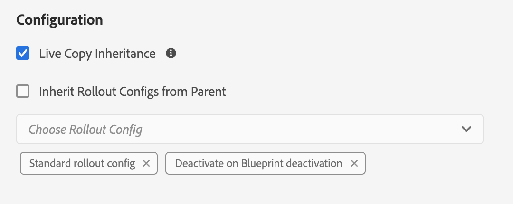

# 配置Live Copy同步 {#configuring-live-copy-synchronization}

Adobe Experience Manager提供許多現成的同步設定。 使用Live Copy之前，您應考慮下列事項，以定義Live Copy與其來源內容同步的方式和時間。

1. 決定現有的轉出設定是否符合您的需求
1. 如果現有的轉出設定沒有，請決定您是否需要建立自己的轉出設定。
1. 指定要用於Live Copy的轉出設定。

## 安裝和自訂轉出設定 {#installed-and-custom-rollout-configurations}

本節提供有關已安裝轉出設定及其使用的同步動作，以及如有需要如何建立自訂設定的資訊。

>[!CAUTION]
>
>更新或變更現成可用的轉出設定為 **not** 建議。 如果需要自訂即時動作，則應將其新增至自訂轉出設定。

### 轉出觸發器 {#rollout-triggers}

每個轉出設定都使用轉出觸發器，而導致轉出發生。 轉出設定可使用下列其中一個觸發器：

* **轉出時**:此 **轉出** 命令用於藍色打印頁，或 **同步** 命令。
* **修改**:已修改源頁。
* **啟動時**:源頁面已激活。
* **停用時**:源頁面已停用。

>[!NOTE]
>
>使用 **修改** 觸發器會影響效能。 請參閱 [MSM最佳實務](best-practices.md#onmodify) 以取得更多資訊。

### 轉出設定 {#rollout-configurations}

下表列出隨AEM提供的現成轉出設定。 表格包含每個轉出設定的觸發和同步動作。

<!--
If the installed rollout configuration actions do not meet your requirements, you can [create a new rollout configuration](#creating-a-rollout-configuration).
-->

| 名稱 | 說明 | 觸發器 | [同步操作](#synchronization-actions) |
|---|---|---|---|
| 標準轉出設定 | 標準轉出設定可允許轉出觸發時開始轉出程式並執行動作：建立、更新、刪除內容和訂購子節點 | 於轉出 | `contentUpdate` `contentCopy` `contentDelete` `referencesUpdate` `productUpdate` `orderChildren` |
| 在 Blueprint 啟動時啟動 | 發佈來源時發佈即時副本 | 啟動時 | `targetActivate` |
| 在 Blueprint 停用時停用 | 停用來源時停用即時副本 | 停用時 | `targetDeactivate` |
| 在發生修改時推送 | 修改來源時推送內容至Live Copy 請謹慎使用此轉出設定，因為它使用「修改時」觸發器。 | 於修改 | `contentUpdate` `contentCopy` `contentDelete` `referencesUpdate` `orderChildren` |
| 在發生修改時推送 (淺層) | 修改Blueprint頁面時推送內容至Live Copy，而不更新參考（例如淺層復本） 請謹慎使用此轉出設定，因為它使用「修改時」觸發器。 | 於修改 | `contentUpdate` `contentCopy` `contentDelete` `orderChildren` |
| 提升啟動 | 提升啟動頁面的標準轉出設定。 | 於轉出 | `contentUpdate` `contentCopy` `contentDelete` `referencesUpdate` `orderChildren` `markLiveRelationship` |

### 同步操作 {#synchronization-actions}

下表列出隨AEM提供的現成同步動作。

<!--If the installed actions do not meet your requirements, you can [Create a New Synchronization Action](/help/sites-developing/extending-msm.md#creating-a-new-synchronization-action).-->

| 動作名稱 | 說明 | 屬性 |
|---|---|---|
| `contentCopy` | 當Live Copy上不存在源節點時，此操作會將節點複製到Live Copy。 [設定 **CQ MSM內容複製動作** 服務](#excluding-properties-and-node-types-from-synchronization) 指定要排除的節點類型、段落項和頁面屬性。 |  |
| `contentDelete` | 此操作會刪除源上不存在的Live Copy節點。 [設定 **CQ MSM內容刪除動作** 服務](#excluding-properties-and-node-types-from-synchronization) 指定要排除的節點類型、段落項和頁面屬性。 |  |
| `contentUpdate` | 此動作會使用來源的變更來更新Live Copy內容。 [設定 **CQ MSM內容更新動作** 服務](#excluding-properties-and-node-types-from-synchronization) 指定要排除的節點類型、段落項和頁面屬性。 |  |
| `editProperties` | 此動作會編輯即時副本的屬性。 此 `editMap` 屬性決定要編輯的屬性及其值。 的值 `editMap` 屬性必須使用下列格式： `[property_name_n]#[current_value]#[new_value]` `current_value` 和 `new_value` 都是規則運算式 `n` 是遞增的整數。 例如，請考量下列值 `editMap`: `sling:resourceType#/(contentpage`ver`homepage)#/mobilecontentpage,cq:template#/contentpage#/mobilecontentpage` 此值將編輯Live Copy節點的屬性，如下所示： 此 `sling:resourceType` 屬性 `contentpage` 或 `homepage` 設為 `mobilecontentpage`. 此 `cq:template` 設為的屬性 `contentpage` 設為 `mobilecontentpage`. | `editMap: (String)` 識別屬性、目前值和新值。 如需詳細資訊，請參閱說明。 |
| `notify` | 此動作會傳送已推出頁面的頁面事件。 若要收到通知，需先訂閱轉出事件。 |  |
| `orderChildren` | 此動作會根據Blueprint上的順序來排序子節點。 |  |
| `referencesUpdate` | 此同步動作會更新Live Copy上的參考。 它會搜尋「即時副本」頁面中指向Blueprint內之資源的路徑。 找到後，會更新路徑，以指向即時副本中的相關資源。 在Blueprint外具有目標的參照不會變更。  [設定 **CQ MSM參考更新動作** 服務](#excluding-properties-and-node-types-from-synchronization) 指定要排除的節點類型、段落項和頁面屬性。 |  |
| `targetVersion` | 此動作會建立即時副本的版本。 此動作必須是轉出設定中唯一包含的同步動作。 |  |
| `targetActivate` | 此動作會啟動「即時副本」。 此動作必須是轉出設定中唯一包含的同步動作。 |  |
| `targetDeactivate` | 此動作會停用即時副本。 此動作必須是轉出設定中唯一包含的同步動作。 |  |
| `workflow` | 此動作會啟動目標屬性定義的工作流程（僅適用於頁面），並將即時副本作為裝載。 目標路徑是模型節點的路徑。 | `target: (String)` 是工作流程模型的路徑。 |
| `mandatory` | 此操作將「即時副本」頁上的多個ACL的權限設定為特定用戶組的只讀權限。 配置了以下ACL: `ActionSet.ACTION_NAME_REMOVE` `ActionSet.ACTION_NAME_SET_PROPERTY` `ActionSet.ACTION_NAME_ACL_MODIFY` 僅對頁面使用此動作。 | `target: (String)` 是您要設定權限之群組的ID。 |
| `mandatoryContent` | 此操作將「即時副本」頁上的多個ACL的權限設定為特定用戶組的只讀權限。 配置了以下ACL: `ActionSet.ACTION_NAME_SET_PROPERTY` `ActionSet.ACTION_NAME_ACL_MODIFY` 僅對頁面使用此動作。 | `target: (String)` 是您要設定權限之群組的ID。 |
| `mandatoryStructure` | 此動作會設定 `ActionSet.ACTION_NAME_REMOVE` 「即時副本」頁面上的ACL，用於特定用戶組的只讀。 僅對頁面使用此動作。 | `target: (String)` 是您要設定權限之群組的ID。 |
| `VersionCopyAction` | 如果Blueprint/來源頁面至少已發佈一次，此動作會使用已發佈的版本建立「即時副本」頁面。 注意：此動作僅適用於根據已發佈的來源頁面建立「即時副本」頁面，不適用於更新現有的「即時副本」頁面。 |  |
| `PageMoveAction` | 此 `PageMoveAction` 會在Blueprint中移動頁面時套用。 動作會複製，而非將「即時副本」（相關）頁面從移動前的位置移至之後的位置。 此 `PageMoveAction` 不會變更移動前位置的「即時副本」頁面。 因此，對於連續轉出設定，其狀態為即時關係，沒有藍圖。 [設定 **CQ MSM頁面移動動作** 服務](#excluding-properties-and-node-types-from-synchronization) 指定要排除的節點類型、段落項和頁面屬性。 此動作必須是轉出設定中唯一包含的同步動作。 | 設定 `prop_referenceUpdate: (Boolean)` 為true（預設值）以更新參考。 |
| `markLiveRelationship` | 此動作表示啟動建立的內容存在即時關係。 |  |

<!--
### Creating a Rollout Configuration {#creating-a-rollout-configuration}

You can [create a rollout configuration](/help/sites-developing/extending-msm.md#creating-a-new-rollout-configuration) when the installed rollout configurations do not meet your application requirements by performing the following steps.

1. [Create the rollout configuration](/help/sites-developing/extending-msm.md#create-the-rollout-configuration).
1. [Add synchronization actions to the rollout configuration](/help/sites-developing/extending-msm.md#add-synchronization-actions-to-the-rollout-configuration).

The new rollout configuration is then available to you when configuring rollout configurations on a blueprint or Live Copy page.
-->

### 從同步中排除屬性和節點類型 {#excluding-properties-and-node-types-from-synchronization}

您可以配置多個支援相應同步操作的OSGi服務，以使其不影響特定節點類型和屬性。 例如，Live Copy中不應包含許多與AEM內部功能相關的屬性和子節點。 只應複製與頁面使用者相關的內容。

使用AEM時，有數種方法可管理這類服務的組態設定。 請參閱 [配置OSGi](/help/implementing/deploying/configuring-osgi.md) 以取得詳細資訊和建議的實務。

下表列出了可以指定要排除的節點的同步操作。 該表提供了使用Web控制台進行配置的服務的名稱，以及使用儲存庫節點進行配置的PID。

| 同步操作 | Web控制台中的服務名 | 服務PID |
|---|---|---|
| `contentCopy` | CQ MSM內容複製動作 | `com.day.cq.wcm.msm.impl.actions.ContentCopyActionFactory` |
| `contentDelete` | CQ MSM內容刪除動作 | `com.day.cq.wcm.msm.impl.actions.ContentDeleteActionFactory` |
| `contentUpdate` | CQ MSM內容更新動作 | `com.day.cq.wcm.msm.impl.actions.ContentUpdateActionFactory` |
| `PageMoveAction` | CQ MSM頁面移動動作 | `com.day.cq.wcm.msm.impl.actions.PageMoveActionFactory` |
| `referencesUpdate` | CQ MSM參考更新動作 | `com.day.cq.wcm.msm.impl.actions.ReferencesUpdateActionFactory` |

下表說明了可以配置的屬性：

| Web控制台屬性 | OSGi屬性 | 說明 |
|---|---|---|
| 排除的節點類型 | `cq.wcm.msm.action.excludednodetypes` | 與要從同步操作中排除的節點類型匹配的規則表達式 |
| 排除的段落項目 | `cq.wcm.msm.action.excludedparagraphitems` | 與要從同步操作中排除的段落項相匹配的規則表達式 |
| 排除的頁面屬性 | `cq.wcm.msm.action.excludedprops` | 符合要從同步動作中排除之頁面屬性的規則運算式 |
| 忽略的Mixin NodeTypes | `cq.wcm.msm.action.ignoredMixin` | 匹配要從同步操作中排除的mixin節點類型名稱的規則表達式(僅適用於 `contentUpdate` 動作) |

#### CQ MSM內容更新動作 — 排除項目 {#cq-msm-content-update-action-exclusions}

預設會排除數個屬性和節點類型，這些會在的OSGi設定中定義 **CQ MSM內容更新動作**，在 **排除的頁面屬性**.

依預設，轉出時會排除與下列規則運算式相符的屬性（即未更新）:

您可以視需要變更定義排除清單的運算式。

例如，如果您想要頁面 **標題** 若要納入考慮轉出的變更中，請移除 `jcr:title` 從排除項目。 例如，使用規則運算式：

`jcr:(?!(title)$).*`

### 配置更新引用的同步 {#configuring-synchronization-for-updating-references}

您可以配置多個OSGi服務，這些服務支援與更新引用相關的相應同步操作。

使用AEM時，有數種方法可管理這類服務的組態設定。 請參閱 [配置OSGi](/help/implementing/deploying/configuring-osgi.md) 以取得詳細資訊和建議的實務。

下表列出了可以為其指定引用更新的同步操作。 該表提供了使用Web控制台進行配置的服務的名稱，以及使用儲存庫節點進行配置的PID。

| Web控制台屬性 | OSGi屬性 | 說明 |
|---|---|---|
| 跨巢狀LiveCopy更新參考 | `cq.wcm.msm.impl.action.referencesupdate.prop_updateNested` | 在Web控制台中選擇此選項，或將此布林屬性設定為 `true` 使用存放庫設定來取代任何位於最上層Live Copy分支內之資源的參考。 僅適用於 `referencesUpdate` 動作。 |
| 更新引用頁面 | `cq.wcm.msm.impl.actions.pagemove.prop_referenceUpdate` | 在Web控制台中選擇此選項，或將此布林屬性設定為 `true` 使用存放庫設定來更新任何參照，以使用原始頁面來改為參考Live Copy頁面。 僅適用於 `PageMoveAction`. |

## 指定要使用的轉出設定 {#specifying-the-rollout-configurations-to-use}

MSM可讓您指定一般使用的轉出設定集，並在需要時，您可以針對特定Live Copy覆寫這些設定。 MSM提供數個位置，用以指定要使用的轉出設定。 位置會決定設定是否套用至特定Live Copy。

下列位置清單可讓您指定要使用的轉出設定，說明MSM如何決定要用於即時副本的轉出設定：

* **[Live Copy頁面屬性](live-copy-sync-config.md#setting-the-rollout-configurations-for-a-live-copy-page):** 當「即時副本」頁面設定為使用一或多個轉出設定時，MSM會使用這些轉出設定。
* **[Blueprint頁面屬性](live-copy-sync-config.md#setting-the-rollout-configuration-for-a-blueprint-page):** 當「即時副本」以Blueprint為基礎，且「即時副本」頁面未以轉出設定進行設定時，會使用與Blueprint來源頁面相關聯的轉出設定。
* **Live Copy上層頁面屬性：** 當Live Copy頁面和Blueprint來源頁面均未設定轉出設定時，會使用套用至Live Copy頁面上層頁面的轉出設定。
* **[系統預設值](live-copy-sync-config.md#setting-the-system-default-rollout-configuration):** 當無法判斷Live Copy上層頁面的轉出設定時，會使用系統預設的轉出設定。

例如，Blueprint使用 [WKND教學課程](/help/implementing/developing/introduction/develop-wknd-tutorial.md) 網站作為來源內容。 從Blueprint建立網站。 下列清單中的每個項目說明使用轉出設定的不同案例：

* 未將任何Blueprint頁面或Live Copy頁面設定為使用轉出設定。 MSM會對所有Live Copy頁面使用系統預設轉出設定。
* WKND網站的根頁面已設定數個轉出設定。 MSM會對所有Live Copy頁面使用這些轉出設定。
* WKND網站的根頁面已設定數個轉出設定，而Live Copy網站的根頁面則設定了一組不同的轉出設定。 MSM會使用在Live Copy網站的根頁面上設定的轉出設定。

### 設定即時副本頁面的轉出設定 {#setting-the-rollout-configurations-for-a-live-copy-page}

使用轉出設定設定設定「即時副本」頁面，以在轉出來源頁面時使用。 子頁預設繼承配置。 將轉出設定設為使用時，會覆寫即時副本頁面從其父項繼承的設定。

您也可以在您 [建立即時副本](creating-live-copies.md#creating-a-live-copy-of-a-page).

1. 使用 **網站** 控制台來選取「即時副本」頁面。
1. 選擇 **屬性** 的上界。
1. 開啟 **Live Copy** 標籤。

   此 **設定** 節顯示頁面繼承的轉出配置。

   

1. 如有需要，請調整 **即時副本繼承** 標籤。 如果已勾選，Live Copy設定對所有子項都有效。

1. 清除 **從父級繼承轉出配置** 屬性，然後從清單中選取一或多個轉出設定。

   選取的轉出設定會顯示在下拉式清單下方。

   

1. 按一下或點選 **儲存並關閉**.

### 設定Blueprint頁面的轉出設定 {#setting-the-rollout-configuration-for-a-blueprint-page}

使用轉出設定設定設定藍圖頁面，以在Blueprint頁面推出時使用。

請注意，Blueprint頁面的子頁面會繼承設定。 將轉出配置配置配置為使用時，可能正在覆蓋頁面從其父級繼承的配置。

1. 使用 **網站** 控制台，以選取blueprint的根頁面。
1. 選擇 **屬性** 的上界。
1. 開啟 **Blueprint** 標籤。
1. 選取一或多個 **轉出設定** 使用下拉式選取器。
1. 將更新保留為 **儲存**.

### 設定系統預設轉出配置 {#setting-the-system-default-rollout-configuration}

若要指定轉出設定以作為系統預設值，請設定下列OSGi服務。

* **Day CQ WCM Live Relationship Manager** 服務PID `com.day.cq.wcm.msm.impl.LiveRelationshipManagerImpl`

使用 [Web主控台](/help/implementing/deploying/configuring-osgi.md#osgi-configuration-with-the-web-console) 或 [存放庫節點](/help/implementing/deploying/configuring-osgi.md#osgi-configuration-in-the-repository).

* 在Web主控台中，要設定的屬性名稱為 **預設轉出設定**.
* 使用儲存庫節點時，要配置的屬性名稱為 `liverelationshipmgr.relationsconfig.default`.

將此屬性值設定為轉出配置的路徑，以用作系統預設值。 預設值為 `/libs/msm/wcm/rolloutconfigs/default`，即 **標準轉出設定**.
