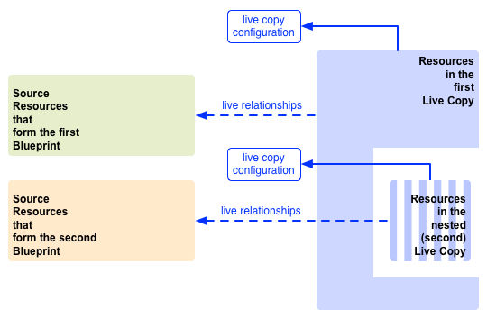

# 重複使用內容：多網站管理員和 Live Copy {#multi-site-manager-and-live-copy}

多網站管理員 (MSM) 使您能夠在多個位置使用相同的網站內容。MSM 使用其 Live Copy 功能來實現這一點。

* 有了 MSM，您可以：
   * 建立內容一次，然後
   * 在相同網站的其他區域或其他網站 (透過 [Live Copy](#live-copies)) 重複使用此內容。
* 然後，MSM 維護您的來源內容與其 Live Copy 之間的即時關係，以便：
   * 當您變更來源內容時，來源和即時副本會同步。
   * 您可以透過斷開各個子頁面和/或元件的即時關係，僅對 Live Copy 的內容進行調整。

此頁面概觀如何吏用 MSM 重複使用內容。以下頁面詳細介紹相關問題。

* [建立和同步 Live Copies](creating-live-copies.md)
* [Live Copy 概觀主控台](live-copy-overview.md)
* [設定 Live Copy 同步](live-copy-sync-config.md)
* [MSM 推出衝突](rollout-conflicts.md)
* [MSM 最佳做法](best-practices.md)

>[!NOTE]
>
>MSM 也可用於 Assets，包括內容片段。請參閱[使用Assets的MSM重複使用內容片段](/help/assets/reuse-assets-using-msm.md) (只能透過Assets主控台使用)。

## 可能的案例 {#possible-scenarios}

MSM 和 Live Copy 有很多使用案例。部分案例包括：

* **跨國公司 - 全球公司到本地公司**

  MSM 支援的典型使用案例是在多個跨國同語言網站中重複使用內容。這允許重複使用核心內容，同時也允許國家差異。

  例如，[WKND 教學課程範例](/help/implementing/developing/introduction/develop-wknd-tutorial.md)英語部分是為美國客戶建立的。此網站的大部分內容也可用於其他 WKND 網站，以迎合不同國家和文化的英語客戶。所有網站的核心內容都保持不變，但可以進行區域性調整。

  以下結構可用於美國和加拿大的網站。請注意 `language-masters` 節點如何維護英語和其他語言內容的主副本。此內容可作為除英語之外的額外區域語言內容的基礎。

  ```xml
  /content
      |- wknd
          |- language-masters
              |- en
              |- es
              |- fr
          |- us
              |- en
              |- es
          |- ca
              |- en
              |- fr
  ```

  >[!NOTE]
  >
  >MSM 不翻譯內容。它用於建立所需結構和部署內容。
  >
  >
  >如需此類範例，請參閱[翻譯多語言網站的內容](/help/sites-cloud/administering/translation/overview.md)。

* **全國 - 總公司到地區分公司**

  或者，擁有經銷商網路的公司可能想要為其各個經銷商建立單獨的網站，每個網站都是總部提供之主要網站的變化。這可能適用於擁有多個區域辦公室的單一公司，或由特許加盟總部和多個地方加盟店組成的全國特許加盟系統。

  總公司可以提供核心資訊，而區域實體可以加入當地資訊，例如聯絡方式、營業時間和活動。

  ```xml
  /content
      |- head-office-berlin
      |- branch-hamburg
      |- branch-stuttgart
      |- branch-munich
      |- branch-frankfurt
  ```

* **多個版本**

  MSM 可以建立特定子分支的版本。例如，支援子網站可以包含特定產品各不同版本的詳細資訊，其中基本資訊保持不變，只有更新的功能需要變更：

  ```xml
  /content
      |- game-support
          |- polybius
              |- v5.0
              |- v4.0
              |- v3.0
              |- v2.0
              |- v1.0
  ```

  >[!TIP]
  >
  >在這種情況下，問題在於是要製作直接副本還是使用 Live Copy，必須在以下各項間取得平衡：
  >
  >* 有多少核心內容需要跨各個版本更新。
  >
  >對比：
  >
  >* 必須調整的個別副本數量。

## 從 UI 存取 MSM {#msm-from-the-ui}

MSM 可以使用相關主控台的各種選項直接在 UI 中存取 MSM。

* **建立網站**(**Sites**)

   * MSM 協助您管理共用共同內容的多個網站。例如，網站通常是為國際訪客所提供的，因此大部分內容在所有國家/地區都是共同的，其中一部分內容特定於個別國家/地區。MSM 可讓您[建立 Live Copy，其可根據來源網站](creating-live-copies.md#creating-a-live-copy-of-a-site-from-a-blueprint-configuration)自動更新一或多個網站。這也有助於您強制施行共同的基本結構，在多個網站中使用共同內容，保持共同外觀，並集中心力管理實際在網站之間不同的內容。以此方式建立網站：
      * 需要預先定義的藍圖設定以指定來源。
      * 建立 (預先定義的) 來源的 Live Copy。
      * 為使用者提供&#x200B;**推出**&#x200B;按鈕。

* **建立 Live Copy** (**Sites**)

   * MSM可讓您[建立個別頁面或網站子分支的臨機（一次性）即時副本](creating-live-copies.md#creating-a-live-copy-of-a-page)。 例如，複製子分支可提供產品的新/更新版本的相關資訊。 以此方式建立 Live Copy：
      * 建立臨時 Live Copy (不需要藍圖設定)。
      * 可用於 (立即) 建立任一頁面/分支的 Live Copy。
      * 需要&#x200B;**同步** (不提供&#x200B;**推出**&#x200B;按鈕)。

* **檢視屬性** (**Sites**)

   * 在適當的情況下，此選項會提供關於 **Live Copy** 或&#x200B;**藍圖**&#x200B;的資訊，協助您[監控 Live Copy](creating-live-copies.md#monitoring-your-live-copy)。

* **參考** (**Sites**)

   * [參考](/help/sites-cloud/authoring/basic-handling.md#references)邊欄提供關於 **Live Copy** 的資訊以及對適當動作的存取。

* **Live Copy 概觀** (**Sites**)

   * 此主控台可讓您[檢視和管理您的Blueprint及其即時副本](live-copy-overview.md)。

* **藍圖**(**工具** - **Sites**)

   * 此主控台可讓您[建立和管理您的Blueprint設定](creating-live-copies.md#creating-a-blueprint-configuration)。

>[!NOTE]
>
>MSM可同時用於頁面和[體驗片段](/help/sites-cloud/authoring/fragments/experience-fragments.md)，因為這些片段是體驗（頁面）的一部分。

>[!NOTE]
>
>MSM 功能的某些方面用於其他幾個 AEM 功能，例如啟動。在這些情況下，Live Copy 由該功能管理。

### 使用的術語 {#terms-used}

出於介紹目的，下表概觀與 MSM 一起使用的主要術語。這些術語會在後續章節和頁面中進行更詳細的介紹。

| 術語 | 定義 | 進一步詳細資訊 |
|---|---|---|
| 來源 | 作為 Live Copy 基礎的原始頁面 | 與藍圖和/或藍圖頁是同義字 |
| Live Copy | (來源的) 副本，由推出設定定義的同步動作進行維護 |  |
| Live Copy 設定 | 定義 Live Copy 的設定詳細資料 |  |
| 即時關係 | 有效定義特定資源 (即來源和 Live Copy 之間的連接) 的繼承 | 確保對來源的變更可以與 Live Copy 同步 |
| 藍圖 | 與來源是同義字 | 可以由藍圖設定來定義 |
| 藍圖設定 | 指定源路徑的預先定義設定 | 在藍圖設定中有參考藍圖頁面時，推出命令即可使用 |
| 章節 | 要包含在 Live Copy 中的藍圖部分 | 這些通常是根的子頁面 |
| 同步 | 來源和 Live Copy 之間內容同步的通用術語 (使用&#x200B;**推出**&#x200B;和&#x200B;**同步**&#x200B;選項進行同步) |  |
| 推出 | 從來源同步到 Live Copy | 可以由作者 (在藍圖頁面上) 或系統事件 (由推出設定定義) 觸發 |
| 推出設定 | 決定哪些屬性會同步、如何同步以及何時同步的規則 |  |
| 同步 | 從 Live Copy 頁面發出的手動同步要求 |  |
| 繼承 | 同步發生時，Live Copy 頁面/元件從其來源頁面/元件繼承內容 |  |
| 暫停 | 暫時移除 Live Copy 與其藍圖頁面之間的即時關係 |  |
| 分離 | 永久移除 Live Copy 與其藍圖頁面之間的即時關係 |  |
| 重設 | 重設 Live Copy 頁面以移除所有繼承取消並將頁面恢復到與來源頁面相同的狀態。 | 重設會影響您對頁面屬性、段落系統和元件所做的任何變更。 |
| 淺層 | 單一頁面的 Live Copy |  |
| 深層 | 頁面及其子頁面的 Live Copy |  |

>[!TIP]
>
>請參閱物件名稱的[延伸多站台管理員](/help/implementing/developing/extending/msm.md#overview-of-the-java-api)。

## Live Copy {#live-copies}

MSM Live Copy 是特定網站內容的副本，與原始來源保持即時關係：

* Live Copy 從其來源繼承內容。
* 當對來源進行變更時，同步功能會實際傳輸內容。
* 可以將 Live Copy 視為：
   * 淺層：單一頁面
   * 深層：頁面及其子頁面
* 同步規則 (稱為推出設定) 決定同步哪些屬性以及何時進行同步。

在前面的範例中，`/content/wknd/language-masters/en` 是全球主要英語網站。為了重複使用此網站的內容，於是建立 MSM Live Copy：

* `/content/wknd/language-masters/en` 下面的內容是來源。
* `/content/wknd/language-masters/en` 下面的內容被複製到 `/content/wknd/us/en/` 和 `/content/wknd/ca/en` 節點下面。這些是 Live Copy。
* 作者在`/content/wknd/language-masters/en`底下變更頁面。
* 觸發後，MSM 會將這些變更同步到 Live Copy。

### Live Copy - 構成項目 {#live-copies-composition}

>[!NOTE]
>
>本章節中的圖表和描述為潛在 Live Copy 的概述。提供的資訊並不全面，只是概要說明以強調特定的特性。

當您最初建立即時副本時，所選的來源頁面會以1:1為基礎反映在即時副本中。 此後，也可以直接在 Live Copy 中建立新資源 (頁面和/或段落)，因此了解這些變化及其對同步的影響是很有用的。可能的構成項目包括：

* [含非 Live Copy 頁面的 Live Copy](#live-copy-with-non-live-copy-pages)
* [巢狀 Live Copy](#nested-live-copies)

Live Copy 的基本形式有：

* 以1:1為基礎反映所選來源頁面的即時副本頁面。
* 一個設定定義。
* 為每個資源定義的即時關係：
   * 將 Live Copy 資源與其藍圖/來源相連結。
   * 實現繼承和推出時使用。

變更可以根據需要[同步](creating-live-copies.md#synchronizing-your-live-copy)。


#### 含非 Live Copy 頁面的 Live Copy {#live-copy-with-non-live-copy-pages}

在 AEM 中建立 Live Copy 時，您可以查看和導覽 Live Copy 分支，並在 Live Copy 分支上使用一般 AEM 功能。這表示您 (或流程) 可以在 Live Copy 內建立新資源 (頁面和/或段落)。例如，特定區域或國家/地區的產品。

* 這類資源與來源/藍圖頁面沒有即時關係，並且不同步。
* 可能會發生 MSM 作為特殊案例處理的情況。例如，當您 (或流程) 在來源/藍圖和 Live Copy 分支中建立具有相同位置和名稱的頁面時。對於此類情況，請參閱 [MSM 推出衝突](rollout-conflicts.md)了解更多資訊。


#### 巢狀 Live Copy {#nested-live-copies}

當您 (或流程) [在現有 Live Copy 內建立新頁面](#live-copy-with-non-live-copy-pages)時，也可將此新頁面建立成不同藍圖的 Live Copy。這稱為巢狀 Live Copy。在巢狀 Live Copy 中，第二個或內部 Live Copy 的行為受第一個或外部 Live Copy 的影響，方式如下：

* 對頂層 Live Copy 觸發的深層推出可以繼續進行到巢狀 Live Copy。
* 在 Live Copy 中，來源之間的任何連結都會重寫。

例如，從第二個藍圖指向第一個藍圖的連結會重寫為從巢狀/第二個 Live Copy 指向第一個 Live Copy 的連結。



>[!NOTE]
>
>如果您移動或重命名 Live Copy 分支中的頁面，這會被視為巢狀 Live Copy 以使 AEM 能夠追蹤關係。

#### 堆疊 Live Copy {#stacked-live-copies}

當 Live Copy 建立為淺層 Live Copy 的子項時，它被稱為堆疊 Live Copy。它的行為方式與[巢狀 Live Copy](#nested-live-copies) 相同。

### 來源、藍圖和藍圖設定 {#source-blueprints-and-blueprint-configurations}

任何頁面或頁面分支都可以作為 Live Copy 的來源。然而，MSM 也可讓您定義指定來源路徑的藍圖設定。使用藍圖設定的好處是它們：

* 允許作者在藍圖上使用&#x200B;**推出**&#x200B;選項。也就是，明確地將修改推送到繼承自該藍圖的 Live Copy。
* 允許作者使用&#x200B;**建立網站**。這可讓使用者輕鬆選擇語言和設定 Live Copy 的結構。
* 為與藍圖具有關係的 Live Copy 定義預設推出設定。

Live Copy 的來源可以是一般頁面或藍圖設定所包含的頁面。兩者都是有效的使用案例。

來源構成 Live Copy 的藍圖。當您執行以下任一操作時，藍圖即已定義：

* [建立藍圖設定](creating-live-copies.md#creating-a-blueprint-configuration) - 該設定預先定義要用於建立 Live Copy 的頁面。
* [建立頁面的 Live Copy](creating-live-copies.md#creating-a-live-copy-of-a-page) - 用於建立 Live Copy 的頁面 (來源頁面) 為藍圖頁面。藍圖頁面可能會被藍圖設定參考，也可能不會。

### 推出和同步 {#rollout-and-synchronize}

推出是將 Live Copy 與其來源同步的中央 MSM 動作。您可以手動執行推出，也可以自動推出。

* 可以定義[推出設定](#rollout-configurations)，以便特定的[事件](live-copy-sync-config.md#rollout-triggers)可以促使推出自動發生。
* 編寫藍圖頁面時，您可以使用&#x200B;**[推出](creating-live-copies.md#rolling-out-a-blueprint)**&#x200B;命令將變更推送到 Live Copy。
   * 可在藍圖設定所參考的藍圖頁面上使用&#x200B;**推出**&#x200B;命令。

  

* 編寫 Live Copy 頁面時，您可以使用&#x200B;**[同步](creating-live-copies.md#synchronizing-a-live-copy)**&#x200B;命令將變更從來源提取到 Live Copy。
   * 一律可以在 Live Copy 頁面上使用&#x200B;**同步**&#x200B;命令，無論藍圖設定是否包含來源/藍圖頁面。

  

### 推出設定 {#rollout-configurations}

推出設定定義 Live Copy 何時以及如何與來源內容同步。推出設定由觸發器和一個或多個同步動作組成：

* **觸發器** - 觸發器是導致即時動作同步發生的事件，例如啟動來源頁面。MSM 定義了您可以使用的觸發器。
* **同步動作** - 在 Live Copy 上執行同步動作以將其與來源同步。範例動作包括複製內容、排序子節點和啟動 Live Copy 頁面。MSM提供數個同步動作。

>[!NOTE]
>
>您可以使用 Java API. 為您的執行個體建立自訂動作。

推出設定可以重複使用，這樣多個 Live Copy 可以使用相同的推出設定。標準安裝中包含多個[推出設定](live-copy-sync-config.md#installed-rollout-configurations)。

### 推出衝突 {#rollout-conflicts}

推出可能會變得複雜，尤其是當作者同時在來源和 Live Copy 中編輯內容時。因此，瞭解AEM如何處理轉出[期間可能發生的任何](rollout-conflicts.md)衝突會很有用。

### 暫停和取消繼承和同步 {#suspending-and-cancelling-inheritance-and-synchronization}

Live Copy 中的每個頁面和元件都透過即時關係與其來源頁面和元件相關聯。即時關係會設定從來源同步 Live Copy 內容。

您可以&#x200B;**暫停** Live Copy 頁面的 Live Copy 繼承，以便您可以變更頁面屬性和元件。當您暫停繼承時，頁面屬性和元件將不再與來源同步。

在編輯個別頁面時，作者可以為元件&#x200B;**取消繼承**。取消繼承後，即時關係會暫停，該元件將不會進行同步。當必須自訂內容的子區段時，取消繼承和同步會很有用。

### 分離 Live Copy {#detaching-a-live-copy}

您也可以從其藍圖[分離 Live Copy](creating-live-copies.md#detaching-a-live-copy) 以移除所有連接。

>[!CAUTION]
>
>分離動作是永久性且無法復原。

分離動作會永久移除 Live Copy 與其藍圖頁面之間的即時關係。Live Copy 中與 MSM 相關的所有屬性都會移除，Live Copy 頁面會成為獨立副本。

>[!TIP]
>
>如需完整詳細資訊，包括對子頁面和父頁面的相關影響，請參閱[分離 Live Copy](creating-live-copies.md#detaching-a-live-copy)。

## MSM 標準使用步驟 {#standard-steps-for-using-msm}

以下步驟描述了使用 MSM 來重複使用內容並將變更同步到 Live Copy 的標準程序。

1. 開發源網站的內容。
1. 決定要使用的推出設定。

   1. MSM [安裝數個轉出設定](live-copy-sync-config.md#installed-rollout-configurations)，可滿足數個使用案例。
   1. 您可以視需要[建立轉出設定](live-copy-sync-config.md#creating-a-rollout-configuration)。

1. 決定您需要在哪裡[指定要使用的推出設定](live-copy-sync-config.md#specifying-the-rollout-configurations-to-use)，並根據需要進行設定。
1. 如有必要，[建立Blueprint設定](creating-live-copies.md#creating-a-blueprint-configuration)，以識別即時副本的來源內容。
1. [建立即時副本](creating-live-copies.md#creating-a-live-copy)。
1. 根據需要變更來源內容。您應該採用您組織已建立的一般內容審查和核准流程。
1. [推出](creating-live-copies.md#rolling-out-a-blueprint)藍圖，或[將 Live Copy 與變更同步](creating-live-copies.md#synchronizing-a-live-copy)。

## 自訂 MSM {#customizing-msm}

MSM 提供的工具使您的實作在面對共用內容可能導致的異常複雜性，能夠加以適應。

* **自訂推出設定** - 當安裝的推出設定不符合您的要求時，[建立推出設定](live-copy-sync-config.md#creating-a-rollout-configuration)。您可以使用任何可用的推出觸發器和同步動作。

<!--
* **Custom Synchronization Actions** - [Create a custom synchronization action](/help/sites-developing/extending-msm.md#creating-a-new-synchronization-action) when the installed actions do not meet your specific application requirements. MSM provides a Java API for creating custom synchronization actions.
-->

## 最佳做法 {#best-practices}

[MSM 最佳做法](best-practices.md)頁面包含與您的實作相關的重要資訊。
