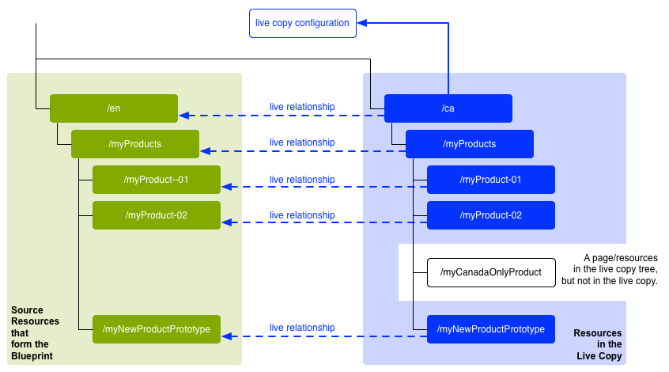

# 重新使用內容：多站點管理器和即時拷貝 {#multi-site-manager-and-live-copy}

多站點管理器(MSM)使您能夠在多個位置使用相同的站點內容。 MSM使用其Live Copy功能來實現此目的。

* 使用MSM，您可以：
   * 一次建立內容
   * 在其他區域中重複使用此內容(通過 [即時拷貝](#live-copies))。
* 然後，MSM將維護源內容與其即時拷貝之間的即時關係，以便：
   * 對源內容進行更改時，源和即時副本將同步。
   * 通過斷開單個子頁和/或元件的即時關係，您只能對即時副本的內容進行調整。

本頁概述了使用MSM重用內容。 下面將詳細介紹相關問題。

* [建立和同步即時拷貝](creating-live-copies.md)
* [Live Copy概述控制台](live-copy-overview.md)
* [配置即時拷貝同步](live-copy-sync-config.md)
* [MSM部署衝突](rollout-conflicts.md)
* [MSM最佳實踐](best-practices.md)

## 可能的方案 {#possible-scenarios}

MSM和Live Copies有許多使用案例。 一些情況包括：

* **跨國公司 — 全球到本地公司**

   MSM支援的一個典型使用案例是在多個跨國相同語言站點中重複使用內容。 這允許核心內容被重新使用，同時也允許國家變化。

   例如， [WKND教程示例](/help/implementing/developing/introduction/develop-wknd-tutorial.md) 為美國客戶建立。 此網站中的大部分內容還可用於其他WKND網站，這些網站面向不同國家和文化的英語客戶。 所有站點的核心內容都保持不變，而區域調整則可進行。

   以下結構可用於美國和加拿大的場址。 注意方式 `language-masters` 節點不僅維護英語，還維護其他語言內容的主副本。 此內容可用作英語之外的其他區域語言內容的基礎。

   ```xml
   /content
       |- wknd
           |- language-masters
               |- en
               |- es
               |- fr
           |- us
               |- en
               |- es
           |- ca
               |- en
               |- fr
   ```

   >[!NOTE]
   >
   >MSM不翻譯內容。 它用於建立所需的結構並部署內容。
   >
   >
   >請參閱 [翻譯多語言站點的內容](/help/sites-cloud/administering/translation/overview.md) 比如這樣一個例子。

* **國家 — 總辦事處至區域分處**

   或者，擁有經銷商網路的公司可能希望為其各個經銷商建立單獨的網站，每個網站都是總部提供的主要網站的變體。 這可能適用於一個擁有多個地區辦事處的公司，或一個由中央加盟商和多個地方加盟商組成的全國加盟系統。

   總部可以提供核心資訊，而區域實體可以添加當地資訊，如聯繫詳情、開業時間和活動。

   ```xml
   /content
       |- head-office-berlin
       |- branch-hamburg
       |- branch-stuttgart
       |- branch-munich
       |- branch-frankfurt
   ```

* **多個版本**

   MSM可以建立特定子分支的版本。 例如，支援子站點可以保存特定產品不同版本的詳細資訊，其中基本資訊保持不變，只需更改更新的功能：

   ```xml
   /content
       |- game-support
           |- polybius
               |- v5.0
               |- v4.0
               |- v3.0
               |- v2.0
               |- v1.0
   ```

   >[!TIP]
   >
   >在這種情況下，這就是是製作直觀副本還是使用即時副本的問題，這是以下兩方面的平衡：
   >
   >* 有多少核心內容需要跨多個版本進行更新。
   >
   >反對：
   >
   >* 需要調整多少個副本。


## 從UI進行MSM {#msm-from-the-ui}

MSM可通過相應控制台中的各種選項在UI中直接訪問。

* **建立站點** (**站點**)

   * MSM幫助您管理多個共用公共內容的網站。 例如，網站通常為國際受眾提供，因此大多數內容在所有國家都是共有的，其中一部分內容是特定於個別國家的。 MSM允許您 [建立基於源站點自動更新一個或多個站點的即時拷貝](creating-live-copies.md#creating-a-live-copy-of-a-site-from-a-blueprint-configuration)。 這還有助於您強制實施通用基礎結構、跨多個站點使用通用內容、保持通用外觀和感受，並將精力集中在管理站點之間實際不同的內容上。 以此方式建立站點：
      * 需要預定義的藍圖配置來指定源。
      * 建立（預定義）源的即時副本。
      * 為用戶提供 **推廣** 按鈕

* **建立即時拷貝** (**站點**)

   * MSM允許您 [建立網站單個頁面或子分支的即席（一次性）即時副本。](creating-live-copies.md#creating-a-live-copy-of-a-page) 例如，複製子分支以提供有關產品的新/更新版本的資訊。 以此方式建立即時副本：
      * 建立即席即時拷貝（不需要藍圖配置）。
      * 可用於（立即）建立任何頁/分支的即時副本。
      * 需要 **同步** (不提供 **推廣** 按鈕)。

* **查看屬性** (**站點**)

   * 在適當情況下，此選項可幫助您 [監視您的即時拷貝](creating-live-copies.md#monitoring-your-live-copy) 提供有關 **即時拷貝** 或 **藍圖**。

* **引用** (**站點**)

   * 的 [引用](/help/sites-cloud/authoring/getting-started/basic-handling.md#references) 軌道提供有關 **即時拷貝** 以及對相應操作的訪問。

* **即時複製概述** (**站點**)

   * 此控制台允許您 [查看和管理您的藍圖及其即時副本。](live-copy-overview.md)

* **藍圖** (**工具** - **站點**)

   * 此控制台允許您 [建立和管理藍圖配置。](creating-live-copies.md#creating-a-blueprint-configuration)

>[!NOTE]
>
>MSM功能的各個方面在諸如啟動等其AEM它幾個功能中使用。 在這些情況下，即時拷貝由該功能管理。

### 使用的術語 {#terms-used}

作為導言，下表概述了MSM使用的主要術語。 這些內容將在後續章節和頁面中詳細介紹。

| 詞彙 | 定義 | 詳細資訊 |
|---|---|---|
| 來源 | 用作即時副本基礎的原始頁 | 與「藍圖」和/或「藍圖」頁同義 |
| 即時副本 | 由同步操作維護的（源的）副本（由部署配置定義） |  |
| 即時複製配置 | Live Copy的配置詳細資訊定義 |  |
| 即時關係 | 給定資源繼承的有效定義，即源和即時副本之間的連接 | 確保對源的更改可以與即時拷貝同步 |
| Blueprint | 同義於源 | 可由藍圖配置定義 |
| 藍圖配置 | 指定源路徑的預定義配置 | 在藍圖配置中引用藍圖頁面時，「展示」命令將可用 |
| 章 | 要包含在即時副本中的藍圖各節 | 這些通常是根的子頁 |
| 同步 | 用於在源和即時拷貝之間同步內容的通用術語（由兩者同時使用） **推廣** 和 **同步** 選項) |  |
| 轉出 | 從源同步到即時副本 | 可由作者（在藍圖頁面上）或系統事件（由部署配置定義）觸發 |
| 轉出設定 | 確定將同步哪些屬性、同步方式和同步時間的規則 |  |
| 同步 | 從Live Copy頁面發出的手動同步請求 |  |
| 繼承 | 當同步發生時， Live Copy頁/元件從其源頁/元件繼承內容 |  |
| 擱置 | 臨時刪除即時副本與其藍圖頁面之間的即時關係 |  |
| 分離 | 永久刪除即時副本與其藍圖頁面之間的即時關係 |  |
| 重設 | 重置「即時複製」頁以刪除所有繼承取消項並將頁返回到與源頁相同的狀態 | 重置會影響您對頁面屬性、段落系統和元件所做的任何更改。 |
| 淺 | 單頁的即時副本 |  |
| 深入 | 頁面及其子頁面的即時副本 |  |

<!--
>[!TIP]
>
>See [Overview of the Java API](/help/sites-developing/extending-msm.md#overview-of-the-java-api) for the object names.
-->

## 即時副本 {#live-copies}

MSM Live Copy是與原始源保持即時關係的特定站點內容的副本：

* 即時拷貝從其源繼承內容。
* 當對源進行更改時，同步執行內容的實際傳輸。
* Live Copy可以視為：
   * 淺：單頁
   * 深：頁面及其子頁面
* 同步規則（稱為轉出配置）可確定要同步的屬性以及同步發生的時間。

在上一個示例中， `/content/wknd/language-masters/en` 是全球英語母版網站。 要重用此站點的內容，將建立MSM Live Copies:

* 以下內容 `/content/wknd/language-masters/en` 是源。
* 以下內容 `/content/wknd/language-masters/en` 複製到 `/content/wknd/us/en/` 和 `/content/wknd/ca/en` 節點。 這些是即時拷貝。
* 作者對下面的頁面進行更改 `/content/wknd/language-masters/en`。
* 觸發時，MSM將這些更改同步到即時副本。

### 即時拷貝 — 合成 {#live-copies-composition}

>[!NOTE]
>
>本節中的圖和說明表示潛在即時副本的快照。 它們不全面，但提供了概述以突出具體特徵。

最初建立即時副本時，所選源頁面將以1:1的基準反映在即時副本中。 此後，也可以直接在Live Copy中建立新資源（頁面和/或段落），因此瞭解這些變化及其對同步的影響非常有用。 可能的組合物包括：

* [帶非Live-Copy頁的Live Copy](#live-copy-with-non-live-copy-pages)
* [嵌套的即時副本](#nested-live-copies)

Live Copy的基本形式有：

* 反映所選源頁面的即時複製頁面(1:1)。
* 一個配置定義。
* 為每個資源定義的即時關係：
   * 將即時複製資源與其藍圖/源連結。
   * 在實現繼承和展示時使用。

更改可以 [同步](creating-live-copies.md#synchronizing-your-live-copy) 按要求。


#### 帶非即時拷貝頁面的即時拷貝 {#live-copy-with-non-live-copy-pages}

在中建立即時複製AEM時，您可以查看並瀏覽「即時複製」分支，並在「即時複製」分支AEM上使用常規功能。 這意味著您（或流程）可以在Live Copy內建立新資源（頁面和/或段落）。 例如，特定區域或國家的產品。

* 此類資源與源/藍圖頁沒有即時關係，且不同步。
* MSM作為特殊情況處理的情形可能發生。 例如，當您（或進程）在源/藍圖和Live Copy分支中建立位置和名稱相同的頁面時。 有關此類情況，請參閱 [MSM部署衝突](rollout-conflicts.md) 的子菜單。



#### 嵌套的即時副本 {#nested-live-copies}

建立 [現有Live Copy中的新頁面](#live-copy-with-non-live-copy-pages) 此新頁面也可以設定為不同藍圖的即時副本。 這稱為嵌套的即時拷貝。 在嵌套的即時拷貝中，第二個或內部即時拷貝的行為受第一個或外部即時拷貝的影響方式如下：

* 為頂級即時拷貝觸發的深度部署可以繼續到嵌套的即時拷貝中。
* 源之間的任何連結將在即時副本中重寫。

例如，從第二個到第一個藍圖的連結將被重寫為從嵌套的/第二個即時拷貝到第一個即時拷貝的連結。


>[!NOTE]
>
>如果在Live Copy分支中移動或更名頁面，則此頁面將被視為嵌套的Live Copy，以AEM便跟蹤關係。

#### 堆疊即時副本 {#stacked-live-copies}

當作為淺即時副本的子級建立時，即時副本稱為堆疊即時副本。 它的行為方式與 [嵌套即時複製](#nested-live-copies)。

### 源、藍圖和藍圖配置 {#source-blueprints-and-blueprint-configurations}

任何頁面或頁面分支都可用作即時副本的源。 但是，MSM還允許您定義指定源路徑的藍圖配置。 使用藍圖配置的好處是：

* 允許作者使用 **推廣** 的下界。 即明確將修改推送到從此藍圖繼承的即時副本。
* 允許作者使用 **建立站點**。 這允許用戶輕鬆選擇語言並配置即時拷貝的結構。
* 為與藍圖有關的即時副本定義預設部署配置。

即時拷貝的源可以是藍圖配置包含的常規頁面或頁面。 這兩個都是有效的使用案例。

源將構成即時拷貝的藍圖。 在以下情況下定義藍圖：

* [建立藍圖配置](creating-live-copies.md#creating-a-blueprint-configuration)  — 該配置會預先定義用於建立即時副本的頁面。
* [建立頁面的即時副本](creating-live-copies.md#creating-a-live-copy-of-a-page)  — 用於建立即時拷貝（源頁）的頁是藍圖頁。 藍圖配置可能引用源頁面，也可能不引用源頁面。

### 展示和同步 {#rollout-and-synchronize}

推廣是使即時拷貝與其源同步的中央MSM操作。 您可以手動執行部署，也可以自動執行。

* A [部署配置](#rollout-configurations) 可以定義為 [事件](live-copy-sync-config.md#rollout-triggers) 會導致自動部署。
* 建立藍圖頁面時，可以使用 **[推廣](creating-live-copies.md#rolling-out-a-blueprint)** 命令將更改推送到即時副本。
   * 的 **推廣** 命令可在藍圖配置引用的藍圖頁上使用。

   

* 創作「即時複製」頁時，您可以使用 **[同步](creating-live-copies.md#synchronizing-a-live-copy)** 命令將更改從源拉到即時副本。
   * 的 **同步** 無論源/藍圖頁是否包含在藍圖配置中，命令都始終可在「即時複製」頁上使用。

   

### 轉出設定 {#rollout-configurations}

部署配置定義即時拷貝與源內容同步的時間和方式。 部署配置由觸發器和一個或多個同步操作組成：

* **觸發器**  — 觸發器是導致即時操作同步發生的事件，如激活源頁。 MSM定義可使用的觸發器。
* **同步操作**  — 在Live Copy上執行同步操作，以將其與源同步。 示例操作包括複製內容、訂購子節點和激活「即時複製」頁。 MSM提供了許多同步操作。

>[!NOTE]
>
>可以使用Java API為實例建立自定義操作。

可以重新使用推廣配置，以便多個Live Copy可以使用相同的推廣配置。 幾個 [部署配置](live-copy-sync-config.md#installed-rollout-configurations) 包含在標準安裝中。

### 部署衝突 {#rollout-conflicts}

部署可能會變得複雜，尤其是當作者正在編輯源和即時拷貝中的內容時。 因此，瞭解如何處理任AEM何 [在部署過程中可能發生的衝突。](rollout-conflicts.md)

### 掛起和取消繼承和同步 {#suspending-and-cancelling-inheritance-and-synchronization}

Live Copy中的每個頁面和元件都通過即時關係與其源頁面和元件相關聯。 即時關係配置源中即時複製內容的同步。

你可以 **掛起** Live Copy頁的Live Copy繼承，以便您可以更改頁面屬性和元件。 掛起繼承時，頁面屬性和元件不再與源同步。

編輯單個頁面時，作者可以 **取消繼承** 的子菜單。 取消繼承後，將掛起即時關係，並且不會對該元件進行同步。 當需要自定義內容的子部分時，取消繼承和同步非常有用。

### 分離即時副本 {#detaching-a-live-copy}

您也可以 [分離即時副本](creating-live-copies.md#detaching-a-live-copy) 從藍圖中移除所有連接。

>[!CAUTION]
>
>「分離」(Detach)操作是永久的且不可逆的。

分離操作將永久刪除即時副本與其藍圖頁面之間的即時關係。 所有與MSM相關的屬性都從Live Copy中刪除，Live Copy頁面將變成獨立副本。

>[!TIP]
>
>請參閱 [分離即時副本](creating-live-copies.md#detaching-a-live-copy) 詳細資訊，包括子頁和父頁的相關影響。

## 使用MSM的標準步驟 {#standard-steps-for-using-msm}

以下步驟介紹了使用MSM重用內容並同步對即時副本所做的更改的標準過程。

1. 開發源站點的內容。
1. 確定要使用的推廣配置。

   1. MSM [安裝幾個部署配置](live-copy-sync-config.md#installed-rollout-configurations) 可以滿足多種使用情況。
   1. （可選）您可以 [建立部署配置](live-copy-sync-config.md#creating-a-rollout-configuration) 的子菜單。

1. 確定您需要的位置 [指定要使用的推廣配置](live-copy-sync-config.md#specifying-the-rollout-configurations-to-use) 並根據需要進行配置。
1. 如果需要， [建立藍圖配置](creating-live-copies.md#creating-a-blueprint-configuration) 標識Live Copy的源內容。
1. [建立即時副本。](creating-live-copies.md#creating-a-live-copy)
1. 根據需要對源內容進行更改。 您應採用您公司已建立的常規內容審核和批准流程。
1. [展開](creating-live-copies.md#rolling-out-a-blueprint) 藍圖，或者 [同步即時拷貝](creating-live-copies.md#synchronizing-a-live-copy) 和更改。

## 自定義MSM {#customizing-msm}

MSM提供工具，以便您的實施能夠適應共用內容時可能存在的異常複雜性。

* **自定義部署配置** - [建立部署配置](live-copy-sync-config.md#creating-a-rollout-configuration) 安裝的部署配置不符合您的要求時。 可以使用任何可用的轉出觸發器和同步操作。

<!--
* **Custom Synchronization Actions** - [Create a custom synchronization action](/help/sites-developing/extending-msm.md#creating-a-new-synchronization-action) when the installed actions do not meet your specific application requirements. MSM provides a Java API for creating custom synchronization actions.
-->

## 最佳作法 {#best-practices}

的 [MSM最佳實踐](best-practices.md) 頁面包含有關您的實施的重要資訊。
