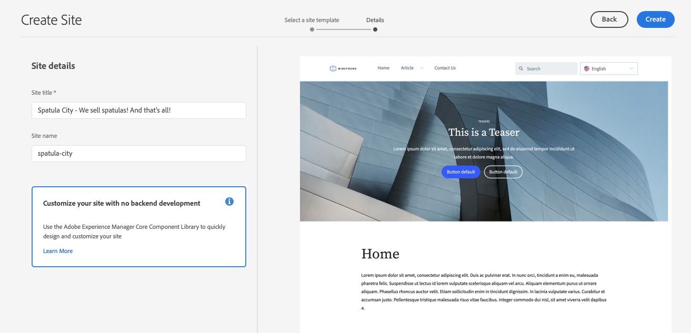

# 建立網站 {#creating-site}

了解如何使用AEM使用網站範本建立網站，以定義網站的樣式和結構。

>[!CAUTION]
>
>快速網站建立工具目前是技術預覽。 除非經Adobe支援同意，否則可供測試及評估之用，且非供生產使用。

## 概覽 {#overview}

內容作者必須先建立網站，才能建立含有內容的頁面。 這通常由定義網站初始結構的AEM管理員執行。 使用網站範本可讓網站建立快速且靈活。

AEM快速網站建立工具可讓非開發人員使用網站範本，從頭開始快速建立新網站。

建立後，「快速網站建立」工具也可讓您快速自訂AEM網站（JavaScript、CSS和靜態資源）的主題和樣式。 這可讓不需要AEM知識的前端開發人員，與內容建立者分開工作，並與其平行。 AEM管理員只需下載網站主題，並提供給前端開發人員，讓他們使用自己最喜愛的工具進行自訂，然後將變更提交至AEM程式碼存放庫，再由系統部署。

本文檔重點介紹使用「快速站點建立」工具建立站點。 如果您想要概略了解網站建立和自訂工作流程，請參閱 [AEM快速網站建立歷程](/help/journey-sites/quick-site/overview.md)

## 規劃站點結構 {#structure}

請事先考慮網站的用途和計畫內容，並花費時間。 這將推動您設計網站結構的方式。 良好的網站結構支援網站訪客輕鬆導覽和探索內容，並支援各種AEM功能，例如 [多站點管理和翻譯。](/help/sites-cloud/administering/msm-and-translation.md)

>[!TIP]
>
>[WKND參考網站](https://wknd.site) 提供功能完整的戶外體驗品牌網站的最佳實務實作。 探索它，了解建置良好的AEM網站的結構。

## 網站範本 {#site-templates}

由於網站結構對網站的成功非常重要，因此使用預定義結構可以方便地根據一組現有標準快速部署新網站。 網站範本是將基本網站內容結合為方便且可重複使用套件的方式。

網站範本通常包含基本網站內容和結構，以及網站樣式資訊，以便快速開始新網站。 範本功能強大，因為可重複使用且可自訂。 由於AEM安裝中提供多個範本，因此您可以彈性建立不同的網站，以符合各種業務需求。

>[!TIP]
>
>有關網站範本的詳細資訊，請查看 [網站範本](site-templates.md) 文章。

>[!NOTE]
>
>網站範本與頁面範本不容混淆。 網站範本會定義網站的整體結構。 頁面範本會定義個別頁面的結構和初始內容。

## 建立網站 {#create-site}

使用範本建立網站很簡單。

1. 登入AEM製作環境，並導覽至Sites主控台

   * `https://<your-author-environment>.adobeaemcloud.com/sites.html/content`

1. 點選或按一下 **建立** 在畫面右上方，從下拉式功能表中選取 **範本網站**.

   

1. 在「建立網站」精靈中，點選或按一下左側面板中的現有範本，或按一下 **匯入** 填入新範本。

   

   1. 如果您選擇匯入，請在檔案瀏覽器中，找到您要使用的範本，然後點選或按一下 **上傳**.

   1. 上傳後，它會顯示在可用範本清單中。

1. 選取範本時，會在右側欄中顯示範本的相關資訊。 在選取所需範本後，點選或按一下 **下一個**.

   

1. 提供您網站的標題。 若省略，可提供網站名稱或從標題產生網站名稱。

   * 網站標題會顯示在瀏覽器標題列中。
   * 網站名稱會成為URL的一部分。
   * 網站名稱必須符合 [AEM頁面命名慣例。](/help/sites-cloud/authoring/fundamentals/organizing-pages.md#page-name-restrictions-and-best-practices)

1. 點選或按一下 **建立** 並從網站範本建立網站。

   

1. 在顯示的確認對話方塊中，點選或按一下 **完成**.

   

1. 在網站主控台中，新網站會顯示，並可導覽至瀏覽範本所定義的基本結構。

   

內容作者現在可以開始編寫！

## 網站自訂 {#site-customization}

如果您的網站需要自訂，而不是可用的範本，您有許多選項。

* 如果需要調整網站結構或初始內容， [可根據您的需求自訂網站範本。](site-templates.md)
* 如果網站樣式需要調整， [網站主題可下載並自訂。](/help/journey-sites/quick-site/overview.md)
* 如果需要調整網站功能， [網站可完全自訂。](/help/implementing/developing/introduction/develop-wknd-tutorial.md)

任何定制都應在開發團隊的支援下進行。
