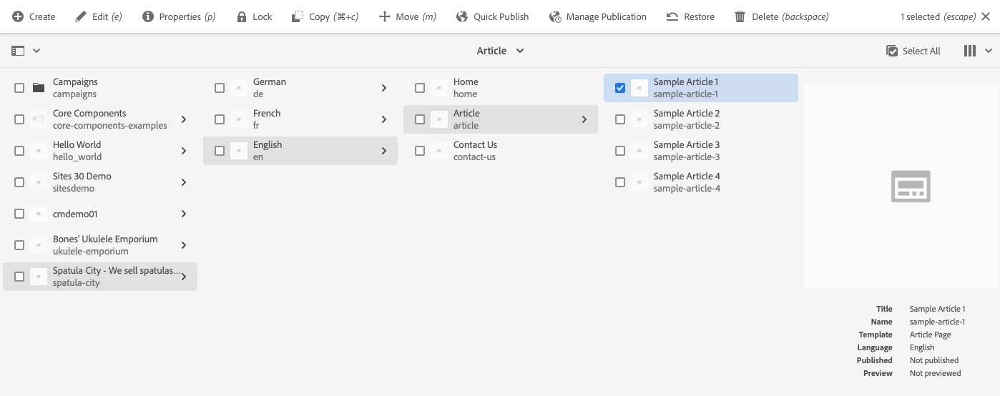

# 建立網站 {#creating-site}

瞭解如何使用AEM建立網站，並使用網站範本定義網站的樣式和結構。

## 概觀 {#overview}

必須先建立網站，內容作者才能建立含有內容的頁面。 這通常由定義網站初始結構的AEM管理員執行。 使用網站範本可讓您快速且靈活地建立網站。

AEM 快速網站建立歷程工具可讓非開發人員使用網站範本從頭開始快速建立新網站。

建立後，快速網站建立工具還可讓您快速為 AEM 網站自訂主題並建立風格 (JavaScript、CSS 和靜態資源)。這使得前端開發人員即使不懂 AEM 也能與內容建立者分開且並行工作。AEM 管理員只需下載網站主題並將其提供給前端開發人員，前端開發人員使用他們偏好的工具自訂主題，然後將變更提交到 AEM 程式碼存放庫，然後進行部署。

本檔案著重於使用快速網站建立工具建立網站。 如果您想概略瞭解網站建立和自訂工作流程，請參閱 [AEM快速網站建立歷程](/help/journey-sites/quick-site/overview.md)

## 規劃網站結構 {#structure}

請花點時間提前考慮您網站的目的和規劃內容。 這將推動您設計網站結構的方式。 良好的網站結構可支援網站訪客輕鬆導覽和發現內容，並支援各種AEM功能，例如 [多站台管理與翻譯](/help/sites-cloud/administering/msm-and-translation.md).

>[!TIP]
>
>[WKND參考網站](https://wknd.site) 提供功能齊全的戶外體驗品牌網站的最佳實務實作。 探索該網站，瞭解建置良好的AEM網站是如何建構的。

## 網站範本 {#site-templates}

由於網站結構對於網站的成功非常重要，因此使用預先定義的結構可以很方便地，根據一組現有標準快速部署新網站。 網站範本是一種將基本網站內容結合成方便且可重複使用之封裝的方法。

網站範本通常包含基本網站內容和結構以及網站樣式資訊，以便快速啟動新網站。 範本可重複使用且可自訂，因此功能強大。 由於您可以在AEM安裝中使用多個範本，因此可以彈性地建立不同的網站以符合各種業務需求。

>[!TIP]
>
>如需網站範本的詳細資訊，請參閱 [網站範本](site-templates.md).

>[!NOTE]
>
>不要將網站範本與頁面範本混淆。 網站範本定義網站的整體結構。 頁面範本會定義個別頁面的結構和初始內容。

## 建立網站 {#create-site}

使用範本建立網站非常簡單。

1. 登入您的AEM編寫環境並導覽至網站主控台

   * `https://<your-author-environment>.adobeaemcloud.com/sites.html/content`

1. 點選或按一下 **建立** 在畫面的右上方，從下拉式功能表中選取 **從範本建立網站**.

   

1. 在「建立網站」精靈中，點選或按一下左側面板中的現有範本或開啟 **匯入** ，以匯入新的範本。

   

   1. 如果您選擇匯入，請在檔案瀏覽器中，找到您要使用的範本，然後點選或按一下 **上傳**.

   1. 上傳後，範本就會顯示在可用範本清單中。

1. 選取範本時，它會在右欄中顯示範本的相關資訊。 選取您想要的範本後，點選或按一下 **下一個**.

   

1. 提供您網站的標題。 若省略，可提供網站名稱，或從標題產生。

   * 網站標題會顯示在瀏覽器標題列中。
   * 網站名稱會成為URL的一部分。
   * 網站名稱必須符合 [AEM頁面命名慣例](/help/sites-cloud/authoring/fundamentals/organizing-pages.md#page-name-restrictions-and-best-practices).

1. 點選或按一下 **建立** 並從網站範本建立網站。

   

1. 在出現的確認對話方塊中，點選或按一下 **完成**.

   

1. 在網站主控台中，新網站是可見的，且可供導覽以探索其由範本定義的基本結構。

   

內容作者現在可以開始撰寫了！

## 網站自訂 {#site-customization}

如果您的網站需要在可用範本之外進行自訂，您有多種選擇。

* 如果需要調整網站結構或初始內容， [網站範本可自訂以符合您的需求](site-templates.md).
* 如果需要調整網站樣式， [可以下載網站主題並加以自訂](/help/journey-sites/quick-site/overview.md).
* 如果需要調整網站功能， [網站可完全自訂](/help/implementing/developing/introduction/develop-wknd-tutorial.md).

任何自訂作業都應在開發團隊的支援下進行。
