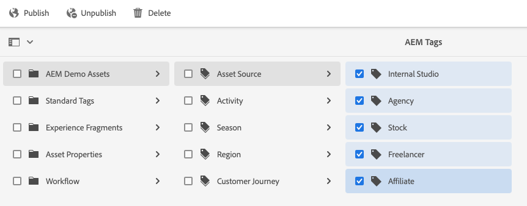
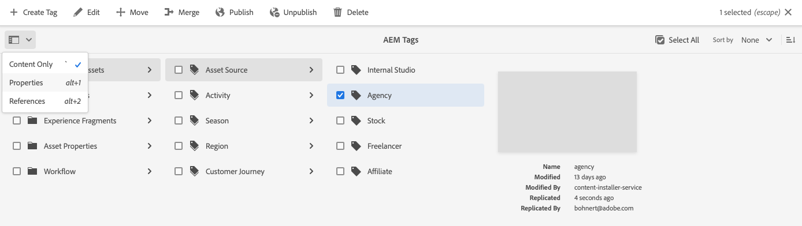
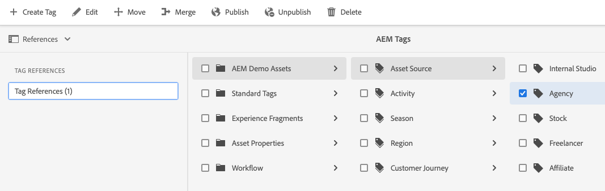
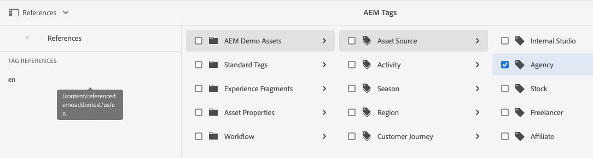
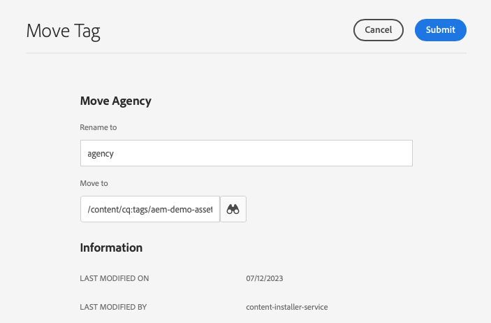
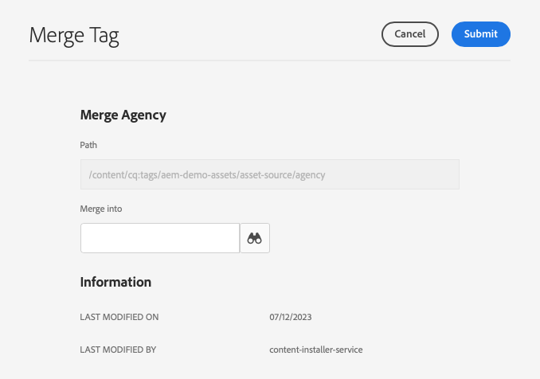

# 管理標記 {#administering-tags}

標記是對內容進行分類的直覺式方法。可將標記視為關鍵字或標籤 (中繼資料)，可以更快速地找到內容。

在 Adob&#x200B;&#x200B;e Experience Manager (AEM) 中，標記可以是以下的屬性：

* 頁面的內容節點
   * 如需詳細資訊，請參閱文件「[使用標記](/help/sites-cloud/authoring/sites-console/tags.md)」。
* 資產的中繼資料節點
   * 如需詳細資訊，請參閱文件「[管理數位資產的中繼資料](/help/assets/manage-metadata.md)」。

>[!TIP]
>
>最佳做法是將和相同想法相關的標記數量減至最少。例如，如果您正在管理戶外&#x200B;&#x200B;用品店的內容，則可能不需要同時使用&#x200B;**鞋類**&#x200B;和&#x200B;**鞋子**&#x200B;的標記。

## 標記功能 {#tag-features}

標記可提供整理和管理內容的強大功能。

* 標記可分門別類至不同的命名空間。
   * 命名空間可視為是允許建構分類法的層次結構。
   * 這些分類法在整個 AEM 中都適用。
* 標記可以由作者套用，並可供網站訪客使用。
* 無論由誰建立，所有形式的標記都可在指定給頁面或搜尋時用於選取。
* 標記會由[清單元件](https://experienceleague.adobe.com/docs/experience-manager-core-components/using/wcm-components/list.html?lang=zh-Hant)用於根據選取的標記產生動態清單。

## 標記需求 {#requirements}

建立和管理標記時需要謹記一些技術詳情。

* 標記在特定命名空間內必須是唯一的。
* 標記的名稱可能不包含標記分隔符號：
   * 冒號 (`:`) - 用於分隔命名空間標記
   * 斜線 (`/`) - 用於分隔子標記
* 如果標記的標題包含標記分隔符號，則在 UI 中會遭到封鎖。
* `tag-administrators` 群組的成員以及擁有 `/content/cq:tags` 修改權的成員可建立標記並修改其分類。
   * 包含子標記的標記稱為容器標記。
   * 非容器標記的標記則稱為葉標記。
   * 標記命名空間可以是葉標記或容器標記。

如需有關標籤如何運作的詳細技術資訊，請參閱[AEM標籤架構](/help/implementing/developing/introduction/tagging-framework.md)。

## 標記主控台 {#tagging-console}

標記主控台用於建立和管理標記及其分類法。您可以使用標記主控台依據以下方式管理您的標記：

* 將標記分門別類至不同的命名空間。
* 在建立新標記之前檢閱現有標記的使用情況。
* 在保持標記和現有參照內容連結的情況下重新整理標記。

若要存取標記主控台：

1. 使用管理權限登入編寫環境。
1. 在全域導覽功能表中選取&#x200B;**`Tools`** > **`General`** >
   **`Tagging`**。

## 建立新標記 {#creating-new-tags}

建立並使用標籤來組織內容有數個步驟。

1. [建立標記的命名空間](#creating-namespaces) (或選擇現有的以重複使用)。
1. [建立新標籤](#creating-tags)。
1. [Publish標籤](#publishing-tags)。

### 建立命名空間 {#creating-namespaces}

命名空間用於整理其他標記。可將其視為最低層級的標記，通常用於將其他標記分組。

1. 若要建立名稱空間，請開啟[標籤主控台](#tagging-console)並選取工具列中的&#x200B;**建立**&#x200B;按鈕，然後選取&#x200B;**建立名稱空間**。

   

1. 提供必要資訊。

   * **標題** - 在 UI 中向使用者顯示的命名空間的標題 (選用)
   * **名稱** - 如果未指定名稱，則在&#x200B;**標題**&#x200B;中建立有效的節點名稱。如需詳細資訊，可參閱文件「[AEM 標記架構](/help/implementing/developing/introduction/tagging-framework.md#tagid)」。
   * **說明** - 命名空間的說明 (選用)

1. 輸入必要資訊後，請選取&#x200B;**建立**。

命名空間即建立完成。在標籤主控台中，名稱空間位於最低層級（在主控台中最左側的欄），並由資料夾圖示表示，這反映了它們作為「容器」或其他標籤分組的性質。

您現在可以[在此名稱空間中建立新標籤](#creating-tags)，或[管理現有標籤](#managing-tags)。

命名空間不需要包含任何子標記。由於命名空間本身就是一種標記，因此可以像任何其他標記一樣用於編排您的內容。但是，若要繼續建立結構化標記分類法，您可以根據專案需求在該命名空間內[建立子標記](#creating-tags)。

### 建立標記 {#creating-tags}

標記通常會新增到命名空間中。

1. 若要建立標籤，請開啟[標籤主控台](#tagging-console)。

1. 選取您要建立標籤的名稱空間。 或者選取另一個標記，在其下方建立子標記。

1. 選取工具列上的&#x200B;**建立**&#x200B;按鈕，然後選取&#x200B;**建立標籤**。

1. 「**建立標記**」對話框會隨即開啟。提供新標記所需的資訊。

   * **標題** - 標記的顯示標題 (必要)
   * **名稱** - 標記的名稱 (必要)。如果未指定，則從&#x200B;**標題**&#x200B;建立有效的節點名稱。請參閱 [TagID](/help/implementing/developing/introduction/tagging-framework.md#tagid)。
   * **說明** - 標記的說明
   * **標記路徑** - 預設為您在標記主控台中選取的命名空間 (或標記)。這可手動更新，只要點選或按一下路徑選擇器圖示即可進行。

   

1. 選取&#x200B;**提交**。

標記已建立，主控台也已更新，顯示新的標記。

標記可讓您根據組織需求靈活地建立自己的分類法。

* 在建立新標記之前，在主控台中選取父標記，即可建立現有標記的子標記。
* 如果您未選取名稱空間或其他標籤便建立標籤，則能有效建立名稱空間。

### 發佈標記 {#publishing-tags}

就像在AEM中建立任何其他內容一樣，在您建立標籤（或名稱空間）後，它只存在於編寫環境中。 為了讓您的標記可供使用者使用，您必須發佈標記。

1. 若要發佈標籤，請開啟[標籤主控台](#tagging-console)。

1. 選取您要發佈的一個或多個標籤，然後在工具列中選取&#x200B;**Publish**。

   

1. **發佈標記**&#x200B;對話框會要求確認要發佈選取的標記。選取「**發佈**」。

   

1. 發佈動作確認時會出現「**成功**」對話框。

   

選取的標記會排入發佈佇列。與頁面內容類似，無論是否有子標記，只會發佈選取的標記。

若要發佈整個分類法 (命名空間和子標記)，最佳做法是建立命名空間[套件](/help/implementing/developing/tools/package-manager.md) (請參閱[分類法根節點](/help/implementing/developing/introduction/tagging-framework.md#taxonomy-root-node))。

<!--
Be sure to [apply permissions](#setting-tag-permissions) to the namespace before creating the package.
-->

## 管理標記 {#managing-tags}

您可以對現有標籤和名稱空間執行數個動作，以管理和組織這些標籤和名稱空間。 只需在[標記主控台](#tagging-console)中選取標記或命名空間，即可在工具列中顯示為可用的動作。

* [檢視屬性](#viewing-tag-properties)
* [編輯](#editing-tags)
* [未發佈](#unpublishing-tags)
* [參考](#viewing-tag-references)
* [移動](#moving-tags)
* [合併](#merging-tags)
* [刪除](#deleting-tags)

當工具列上有足夠的可用空間時，省略符號圖示後面會有其他選項。

### 檢視標記屬性 {#viewing-tag-properties}

在標記主控台中選取單一標記或命名空間或其他標記時，所選取標記的基本詳細資料 (例如上次編輯的時間和上次發佈的時間) 會顯示在標記欄左側的欄中。

將主控台切換到「**屬性**」檢視，即可檢視標記的詳細資料，包括最後發佈者以及時間。

1. 若要檢視標籤的內容，請開啟[標籤主控台](#tagging-console)。

1. 選取您要檢視其屬性的標籤，然後在左側邊欄中選取&#x200B;**屬性**。

   

1. 所選取標記的詳細屬性會顯示在左側邊欄中。

   

如需有關選取檢視模式和邊欄的詳細資訊，請參閱[基本處理](/help/sites-cloud/authoring/basic-handling.md#rail-selector)。

### 編輯標記 {#editing-tags}

建立標記和命名空間後可進行編輯。

1. 若要編輯標籤，請開啟[標籤主控台](#tagging-console)。

1. 選取您要編輯的標籤，然後在工具列中選取&#x200B;**編輯**。

1. 進行所需的變更。可變更的項目為：

   * **標題**
   * **說明**
   * [**本地化**](#managing-tags-in-different-languages)

1. 完成編輯後，選取&#x200B;**提交**。

如需如何新增語言翻譯的詳細資料，請參閱「[管理不同語言的標記](#managing-tags-in-different-languages)」一節。

如果您對已發佈的標籤所做的變更，您可能要[重新發佈](#publishing-tags)。

### 取消發佈標記 {#unpublishing-tags}

若要停用作者執行個體上的標籤並將其從發佈執行個體中移除，您可以將其取消發佈。

1. 若要取消發佈標籤，請開啟[標籤主控台](#tagging-console)。

1. 選取您要取消發佈的標籤，然後在工具列中選取&#x200B;**取消發佈**。

   

1. **取消發佈標記**&#x200B;對話框會要求確認要發佈選取的標記。選取「**發佈**」。

   

1. 取消發佈動作確認時會出現「**成功**」對話框。

   

選取的標記會排入取消發佈佇列。如果所選取的標記為容器標記，則其所有子標記都會在作者環境中停用，並從發佈環境移除。

### 檢視標記參考 {#viewing-tag-references}

若要查看特定標記套用於哪些內容，這可能很實用。在標記主控台中使用&#x200B;**參考**&#x200B;檢視，即可進行此動作。

1. 若要檢視標籤的參考，請開啟[標籤主控台](#tagging-console)。

1. 選取您要檢視其參照的標籤，然後在左側邊欄中選取&#x200B;**參照**。

   

1. 選取標記的參考總數會顯示在左側邊欄中。

   

1. 選取標籤參照的數量，以檢視指派給標籤之內容的詳細清單。

   

將滑鼠停留在清單中或選取參照內容，以顯示內容的完整路徑。

如需有關選取檢視模式和邊欄的詳細資訊，請參閱[基本處理](/help/sites-cloud/authoring/basic-handling.md#rail-selector)。

### 移動標記 {#moving-tags}

可能有必要進行清理，不然就必須將標記移動到新位置或將其重新命名，重新整理標記分類法。

>[!TIP]
>
>最佳做法是只有管理員有權限可移動標記並將其重新命名。

1. 若要移動或重新命名標籤，請開啟[標籤主控台](#tagging-console)。

1. 選取您要移動或重新命名的標籤，然後在工具列中選取&#x200B;**移動**。

1. 在&#x200B;**移動標籤**&#x200B;對話方塊中，指定您要變更的屬性。

   * **重新命名為** — 您要賦予標籤的新名稱
      * 此欄位會預先填入標記的目前名稱。
      * 如果您只想移動標籤而不想重新命名，請保留未修改狀態。
   * **移至** — 您要移動標籤的位置
      * 此欄位會預先填入標記的目前位置。
      * 如果您只想重新命名標籤而不想移動它，請保留未修改狀態。

   

1. 選取&#x200B;**提交**。

標記會被重新命名和/或移動到新位置。所選取的標記是容器標記時，若移動該標記，所有子標記也會跟著移動。

### 合併標記 {#merging-tags}

如果您的標記分類法有重複或類似的標記，則合併這些標記可能會有幫助。將標記 `A` 合併到標記 `B` 時，所有以標記 `A` 標記的頁面會變成以標記 `B` 標記，而標記 `A` 即不再供作者使用。

1. 若要合併兩個標籤，請開啟[標籤主控台](#tagging-console)。

1. 選取您要合併到其他標籤的標籤，然後在工具列選取&#x200B;**合併**。

1. 在&#x200B;**合併標籤**&#x200B;對話方塊中，選取&#x200B;**合併為**&#x200B;欄位的&#x200B;**瀏覽**&#x200B;圖示，以指定要將選取的標籤合併到哪個標籤中。

   

1. 選取&#x200B;**提交**。

在主控台中選取的標記即會合併到對話框中指定的標記中。移動或合併參照的標記時，不會將該標記真的刪除，因此有可能維持參照。如需詳細資訊，請參閱[AEM標籤架構](/help/implementing/developing/introduction/tagging-framework.md#moving-and-merging-tags)。

### 刪除標記 {#deleting-tags}

如果您的標記分類法變更並使得標記或命名空間變得不必要，則可以將其刪除。

1. 若要刪除標籤，請開啟[標籤主控台](#tagging-console)。

1. 選取您要刪除的標籤，然後在工具列中選取&#x200B;**刪除**。

1. **刪除標記**&#x200B;對話框會要求確認要刪&#x200B;&#x200B;除所選取的標記。選取&#x200B;**刪除**。

   

1. AEM 會檢查以確保該標記未被參照。

   1. 如果找不到任何參照，則 AEM 會要求最後的刪除確認。選取&#x200B;**刪除**

      

   1. 如果有找到參照，則 AEM 會顯示參照並要求最後的刪除確認。

      

會將所選取的標記刪除並從作者環境中永久移除。如果該標記已發布，也會將其從發佈環境中移除。如果所選取的標記為容器標記，則會一併移除其所有子標記。

<!--

## Setting Tag Permissions {#setting-tag-permissions}

Tag permissions are ['secure (by default)'](/help/sites-administering/production-ready.md); a best practice for the publish environment that requires read permission to be explicitly allowed for tags. Bascially, this is done by creating a package of the Tag Namespace after permissions have been set on author, and installing the package on all publish instances.

* on author instance

    * sign in with administrative privileges
    * access the [Security Console](/help/sites-administering/security.md#accessing-user-administration-with-the-security-console),

        * for example, browse to http://localhost:4502/useradmin

    * in the left pane, select the group (or user) for which [read permission](/help/sites-administering/security.md#permissions) is to be granted
    * in the right pane, locate the **Path **to the Tag Namespace

        * for example, `/content/cq:tags/mycommunity`

    * select the `checkbox`in the **Read** column
    * select **Save**

* ensure all publish instances have same permissions

    * one approach is to [create a package](/help/sites-administering/package-manager.md#package-manager) of the namespace on author

        * on `Advanced` tab, for `AC Handling` select `Overwrite`

    * replicate the package

        * choose `Replicate` from package manager

-->

## 管理不同語言的標記 {#managing-tags-in-different-languages}

可將標記的 `title` 屬性翻譯成多種語言。翻譯後，即會根據使用者或內容語言顯示適當的標記標題。

假設我們有一個名為`Animals`的標籤，且我們要將其翻譯成德文和法文。

1. 開啟[標籤主控台](#tagging-console)。

1. 選取您要翻譯的標籤，然後在工具列中選取&#x200B;**編輯**。

1. 在&#x200B;**編輯標籤**&#x200B;對話方塊的&#x200B;**本地化**&#x200B;欄中，選取目標語言，例如德文。

1. 在顯示的&#x200B;**德文**&#x200B;欄位中，提供翻譯後的標題。

1. 若要翻譯為法文，可重複上述兩個步驟。

   

1. 選取&#x200B;**提交**。

若為內容頁面，會從頁面語言 (如有) 選擇標記的語言。

但是，在編寫環境中，AEM 會使用使用者語言設定。因此在標記主控台中，使用者若在其使用者屬性中將語言設定為法文，`Animals` 標記即會顯示為 `Animaux`。

若要新增語言至對話框，請參閱文件「[將標記建置到 AEM 應用程式中](/help/implementing/developing/introduction/tagging-applications.md#adding-a-new-language-to-the-edit-tag-dialog)」

>[!TIP]
>
>如果您想深入瞭解AEM本地化功能，請參閱[翻譯您的多語言網站內容](/help/sites-cloud/administering/translation/overview.md)。
