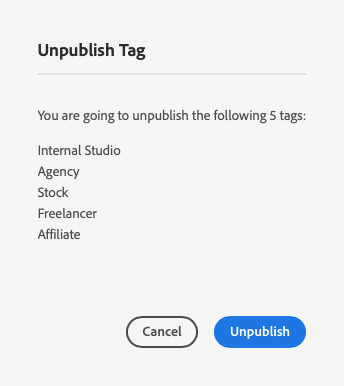

# 管理標籤 {#administering-tags}

標籤是分類內容的直覺式方法。 它們可視為關鍵字或標籤（中繼資料），以便更快地找到內容。

在Adobe Experience Manager (AEM)中，標籤可以是下列專案的屬性：

* 頁面的內容節點
   * 檢視檔案 [使用標籤](/help/sites-cloud/authoring/features/tags.md) 以取得詳細資訊。
* 資產的中繼資料節點
   * 檢視檔案 [管理數位資產的中繼資料](/help/assets/manage-metadata.md) 以取得詳細資訊。

>[!TIP]
>
>最佳實務是將與相同想法相關的標籤數量減到最少。 例如，如果您管理的是戶外用品商店的內容，您可能不需要兩個標籤 **鞋類** 和 **鞋子**.

## 標籤功能 {#tag-features}

標籤提供完善的功能，可方便組織和管理內容。

* 標籤可以分組到各種名稱空間中。
   * 名稱空間可視為允許建立分類的階層。
   * 這些分類在整個AEM都是全域的。
* 作者可套用標籤，網站訪客也可使用標籤。
* 無論其建立者為何，在指派至頁面或搜尋時，所有形式的標籤都可供選取。
* 標籤由 [清單元件](https://experienceleague.adobe.com/docs/experience-manager-core-components/using/wcm-components/list.html) 以根據所選標籤產生動態清單。

## 標籤需求 {#requirements}

建立和管理標籤時，請謹記一些技術細節。

* 標籤在特定名稱空間內必須是唯一的。
* 標籤名稱不得包含標籤分隔符號：
   * 冒號(`:`) — 分隔名稱空間標籤
   * 斜線(`/`) — 分隔子標籤
* 如果標籤的標題包含標籤分隔字元，UI中將會隱藏這些字元。
* 成員可建立標籤，並修改其分類。 `tag-administrators` 擁有修改許可權的群組和成員 `/content/cq:tags`.
   * 包含子標籤的標籤稱為容器標籤。
   * 非容器標籤的標籤稱為分葉標籤。
   * 標籤名稱空間可以是葉標籤或容器標籤。

如需有關標籤如何運作的更多技術細節，請參閱檔案 [AEM標籤架構。](/help/implementing/developing/introduction/tagging-framework.md)

## 標籤主控台 {#tagging-console}

標籤控制檯可用來建立和管理標籤及其分類。 您可以使用標籤控制檯透過以下方式管理您的標籤：

* 將其分組到名稱空間中。
* 在建立新標籤之前，請先檢閱現有標籤的使用情況。
* 重新組織您的標籤，而不中斷標籤與目前參照內容的連線。

若要存取標籤主控台：

1. 以管理許可權登入製作環境。
1. 在全域導覽功能表中選取 **`Tools`** -> **`General`** ->
   **`Tagging`**。

## 建立新標籤 {#creating-new-tags}

建立並使用標籤來組織內容有許多步驟。

1. [為您的標籤建立名稱空間](#creating-namespaces) （或選擇要重複使用的現有專案）。
1. [建立新標籤。](#creating-tags)
1. [發佈標籤。](#publishing-tags)

### 建立名稱空間 {#creating-namespaces}

名稱空間可用來組織其他標籤。 可將其視為最低層級的標籤，通常用於將其他標籤設為群組。

1. 若要建立新的名稱空間，請開啟 [標籤主控台](#tagging-console) 然後點選或按一下 **建立** 工具列中的按鈕，然後 **建立名稱空間**.

   

1. 提供必要資訊。

   * **標題** - UI中向使用者顯示的名稱空間標題（選用）
   * **名稱**  — 如果未指定名稱，則會從 **標題**. 檢視檔案 [AEM標籤架構](/help/implementing/developing/introduction/tagging-framework.md#tagid) 以取得詳細資訊。
   * **說明**  — 名稱空間說明（選用）

1. 輸入必要資訊後，點選或按一下 **建立**.

名稱空間隨即建立。 請注意，在標籤主控台中，名稱空間位於最低層級（在主控台中最左側的欄），並由資料夾圖示表示，這反映了它們作為「容器」或其他標籤分組的性質。

您現在可以 [建立新標籤](#creating-tags) 在此名稱空間中或 [管理現有標籤。](#managing-tags)

名稱空間不需要包含任何子標籤。 由於名稱空間本身就是標籤，因此可用來將您的內容組織成任何其他標籤。 不過，若要繼續建立結構化標籤分類法，您可以 [建立子標籤](#creating-tags) 根據您的專案需求，在該名稱空間內建立。

### 建立標籤 {#creating-tags}

標籤通常會新增至名稱空間。

1. 若要建立新標籤，請開啟 [標籤主控台。](#tagging-console)

1. 選取您要建立標籤的名稱空間。 或是選取其他標籤以在其下方建立子標籤。

1. 點選或按一下 **建立** 按鈕上，然後 **建立標籤**.

1. 此 **建立標籤** 對話方塊開啟。 為新標籤提供必要資訊。

   * **標題**  — 標籤的顯示標題（必填）
   * **名稱**  — 標籤的名稱（必填）。 如果未指定，則會從 **標題**. 另請參閱 [標籤ID](/help/implementing/developing/introduction/tagging-framework.md#tagid).
   * **說明**  — 標籤的說明
   * **標籤路徑**  — 預設為您在標籤主控台中選取的名稱空間（或標籤）。 點選或按一下路徑選擇器圖示，即可手動更新。

   

1. 點選或按一下 **提交**.

標籤隨即建立，且主控台隨即更新，以顯示新標籤。

標籤可讓您根據組織需求，靈活地建立自己的分類法。

* 您可以在建立新標籤之前，先在主控台中選取父標籤，以建立現有標籤的子標籤。
* 如果您未選取名稱空間或其他標籤就建立標籤，則能有效建立新的名稱空間。

### 發佈標籤 {#publishing-tags}

就像在AEM中建立任何其他內容一樣，當您建立標籤（或名稱空間）後，它只會存在於編寫環境中。 若要讓您的標籤可供使用者使用，您必須發佈標籤。

1. 若要發佈標籤，請開啟 [標籤主控台。](#tagging-console)

1. 選取您要發佈的一個或多個標籤，然後在工具列中選取 **發佈**.

   

1. 此 **發佈標籤** 對話方塊會要求確認以發佈選取的標籤。 點選或按一下「**發佈**」。

   

1. 已使用確認發佈動作 **成功** 對話方塊。

   

選取的標籤會排入發佈佇列。 與頁面內容類似，無論是否包含子標籤，都只會發佈選取的標籤。

若要發佈整個分類法（名稱空間和子標籤），最佳作法是建立 [封裝](/help/implementing/developing/tools/package-manager.md) 名稱空間的(請參閱 [分類根節點](/help/implementing/developing/introduction/tagging-framework.md#taxonomy-root-node))。

<!--
Be sure to [apply permissions](#setting-tag-permissions) to the namespace before creating the package.
-->

## 管理標籤 {#managing-tags}

您可以對現有標籤和名稱空間執行許多操作，以便管理和組織它們。 只要在「 」中選擇標籤或名稱空間 [標籤主控台](#tagging-console) 以在工具列中顯示可用的動作。

* [檢視屬性](#viewing-tag-properties)
* [編輯](#editing-tags)
* [未發佈](#unpublishing-tags)
* [引用](#viewing-tag-references)
* [移動](#moving-tags)
* [合併](#merging-tags)
* [刪除](#deleting-tags)

請注意，當工具列上有足夠的可用空間時，省略符號圖示後面會有其他選項可用。

### 檢視標籤屬性 {#viewing-tag-properties}

在標籤控制檯中選取單一標籤、名稱空間或其他標籤時，所選標籤的基本詳細資訊（例如上次編輯時間和上次發佈時間）會顯示在標籤欄左側的欄中。

您可以將主控台切換至「 」，檢視標籤的詳細資訊，包括上次發佈者及發佈時間 **屬性** 檢視。

1. 若要檢視標籤的屬性，請開啟 [標籤主控台。](#tagging-console)

1. 選取您要檢視其屬性的標籤，然後在左側欄中選取 **屬性**.

   

1. 所選標籤的詳細屬性會顯示在左側邊欄中。

   

如需有關選取檢視模式和邊欄的詳細資訊，請參閱檔案 [基本處理。](/help/sites-cloud/authoring/getting-started/basic-handling.md#rail-selector)

### 編輯標記 {#editing-tags}

標籤和名稱空間可在建立後進行編輯。

1. 若要編輯標籤，請開啟 [標籤主控台。](#tagging-console)

1. 選取您要編輯的標籤，然後在工具列中選取「 」 **編輯**.

1. 進行所需的變更。 您可以變更以下專案：

   * **標題**
   * **說明**
   * [**本土化**](#managing-tags-in-different-languages)

1. 完成編輯後，點選或按一下 **提交**.

如需新增語言翻譯的詳細資訊，請參閱以下章節： [管理不同語言的標籤](#managing-tags-in-different-languages).

如果您對已發佈的標籤進行變更，您可能想要 [重新發佈。](#publishing-tags)

### 取消發佈標籤 {#unpublishing-tags}

若要停用編寫執行個體上的標籤並將其從發佈執行個體中移除，您可以將其取消發佈。

1. 若要取消發佈標籤，請開啟 [標籤主控台。](#tagging-console)

1. 選取您要取消發佈的一個或多個標籤，然後在工具列中選取 **取消發佈**.

   

1. 此 **未發佈標籤** 對話方塊會要求確認以發佈選取的標籤。 點選或按一下「**發佈**」。

   

1. 取消發佈動作已由 **成功** 對話方塊。

   

選取的標籤會排入取消發佈的佇列。 如果選取的標籤是容器標籤，則其所有子標籤將在製作環境中停用，並從發佈環境中移除。

### 檢視標籤參照 {#viewing-tag-references}

檢視特定標籤套用到哪些內容會很實用。 您可以透過使用 **引用** 在標籤主控台中檢視。

1. 若要檢視標籤的參照，請開啟 [標籤主控台。](#tagging-console)

1. 選取您要檢視其參照的標籤，然後在左側欄中選取 **引用**.

   

1. 所選標籤的參照總數會顯示在左側邊欄中。

   

1. 點選或按一下標籤參照的數量，以檢視指派給標籤之內容的詳細清單。

   

將滑鼠游標停留或點選清單中的參照內容，即可顯示內容的完整路徑。

如需有關選取檢視模式和邊欄的詳細資訊，請參閱檔案 [基本處理。](/help/sites-cloud/authoring/getting-started/basic-handling.md#rail-selector)

### 移動標記 {#moving-tags}

可能需要將標籤移至新位置或重新命名來清理或重新組織標籤分類。

>[!TIP]
>
>最佳做法是僅允許管理員移動和重新命名標籤。

1. 若要移動或重新命名標籤，請開啟 [標籤主控台。](#tagging-console)

1. 選取您要移動或重新命名的標籤，然後點選或按一下 **移動** （在工具列中）。

1. 在 **移動標籤** 對話方塊，指定您要變更的屬性。

   * **重新命名為**  — 您想要為標籤指定的新名稱
      * 此欄位會預先填入標籤的目前名稱。
      * 如果您只想移動標籤而不想重新命名，請保留未修改狀態。
   * **移至**  — 您想要移動標籤的位置
      * 此欄位會預先填入標籤的目前位置。
      * 如果您只想重新命名標籤而不想移動它，請保留未修改狀態。

   

1. 點選或按一下 **提交**.

標籤會重新命名及/或移至其新位置。 當選取的標籤為容器標籤時，移動標籤也會移動所有子標籤。

### 合併標籤 {#merging-tags}

如果您的標籤分類有重複專案或類似的標籤，則合併這些標籤會很實用。 When標籤 `A` 已合併至標籤中 `B`，所有已標籤標籤的頁面 `A` 變為標籤狀態 `B` 和標籤 `A` 作者將無法再使用。

1. 若要合併兩個標籤，請開啟 [標籤主控台。](#tagging-console)

1. 選取您要合併至其他標籤的標籤，然後點選或按一下 **合併** （在工具列中）。

1. 在 **合併標籤** 對話方塊，點選或按一下 **瀏覽** 圖示 **合併至** 欄位，指定要將所選標籤合併到哪個標籤中。

   

1. 點選或按一下 **提交**.

在主控台中選取的標籤會合併到對話方塊中指定的標籤中。 移動或合併參照的標籤時，並不會實際刪除標籤，因此可以保留參照。 請參閱檔案 [AEM標籤架構](/help/implementing/developing/introduction/tagging-framework.md#moving-and-merging-tags) 以取得詳細資訊。

### 刪除標記 {#deleting-tags}

如果您的標籤分類發生變更，且使標籤或名稱空間失去必要性，則可將其刪除。

1. 若要刪除標籤，請開啟 [標籤主控台。](#tagging-console)

1. 選取您要刪除的標籤，然後點選或按一下 **刪除** （在工具列中）。

1. 此 **刪除標籤** 對話方塊會要求確認刪除選取的標籤。 點選或按一下 **刪除**.

   

1. AEM會檢查以確保標籤未被引用。

   1. 如果找不到引用，AEM會要求您的最終確認以刪除。 點選或按一下 **刪除**

      

   1. 如果找到參照，AEM會顯示參照，並要求進行刪除的最終確認。

      

選取的標籤會遭到刪除並從製作環境中永久移除。 如果標籤已發佈，也會從發佈環境中將其移除。 如果選取的標籤是容器標籤，則會一併移除其所有子標籤。

<!--

## Setting Tag Permissions {#setting-tag-permissions}

Tag permissions are ['secure (by default)'](/help/sites-administering/production-ready.md); a best practice for the publish environment that requires read permission to be explicitly allowed for tags. Bascially, this is done by creating a package of the Tag Namespace after permissions have been set on author, and installing the package on all publish instances.

* on author instance

    * sign in with administrative privileges
    * access the [Security Console](/help/sites-administering/security.md#accessing-user-administration-with-the-security-console),

        * for example, browse to http://localhost:4502/useradmin

    * in the left pane, select the group (or user) for which [read permission](/help/sites-administering/security.md#permissions) is to be granted
    * in the right pane, locate the **Path **to the Tag Namespace

        * for example, `/content/cq:tags/mycommunity`

    * select the `checkbox`in the **Read** column
    * select **Save**

* ensure all publish instances have same permissions

    * one approach is to [create a package](/help/sites-administering/package-manager.md#package-manager) of the namespace on author

        * on `Advanced` tab, for `AC Handling` select `Overwrite`

    * replicate the package

        * choose `Replicate` from package manager

-->

## 管理不同語言的標籤 {#managing-tags-in-different-languages}

此 `title` 標籤的屬性可翻譯成多種語言。 翻譯後，可以根據使用者或內容語言顯示適當的標籤標題。

假設我們有一個稱為的標籤 `Animals` 我們希望將文章翻譯成德文和法文。

1. 開啟 [標籤主控台。](#tagging-console)

1. 選取您要翻譯的標籤，然後點選或按一下 **編輯** （在工具列中）。

1. 在 **編輯標籤** 對話方塊，在 **本地化** 欄，選取目標語言，例如德文。

1. 在 **德文** 欄位中，提供翻譯的標題。

1. 針對法文重複前兩個步驟。

   

1. 點選或按一下 **提交**.

對於內容頁面，為標籤選擇的語言會從頁面語言中取得（可用時）。

不過在編寫環境中，AEM會使用使用者語言設定。 所以在標籤控制檯中，針對 `Animals` 標籤， `Animaux` 將會對在使用者屬性中將語言設定為法文的使用者顯示。

若要新增語言至對話方塊，請參閱檔案 [將標籤建置至AEM應用程式](/help/implementing/developing/introduction/tagging-applications.md#adding-a-new-language-to-the-edit-tag-dialog)

>[!TIP]
>
>如果您想深入瞭解AEM本地化功能，請參閱檔案 [翻譯您的多語言網站內容。](/help/sites-cloud/administering/translation/overview.md)
