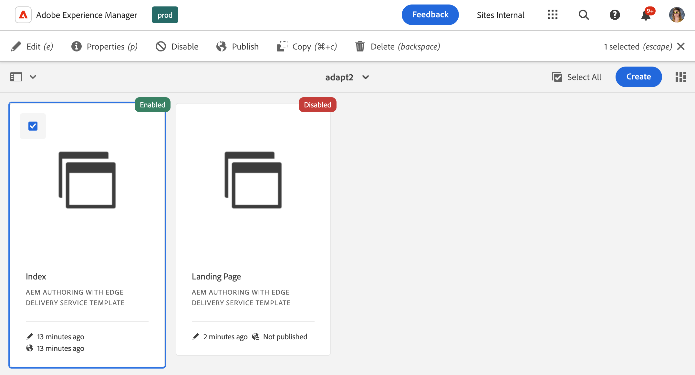

# 範本主控台 {#templates-console}

瞭解範本主控台如何作為檢視和管理頁面範本的中央位置。

## 概觀 {#overview}

建立頁面時，您需要選取範本。 頁面範本會用作新頁面的基礎。 [AEM的可編輯範本](/help/implementing/developing/components/templates.md)可以定義結果頁面的結構、任何初始內容以及可以使用的元件（設計屬性）。

內容作者在網站主控台[建立新頁面時，](/help/sites-cloud/authoring/sites-console/creating-pages.md)會看到一系列可用的範本。 範本可用來建立可編輯的頁面：

* [頁面編輯器](/help/sites-cloud/authoring/page-editor/templates.md)或
* [通用編輯器](/help/sites-cloud/authoring/universal-editor/templates.md)

範本主控台可讓管理員在中央位置檢視及管理所有頁面範本。

## 存取範本主控台 {#accessing}

1. 登入AEM as a Cloud Service。
1. 開啟全域導覽並選取&#x200B;**工具**&#x200B;面板，然後選取&#x200B;**一般** -> **範本**。

## 方向 {#orientation}

範本主控台被組織成資料夾，每個[組態](/help/implementing/developing/introduction/configurations.md)有一個資料夾，其中可編輯的範本已為組態啟用。

[主控台的預設檢視](/help/sites-cloud/authoring/quick-start.md)是卡片檢視。 點選或按一下資料夾以探索其內容。

選取範本以顯示工具列中的可用選項。

* [編輯](#edit-edit)
* [屬性](#properties)
* [停用/啟用](#enable-disable)
* [發佈](#publish)
* [複製](#copy)
* [刪除](#delete)

## 編輯 {#edit}

編輯範本會開啟用來建立範本的編輯器。 可以：

* [範本編輯器](/help/sites-cloud/authoring/page-editor/templates.md)
* [通用編輯器](/help/sites-cloud/authoring/universal-editor/templates.md)

無論使用哪個編輯器，您都可以對範本進行必要的變更。 請注意，編輯使用中的範本可能會影響您的作者。

* 對於使用範本編輯器建立的範本，所做的變更可能會影響以所選範本為基礎的即時頁面。
* 對於使用通用編輯器建立的範本，所做的變更只會影響您的作者根據所選範本建立的新頁面。

如果作者開始使用已啟用的範本編輯器建立的範本，則會顯示警告。

>[!TIP]
>
>在主控台中選取範本後，請使用快速鍵`e`來編輯選取的範本。

## 屬性 {#properties}

您可以編輯範本](/help/sites-cloud/authoring/page-editor/templates.md)的[屬性，其方式與您[編輯頁面屬性的方式非常相同。](/help/sites-cloud/authoring/sites-console/edit-page-properties.md)範本屬性包括：

* 範本標題
* 說明
* 影像

>[!TIP]
>
>在主控台中選取範本後，請使用快速鍵`p`開啟所選範本的屬性。

## 啟用和停用 {#enable-disable}

範本可以有下列三種狀態之一：

* **草稿** — 範本仍在建立中，無法用來建立新頁面。
* **已啟用** — 範本已完成，可用於建立新頁面。
* **已停用** — 範本已完成，但無法用來建立新頁面。

建立範本時，其預設為&#x200B;**草稿**&#x200B;狀態（針對使用[範本編輯器](/help/sites-cloud/authoring/page-editor/templates.md)建立的範本）或&#x200B;**已啟用**&#x200B;狀態（針對使用[通用編輯器](/help/sites-cloud/authoring/universal-editor/templates.md)建立的範本）。

必須先啟用範本，內容作者才能使用範本建立頁面。 如果不再需要範本，則可停用該範本，使其不再顯示在頁面建立精靈中。

* 選取範本，然後按一下[停用]以停用範本。****
* 選取範本，然後按一下[啟用] ****&#x200B;以啟用範本。

## 發佈 {#publish}

使用範本編輯器建立的範本只能在發佈後使用。 選取範本，然後按一下&#x200B;**發佈**&#x200B;以進行發佈。

使用通用編輯器建立的範本不需要發佈即可使用。

## 複製 {#copy}

如果您的許多頁面的結構類似，您可以使用&#x200B;**複製**&#x200B;按鈕來建立範本的範圍，然後根據您的需求變更副本。 如果您想要在其他網站上使用範本，這也很有用。

1. 選取範本，然後點選或按一下「**複製**」以建立副本。
1. 導覽至您要建立復本的位置。
1. 點選或按一下工具列中的&#x200B;**貼上**。

貼上後，您可以：

* [編輯範本](#edit)以視需要調整。
* [使用屬性視窗](#properties)更新範本標題。
* [啟用範本](#enable-disable)，以便用來建立頁面。
* [視需要發佈範本](#publish)。

>[!TIP]
>
>在主控台中選取範本後，請使用快速鍵`Command+c`或`ctrl+c`來複製選取的範本。

## 刪除中 {#delete}

如果不再需要某個範本，只要該範本未由任何頁面引用，即可將其刪除。

選取範本，然後點選或按一下&#x200B;**刪除**&#x200B;以刪除範本。

>[!TIP]
>
>在主控台中選取範本後，請使用快速鍵`Backspace`刪除選取的範本。

## 建立範本 {#create}

使用主控台中的&#x200B;**建立**&#x200B;按鈕，在您的目前位置中建立新範本。 如需建立範本的詳細資訊，請參閱檔案[建立可透過頁面編輯器編輯的頁面的範本](/help/sites-cloud/authoring/page-editor/templates.md)。

**Create**&#x200B;按鈕僅用於建立可透過「頁面編輯器」編輯的範本。 請參閱檔案[建立可使用通用編輯器編輯的頁面的範本](/help/sites-cloud/authoring/universal-editor/templates.md)，瞭解如何根據使用通用編輯器建立的頁面建立範本。
