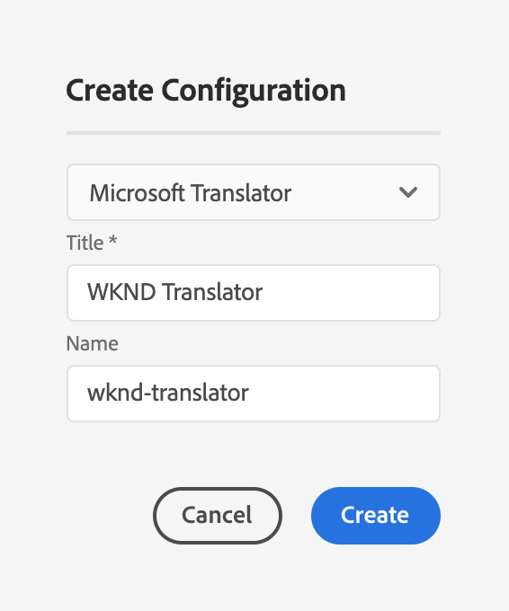

# 連接到Microsoft翻譯 {#connecting-to-microsoft-translator}

為 [Microsoft翻譯](https://hub.microsofttranslator.com) 雲服務，使用您的Microsoft翻譯帳戶AEM翻譯頁面內容或資產。

>[!TIP]
>
>如果您是翻譯內容的新手，請參閱我們的 [網站翻譯之旅，](/help/journey-sites/translation/overview.md) 它是指通過使用功能強大的翻譯工具AEM翻譯您的AEM Sites內容的指導路AEM徑，是那些沒有翻譯經驗的人的理想選擇。

>[!NOTE]
>
>提AEM供試用Microsoft翻譯帳戶，每月最多允許2 000 000個免費翻譯字元。 要獲得適用於生產系統的帳戶訂閱，請參閱 [升級Microsoft翻譯器試用許可證配置](#upgrading-the-microsoft-translator-trial-license-configuration)。

| 屬性 | 說明 |
|---|---|
| 翻譯標籤 | 翻譯服務的顯示名稱 |
| 翻譯歸因 | （可選）對於用戶生成的內容，例如，在已翻譯文本旁邊顯示的屬性 `Translations by Microsoft` |
| 工作區ID | （可選）要使用的自定義Microsoft翻譯器引擎的ID |
| 訂閱金鑰 | 您的Microsoft翻譯員訂閱密鑰 |

建立配置後，需要 [激活](#activating-the-translator-service-configurations)。

以下過程建立Microsoft轉換器配置。

1. 在 [導航面板，](/help/sites-cloud/authoring/getting-started/basic-handling.md#first-steps) 按一下或點擊 **工具** -> **Cloud Services** -> **翻譯Cloud Services**。
1. 導航到要建立配置的位置。 通常，這是站點根目錄中的，或者它可以是全局預設配置。
1. 點擊或按一下 **建立** 按鈕
1. 定義配置。
   1. 選擇 **Microsoft翻譯** 的下界。
   1. 鍵入配置的標題。 標題標識Cloud Services控制台和頁面屬性下拉清單中的配置。
   1. （可選）鍵入用於儲存配置的儲存庫節點的名稱。

   

1. 按一下&#x200B;**建立**。
1. 在 **編輯配置** 窗口，提供上表中描述的轉換服務的值。

   

1. 點擊或按一下 **連接** 驗證連接。
1. 點擊或按一下 **保存並關閉**。

## 升級Microsoft翻譯器試用許可證配置 {#upgrading-the-microsoft-translator-trial-license-configuration}

Microsoft翻譯配置頁提供了到Microsoft網站的方便連結，以便獲得適合生產系統的帳戶訂閱。

1. 在 [導航面板，](/help/sites-cloud/authoring/getting-started/basic-handling.md#first-steps) 按一下 **工具** -> **Cloud Services** -> **翻譯Cloud Services**。
1. 點擊或按一下您現有的Microsoft翻譯器配置。
1. 點擊或按一下 **編輯**。
1. 在 **編輯配置** 按一下或按一下 **升級訂閱**。 開啟一個Microsoft網頁，其中包含有關該服務的詳細資訊。

## 自定義您的Microsoft翻譯器引擎 {#customizing-your-microsoft-translator-engine}

Microsoft翻譯配置頁提供了到Microsoft網站的便捷連結，可以自定義Microsoft翻譯器引擎。

1. 在 [導航面板，](/help/sites-cloud/authoring/getting-started/basic-handling.md#first-steps) 按一下 **工具** -> **Cloud Services** -> **翻譯Cloud Services**。
1. 點擊或按一下您現有的Microsoft翻譯器配置。
1. 點擊或按一下 **編輯**。
1. 在 **編輯配置** 按一下或按一下 **自定義轉換器**。 使用開啟的Microsoft網頁自定義您的服務。

## 激活轉換器服務配置 {#activating-the-translator-service-configurations}

您需要激活雲服務配置以支援複製到發佈實例的已翻譯內容。 使用 [發佈樹](/help/sites-cloud/authoring/fundamentals/publishing-pages.md#publishing-and-unpublishing-a-tree) 激活儲存Microsoft轉換器配置的儲存庫節點。 節點位於以下父節點下：

* `/libs/settings/cloudconfigs/translation/msft-translation`
