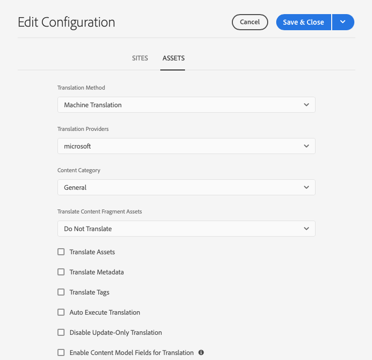

# 配置翻譯整合框架 {#configuring-the-translation-integration-framework}

翻譯整合框架與第三方翻譯服務整合以協調內容的AEM翻譯。 它涉及三個基本步驟。

1. [連接到翻譯服務提供商。](#connecting-to-a-translation-service-provider)
1. [建立翻譯整合框架配置。](#creating-a-translation-integration-configuration)
1. [將雲配置與您的頁面關聯。](#configuring-pages-for-translation)

有關中的內容翻譯功能的概AEM述，請參見 [翻譯多語言站點的內容](overview.md)。

>[!TIP]
>
>如果您是翻譯內容的新手，請參閱我們的 [網站翻譯之旅，](/help/journey-sites/translation/overview.md) 它是指通過使用功能強大的翻譯工具AEM翻譯您的AEM Sites內容的指導路AEM徑，是那些沒有翻譯經驗的人的理想選擇。

## 連接到翻譯服務提供商 {#connecting-to-a-translation-service-provider}

建立連接到翻譯服AEM務提供商的雲配置。 AEM包括 [連接到Microsoft翻譯](connect-ms-translator.md) 預設值。

以下翻譯供應商提供了翻譯項AEM目API的實現。

* [Microsoft翻譯](connect-ms-translator.md)
* [翻譯.com](https://exchange.adobe.com/experiencecloud.details.90104.globallink-connect-plus-for-aem.html) (AdobeExchange Premier合作夥伴)
* [粘土平板技術](https://exchange.adobe.com/experiencecloud.details.90064.clay-tablet-translation-for-experience-manager.html)
* [萊博智](https://exchange.adobe.com/experiencecloud.details.100064.lionbridge-connector-for-experience-manager-63.html)
* [梅姆索](https://exchange.adobe.com/experiencecloud.details.103166.memsource-connector-for-adobe-experience-manager.html)
* [雲字](https://exchange.adobe.com/experiencecloud.details.90019.html)
* [XTM雲](https://exchange.adobe.com/experiencecloud.details.105037.xtm-connect-for-adobe-experience-manager.html)
* [林戈泰克](https://exchange.adobe.com/experiencecloud.details.90088.lingotek-collaborative-translation-platform.html)
* [RWS](https://partners.adobe.com/exchangeprogram/experiencecloud/exchange.details.108277.html)
* [智慧靈](https://exchange.adobe.com/experiencecloud.details.90101.smartling-connector-for-adobe-experience-manager.html)
* [瑟斯特蘭](https://exchange.adobe.com/experiencecloud.details.90233.systran-for-adobe-experience-manager.html)

安裝連接器包後，可以為連接器建立雲配置。 通常，您需要提供憑據，以便向翻譯服務進行身份驗證。 有關為Microsoft翻譯器連接器添加雲配置的資訊，請參見 [與Microsoft翻譯器整合](connect-ms-translator.md)。

如果需要，可以為同一連接器建立多個雲配置。 例如，為您與同一供應商擁有的每個帳戶或項目建立一個配置。

配置連接後，可以建立使用該連接的轉換整合框架配置。

## 建立翻譯整合配置 {#creating-a-translation-integration-configuration}

建立翻譯整合框架配置以指定如何翻譯內容。 配置包括以下資訊：

* 要使用哪個翻譯服務提供商
* 是否執行人或機器翻譯
* 是否翻譯與頁面或資產關聯的其他內容，如標籤

在建立框架配置後，將雲配置與要根據配置翻譯的頁面相關聯。 當翻譯過程被啟動時，翻譯工作流根據關聯的框架配置繼續進行。

當網站的不同部分有不同的翻譯要求時，請相應地建立多個框架配置。 例如，多語種網站可能包含英語、西班牙語和日語副本。 站點所有者使用兩種不同的翻譯服務提供商進行西班牙語和日語翻譯。 因此，配置了框架的兩種配置。 每個配置都使用不同的翻譯服務提供程式。

配置翻譯整合框架後，您可以 [將其與頁面關聯](preparation.md) 用它。

>[!TIP]
>
>有關中的內容翻譯功能的概AEM述，請參見 [翻譯多語言站點的內容](overview.md)。

框架的單個配置控制頁面內容和資產的翻譯方式。 要建立新的翻譯配置：

1. 在 [全局導航菜單，](/help/sites-cloud/authoring/getting-started/basic-handling.md#global-navigation) 按一下或點擊 **工具 — >Cloud Services — 和翻譯Cloud Services**。
1. 導航到要在內容結構中建立配置的位置。 這通常基於特定站點或可以是全球性站點。
1. 在欄位中提供以下資訊，然後按一下或點擊 **建立**:
   1. 選擇 **配置類型** 的下界。
   1. 輸入 **標題** 的下界。 的 **標題** 標識 **Cloud Services** 控制台以及頁面屬性下拉清單中。
   1. （可選）鍵入 **名稱** 用於儲存配置的儲存庫節點。
1. 在 **編輯配置** 窗口，配置 **站點** 和 **資產** 頁籤，然後按一下或點擊 **保存並關閉**。

### 站點配置屬性 {#sites-configuration-properties}

的 **站點** 頁籤控制如何執行頁面內容的翻譯。

| 屬性 | 說明 |
|---|---|
| 翻譯方法 | 此屬性定義框架對站點內容執行的轉換方法：  — 機器翻譯：翻譯提供器使用機器翻譯即時執行翻譯。  — 人文翻譯：內容將發送到翻譯提供商，由翻譯員翻譯。  — 不翻譯：不發送內容進行翻譯。 這將跳過某些內容分支，這些分支不會被翻譯，但可以用最新內容進行更新。 |
| 翻譯提供程式 | 此屬性定義執行轉換的轉換提供程式。 安裝相應連接器時，提供程式將出現在清單中。 |
| 內容類別 | （僅限機器翻譯）此屬性是描述要翻譯的內容的類別。 在翻譯內容時，該類別會影響術語和措辭的選擇。 |
| 翻譯標記 | 此選項啟用與頁面關聯的轉換標籤。 |
| 翻譯頁面資產 | 此屬性定義如何轉換從檔案系統添加到元件或從資產引用的資產：  — 不翻譯：頁面資產不進行轉換。  — 使用網站翻譯工作流：根據上的配置屬性處理資產 **站點** 頁籤。  — 使用資產轉換工作流：根據上配置的屬性處理資產 **資產** 頁籤。 |
| 自動執行翻譯 | 啟用此屬性可在建立翻譯項目後自動執行翻譯作業。 選擇此選項時，您沒有機會複查和確定翻譯作業的範圍。 |
| 禁用僅更新轉換 | 選中此選項後，更新翻譯項目將提交所有可翻譯的欄位以供翻譯，而不僅僅是自上次翻譯後更改的欄位。 |

### 資產配置屬性 {#assets-configuration-properties}

資產屬性控制如何配置資產。 有關轉換資產的詳細資訊，請參閱 [為資產建立語言副本](/help/assets/translate-assets.md)。

| 屬性 | 說明 |
|---|---|
| 翻譯方法 | 此屬性選擇框架對資產執行的轉換類型：  — 機器翻譯：翻譯提供器使用機器翻譯立即執行翻譯。  — 人文翻譯：內容自動發送到翻譯提供程式以被手動翻譯。  — 不翻譯：不發送資產進行翻譯。 |
| 翻譯提供程式 | 此屬性定義執行轉換的轉換提供程式。 安裝相應連接器時，提供程式將出現在清單中。 |
| 內容類別 | （僅限機器翻譯）此屬性描述要翻譯的內容。 在翻譯內容時，該類別會影響術語和措辭的選擇。 |
| 翻譯資產 | 激活此屬性以在轉換項目中包括資產。 |
| 翻譯中繼資料 | 激活此屬性以轉換資產元資料。 |
| 翻譯標記 | 激活此屬性以轉換與資產關聯的標籤。 |
| 自動執行翻譯 | 選擇此屬性可在建立翻譯項目後自動執行翻譯作業。 選擇此選項時，您沒有機會複查或確定翻譯作業的範圍。 |
| 禁用僅更新轉換 | 選中此選項後，更新翻譯項目將提交所有可翻譯的欄位以供翻譯，而不僅僅是自上次翻譯後更改的欄位。 |
| 啟用用於翻譯的內容模型欄位 | 啟用此選項將使用 **可翻譯** 欄位 [內容片段模型](/help/assets/content-fragments/content-fragments-models.md#properties) 確定是否翻譯了欄位並自動建立 [翻譯規則](rules.md) 因此。 此選項取代您可能建立的任何翻譯規則。 |

## 配置翻譯頁面 {#configuring-pages-for-translation}

要將源頁面翻譯成其他語言，請將這些頁面與以下雲配置關聯：

* 連接到翻譯提供AEM商的雲配置。
* 配置翻譯詳細資訊的翻譯整合框架。

請注意，翻譯整合框架雲配置標識了用於連接到服務提供商的雲配置。 將源頁與框架雲配置關聯時，該頁必須與框架雲配置使用的服務提供商雲配置關聯。

將頁面與雲配置關聯時，頁面的子體將繼承關聯。 例如，如果關聯 `/content/wknd/language-masters/en/magazine` 的子菜單。 `magazine` 頁面和下面的子頁面將根據框架進行翻譯。

如果需要，可以覆蓋子代頁面上的關聯。 例如，網站的內容主要是旅遊和生活方式。 不過，有一頁分部描述了該公司。 在這種情況下，站點的根頁可能與翻譯整合框架相關聯，該框架指定使用「生活方式」類別進行機器翻譯，而描述公司的分支將使用使用「常規」類別執行機器翻譯的框架。

### 將頁面與翻譯提供程式關聯 {#associating-a-page-with-a-translation-provider}

將頁面與用於翻譯頁面和後代頁面的翻譯提供程式關聯。

1. 在站點控制台中，選擇要配置的頁面，然後按一下或點擊 **查看屬性**。
1. 按一下或點擊 **Cloud Services** 頁籤。
1. 在 **添加配置** 下拉清單，選擇配置。
1. 按一下或點擊 **保存並關閉**。

### 將頁面與翻譯整合框架關聯 {#associating-pages-with-a-translation-integration-framework}

將頁面與翻譯整合框架關聯，該框架定義了要如何執行頁面和子代頁面的翻譯。

1. 在站點控制台中，選擇要配置的頁面，然後按一下或點擊 **查看屬性**。
1. 按一下或點擊 **Cloud Services** 頁籤。
1. 在 **添加配置** 下拉清單，選擇配置。
1. 按一下或點擊 **保存並關閉**。
