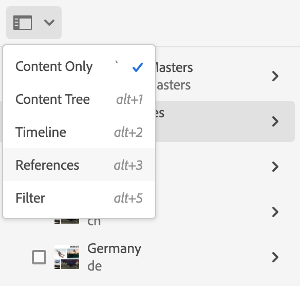
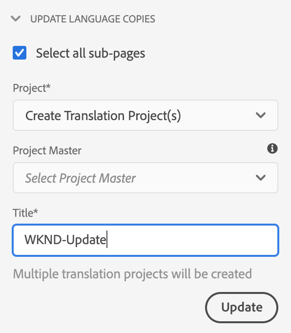
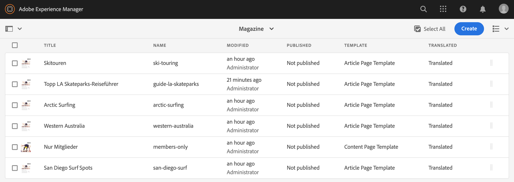
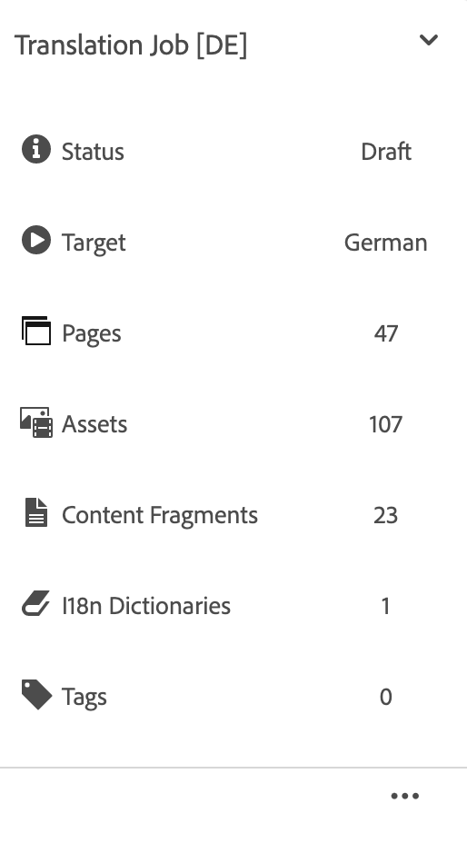
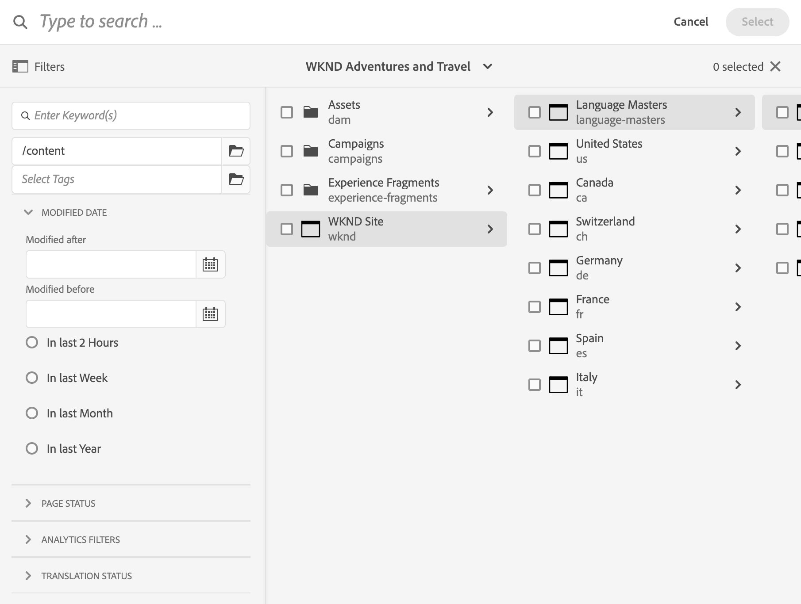
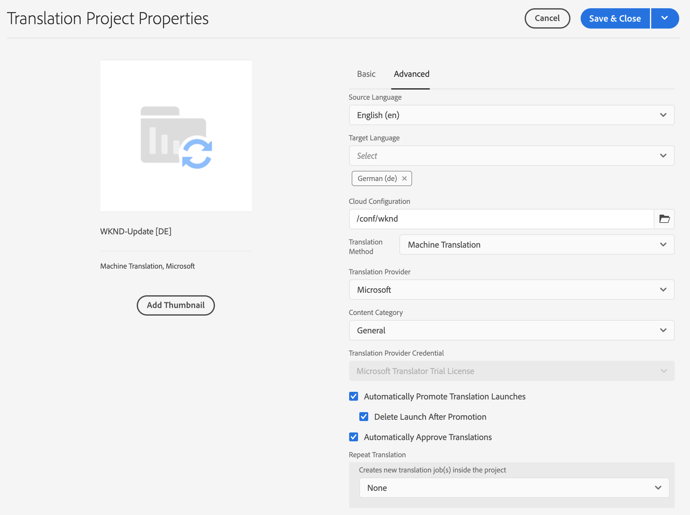
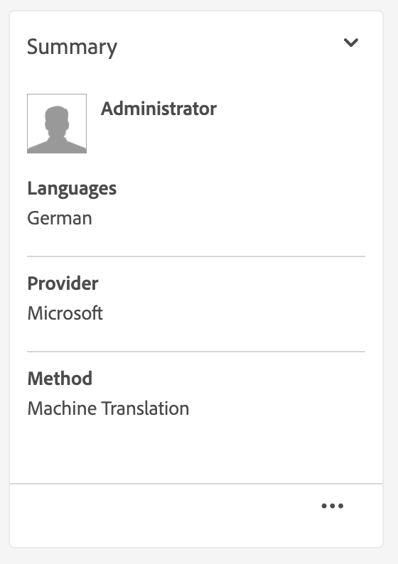
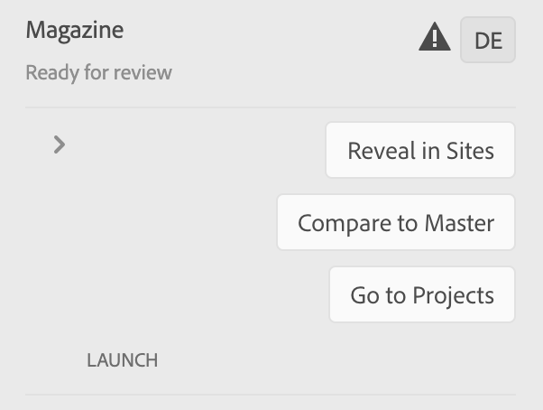

# 管理翻譯項目 {#managing-translation-projects}

翻譯項目使您能夠管理內容的AEM翻譯。 翻譯項目是一AEM種 [項目](/help/sites-cloud/authoring/projects/overview.md) 包含要翻譯成其他語言的資源。 這些資源是 [語言副本](preparation.md) 從語言母版中建立。

>[!TIP]
>
>如果您是翻譯內容的新手，請參閱我們的 [網站翻譯之旅，](/help/journey-sites/translation/overview.md) 它是指通過使用功能強大的翻譯工具AEM翻譯您的AEM Sites內容的指導路AEM徑，是那些沒有翻譯經驗的人的理想選擇。

將資源添加到翻譯項目時，將為其建立翻譯作業。 作業提供命令和狀態資訊，用於管理在資源上執行的人工翻譯和機器翻譯工作流。

翻譯項目是長期項目，由語言和翻譯方法/提供商定義，以與全球化的組織治理保持一致。 它們應在初始翻譯期間或手動啟動一次，並在整個內容和翻譯更新活動中保持有效。

翻譯項目和作業是使用翻譯準備工作流建立的。 這些工作流有三個選項，分別用於初始翻譯（建立和翻譯）和更新（更新翻譯）:

1. [建立新項目](#creating-translation-projects-using-the-references-panel)
1. [添加到現有項目](#adding-pages-to-a-translation-project)
1. [僅內容結構](#creating-the-structure-of-a-language-copy)

檢測AEM是否正在為內容的初始翻譯建立翻譯項目，或是否更新已翻譯的語言副本。 當您為頁面建立翻譯項目並指明要翻譯的語言副本時，AEM將檢測源頁面是否已存在於目標語言副本中：

* **語言副本不包括頁面：** 將AEM此情況視為初始翻譯。 該頁面會立即複製到語言副本中，並包含在項目中。 將已翻譯的頁面導入AEM到AEM時，將其直接複製到語言副本。
* **語言副本已包含頁面：** 將AEM此情況視為更新的翻譯。 將建立啟動，並將頁面的副本添加到啟動中，並包括在項目中。 啟動使您能夠在將更新的翻譯提交到語言副本之前審閱該翻譯：

   * 將已翻譯的頁面導入AEM到時，會在啟動中覆蓋頁面。
   * 只有在升級啟動時，翻譯後的頁面才會覆蓋語言副本。

例如， `/content/wknd/fr` 語言根是為翻譯 `/content/wknd/en` 母語。 法文版中沒有其他頁面。

* 為 `/content/wknd/en/products` 頁面和所有子頁面，目標為法文語言副本。 因為語言副本不包括 `/content/wknd/fr/products` 頁面，AEM立即複製 `/content/wknd/en/products` 和所有子頁到法語副本。 這些副本也包含在翻譯項目中。
* 為 `/content/wknd/en` 頁面和所有子頁面，目標為法文語言副本。 因為語言副本包含與 `/content/wknd/en` 頁（語言根）,AEM複製 `/content/wknd/en` 頁面和所有子頁面，並將它們添加到啟動中。 這些副本也包含在翻譯項目中。

## 從站點控制台翻譯 {#performing-initial-translations-and-updating-existing-translations}

可以直接從站點控制台建立或更新翻譯項目。

### 使用「參照」面板建立翻譯項目 {#creating-translation-projects-using-the-references-panel}

建立翻譯項目，以便執行和管理翻譯語言母版資源的工作流。 在建立項目時，您可以在要翻譯的語言母版中指定頁面，以及要執行翻譯的語言副本：

* 與所選頁面關聯的翻譯整合框架的雲配置決定了翻譯項目的許多屬性，如要使用的翻譯工作流。
* 為所選的每個語言副本建立項目。
* 建立所選頁面和關聯資產的副本並將其添加到每個項目。 這些副本稍後將發送到翻譯提供商進行翻譯。

您可以指定所選頁面的子頁面也被選中。 在這種情況下，子頁面的副本也添加到每個項目中，以便翻譯。 當任何子頁都與不同的翻譯整合框架配置相關聯時，會創AEM建其他項目。

您也可以 [手動建立翻譯項目](#creating-a-translation-project-using-the-projects-console)。

>[!NOTE]
>
>要建立項目，您的帳戶必須是 `project-administrators` 組。

### 初始翻譯和更新翻譯 {#initial-and-updating}

「引用」面板指示您是更新現有語言副本還是建立語言副本的第一版本。 當所選頁面存在語言副本時，「更新語言副本」頁籤將顯示為提供對與項目相關的命令的訪問權限。

翻譯後， [審閱翻譯](#reviewing-and-promoting-updated-content) 覆蓋語言副本。 如果所選頁面不存在語言副本，則「建立和翻譯」頁籤將顯示用於訪問與項目相關的命令。

### 為新語言副本建立翻譯項目 {#create-translation-projects-for-a-new-language-copy}

1. 使用「站點」控制台選擇要添加到翻譯項目的頁面。

1. 使用工具欄，開啟 **引用** 鐵軌。

   

1. 選擇 **語言副本**，然後選擇要翻譯其源頁面的語言副本。
1. 按一下或點擊 **建立和翻譯** 然後配置轉換作業：

   * 使用 **語言** 下拉框，選擇要翻譯的語言副本。 根據需要選擇其他語言。 清單中顯示的語言與 [你建立的語言根](preparation.md#creating-a-language-root)。
      * 選擇多種語言可建立一個項目，每個語言都具有翻譯作業。
   * 要翻譯所選頁面和所有子頁面，請選擇 **選擇所有子頁**。 要僅翻譯所選頁面，請清除該選項。
   * 對於 **項目**&#x200B;選中 **建立翻譯項目**。
   * （可選） **項目主資料**，選擇要從中繼承用戶角色和權限的項目。
   * 在 **標題** 鍵入項目的名稱。

   

1. 按一下或點擊 **建立**。

### 為現有語言副本建立翻譯項目 {#create-translation-projects-for-an-existing-language-copy}

1. 使用「站點」控制台選擇要添加到翻譯項目的頁面。

1. 使用工具欄，開啟 **引用** 鐵軌。

   

1. 選擇 **語言副本**，然後選擇要翻譯其源頁面的語言副本。
1. 按一下或點擊 **更新語言副本** 然後配置轉換作業：

   * 要翻譯所選頁面和所有子頁面，請選擇 **選擇所有子頁**。 要僅翻譯所選頁面，請清除該選項。
   * 對於 **項目**&#x200B;選中 **建立翻譯項目**。
   * （可選） **項目主資料**，選擇要從中繼承用戶角色和權限的項目。
   * 在 **標題** 鍵入項目的名稱。

   

1. 按一下或點擊 **建立**。

### 將頁面添加到翻譯項目 {#adding-pages-to-a-translation-project}

建立翻譯項目後，可使用 **資源** 將頁面添加到項目。 添加頁面對於包含來自同一項目中不同分支的頁面非常有用。

將頁面添加到翻譯項目時，這些頁面將包含在新的翻譯作業中。 您也可以 [將頁面添加到現有作業](#adding-pages-assets-to-a-translation-job)。

與建立新項目時一樣，在添加頁面時，頁面的副本會在需要時添加到啟動中，以避免覆蓋現有語言副本。 (請參閱 [為現有語言副本建立翻譯項目](#performing-initial-translations-and-updating-existing-translations)。)

1. 使用「站點」控制台選擇要添加到翻譯項目的頁面。

1. 使用工具欄，開啟 **引用** 鐵軌。

   

1. 選擇 **語言副本**，然後選擇要翻譯其源頁面的語言副本。

   

1. 按一下或點擊 **更新語言副本** 然後配置屬性：

   * 要翻譯所選頁面和所有子頁面，請選擇 **選擇所有子頁**。 要僅翻譯所選頁面，請清除該選項。
   * 對於 **項目**&#x200B;選中 **添加到現有翻譯項目**。
   * 在中選擇項目 **現有翻譯項目**。

   >[!NOTE]
   >
   >翻譯項目中設定的目標語言應與參考滑軌中顯示的語言副本路徑相匹配。

1. 按一下或點擊 **更新**。

### 建立語言副本的結構 {#creating-the-structure-of-a-language-copy}

只能建立語言副本的結構，允許您將語言母版中的內容和結構更改複製到（未翻譯）語言副本。 這與翻譯作業或項目無關。 您可以使用此功能保持語言主語的同步，即使不進行翻譯。

填充您的語言副本，以便包含您正在翻譯的主語言中的內容。 在填寫語言副本之前，必須 [建立語言根](preparation.md#creating-a-language-root) 語言副本。

1. 使用站點控制台選擇用作源的主語言的語言根。
1. 通過按一下或輕擊開啟參照滑軌 **引用** 的子菜單。

   

1. 選擇 **語言副本**，然後選擇要填充的語言副本。

   

1. 按一下或點擊 **更新語言副本** 顯示翻譯工具並配置屬性：

   * 選擇 **選擇所有子頁** 的雙曲餘切值。
   * 對於 **項目**&#x200B;選中 **僅建立結構**。

   

1. 按一下或點擊 **更新**。

### 更新翻譯記憶庫 {#updating-translation-memory}

翻譯內容的手動編輯可以同步回翻譯管理系統(TMS)以訓練其翻譯記憶庫。

1. 在站點控制台中，在已翻譯頁面中更新文本內容後，選擇 **更新翻譯記憶庫**。
1. 清單視圖顯示原始碼與已編輯的每個文本元件的翻譯的並排比較。 選擇哪些翻譯更新應同步到翻譯記憶庫，然後選擇 **更新記憶體**。

更AEM新配置TMS的翻譯儲存器中現有字串的翻譯。

* 該操作更新配置TMS的翻譯儲存器中現有字串的翻譯。
* 它不會建立新的翻譯作業。
* 它通過翻譯API(參見下AEM面)將翻譯發回TMS。

要使用此功能：

* 必須配置TMS以與一起使AEM用。
* 連接器需要實現該方法 [`storeTranslation`](https://developer.adobe.com/experience-manager/reference-materials/cloud-service/javadoc/com/adobe/granite/translation/api/TranslationService.html)。
   * 此方法中的代碼確定翻譯記憶庫更新請求發生的情況。
   * 轉AEM換框架通過該方法實現將字串值對（原始和更新的轉換）發回到TMS。

對於使用專有翻譯儲存器的情況，翻譯儲存器更新可以被截取併發送到定制目的地。

### 檢查頁面的翻譯狀態 {#check-translation-status}

可以在站點控制台的清單視圖中選擇一個屬性，該屬性顯示頁面是已翻譯、正在翻譯還是尚未翻譯。

1. 在站點控制台中，切換到 [的子菜單。](/help/sites-cloud/authoring/getting-started/basic-handling.md#viewing-and-selecting-resources)
1. 點擊或按一下， **查看設定** 的子菜單。
1. 在對話框中，檢查 **已翻譯** 或按一下 **更新**。

站點控制台現在顯示 **已翻譯** 列的轉換狀態。

## 從Project Console管理翻譯項目

可以在項目控制台中訪問許多翻譯任務和高級選項。

### 瞭解項目控制台

正在使AEM用的翻譯項目 [項目控AEM制台。](/help/sites-cloud/authoring/projects/overview.md) 如果您不熟悉項AEM目，請查看該文檔。

與任何其他項目一樣翻譯項目由顯示項目任務概覽的磁貼組成。

* **摘要**  — 項目概述
* **任務**  — 一個或多個翻譯任務
* **團隊**  — 在翻譯項目上協作的用戶
* **任務**  — 需要作為翻譯工作一部分完成的項目

使用磁貼頂部和底部的命令和省略號按鈕（分別）訪問各種磁貼的控制項和選項。

### 使用「項目控制台」建立翻譯項目 {#creating-a-translation-project-using-the-projects-console}

如果您希望使用項目控制台而不是站點控制台，則可以手動建立翻譯項目。

>[!NOTE]
>
>要建立項目，您的帳戶必須是 `project-administrators` 組。

在手動建立翻譯項目時，除了 [基本屬性](/help/sites-cloud/authoring/projects/managing.md#creating-a-project):

* **名稱：** 項目名稱
* **源語言：** 源內容的語言
* **目標語言：** 翻譯內容的語言
   * 如果選擇了多種語言，則為項目內的每種語言建立作業。
* **翻譯方法：** 選擇 **人文翻譯** 表示要手動執行轉換。

1. 在項目控制台的工具欄上，按一下或點擊 **建立**。
1. 選擇 **翻譯項目** 模板，然後按一下或點擊 **下一個**。
1. 輸入 **基本** 屬性頁籤。
1. 按一下或點擊 **高級** 並提供與轉換相關的屬性的值。
1. 按一下或點擊 **建立**。 在確認框中，按一下或點擊 **完成** 返回項目控制台，或按一下或點擊 **開啟項目** 開啟並開始管理項目。

### 將頁面和資產添加到翻譯作業 {#adding-pages-assets-to-a-translation-job}

您可以將頁面、資產或標籤添加到翻譯項目的翻譯作業中。 要添加頁面或資產：

1. 在翻譯項目的翻譯作業磁貼底部，按一下或點擊省略號。

   

1. 在下一個窗口中，按一下或點擊 **添加** 按鈕，然後選擇 **資產/頁**。

   

1. 在「模式」窗口中，選擇要添加的分支的最頂部項目，然後按一下或點擊複選標籤表徵圖。 在此窗口中啟用了多選。

   

1. 或者，您可以選擇搜索表徵圖，以輕鬆查找要添加到翻譯作業中的頁面或資產。

   

1. 選擇後，點擊或按一下 **選擇**。 您的頁面和/或資產將添加到翻譯作業中。

>[!TIP]
>
>此方法將頁面/資產及其子項添加到項目。 選擇 **資產/頁（不帶子項）** 的子菜單。

### 向翻譯作業添加標籤 {#adding-tags-to-a-translation-job}

您可以向翻譯項目添加與 [如何將資產和頁面添加到項目。](#adding-pages-assets-to-a-translation-job) 只選擇 **標籤** 下 **添加** 按照相同的步驟。

### 查看翻譯項目詳細資訊 {#seeing-translation-project-details}

可通過項目摘要磁貼的省略號按鈕訪問翻譯項目屬性。 除了泛型 [項目資訊](/help/sites-cloud/authoring/projects/overview.md#project-info)，翻譯項目屬性包含特定於翻譯的內容。

在翻譯項目中，按一下或點擊「翻譯摘要」磁貼底部的省略號。 大多數特定於項目的屬性位於 **高級** 頁籤。

* **源語言：** 正在翻譯的頁面的語言
* **目標語言：** 正在翻譯頁面的語言
* **雲配置：** 用於項目的翻譯服務連接器的雲配置
* **翻譯方法：** 翻譯工作流 **人文翻譯** 或 **機器翻譯**
* **翻譯提供程式：** 正在執行翻譯的翻譯服務提供商
* **內容類別：** （機器翻譯）用於翻譯的內容類別
* **翻譯提供程式憑據：** 要登錄到提供程式的憑據
* **自動升級翻譯啟動：** 在接收翻譯內容後，翻譯啟動將自動升級
   * **升級後刪除啟動：** 如果翻譯啟動自動升級，請在升級後刪除啟動
* **自動審批翻譯：** 接收翻譯內容後，翻譯作業將自動獲得批准
* **重複翻譯：** 通過選擇項目自動建立和執行翻譯作業的頻率來配置翻譯項目的循環執行

使用頁面的引用導軌建立項目時，這些屬性將根據源頁面的屬性自動配置。

### 監視翻譯作業的狀態 {#monitoring-the-status-of-a-translation-job}

翻譯項目的翻譯作業平鋪提供了翻譯作業的狀態以及作業中的頁數和資產數。

下表說明了作業或作業中的項目可以具有的每種狀態：

| 狀態 | 說明 |
|---|---|
| **草稿** | 尚未啟動轉換作業。 翻譯作業在 **草稿****建立時的狀態。 |
| **已提交** | 翻譯作業中的檔案在成功發送到翻譯服務後具有此狀態。 此狀態可在 **請求範圍** 或 **開始** 命令。 |
| **已要求範圍** | 對於人工翻譯工作流，作業中的檔案已提交到翻譯供應商以進行範圍界定。 此狀態顯示在 **請求範圍** 命令。 |
| **範圍已完成** | 供應商已確定翻譯作業的範圍。 |
| **已提交翻譯** | 項目所有者已接受該範圍。 此狀態表示翻譯供應商應開始翻譯作業中的檔案。 |
| **正在翻譯** | 對於作業，該作業中一個或多個檔案的翻譯尚未完成。 對於作業中的項目，正在翻譯該項目。 |
| **已翻譯** | 對於作業，該作業中所有檔案的翻譯已完成。 對於作業中的項目，將翻譯該項目。 |
| **準備審閱** | 將轉換作業中的項，並將檔案導入AEM。 |
| **完成** | 項目所有者已指示翻譯合同已完成。 |
| **取消** | 指示翻譯供應商應停止處理翻譯作業。 |
| **更新錯誤** | 在與翻譯服務之間傳AEM輸檔案時出錯。 |
| **未知狀態** | 發生未知錯誤。 |

要查看作業中每個檔案的狀態，請按一下或點擊磁貼底部的省略號。

### 設定翻譯作業的到期日期 {#setting-the-due-date-of-translation-jobs}

指定翻譯供應商需要返回已翻譯檔案的日期。 僅當您使用的翻譯供應商支援此功能時，才能正確設定到期日期。

1. 按一下或點擊翻譯摘要磁貼底部的省略號。

   

1. 在 **基本** 頁籤，使用 **到期日** 屬性，以選擇到期日期。

   

1. 按一下或點擊 **保存並關閉**。

### 規劃翻譯作業 {#scoping-a-translation-job}

確定翻譯作業的範圍，以從翻譯服務提供商獲取翻譯成本的估計值。 在您對作業進行作用域設定時，源檔案將提交給翻譯供應商，該供應商將文本與儲存的翻譯庫（翻譯記憶庫）進行比較。 通常，範圍是需要翻譯的詞數。

要獲取有關範圍界定結果的詳細資訊，請與翻譯供應商聯繫。

>[!NOTE]
>
>範圍界定是可選的，僅適用於人類翻譯。 您可以啟動翻譯作業而不進行作用域。

當您確定翻譯作業的範圍時，該作業的狀態為 **請求的作用域**。 當翻譯供應商返回範圍時，狀態將更改為 **範圍已完成**。 作用域完成後，可以使用 **顯示範圍** 命令來查看作用域結果。

只有您使用的翻譯供應商支援此功能時，作用域才能正確運行。

1. 在項目控制台中，開啟翻譯項目。
1. 在翻譯作業的標題上，點擊或按一下命令菜單，然後點擊或按一下 **請求範圍**。
1. 作業狀態更改為 **範圍已完成**，按一下或點擊命令菜單，然後按一下或點擊 **顯示範圍**。

### 啟動翻譯作業 {#starting-translation-jobs}

啟動翻譯作業以將源頁面翻譯為目標語言。 根據翻譯摘要拼貼的屬性值執行翻譯。

可以從項目內啟動單個作業。

1. 在項目控制台中，開啟轉換項目。
1. 在翻譯作業磁貼上，按一下或點擊命令菜單，然後按一下或點擊 **開始**。
1. 在確認翻譯開始的操作對話框中，按一下或點擊 **關閉**。

啟動翻譯作業後，翻譯作業平鋪顯示 **正在進行** 狀態。

您還可以啟動項目的所有翻譯作業。

1. 在項目控制台中，選擇轉換項目。
1. 在工具欄中，點擊或按一下 **開始翻譯作業**。
1. 在對話框中，查看要啟動的作業清單，然後使用確認 **開始** 或中止 **取消**。

### 取消翻譯作業 {#canceling-a-translation-job}

取消翻譯作業以停止翻譯流程並防止翻譯供應商執行任何進一步的翻譯。 當作業具有 **已提交翻譯** 或 **正在翻譯** 狀態。

1. 在項目控制台中，開啟轉換項目。
1. 在翻譯作業磁貼上，按一下或點擊命令菜單，然後按一下或點擊 **取消**。
1. 在確認取消翻譯的操作對話框中，按一下或點擊 **確定**。

### 接受和拒絕工作流 {#accept-reject-workflow}

當內容在翻譯後返回，並且 **準備審閱** 狀態，您可以進入翻譯作業並接受/拒絕內容。

如果選擇 **拒絕翻譯**，您可以選擇添加註釋。

拒絕內容會將其發回翻譯供應商，在該供應商中，他們將能夠查看評論。

### 完成和存檔翻譯作業 {#completing-and-archiving-translation-jobs}

在您查看供應商的已翻譯檔案後完成翻譯作業。

1. 在項目控制台中，開啟轉換項目。
1. 在翻譯作業磁貼上，按一下或點擊命令菜單，然後按一下或點擊 **完成**。
1. 該作業現在具有狀態 **完成**。

對於人工翻譯工作流，完成翻譯會向供應商表明翻譯合同已經履行，並且他們應將翻譯保存到翻譯記憶庫。

完成翻譯作業後存檔，您不再需要查看作業狀態詳細資訊。

1. 在項目控制台中，開啟轉換項目。
1. 在翻譯作業磁貼上，按一下或點擊命令菜單，然後按一下或點擊 **存檔**。

存檔作業時，翻譯作業磁貼將從項目中刪除。

## 查看和使用已翻譯的內容 {#reviewing-and-promoting-updated-content}

您可以使用站點控制台來查看內容、比較語言副本並激活內容。

### 升級更新內容 {#promoting-updated-content}

當為現有語言副本翻譯內容時，請查看翻譯，在必要時進行更改，然後升級翻譯以將其移動到語言副本。 當翻譯作業顯示 **準備審閱** 狀態。

1. 在語言母版中選擇頁面，按一下或點擊 **引用**，然後按一下 **語言副本**。
1. 按一下或點擊要查看的語言副本。

   

1. 按一下或點擊 **啟動** 顯示與啟動相關的命令。

   

1. 要開啟頁面的啟動副本以查看和編輯內容，請按一下 **開啟頁面**。
1. 在您查看了內容並做了必要更改後，要升級啟動副本，請按一下 **提升**。
1. 在 **升級啟動** 指定要升級的頁面，然後按一下或點擊 **提升**。

### 比較語言副本 {#comparing-language-copies}

要將語言副本與語言母版進行比較，請執行以下操作：

1. 在站點控制台中，導航到要比較的語言副本。
1. 開啟 [參考導軌。](/help/sites-cloud/authoring/getting-started/basic-handling.md#references)
1. 在 **副本** 標題選擇 **語言副本。**
1. 選擇您的特定語言副本，然後可以按一下 **比較主** 或 **與上一個比較** 。

   

1. 兩個頁面（啟動和源）將並排開啟。
   * 有關使用此功能的完整資訊，請參見 [頁面差異](/help/sites-cloud/authoring/features/page-diff.md)。

## 導入和導出翻譯作業 {#import-export}

儘管AEM提供了許多翻譯解決方案和介面，但也可以手動導入和導出翻譯作業資訊。

### 導出翻譯作業 {#exporting-a-translation-job}

您可以下載翻譯作業的內容，例如，通過連接器發送到未與其整合的翻譯提供AEM商，或者審閱內容。

1. 在翻譯作業磁貼的下拉菜單中，按一下或點擊 **導出**。
1. 在對話框中，按一下或點擊 **下載導出的檔案**，如有必要，請使用web瀏覽器對話框保存檔案。
1. 在對話框中，按一下或點擊 **關閉**。

### 導入翻譯作業 {#importing-a-translation-job}

您可以將翻譯內容導AEM入，例如，當翻譯提供商將翻譯內容發送給您時，因為這些內容未通過連接AEM器與整合。

1. 在翻譯作業磁貼的下拉菜單中，按一下或點擊 **導入**。
1. 使用Web瀏覽器的對話框選擇要導入的檔案。
1. 在對話框中，按一下或點擊 **關閉**。
