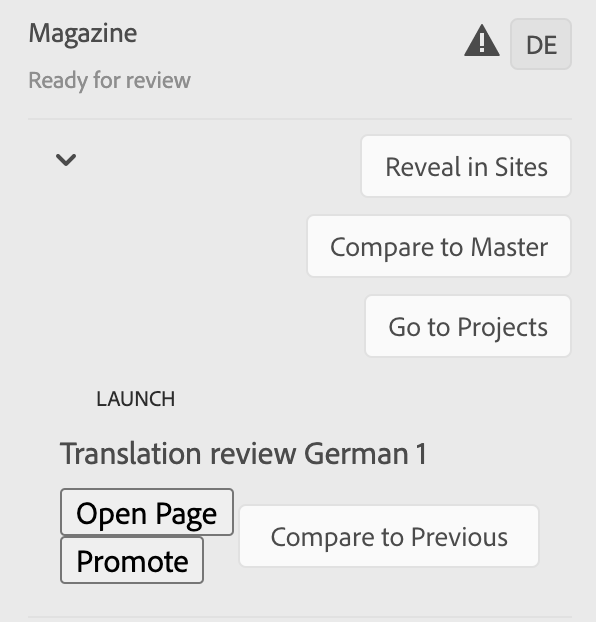

# 管理翻譯專案 {#managing-translation-projects}

翻譯專案可讓您管理AEM內容的翻譯。 翻譯專案是一種AEM [專案](/help/sites-cloud/authoring/projects/overview.md) 包含要翻譯成其他語言的資源。 這些資源是 [語言副本](preparation.md) 由語言主版建立。

>[!TIP]
>
>如果您是初次翻譯內容，請參閱 [網站翻譯歷程，](/help/journey-sites/translation/overview.md) 這是使用AEM功能強大的翻譯工具來轉譯您的AEM Sites內容的引導式路徑，最適合沒有AEM或翻譯體驗的人。

將資源新增至翻譯專案時，會為資源建立翻譯工作。 作業提供命令和狀態資訊，用於管理在資源上執行的人工翻譯和機器翻譯工作流。

翻譯專案是長期執行的項目，由語言和翻譯方法/提供者來定義，以符合全球化的組織治理。 應在初始翻譯期間或手動啟動一次，並在整個內容和翻譯更新活動中保持有效。

翻譯專案和工作是使用翻譯準備工作流程建立。 這些工作流程有三個選項，分別用於初始翻譯（建立和翻譯）和更新（更新翻譯）:

1. [建立新專案](#creating-translation-projects-using-the-references-panel)
1. [新增至現有專案](#adding-pages-to-a-translation-project)
1. [僅內容結構](#creating-the-structure-of-a-language-copy)

AEM會偵測正在為內容的初始翻譯建立翻譯專案，還是更新已翻譯的語言副本。 當您為頁面建立翻譯專案並指出要翻譯的語言副本時，AEM會偵測來源頁面是否已存在於目標語言副本中：

* **語言副本不包含頁面：** AEM會將此情況視為初始翻譯。 頁面會立即複製到語言副本中，並包含在專案中。 翻譯的頁面匯入至AEM時，AEM會直接複製到語言副本。
* **語言副本已包含頁面：** AEM會將此情況視為更新的翻譯。 系統會建立啟動，並將頁面復本新增至啟動中，並包含在專案中。 啟動可讓您在將更新的翻譯提交至語言副本之前先檢閱該翻譯：

   * 翻譯的頁面匯入至AEM時，會覆寫啟動中的頁面。
   * 翻譯的頁面只有在升級啟動時才會覆寫語言副本。

例如， `/content/wknd/fr` 語言根是為 `/content/wknd/en` 主語言。 法文副本中沒有其他頁。

* 系統會為 `/content/wknd/en/products` 頁面和所有子頁面，以法文語言副本為目標。 因為語言副本不包含 `/content/wknd/fr/products` 頁面，AEM會立即複製 `/content/wknd/en/products` 頁面和所有子頁面都包含在法文語言副本中。 翻譯專案中也包含這些副本。
* 系統會為 `/content/wknd/en` 頁面和所有子頁面，以法文語言副本為目標。 因為語言副本包含與 `/content/wknd/en` 頁面（語言根）, AEM會複製 `/content/wknd/en` 頁面和所有子頁面，並將它們新增至啟動。 翻譯專案中也包含這些副本。

## 從Sites Console進行翻譯 {#performing-initial-translations-and-updating-existing-translations}

可直接從網站主控台建立或更新翻譯專案。

### 使用「參考」面板建立翻譯專案 {#creating-translation-projects-using-the-references-panel}

建立翻譯專案，以便執行和管理翻譯語言主版資源的工作流程。 建立項目時，可以在要翻譯的語言主版中指定頁面，並指定要執行翻譯的語言副本：

* 與選定頁面關聯的翻譯整合框架的雲配置確定了翻譯項目的許多屬性，如要使用的翻譯工作流。
* 系統會為選取的每個語言副本建立專案。
* 系統會建立選取頁面的復本和相關資產，並新增至每個專案。 這些副本稍後將發送到翻譯提供程式進行翻譯。

您可以指定也選取所選頁面的子頁面。 在這種情況下，子頁面的副本也會新增至每個專案，以便翻譯。 當任何子頁面與不同的翻譯整合架構設定相關聯時，AEM會建立其他專案。

您也可以 [手動建立翻譯專案](#creating-a-translation-project-using-the-projects-console).

>[!NOTE]
>
>若要建立專案，您的帳戶必須是 `project-administrators` 群組。

### 初始翻譯和更新翻譯 {#initial-and-updating}

「參考」面板指示您是更新現有語言副本，還是建立語言副本的第一版本。 當選定頁面的語言副本存在時，「更新語言副本」頁簽將顯示為提供對與項目相關的命令的訪問。

轉譯後，您可以 [查看翻譯](#reviewing-and-promoting-updated-content) 以覆寫語言副本。 當所選頁面不存在語言副本時，將顯示「建立和翻譯」頁簽，以提供對項目相關命令的訪問。

### 為新語言副本建立翻譯項目 {#create-translation-projects-for-a-new-language-copy}

1. 使用Sites Console來選取要新增至翻譯專案的頁面。

1. 使用工具列，開啟 **參考** 欄。

   

1. 選擇 **語言副本**，然後選擇要翻譯源頁面的語言副本。
1. 按一下或點選 **建立和翻譯** 然後配置翻譯作業：

   * 使用 **語言** 下拉式清單，選取您要翻譯的語言副本。 視需要選取其他語言。 清單中顯示的語言與 [你創造的語言根](preparation.md#creating-a-language-root).
      * 選取多種語言會建立一個專案，並針對每種語言執行翻譯工作。
   * 要翻譯所選頁面和所有子頁面，請選擇 **選擇所有子頁**. 若要僅翻譯您選取的頁面，請清除選項。
   * 針對 **專案**，選取 **建立翻譯專案**.
   * （可選） **項目主**，請選擇要繼承用戶角色和權限的項目。
   * 在 **標題** 輸入專案的名稱。

   

1. 按一下或點選 **建立**.

### 為現有語言副本建立翻譯項目 {#create-translation-projects-for-an-existing-language-copy}

1. 使用Sites控制台來選擇要添加到翻譯項目的頁面。

1. 使用工具列，開啟 **參考** 欄。

   

1. 選擇 **語言副本**，然後選擇要翻譯源頁面的語言副本。
1. 按一下或點選 **更新語言副本** 然後配置翻譯作業：

   * 要翻譯所選頁面和所有子頁面，請選擇 **選擇所有子頁**. 若要僅翻譯您選取的頁面，請清除選項。
   * 針對 **專案**，選取 **建立翻譯專案**.
   * （可選） **項目主**，請選擇要繼承用戶角色和權限的項目。
   * 在 **標題** 輸入專案的名稱。

   

1. 按一下或點選 **建立**.

### 新增頁面至翻譯專案 {#adding-pages-to-a-translation-project}

建立翻譯專案後，您可以使用 **資源** 邊欄以新增頁面至專案。 在相同專案中包含來自不同分支的頁面時，新增頁面很實用。

將頁面新增至翻譯專案時，這些頁面會包含在新的翻譯工作中。 您也可以 [將頁面新增至現有作業](#adding-pages-assets-to-a-translation-job).

和建立新專案時一樣，新增頁面時，必要時會將頁面的復本新增至啟動，以避免覆寫現有的語言復本。 (請參閱 [為現有語言副本建立翻譯項目](#performing-initial-translations-and-updating-existing-translations).)

1. 使用Sites控制台來選擇要添加到翻譯項目的頁面。

1. 使用工具列，開啟 **參考** 欄。

   

1. 選擇 **語言副本**，然後選擇要翻譯源頁面的語言副本。

   

1. 按一下或點選 **更新語言副本** 然後設定屬性：

   * 要翻譯所選頁面和所有子頁面，請選擇 **選擇所有子頁**. 若要僅翻譯您選取的頁面，請清除選項。
   * 針對 **專案**，選取 **新增至現有翻譯專案**.
   * 在中選取專案 **現有翻譯專案**.

   >[!NOTE]
   >
   >翻譯專案中設定的目標語言應符合語言副本的路徑，如參考邊欄所示。

1. 按一下或點選 **更新**.

### 建立語言副本的結構 {#creating-the-structure-of-a-language-copy}

只能建立語言副本的結構，允許您將語言主版中的內容和結構更改複製到（未翻譯）語言副本。 這與翻譯工作或專案無關。 您可以使用這個功能來保持語言主版的同步，即使不需要翻譯。

填入您的語言副本，以便包含您正在翻譯之主語言的內容。 填入語言副本之前，您必須 [建立了語言根](preparation.md#creating-a-language-root) 語言副本。

1. 使用站點控制台來選擇用作源的主語言的語言根目錄。
1. 按一下或點選以開啟參照邊欄 **參考** 的下一頁。

   

1. 選擇 **語言副本**，然後選取要填入的語言副本。

   

1. 按一下或點選 **更新語言副本** 顯示翻譯工具並配置屬性：

   * 選取 **選擇所有子頁** 選項。
   * 針對 **專案**，選取 **僅建立結構**.

   

1. 按一下或點選 **更新**.

### 更新翻譯記憶體 {#updating-translation-memory}

翻譯內容的手動編輯可以同步回翻譯管理系統(TMS)以訓練其翻譯記憶體。

1. 從網站主控台，在更新翻譯頁面中的文字內容後，選取 **更新翻譯記憶體**.
1. 清單視圖會並排顯示源的比較，以及已編輯的每個文本元件的翻譯。 選擇哪些翻譯更新應同步到翻譯記憶庫，然後選擇 **更新記憶體**.

AEM更新已配置TMS的翻譯記憶體中現有字串的翻譯。

* 動作會更新已設定TMS的翻譯記憶體中現有字串的翻譯。
* 不會建立新的翻譯工作。
* 它透過AEM翻譯API（請參閱下方）將翻譯傳回TMS。

若要使用此功能：

* TMS必須設定以與AEM搭配使用。
* 連接器需要實施此方法 [`storeTranslation`](https://developer.adobe.com/experience-manager/reference-materials/cloud-service/javadoc/com/adobe/granite/translation/api/TranslationService.html).
   * 此方法中的代碼確定翻譯記憶體更新請求的結果。
   * AEM轉譯架構透過此方法實施將字串值配對（原始和更新的轉譯）傳回TMS。

對於使用專有翻譯記憶體的情況，可以截取翻譯記憶體更新併發送到自定義目標。

### 檢查頁面的翻譯狀態 {#check-translation-status}

可在網站控制台的清單檢視中選取屬性，顯示頁面是已翻譯、正在翻譯或尚未翻譯。

1. 在網站主控台中，切換至 [清單檢視。](/help/sites-cloud/authoring/getting-started/basic-handling.md#viewing-and-selecting-resources)
1. 點選或按一下， **檢視設定** 在「檢視」下拉式清單中。
1. 在對話方塊中，核取 **已翻譯** 屬性，點選或按一下 **更新**.

網站主控台現在會顯示 **已翻譯** 欄，顯示所列頁面的翻譯狀態。

## 從專案主控台管理翻譯專案

您可以在專案主控台中存取許多翻譯工作和進階選項。

### 了解專案主控台

AEM中的翻譯專案使用標準 [AEM專案主控台。](/help/sites-cloud/authoring/projects/overview.md) 如果您不熟悉AEM專案，請檢閱該檔案。

與任何其他項目一樣翻譯項目由顯示項目任務概覽的圖磚組成。

* **摘要**  — 專案概觀
* **工作**  — 一個或多個翻譯任務
* **團隊**  — 協作翻譯項目的用戶
* **工作**  — 需要完成的項目，作為翻譯工作的一部分

使用圖磚頂部和底部的命令和刪節號按鈕（分別）訪問各圖磚的控制項和選項。

### 使用專案主控台建立翻譯專案 {#creating-a-translation-project-using-the-projects-console}

如果您偏好使用專案主控台而非網站主控台，可以手動建立翻譯專案。

>[!NOTE]
>
>若要建立專案，您的帳戶必須是 `project-administrators` 群組。

手動建立翻譯專案時，除了 [基本屬性](/help/sites-cloud/authoring/projects/managing.md#creating-a-project):

* **名稱：** 專案名稱
* **源語言：** 來源內容的語言
* **目標語言：** 內容要翻譯的語言或語言
   * 如果選取了多種語言，則會針對專案內的每種語言建立工作。
* **翻譯方法：** 選擇 **人類翻譯** 以指出要手動執行翻譯。

1. 在專案主控台的工具列上，按一下或點選 **建立**.
1. 選取 **翻譯專案** 範本，然後按一下或點選 **下一個**.
1. 輸入 **基本** 屬性標籤。
1. 按一下或點選 **進階** 和為與翻譯相關的屬性提供值。
1. 按一下或點選 **建立**. 在確認方塊中，按一下或點選 **完成** 若要返回專案主控台，或按一下或點選 **開啟專案** 以開啟並開始管理專案。

### 新增頁面和資產至翻譯工作 {#adding-pages-assets-to-a-translation-job}

您可以將頁面、資產或標籤新增至翻譯專案的翻譯工作。 若要新增頁面或資產：

1. 在翻譯專案的翻譯工作方塊底部，按一下或點選省略號。

   

1. 在下一個視窗中，按一下或點選 **新增** 按鈕，然後選擇 **資產/頁面**.

   

1. 在強制回應視窗中，選取您要新增的分支最頂端的項目，然後按一下或點選核取標籤圖示。 此窗口中啟用了多選。

   

1. 或者，您也可以選取搜尋圖示，輕鬆尋找想要新增至翻譯工作的頁面或資產。

   

1. 選取後，點選或按一下 **選擇**. 您的頁面和/或資產會新增至翻譯工作。

>[!TIP]
>
>此方法會將頁面/資產及其子項新增至專案。 選擇 **資產/頁面（不含子項）** 如果你只想添加父母。

### 為翻譯工作新增標籤 {#adding-tags-to-a-translation-job}

您可以新增標籤至翻譯專案，類似於 [如何新增資產和頁面至專案。](#adding-pages-assets-to-a-translation-job) 只需選取 **標籤** 在 **新增** 功能表，然後遵循相同步驟。

### 查看翻譯項目詳細資訊 {#seeing-translation-project-details}

您可以透過專案摘要圖磚的刪節號按鈕，存取翻譯專案屬性。 除了通用 [項目資訊](/help/sites-cloud/authoring/projects/overview.md#project-info)，則翻譯專案屬性包含翻譯專屬的內容。

在翻譯專案中，按一下或點選「翻譯摘要」圖磚底部的刪節號。 大部分專案專屬屬性位於 **進階** 標籤。

* **源語言：** 正在翻譯的頁面的語言
* **目標語言：** 頁面翻譯的語言或語言
* **雲配置：** 用於專案的翻譯服務連接器雲端設定
* **翻譯方法：** 翻譯工作流程 **人類翻譯** 或 **機器翻譯**
* **翻譯提供者：** 執行翻譯的翻譯服務提供商
* **內容類別：** （機器翻譯）用於翻譯的內容類別
* **翻譯提供程式憑據：** 要登錄到提供程式的憑據
* **自動促銷翻譯啟動：** 收到翻譯內容後，翻譯啟動會自動升級
   * **促銷後刪除啟動：** 如果翻譯啟動自動升級，請在升級後刪除啟動
* **自動批准翻譯：** 收到翻譯內容後，翻譯工作會自動獲得批准
* **重複翻譯：** 通過選擇項目將自動建立和執行翻譯作業的頻率來配置翻譯項目的循環執行

使用頁面的參考邊欄建立專案時，系統會根據來源頁面的屬性自動設定這些屬性。

### 監控翻譯工作的狀態 {#monitoring-the-status-of-a-translation-job}

翻譯專案的翻譯工作方塊會提供翻譯工作的狀態，以及工作中的頁數和資產。

下表說明作業或作業中的項目可擁有的每個狀態：

| 狀態 | 說明 |
|---|---|
| **草稿** | 尚未啟動翻譯工作。 翻譯工作位於 **草稿****建立狀態時的狀態。 |
| **已提交** | 翻譯工作中的檔案成功傳送至翻譯服務時，會具有此狀態。 此狀態可能發生在 **請求範圍** 命令或 **開始** 命令。 |
| **已要求範圍** | 對於人工翻譯工作流，作業中的檔案已提交給翻譯供應商進行範圍界定。 此狀態會顯示在 **請求範圍** 命令。 |
| **範圍已完成** | 供應商已限定翻譯作業的範圍。 |
| **承諾翻譯** | 項目所有者已接受該範圍。 此狀態表示翻譯供應商應開始翻譯作業中的檔案。 |
| **正在進行的翻譯** | 對於作業，作業中一個或多個檔案的翻譯尚未完成。 對於作業中的項目，正在翻譯該項目。 |
| **已翻譯** | 對於作業，作業中的所有檔案的翻譯已完成。 對於作業中的項目，項目會被翻譯。 |
| **準備審核** | 作業中的項目會翻譯，且檔案已匯入AEM。 |
| **完成** | 項目所有者表示翻譯合同已完成。 |
| **取消** | 指示翻譯供應商應停止處理翻譯工作。 |
| **更新錯誤** | 在AEM和翻譯服務之間傳輸檔案時出錯。 |
| **未知狀態** | 發生未知錯誤。 |

若要查看工作中每個檔案的狀態，請按一下或點選圖磚底部的刪節號。

### 設定翻譯作業的到期日 {#setting-the-due-date-of-translation-jobs}

指定翻譯供應商需要返回翻譯檔案的日期。 只有當所使用的翻譯供應商支援此功能時，才能正確設定到期日。

1. 按一下或點選翻譯摘要圖磚底部的刪節號。

   

1. 在 **基本** 頁簽，使用 **到期日** 屬性以選取到期日。

   

1. 按一下或點選 **儲存並關閉**.

### 規範翻譯工作 {#scoping-a-translation-job}

從翻譯服務提供商處獲取翻譯成本的估計值。 當您調整作業範圍時，會將源檔案提交給翻譯供應商，該供應商將文本與儲存的翻譯庫（翻譯記憶庫）進行比較。 範圍通常是需要翻譯的字詞數。

要獲取有關範圍界定結果的更多資訊，請與翻譯供應商聯繫。

>[!NOTE]
>
>範圍界定是選用的，僅適用於人類翻譯。 您可以開始翻譯工作，而無須範圍界定。

當您調整翻譯作業的範圍時，該作業的狀態為 **請求的範圍**. 當翻譯供應商返回範圍時，狀態將更改為 **已完成範圍**. 範圍界定完成時，您可以使用 **顯示範圍** 命令來查看範圍分析結果。

只有使用的翻譯供應商支援此功能時，範圍界定功能才能正常運作。

1. 在專案主控台中，開啟您的翻譯專案。
1. 在翻譯工作的標題上，點選或按一下命令菜單，然後點選或按一下 **請求範圍**.
1. 作業狀態變更為 **已完成範圍**，按一下或點選「命令」選單，然後按一下或點選 **顯示範圍**.

### 開始翻譯工作 {#starting-translation-jobs}

啟動翻譯工作，將源頁面翻譯為目標語言。 根據翻譯摘要表徵圖的屬性值執行翻譯。

您可以從專案內啟動個別工作。

1. 在專案主控台中，開啟翻譯專案。
1. 在翻譯工作方塊上，按一下或點選「命令」選單，然後按一下或點選 **開始**.
1. 在確認翻譯開始的動作對話方塊中，按一下或點選 **關閉**.

開始翻譯工作後，翻譯工作方塊會顯示 **進行中** 狀態。

您也可以開始專案的所有翻譯工作。

1. 在專案主控台中，選取翻譯專案。
1. 在工具列中點選或按一下 **開始翻譯工作**.
1. 在對話方塊中，檢閱要啟動的作業清單，然後使用確認 **開始** 或中止 **取消**.

### 取消翻譯工作 {#canceling-a-translation-job}

取消翻譯工作以停止翻譯過程並阻止翻譯供應商執行任何進一步的翻譯。 當作業具有 **承諾翻譯** 或 **正在進行的翻譯** 狀態。

1. 在專案主控台中，開啟翻譯專案。
1. 在翻譯工作方塊上，按一下或點選「命令」選單，然後按一下或點選 **取消**.
1. 在確認翻譯取消的動作對話方塊中，按一下或點選 **確定**.

### 接受和拒絕工作流 {#accept-reject-workflow}

翻譯後內容回來時，內容會進入 **準備審核** 狀態時，您可以進入翻譯工作並接受/拒絕內容。

如果您選取 **拒絕翻譯**，您可以選擇新增註解。

拒絕內容會將內容傳回翻譯廠商，讓他們可以在其中看到評論。

### 完成和歸檔翻譯工作 {#completing-and-archiving-translation-jobs}

審核供應商翻譯的檔案後，完成翻譯工作。

1. 在專案主控台中，開啟翻譯專案。
1. 在翻譯工作方塊上，按一下或點選「命令」選單，然後按一下或點選 **完成**.
1. 該作業現在具有狀態 **完成**.

對於人工翻譯工作流，完成翻譯會向供應商表明翻譯合同已經履行，並且應將翻譯保存到其翻譯記憶庫。

翻譯工作完成後進行封存，您不再需要查看工作狀態詳細資訊。

1. 在專案主控台中，開啟翻譯專案。
1. 在翻譯工作方塊上，按一下或點選「命令」選單，然後按一下或點選 **封存**.

封存工作時，翻譯工作標題會從專案中移除。

## 檢閱和使用翻譯的內容 {#reviewing-and-promoting-updated-content}

您可以使用網站主控台來檢閱內容、比較語言復本及啟用內容。

### 提升更新的內容 {#promoting-updated-content}

當針對現有語言副本翻譯內容時，請查看翻譯內容，視需要進行更改，然後升級翻譯以將其移到語言副本中。 翻譯工作顯示 **準備審核** 狀態。

1. 在語言主版中選取頁面，按一下或點選 **參考**，然後按一下或點選 **語言副本**.
1. 按一下或點選要檢閱的語言副本。

   

1. 按一下或點選 **Launch** 以顯示與launch相關的命令。

   

1. 若要開啟頁面的啟動復本以檢閱及編輯內容，請按一下 **開啟頁面**.
1. 檢閱內容並進行必要變更後，請升級啟動復本點按 **提升**.
1. 在 **促銷啟動** 頁面，指定要促銷的頁面，然後按一下或點選 **提升**.

### 比較語言副本 {#comparing-language-copies}

要比較語言副本與語言主版：

1. 在網站主控台中，導覽至您要比較的語言副本。
1. 開啟 [參考邊欄。](/help/sites-cloud/authoring/getting-started/basic-handling.md#references)
1. 在 **復本** 標題選取 **語言副本。**
1. 選取您的特定語言副本，然後按一下 **與主版比較** 或 **與上一個比較** 若適用。

   

1. 兩個頁面（啟動和來源）將並排開啟。
   * 如需使用此功能的完整資訊，請參閱 [頁面差異](/help/sites-cloud/authoring/features/page-diff.md).

## 匯入和匯出翻譯工作 {#import-export}

雖然AEM提供許多翻譯解決方案和介面，但您也可以手動匯入和匯出翻譯工作資訊。

### 匯出翻譯工作 {#exporting-a-translation-job}

您可以下載翻譯工作的內容，例如傳送至未透過連接器與AEM整合的翻譯提供者，或檢閱內容。

1. 從翻譯工作方塊的下拉式選單中，按一下或點選 **匯出**.
1. 在對話方塊中，按一下或點選 **下載匯出的檔案**，並視需要使用網頁瀏覽器對話方塊來儲存檔案。
1. 在對話方塊中，按一下或點選 **關閉**.

### 匯入翻譯工作 {#importing-a-translation-job}

您可以將翻譯的內容匯入AEM，例如當翻譯提供者將翻譯內容傳送給您時，因為這些內容並未透過連接器與AEM整合。

1. 從翻譯工作方塊的下拉式選單中，按一下或點選 **匯入**.
1. 使用Web瀏覽器的對話框選擇要導入的檔案。
1. 在對話方塊中，按一下或點選 **關閉**.
