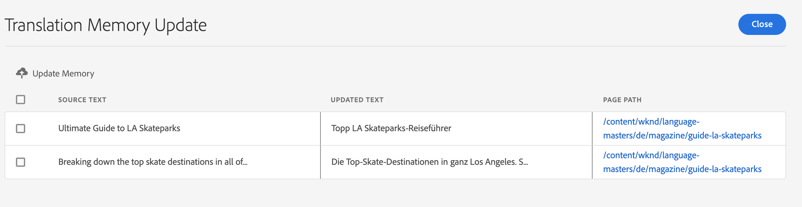
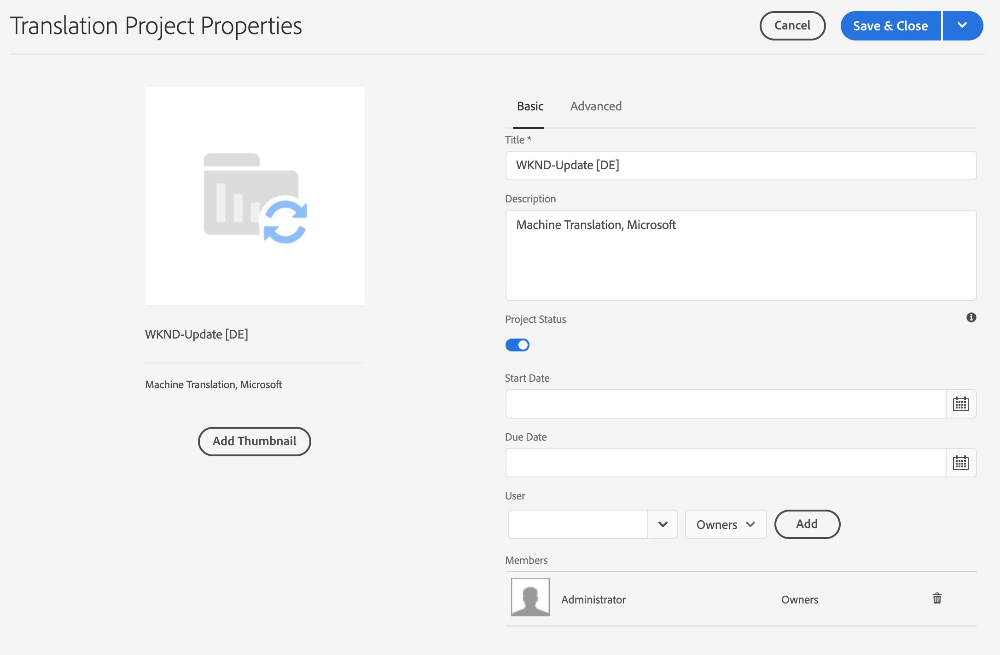

# 管理翻譯項目{#managing-translation-projects}

翻譯專案可讓您管理內容的AEM翻譯。 翻譯項目是&lt;AEMa0/>project](/help/sites-cloud/authoring/projects/overview.md)的類型，它包含要翻譯成其他語言的資源。 [這些資源是從語言主版建立的[語言副本](preparation.md)的頁面和資產。

將資源添加到翻譯項目時，將為其建立翻譯作業。 作業提供命令和狀態資訊，用於管理在資源上執行的人工翻譯和機器翻譯工作流。

翻譯項目是長期執行的項目，由語言和翻譯方法／提供者定義，以便與全球化的組織治理保持一致。 應在初始翻譯期間或手動啟動一次，並在整個內容和翻譯更新活動中保持有效。

翻譯項目和作業是使用翻譯準備工作流建立的。 這些工作流程有三種選項，包括初始翻譯（建立和翻譯）和更新（更新翻譯）:

1. [建立新專案](#creating-translation-projects-using-the-references-panel)
1. [新增至現有專案](#adding-pages-to-a-translation-project)
1. [僅限內容結構](#creating-the-structure-of-a-language-copy)

AEM檢測是否正在為初始翻譯內容建立翻譯項目，或更新已翻譯的語言副本。 為頁面建立翻譯項目並指明要翻譯的語言副本時，AEM將檢測源頁面是否已存在於目標語言副本中：

* **語言副本不包含頁面：** AEM將此情況視為初始翻譯。頁面會立即複製到語言副本，並包含在專案中。 將翻譯的頁面匯入時AEM,AEM直接複製到語言副本。
* **語言副本已包含頁面：將** AEM此情況視為更新的翻譯。會建立啟動，並將頁面副本新增至啟動，並包含在專案中。 啟動可讓您在將更新的翻譯提交至語言副本之前，先檢閱其翻譯：

   * 將翻譯的頁面匯入AEM時，會覆寫啟動中的頁面。
   * 只有在升級啟動時，翻譯的頁面才會覆寫語言副本。

例如，為`/content/wknd/en`主語言的法文翻譯建立`/content/wknd/fr`語言根。 法文版中沒有其他頁面。

* 會針對`/content/wknd/en/products`頁面和所有子頁面建立翻譯專案，以法文語言副本為目標。 由於語言副本不包含`/content/wknd/fr/products`頁面，AEM因此會立即將`/content/wknd/en/products`頁面和所有子頁面複製為法文語言副本。 翻譯項目中也包含這些副本。
* 會針對`/content/wknd/en`頁面和所有子頁面建立翻譯專案，以法文語言副本為目標。 由於語言副本包含與`/content/wknd/en`頁面（語言根目錄）對應的頁面，AEM因此會複製`/content/wknd/en`頁面和所有子頁面，並將它們新增至啟動。 翻譯項目中也包含這些副本。

## 從站點控制台{#performing-initial-translations-and-updating-existing-translations}轉換

可以直接從站點控制台建立或更新翻譯項目。

### 使用「參考」面板{#creating-translation-projects-using-the-references-panel}建立翻譯項目

建立翻譯項目，以便執行和管理翻譯語言首頁資源的工作流。 在建立項目時，您可以在要翻譯的語言主版中指定頁面，以及要執行翻譯的語言副本：

* 與所選頁面相關聯的翻譯整合框架的雲配置決定了翻譯項目的許多屬性，如要使用的翻譯工作流。
* 系統會為選取的每個語言副本建立專案。
* 系統會建立選定頁面及相關資產的副本，並新增至每個專案。 這些副本稍後將發送給翻譯提供者進行翻譯。

您可以指定也選取所選頁面的子頁面。 在這種情況下，子頁面的副本也會新增至每個專案，以便翻譯。 當任何子頁面與不同的翻譯整合框架配置相關聯時，AEM將建立其他項目。

您也可以[手動建立翻譯項目](#creating-a-translation-project-using-the-projects-console)。

### 初始翻譯和更新翻譯{#initial-and-updating}

「參考」面板會指出您是要更新現有語言副本，還是要建立語言副本的第一版。 當選定頁面存在語言副本時，將顯示「更新語言副本」頁籤，以提供對項目相關命令的訪問。

轉譯後，您可以在使用翻譯覆蓋語言副本之前，先查看翻譯](#reviewing-and-promoting-updated-content)。 [當選定頁面不存在語言副本時，將顯示「建立和翻譯」頁籤，以提供對項目相關命令的訪問。

### 為新語言副本建立翻譯項目{#create-translation-projects-for-a-new-language-copy}

1. 使用Sites控制台選擇要添加到翻譯項目的頁。

1. 使用工具列，開啟&#x200B;**References**&#x200B;邊欄。

   

1. 選擇&#x200B;**語言副本**，然後選擇要翻譯源頁的語言副本。
1. 按一下或點選&#x200B;**建立和翻譯** ，然後配置翻譯作業：

   * 使用&#x200B;**Languages**&#x200B;下拉式清單來選擇您要翻譯的語言副本。 視需要選擇其他語言。 清單中顯示的語言與您已建立的[語言根對應。](preparation.md#creating-a-language-root)
      * 選擇多種語言會建立一個專案，每個語言都有翻譯工作。
   * 要翻譯所選頁面和所有子頁面，請選擇&#x200B;**選擇所有子頁面**。 要僅翻譯所選的頁面，請清除該選項。
   * 對於&#x200B;**Project**，選擇&#x200B;**建立翻譯項目**。
   * （可選）對於&#x200B;**項目主版**，選擇要從中繼承用戶角色和權限的項目。
   * 在&#x200B;**Title**&#x200B;中，鍵入項目的名稱。

   

1. 按一下或點選「**建立**」。

### 為現有語言副本建立翻譯項目{#create-translation-projects-for-an-existing-language-copy}

1. 使用Sites控制台選擇要添加到翻譯項目的頁。

1. 使用工具列，開啟&#x200B;**References**&#x200B;邊欄。

   

1. 選擇&#x200B;**語言副本**，然後選擇要翻譯源頁的語言副本。
1. 按一下或點選&#x200B;**更新語言副本** ，然後配置翻譯作業：

   * 要翻譯所選頁面和所有子頁面，請選擇&#x200B;**選擇所有子頁面**。 要僅翻譯所選的頁面，請清除該選項。
   * 對於&#x200B;**Project**，選擇&#x200B;**建立翻譯項目**。
   * （可選）對於&#x200B;**項目主版**，選擇要從中繼承用戶角色和權限的項目。
   * 在&#x200B;**Title**&#x200B;中，鍵入項目的名稱。

   

1. 按一下或點選「**建立**」。

### 將頁面添加到翻譯項目{#adding-pages-to-a-translation-project}

建立翻譯項目後，可以使用&#x200B;**資源**&#x200B;邊欄將頁面添加到項目中。 在相同專案中包含來自不同分支的頁面時，新增頁面很有用。

將頁面添加到翻譯項目時，這些頁面將包含在新的翻譯作業中。 您也可以[將頁面新增至現有工作](#adding-pages-assets-to-a-translation-job)。

如同建立新專案時，新增頁面時，頁面的副本會在需要時新增至啟動，以避免覆寫現有的語言副本。 （請參閱[為現有語言副本建立翻譯項目](#performing-initial-translations-and-updating-existing-translations)。）

1. 使用Sites控制台選擇要添加到翻譯項目的頁。

1. 使用工具列，開啟&#x200B;**References**&#x200B;邊欄。

   

1. 選擇&#x200B;**語言副本**，然後選擇要翻譯源頁的語言副本。

   

1. 按一下或點選&#x200B;**更新語言副本** ，然後配置屬性：

   * 要翻譯所選頁面和所有子頁面，請選擇&#x200B;**選擇所有子頁面**。 要僅翻譯所選的頁面，請清除該選項。
   * 對於&#x200B;**Project**，選擇&#x200B;**添加到現有翻譯項目**。
   * 在&#x200B;**現有翻譯項目**&#x200B;中選擇項目。

   >[!NOTE]
   >
   >翻譯專案中設定的目標語言應與語言副本的路徑相符，如參考邊欄所示。

1. 按一下或點選&#x200B;**Update**。

### 建立語言副本的結構{#creating-the-structure-of-a-language-copy}

您只能建立語言副本的結構，讓您將語言主版的內容和結構變更複製到（未翻譯）語言副本。 這與翻譯工作或項目無關。 您可以使用這個功能，讓語言主控程式保持同步，即使不需要翻譯。

填入您的語言副本，以便包含您要翻譯的主版語言的內容。 在填入語言副本之前，您必須先建立語言副本的語言根目錄](preparation.md#creating-a-language-root)。[

1. 使用站點控制台來選擇作為源的主語言的語言根目錄。
1. 按一下或點選工具欄中的&#x200B;**References**&#x200B;以開啟參照邊欄。

   

1. 選擇&#x200B;**語言副本**，然後選擇要填充的語言副本。

   

1. 按一下或點選&#x200B;**更新語言副本**&#x200B;以顯示翻譯工具並配置屬性：

   * 選擇&#x200B;**選擇所有子頁**&#x200B;選項。
   * 對於&#x200B;**Project**，選擇&#x200B;**僅建立結構**。

   

1. 按一下或點選&#x200B;**Update**。

### 更新翻譯庫{#updating-translation-memory}

翻譯內容的手動編輯可以同步回翻譯管理系統(TMS)以訓練其翻譯記憶庫。

1. 在站點控制台中，在更新翻譯頁面中的文本內容後，選擇&#x200B;**更新翻譯庫**。
1. 清單檢視會並排顯示所編輯之每個文字元件的來源與翻譯比較。 選擇哪些翻譯更新應與翻譯記憶體同步，然後選擇&#x200B;**更新記憶體**。

將AEM選定的字串發回翻譯管理系統。

### 檢查頁面{#check-translation-status}的翻譯狀態

在站點控制台的清單視圖中可以選擇一個屬性，該屬性顯示頁面是已翻譯、正在翻譯還是尚未翻譯。

1. 在站點控制台中，切換到[清單視圖。](/help/sites-cloud/authoring/getting-started/basic-handling.md#viewing-and-selecting-resources)
1. 點選或按一下檢視下拉式清單中的「檢視設定」。****
1. 在對話方塊中，檢查&#x200B;**Translated**&#x200B;屬性，然後點選或按一下&#x200B;**Update**。

現在，站點控制台顯示&#x200B;**Translated**&#x200B;列，顯示列出頁面的翻譯狀態。

## 從Project Console管理翻譯項目

您可以在專案主控台中存取許多翻譯工作和進階選項。

### 瞭解專案主控台

正在使用標AEM準[項目控制台的翻譯AEM項目。](/help/sites-cloud/authoring/projects/overview.md) 如果您不熟悉專AEM案，請檢閱檔案。

與其他項目一樣翻譯項目由顯示項目任務概覽的表徵圖組成。

* **摘要** -專案概觀
* **任務** -一個或多個翻譯任務
* **Team**  —— 協作翻譯項目的用戶
* **任務** -需要在翻譯工作中完成的項目

使用拼貼頂部和底部的命令和省略號按鈕（分別）來存取各種拼貼的控制項和選項。

### 使用項目控制台{#creating-a-translation-project-using-the-projects-console}建立翻譯項目

如果希望使用項目控制台而不是站點控制台，可以手動建立翻譯項目。

手動建立翻譯項目時，除了[基本屬性](/help/sites-cloud/authoring/projects/managing.md#creating-a-project)外，還必須提供以下與翻譯相關的屬性的值：

* **名稱：專** 案名稱
* **源語言：** 源內容的語言
* **目標語言：** 內容要翻譯的語言或語言
   * 如果選取多種語言，則會針對專案中的每種語言建立工作。
* **翻譯方法：** 選擇 **「** 人工翻譯」以指示要手動執行翻譯。

1. 在專案主控台的工具列上，按一下或點選「建立&#x200B;**」。**
1. 選擇&#x200B;**翻譯項目**&#x200B;模板，然後按一下或點選&#x200B;**Next**。
1. 輸入&#x200B;**Basic**&#x200B;屬性頁籤的值。
1. 按一下或點選&#x200B;**Advanced** ，並為翻譯相關屬性提供值。
1. 按一下或點選「**建立**」。 在確認方塊中，按一下或點選&#x200B;**Done**&#x200B;以返回專案主控台，或點選或點選&#x200B;**Open Project**&#x200B;以開啟並開始管理專案。

### 將頁面和資產添加到翻譯作業{#adding-pages-assets-to-a-translation-job}

您可以將頁面、資產或標籤新增至翻譯專案的翻譯工作。 若要新增頁面或資產：

1. 在翻譯項目的翻譯工作表徵圖底部，按一下或點選省略號。

   

1. 在下一個視窗中，按一下或點選工具列中的&#x200B;**Add**&#x200B;按鈕，然後選取&#x200B;**Assets/Pages**。

   

1. 在模式窗口中，選擇要添加的分支的最頂部項目，然後按一下或點選複選標籤表徵圖。 在此窗口中啟用多選。

   

1. 或者，您也可以選取搜尋圖示，輕鬆尋找要新增至翻譯工作的頁面或資產。

   

1. 選取後，點選或按一下「選擇&#x200B;****」。 您的頁面和／或資產會新增至翻譯工作。

>[!TIP]
>
>此方法會將頁面／資產及其子系新增至專案。 如果您只想添加父項，請選擇&#x200B;**Asset/Page（不帶子項）**。

### 向翻譯作業添加標籤{#adding-tags-to-a-translation-job}

您可以將標籤新增至翻譯專案，類似於[在專案中新增資產和頁面的方式。](#adding-pages-assets-to-a-translation-job) 只要在「 **** Addmenu（添加）」下 **** 選擇「Tags」（標籤），然後執行相同的步驟即可。

### 查看翻譯項目詳細資訊{#seeing-translation-project-details}

可通過項目摘要表徵圖的省略號按鈕訪問翻譯項目屬性。 除了一般[項目資訊](/help/sites-cloud/authoring/projects/overview.md#project-info)外，翻譯項目屬性還包含特定於翻譯的內容。

在您的翻譯專案中，按一下或點選「翻譯摘要」方塊底部的省略號。 大多數專案特定屬性位於&#x200B;**Advanced**&#x200B;標籤上。

* **來源語** 言：正在翻譯的頁面語言
* **目標語言：** 要翻譯頁面的語言或語言
* **雲配置：** 用於項目的翻譯服務連接器的雲配置
* **翻譯方法：** 人文翻譯或機器翻 **譯** 工作流 **程**
* **翻譯提供方：** 執行翻譯的翻譯服務提供方
* **內容類別：** （機器翻譯）用於翻譯的內容類別
* **翻譯提供程式憑** 據：要登錄到提供程式的憑據
* **自動提升翻譯啟動：在** 收到翻譯內容後，翻譯啟動會自動提升
   * **促銷後刪除啟動：** 如果轉換啟動自動升級，請刪除促銷後的啟動
* **自動批准翻譯：在** 接收翻譯內容後，翻譯作業會自動批准
* **重複翻譯：** 通過選擇項目將自動建立和執行翻譯作業的頻率來配置翻譯項目的循環執行

使用頁面的參考邊欄建立專案時，這些屬性會根據來源頁面的屬性自動設定。

### 監視翻譯作業的狀態{#monitoring-the-status-of-a-translation-job}

翻譯項目的翻譯作業表徵圖提供了翻譯作業的狀態以及作業中的頁數和資產數。

下表說明作業或作業中的項目可以擁有的每個狀態：

| 狀態 | 說明 |
|---|---|
| **草稿** | 尚未啟動翻譯作業。 翻譯作業建立時處於&#x200B;**Draft****狀態。 |
| **已提交** | 翻譯作業中的檔案在成功發送到翻譯服務後具有此狀態。 發出&#x200B;**請求範圍**&#x200B;命令或&#x200B;**開始**&#x200B;命令後，可能會出現此狀態。 |
| **已要求範圍** | 在人工翻譯工作流程中，作業中的檔案已提交給翻譯供應商進行範圍界定。 發出&#x200B;**請求範圍**&#x200B;命令後，此狀態將顯示。 |
| **範圍已完成** | 供應商已對翻譯作業進行了審查。 |
| **承諾翻譯** | 項目所有者已接受此範圍。 此狀態表示翻譯供應商應開始翻譯作業中的檔案。 |
| **正在進行翻譯** | 對於作業，作業中一個或多個檔案的翻譯尚未完成。 對於任務中的項目，正在翻譯該項目。 |
| **已翻譯** | 對於作業，作業中所有檔案的翻譯完成。 對於任務中的項目，將翻譯該項目。 |
| **可供審核** | 作業中的項目會翻譯，而且檔案已匯入AEM。 |
| **完成** | 項目所有者已表示翻譯合同已完成。 |
| **取消** | 指示翻譯供應商應停止處理翻譯作業。 |
| **錯誤更新** | 在與翻譯服務之間傳輸文AEM件時出錯。 |
| **未知狀態** | 發生未知錯誤。 |

要查看作業中每個檔案的狀態，請按一下或點選表徵圖底部的省略號。

### 設定翻譯作業的到期日{#setting-the-due-date-of-translation-jobs}

指定翻譯供應商需要返回翻譯檔案的日期。 只有當您使用的翻譯供應商支援此功能時，才能正確設定到期日。

1. 按一下或點選翻譯摘要表徵圖底部的省略號。

   

1. 在&#x200B;**Basic**&#x200B;標籤上，使用&#x200B;**Due Date**&#x200B;屬性的日期選擇器來選擇到期日。

   

1. 按一下或點選&#x200B;**保存並關閉**。

### 對翻譯作業範圍{#scoping-a-translation-job}

調整翻譯作業範圍，以從翻譯服務提供商那裡獲得翻譯成本的估計值。 當您對作業進行範圍調整時，源檔案將提交給翻譯供應商，該供應商將文本與儲存的翻譯庫（翻譯記憶體）進行比較。 通常範圍是需要翻譯的字詞數。

要獲取有關範圍界定結果的更多資訊，請與翻譯供應商聯繫。

>[!NOTE]
>
>範圍界定是可選的，僅適用於人類翻譯。 您可以開始翻譯工作，而不需進行範圍界定。

當您調整翻譯作業的範圍時，作業的狀態為&#x200B;**請求的範圍**。 當翻譯供應商返回範圍時，狀態將更改為&#x200B;**已完成範圍**。 完成範圍界定時，您可以使用&#x200B;**顯示範圍**&#x200B;命令來查看範圍界定結果。

只有當您使用的翻譯供應商支援此功能時，範圍界定才能正確運作。

1. 在專案主控台中，開啟您的轉譯專案。
1. 在翻譯作業的標題上，點選或按一下命令菜單，然後點選或按一下&#x200B;**請求範圍**。
1. 當作業狀態更改為&#x200B;**已完成範圍**&#x200B;時，按一下或點選命令菜單，然後按一下或點選&#x200B;**顯示範圍**。

### 啟動翻譯作業{#starting-translation-jobs}

啟動翻譯作業，將源頁面翻譯為目標語言。 根據翻譯摘要表徵圖的屬性值執行翻譯。

您可以從專案中開始個別工作。

1. 在項目控制台中，開啟翻譯項目。
1. 在翻譯作業表徵圖上，按一下或點選命令菜單，然後按一下或點選&#x200B;**開始**。
1. 在確認翻譯開始的動作對話方塊中，按一下或點選&#x200B;**關閉**。

啟動翻譯作業後，翻譯作業表徵圖將顯示處於&#x200B;**In Progress**&#x200B;狀態的翻譯。

您也可以啟動項目的所有翻譯作業。

1. 在項目控制台中，選擇翻譯項目。
1. 在工具欄中點選或按一下&#x200B;**開始翻譯作業**。
1. 在對話框中，查看將啟動的作業清單，然後使用&#x200B;**Start**&#x200B;確認，或使用&#x200B;**Cancel**&#x200B;中止。

### 取消翻譯作業{#canceling-a-translation-job}

取消翻譯作業以停止翻譯過程並阻止翻譯供應商執行任何進一步的翻譯。 當作業具有&#x200B;**Committed For Translation**&#x200B;或&#x200B;**Translation In Progress**&#x200B;狀態時，可以取消作業。

1. 在項目控制台中，開啟翻譯項目。
1. 在翻譯作業表徵圖上，按一下或點選命令菜單，然後按一下或點選&#x200B;**取消**。
1. 在確認取消翻譯的操作對話框中，按一下或點選&#x200B;**確定**。

### 接受和拒絕工作流{#accept-reject-workflow}

當內容在翻譯後返回且處於&#x200B;**「準備審核」狀態時，您可以進入翻譯作業並接受／拒絕內容。**

如果選擇&#x200B;**拒絕翻譯**，則可以選擇添加註釋。

拒絕內容會將其傳回翻譯廠商，讓他們可以在那裡看到注釋。

### 完成和歸檔翻譯作業{#completing-and-archiving-translation-jobs}

在審核了供應商翻譯的檔案後完成翻譯工作。

1. 在項目控制台中，開啟翻譯項目。
1. 在翻譯作業表徵圖上，按一下或點選命令菜單，然後按一下或點選&#x200B;**Complete**。
1. 作業現在的狀態為&#x200B;**Complete**。

對於人工翻譯工作流，完成翻譯會向供應商表明翻譯合同已經履行，並且應將翻譯保存到其翻譯庫中。

在翻譯作業完成後存檔，您不再需要查看作業狀態詳細資訊。

1. 在項目控制台中，開啟翻譯項目。
1. 在轉譯作業表徵圖上，按一下或點選命令菜單，然後按一下或點選&#x200B;**歸檔**。

當您封存工作時，翻譯工作圖格會從專案中移除。

## 檢閱和使用翻譯的內容{#reviewing-and-promoting-updated-content}

您可以使用網站主控台來檢閱內容、比較語言復本並啟動內容。

### 升級更新內容{#promoting-updated-content}

當內容翻譯成現有語言副本時，請檢閱翻譯，視需要進行變更，然後將翻譯提升為語言副本。 當翻譯作業顯示&#x200B;**Ready For Review**&#x200B;狀態時，您可以查看翻譯的檔案。

1. 在語言主版中選擇頁面，按一下或點選&#x200B;**參考**，然後按一下或點選&#x200B;**語言副本**。
1. 按一下或點選要檢閱的語言副本。

   

1. 按一下或點選&#x200B;**Launch**&#x200B;以顯示啟動相關命令。

   

1. 若要開啟頁面的啟動副本以檢閱和編輯內容，請按一下「開啟頁面」**。**
1. 查看內容並進行必要更改後，要升級啟動副本，請按一下「升級」。****
1. 在&#x200B;**Promote Launch**&#x200B;頁面上，指定要促銷的頁面，然後按一下或點選&#x200B;**Promote**。

### 比較語言副本{#comparing-language-copies}

要比較語言副本與語言主版：

1. 在網站主控台中，導覽至您要比較的語言副本。
1. 開啟[參考邊欄。](/help/sites-cloud/authoring/getting-started/basic-handling.md#references)
1. 在&#x200B;**Copies**&#x200B;標題下，選擇&#x200B;**Language Copies.**
1. 選擇您的特定語言副本，然後您可以按一下「比較主版&#x200B;**」或「比較上一版**」（如果適用）。****

   

1. 兩個頁面（啟動和來源）將並排開啟。
   * 有關使用此功能的完整資訊，請參見[頁面差異](/help/sites-cloud/authoring/features/page-diff.md)。

## 導入和導出翻譯作業{#import-export}

雖然AEM提供了許多翻譯解決方案和介面，但也可以手動導入和導出翻譯作業資訊。

### 導出翻譯作業{#exporting-a-translation-job}

您可以下載翻譯作業的內容，例如發送到未通過連接器與之整合的翻譯提供AEM商，或者查看內容。

1. 從翻譯作業表徵圖的下拉菜單中，按一下或點選&#x200B;**導出**。
1. 在對話方塊中，按一下或點選「下載匯出的檔案&#x200B;**」，並視需要使用網頁瀏覽器對話方塊來儲存檔案。**
1. 在對話方塊中，按一下或點選&#x200B;**關閉**。

### 導入翻譯作業{#importing-a-translation-job}

您可以將翻譯內容匯AEM入，例如，當翻譯提供者將翻譯內容傳送給您時，因為翻譯內容未透過連AEM接器與您整合。

1. 從翻譯作業表徵圖的下拉菜單中，按一下或點選&#x200B;**導入**。
1. 使用網頁瀏覽器的對話框選擇要導入的檔案。
1. 在對話方塊中，按一下或點選&#x200B;**關閉**。
