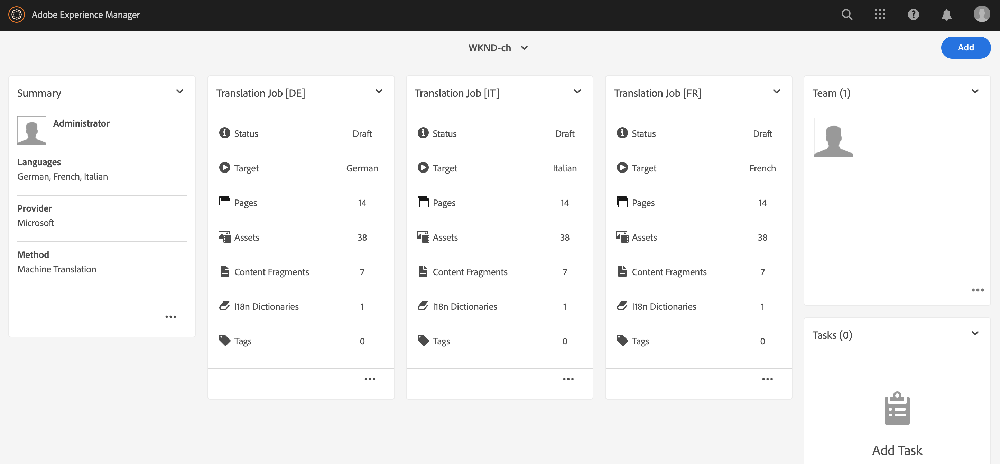

# 管理翻譯專案 {#managing-translation-projects}

翻譯專案可讓您管理AEM內容的翻譯。 翻譯專案是AEM的型別 [專案](/help/sites-cloud/authoring/projects/overview.md) 包含要翻譯成其他語言的資源。 這些資源是 [語言副本](preparation.md) 從語言母版建立的。

>[!TIP]
>
>如果您不熟悉翻譯內容，請參閱我們的 [網站翻譯歷程，](/help/journey-sites/translation/overview.md) 將引導您使用AEM強大的翻譯工具來翻譯AEM Sites內容，非常適合沒有AEM或翻譯經驗的人士。

將資源新增至翻譯專案時，系統會為其建立翻譯工作。 工作會提供相關命令和狀態資訊，您可用來管理在資源上執行的人工翻譯和機器翻譯工作流程。

翻譯專案是長期執行的專案，由語言和翻譯方法/提供者定義，以符合全球化的組織治理。 應該在初始翻譯期間啟動一次或手動啟動一次，並在整個內容和翻譯更新活動中保持有效。

翻譯專案和工作是使用翻譯準備工作流程建立的。 這些工作流程有三個選項，用於初始翻譯（建立和翻譯）和更新（更新翻譯）：

1. [建立新專案](#creating-translation-projects-using-the-references-panel)
1. [新增至現有專案](#adding-pages-to-a-translation-project)
1. [僅限內容結構](#creating-the-structure-of-a-language-copy)

AEM會偵測是否為內容的初始翻譯建立翻譯專案，或更新已翻譯的語言副本。 當您為頁面建立翻譯專案並指明要翻譯的語言副本時，AEM會偵測來源頁面是否已存在於目標語言副本中：

* **語言副本不包含頁面：** AEM會將此情況視為初始翻譯。 頁面會立即複製到語言副本中，並包含在專案中。 將翻譯頁面匯入AEM時，AEM會將其直接複製到語言副本。
* **語言副本已包含頁面：** AEM將此情況視為更新翻譯。 啟動隨即建立，頁面副本隨即新增至啟動項，並包含在專案中。 啟動可讓您在將更新的翻譯送交語言副本之前先加以檢閱：

   * 將翻譯的頁面匯入至AEM時，會覆寫啟動中的頁面。
   * 只有在提升啟動項時，翻譯的頁面才會覆寫語言副本。

例如， `/content/wknd/fr` 語言根目錄是為的法文翻譯所建立 `/content/wknd/en` 主語言。 法語副本中沒有其他頁面。

* 已針對以下專案建立翻譯專案： `/content/wknd/en/products` 頁面和所有子頁面，以法文副本為目標。 因為語言副本不包含 `/content/wknd/fr/products` 頁面，AEM會立即複製 `/content/wknd/en/products` 頁面及所有子頁面放入法文副本。 這些副本也包含在翻譯專案中。
* 已針對以下專案建立翻譯專案： `/content/wknd/en` 頁面和所有子頁面，以法文副本為目標。 因為語言副本包含對應至 `/content/wknd/en` 頁面（語言根），AEM會複製 `/content/wknd/en` 和全部子頁面，並將它們新增至啟動項。 這些副本也包含在翻譯專案中。

## 從Sites主控台翻譯 {#performing-initial-translations-and-updating-existing-translations}

可直接從網站主控台建立或更新翻譯專案。

### 使用「參考」面板建立翻譯專案 {#creating-translation-projects-using-the-references-panel}

建立翻譯專案，以便您可以執行和管理翻譯語言母版資源的工作流程。 建立專案時，您可在要翻譯的語言主版中指定頁面，並指定要為其執行翻譯的語言副本：

* 與所選頁面關聯的翻譯整合框架的雲端設定會決定翻譯專案的許多屬性，例如要使用的翻譯工作流程。
* 系統會為每個選取的語言副本建立專案。
* 所選頁面和相關資產的副本隨即建立並新增至每個專案。 這些副本稍後會傳送給翻譯提供者進行翻譯。

您可以指定也選取所選頁面的子頁面。 在此情況下，子頁面的副本也會新增至每個專案，以便翻譯。 當任何子頁面與不同的翻譯整合框架設定相關聯時，AEM會建立其他專案。

您也可以 [手動建立翻譯專案](#creating-a-translation-project-using-the-projects-console).

>[!NOTE]
>
>若要建立專案，您的帳戶必須是 `project-administrators` 群組。

### 初始翻譯和更新翻譯 {#initial-and-updating}

「參考」面板會指出您是要更新現有的語言副本，還是要建立語言副本的第一個版本。 當所選頁面存在語言副本時，會出現「更新語言副本」索引標籤，以提供對專案相關命令的存取。

翻譯之後，您可以 [檢閱翻譯](#reviewing-and-promoting-updated-content) 然後使用它覆寫語言副本。 當所選頁面不存在語言副本時，建立並翻譯索引標籤會出現，以提供對專案相關命令的存取。

### 建立新語言副本的翻譯專案 {#create-translation-projects-for-a-new-language-copy}

1. 使用Sites主控台來選取您要新增至翻譯專案的頁面。

1. 使用工具列，開啟 **引用** 邊欄。

   

1. 選取 **語言副本**，然後選取您要翻譯來源頁面的語言副本。
1. 按一下或點選 **建立並翻譯** 然後設定翻譯工作：

   * 使用 **語言** 下拉式清單，選取您要翻譯的語言副本。 視需要選取其他語言。 清單中顯示的語言對應於 [您已建立的語言根](preparation.md#creating-a-language-root).
      * 選取多種語言會建立一個專案，其中包含每種語言的翻譯工作。
   * 若要翻譯您選取的頁面和所有子頁面，請選取 **選取所有子頁面**. 若只要翻譯選取的頁面，請清除選項。
   * 對象 **專案**，選取 **建立翻譯專案**.
   * 可選擇用於 **主要專案**，選取要從中繼承使用者角色和許可權的專案。
   * 在 **標題** 輸入專案名稱。

   

1. 按一下或點選 **建立**.

### 為現有語言副本建立翻譯專案 {#create-translation-projects-for-an-existing-language-copy}

1. 使用Sites主控台來選取您要新增至翻譯專案的頁面。

1. 使用工具列，開啟 **引用** 邊欄。

   

1. 選取 **語言副本**，然後選取您要翻譯來源頁面的語言副本。
1. 按一下或點選 **更新語言副本** 然後設定翻譯工作：

   * 若要翻譯您選取的頁面和所有子頁面，請選取 **選取所有子頁面**. 若只要翻譯選取的頁面，請清除選項。
   * 對象 **專案**，選取 **建立翻譯專案**.
   * 可選擇用於 **主要專案**，選取要從中繼承使用者角色和許可權的專案。
   * 在 **標題** 輸入專案名稱。

   

1. 按一下或點選 **建立**.

### 新增頁面至翻譯專案 {#adding-pages-to-a-translation-project}

建立翻譯專案後，您可以使用 **資源** 邊欄，將頁面新增至專案。 當您將來自不同分支的頁面包含在同一專案中時，新增頁面會很有用。

將頁面新增至翻譯專案時，這些頁面會包含在新的翻譯工作中。 您也可以 [將頁面新增至現有工作](#adding-pages-assets-to-a-translation-job).

如同建立新專案一樣，新增頁面時，頁面副本會在必要時新增至啟動項，以避免覆寫現有語言副本。 (請參閱 [建立現有語言副本的翻譯專案](#performing-initial-translations-and-updating-existing-translations).)

1. 使用Sites主控台來選取您要新增至翻譯專案的頁面。

1. 使用工具列，開啟 **引用** 邊欄。

   

1. 選取 **語言副本**，然後選取您要翻譯來源頁面的語言副本。

   

1. 按一下或點選 **更新語言副本** 然後設定屬性：

   * 若要翻譯您選取的頁面和所有子頁面，請選取 **選取所有子頁面**. 若只要翻譯選取的頁面，請清除選項。
   * 對象 **專案**，選取 **新增至現有翻譯專案**.
   * 選取專案於 **現有翻譯專案**.

   >[!NOTE]
   >
   >翻譯專案中設定的目標語言應與參考邊欄中顯示的語言副本路徑相符。

1. 按一下或點選 **更新**.

### 建立語言副本的結構 {#creating-the-structure-of-a-language-copy}

您可以只建立語言副本的結構，讓您將語言主版中的內容和結構變更複製到（未翻譯的）語言副本。 這與翻譯工作或專案無關。 即使沒有翻譯，您也可以使用此項讓您的語言主版保持同步。

填入您的語言副本，使其包含您正在翻譯之主要語言的內容。 填入語言副本之前，您必須擁有 [已建立語言根目錄](preparation.md#creating-a-language-root) 語言副本的。

1. 使用網站主控台來選取您用來作為來源的主要語言的語言根。
1. 按一下或點選以開啟參考邊欄 **引用** （在工具列中）。

   

1. 選取 **語言副本**，然後選取您要填入的語言副本。

   

1. 按一下或點選 **更新語言副本** 若要顯示翻譯工具並設定屬性：

   * 選取 **選取所有子頁面** 選項。
   * 對象 **專案**，選取 **僅建立結構**.

   

1. 按一下或點選 **更新**.

### 更新翻譯記憶庫 {#updating-translation-memory}

翻譯內容的手動編輯可以同步回翻譯管理系統(TMS)，以訓練其翻譯記憶庫。

1. 在網站主控台中，更新翻譯頁面中的文字內容後，選取 **更新翻譯記憶庫**.
1. 清單檢視會顯示每個已編輯文字元件的來源與翻譯的並排比較。 選取應將哪些翻譯更新同步到翻譯記憶庫，然後選取 **更新記憶體**.

AEM會更新已設定TMS之翻譯記憶庫中現有字串的翻譯。

* 動作會更新已設定TMS的翻譯記憶庫中現有字串的翻譯。
* 它不會建立新的翻譯工作。
* 它會透過AEM翻譯API （請參閱下文）將翻譯傳回TMS。

若要使用此功能：

* TMS必須設定為可與AEM搭配使用。
* 聯結器需要實作方法 [`storeTranslation`](https://developer.adobe.com/experience-manager/reference-materials/cloud-service/javadoc/com/adobe/granite/translation/api/TranslationService.html).
   * 此方法中的程式碼會決定翻譯記憶庫更新請求會發生什麼情況。
   * AEM翻譯架構會透過此方法實作，將字串值配對（原始和更新的翻譯）傳送回TMS。

對於使用專有翻譯記憶庫的情況，可以攔截翻譯記憶庫更新並傳送到自訂目的地。

### 檢查頁面的翻譯狀態 {#check-translation-status}

可在網站主控台的清單檢視中選取屬性，以顯示頁面是否已翻譯、正在翻譯或尚未翻譯。

1. 在網站主控台中，切換至 [清單檢視。](/help/sites-cloud/authoring/getting-started/basic-handling.md#viewing-and-selecting-resources)
1. 點選或按一下 **檢視設定** 在「檢視」下拉式清單中。
1. 在對話方塊中，核取 **已翻譯** 屬性，然後點選或按一下 **更新**.

網站主控台現在會顯示 **已翻譯** 欄，顯示所列頁面的翻譯狀態。

## 從專案主控台管理翻譯專案

您可以在專案主控台中存取許多翻譯任務和進階選項。

### 瞭解專案主控台

AEM中的翻譯專案使用標準 [AEM專案主控台。](/help/sites-cloud/authoring/projects/overview.md) 如果您不熟悉AEM專案，請檢閱此檔案。

如同任何其他專案翻譯專案是由呈現專案任務概觀的圖磚組成。

* **摘要**  — 專案概述
* **任務**  — 一或多個翻譯任務
* **團隊**  — 共同作業翻譯專案的使用者
* **任務**  — 需作為翻譯工作的一部分完成的專案

使用圖磚頂部和底部的命令和省略符號按鈕（分別）來存取各種圖磚的控制項和選項。

### 使用專案控制檯建立翻譯專案 {#creating-a-translation-project-using-the-projects-console}

如果您偏好使用專案主控台而非網站主控台，可以手動建立翻譯專案。

>[!NOTE]
>
>若要建立專案，您的帳戶必須是 `project-administrators` 群組。

手動建立翻譯專案時，除了提供下列與翻譯相關的屬性，您還必須提供 [基本屬性](/help/sites-cloud/authoring/projects/managing.md#creating-a-project)：

* **名稱：** 專案名稱
* **來源語言：** 來源內容的語言
* **目標語言：** 內容將翻譯成的一種或多種語言
   * 如果選取了多種語言，則會為專案中的每種語言建立一個工作。
* **翻譯方法：** 選取 **人工翻譯** 指示要手動執行翻譯。

1. 在專案控制檯的工具列上，按一下或點選 **建立**.
1. 選取 **翻譯專案** 範本，然後按一下或點選 **下一個**.
1. 輸入以下專案的值： **基本** 屬性標籤。
1. 按一下或點選 **進階** 並提供翻譯相關屬性的值。
1. 按一下或點選 **建立**. 在確認方塊中，按一下或點選 **完成** 以返回專案主控台，或按一下或點選 **開啟專案** 以開啟並開始管理專案。

### 新增頁面和資產至翻譯工作 {#adding-pages-assets-to-a-translation-job}

您可以將頁面、資產或標籤新增至翻譯專案的翻譯工作。 若要新增頁面或資產：

1. 在翻譯專案的翻譯工作表徵圖底部，按一下或點選省略符號。

   

1. 在下一個視窗中，按一下或點選 **新增** 按鈕，然後選取 **資產/頁面**.

   

1. 在強制回應視窗中，選取您要新增之分支的最上層專案，然後按一下或點選核取標籤圖示。 此視窗中已啟用多重選取。

   

1. 或者，您可以選取搜尋圖示，輕鬆尋找要新增至翻譯工作的頁面或資產。

   

1. 選取後，點選或按一下 **選取**. 您的頁面和/或資產已新增至翻譯工作。

>[!TIP]
>
>此方法會將頁面/資產及其子項新增至專案。 選取 **資產/頁面（不含子項）** 如果您只想新增父項。

### 新增標籤至翻譯工作 {#adding-tags-to-a-translation-job}

您可以將標籤新增至類似以下的翻譯專案 [如何將資產和頁面新增至專案。](#adding-pages-assets-to-a-translation-job) 只要選取 **標籤** 在 **新增** 功能表，然後遵循相同的步驟。

### 檢視翻譯專案詳細資料 {#seeing-translation-project-details}

可透過專案摘要圖磚的省略符號按鈕存取翻譯專案屬性。 除了泛型之外 [專案資訊](/help/sites-cloud/authoring/projects/overview.md#project-info)中，翻譯專案屬性包含翻譯專屬的。

在您的翻譯專案中，按一下或點選「翻譯摘要」方塊底部的省略符號。 大多數專案特定屬性位於 **進階** 標籤。

* **來源語言：** 正在翻譯的頁面語言
* **目標語言：** 頁面將翻譯成的一種或多種語言
* **雲端設定：** 用於專案的翻譯服務聯結器的雲端設定
* **翻譯方法：** 翻譯工作流程： **人工翻譯** 或 **機器翻譯**
* **翻譯提供者：** 執行翻譯的翻譯服務提供者
* **內容類別：** （機器翻譯）用於翻譯的內容類別
* **翻譯提供者認證：** 要登入提供者的認證
* **自動提升翻譯啟動：** 收到翻譯內容後，翻譯啟動會自動提升
   * **促銷活動後刪除啟動：** 如果翻譯啟動自動提升，請在提升後刪除啟動
* **自動核准翻譯：** 收到翻譯內容後，翻譯工作會自動獲得核准
* **重複翻譯：** 選取專案將自動建立和執行翻譯作業的頻率，以設定翻譯專案的循環執行

使用頁面的參考邊欄建立專案時，系統會根據來源頁面的屬性自動設定這些屬性。

### 監控翻譯工作的狀態 {#monitoring-the-status-of-a-translation-job}

翻譯專案的翻譯工作表徵圖提供翻譯工作的狀態，以及工作中的頁面和資產數量。

下表說明工作或工作中的專案可以具有的每種狀態：

| 狀態 | 說明 |
|---|---|
| **草稿** | 翻譯工作尚未開始。 翻譯工作位於 **草稿** 狀態。 |
| **已提交** | 成功傳送至翻譯服務時，翻譯工作中的檔案會具有此狀態。 此狀態可能會在 **要求範圍** 命令或 **開始** 命令已發出。 |
| **已要求範圍** | 對於人工翻譯工作流程，作業中的檔案已提交給翻譯供應商來設定範圍。 此狀態會顯示在 **要求範圍** 命令已發出。 |
| **範圍已完成** | 供應商已設定翻譯工作的範圍。 |
| **已提交進行翻譯** | 專案所有者已接受範圍。 此狀態表示翻譯廠商應開始翻譯工作中的檔案。 |
| **翻譯進行中** | 對於工作，工作中的一或多個檔案的翻譯尚未完成。 針對工作中的專案，該專案正在翻譯。 |
| **已翻譯** | 對於工作，工作中的所有檔案的翻譯都已完成。 若為工作中的專案，則會翻譯該專案。 |
| **可供檢閱** | 作業中的專案已翻譯，且檔案已匯入至AEM。 |
| **完成** | 專案所有者已指出翻譯合約已完成。 |
| **取消** | 指示翻譯供應商應停止處理翻譯工作。 |
| **錯誤更新** | 在AEM和翻譯服務之間傳輸檔案時發生錯誤。 |
| **未知狀態** | 發生未知的錯誤。 |

若要檢視工作中每個檔案的狀態，請按一下或點選圖磚底部的省略符號。

### 設定翻譯工作的到期日 {#setting-the-due-date-of-translation-jobs}

指定您的翻譯廠商需要傳回已翻譯檔案的日期。 只有在您使用的翻譯供應商支援此功能時，才能正確設定到期日。

1. 按一下或點選「翻譯摘要」方塊底部的省略符號。

   

1. 於 **基本** 索引標籤中，使用的日期選擇器 **到期日期** 屬性以選取到期日。

   

1. 按一下或點選 **儲存並關閉**.

### 設定翻譯工作的範圍 {#scoping-a-translation-job}

設定翻譯工作的範圍，以取得翻譯服務提供商對翻譯成本的估計。 設定工作範圍時，來源檔案會提交給翻譯廠商，後者會將文字與其儲存的翻譯集區（翻譯記憶庫）進行比較。 通常，範圍是需要翻譯的字數。

若要取得範圍設定結果的詳細資訊，請聯絡您的翻譯廠商。

>[!NOTE]
>
>範圍設定是選擇性的，僅適用於人工翻譯。 您可以在不設定範圍的情況下開始翻譯工作。

設定翻譯工作的範圍時，工作的狀態為 **已要求範圍**. 當翻譯供應商傳回範圍時，狀態會變更為 **範圍已完成**. 範圍設定完成後，您可以使用 **顯示範圍** 命令以檢閱範圍設定結果。

只有在您使用的翻譯供應商支援此功能時，範圍設定才會正確運作。

1. 在專案主控台中，開啟您的翻譯專案。
1. 在翻譯工作的標題上，點選或按一下命令功能表，然後點選或按一下 **要求範圍**.
1. 當工作狀態變更為 **範圍已完成**，按一下或點選「命令」功能表，然後按一下或點選 **顯示範圍**.

### 開始翻譯工作 {#starting-translation-jobs}

啟動翻譯工作，將來源頁面翻譯成目標語言。 根據翻譯摘要拼貼的屬性值執行翻譯。

您可以從專案中開始個別工作。

1. 在專案主控台中，開啟翻譯專案。
1. 在翻譯工作拼貼上，按一下或點選命令功能表，然後按一下或點選 **開始**.
1. 在確認開始翻譯的動作對話方塊中，按一下或點選 **關閉**.

開始翻譯工作後，翻譯工作表徵圖會在以下位置顯示翻譯： **進行中** 狀態。

您也可以開始專案的所有翻譯工作。

1. 在專案主控台中，選取翻譯專案。
1. 在工具列中，點選或按一下 **開始翻譯工作**.
1. 在對話方塊中，檢閱已啟動的工作清單，然後透過確認 **開始** 或中止使用 **取消**.

### 取消翻譯工作 {#canceling-a-translation-job}

取消翻譯工作以停止翻譯流程並阻止翻譯供應商執行任何進一步的翻譯。 當工作具有下列條件時，您可以取消工作 **已提交進行翻譯** 或 **翻譯進行中** 狀態。

1. 在專案主控台中，開啟翻譯專案。
1. 在翻譯工作拼貼上，按一下或點選命令功能表，然後按一下或點選 **取消**.
1. 在確認取消翻譯的動作對話方塊中，按一下或點選 **確定**.

### 接受和拒絕工作流程 {#accept-reject-workflow}

內容在翻譯後返回並進入時 **可供檢閱** 狀態，您可以進入翻譯工作並接受/拒絕內容。

如果您選取 **拒絕翻譯**，您可以選擇新增註解。

拒絕內容會將其傳回翻譯廠商，以便他們檢視註解。

### 完成並封存翻譯工作 {#completing-and-archiving-translation-jobs}

在檢閱來自供應商的已翻譯檔案後，完成翻譯工作。

1. 在專案主控台中，開啟翻譯專案。
1. 在翻譯工作拼貼上，按一下或點選命令功能表，然後按一下或點選 **完成**.
1. 工作現在具有狀態 **完成**.

對於人工翻譯工作流程，完成翻譯會向供應商指出已履行翻譯合約，且他們應將翻譯儲存至其翻譯記憶庫。

在翻譯工作完成後將其封存，您就不再需要檢視工作狀態詳細資訊。

1. 在專案主控台中，開啟翻譯專案。
1. 在翻譯工作拼貼上，按一下或點選命令功能表，然後按一下或點選 **封存**.

當您封存工作時，翻譯工作拼貼將從專案中移除。

## 檢閱和使用翻譯的內容 {#reviewing-and-promoting-updated-content}

您可以使用網站主控台來檢閱內容、比較語言副本及啟用內容。

### 提升更新的內容 {#promoting-updated-content}

為現有語言副本翻譯內容時，請檢閱翻譯並在必要時進行變更，然後提升翻譯以將其移至語言副本。 當翻譯作業顯示已翻譯檔案時，您可以檢閱已翻譯檔案 **可供檢閱** 狀態。

1. 在語言主版中選取頁面，按一下或點選 **引用**，然後按一下或點選 **語言副本**.
1. 按一下或點選要檢閱的語言副本。

   

1. 按一下或點選 **Launch** 以顯示與啟動項相關的命令。

   

1. 若要開啟頁面的啟動副本以檢閱和編輯內容，請按一下 **開啟頁面**.
1. 檢閱內容並進行必要變更後，若要提升啟動副本，請按一下 **提升**.
1. 於 **提升啟動** 頁面，指定要提升的頁面，然後按一下或點選 **提升**.

### 比較語言副本 {#comparing-language-copies}

若要比較語言副本與語言母版，請執行下列動作：

1. 在網站主控台中，導覽至您要比較的語言副本。
1. 開啟 [參考邊欄。](/help/sites-cloud/authoring/getting-started/basic-handling.md#references)
1. 在 **份數** 標題選取 **語言副本。**
1. 選取您的特定語言副本，然後您可以按一下 **與主版比較** 或 **與上一個比較** 若適用。

   

1. 兩個頁面（啟動項和來源）並排開啟。
   * 如需關於使用此功能的完整資訊，請參閱 [頁面差異](/help/sites-cloud/authoring/features/page-diff.md).

## 移動或重新命名來源頁面 {#move-source}

如果已翻譯的來源頁面需要 [已重新命名或已移動](/help/sites-cloud/authoring/fundamentals/organizing-pages.md#moving-or-renaming-a-page)，在移動後再次翻譯頁面將根據新頁面名稱/位置建立新的語言副本。 根據先前名稱/位置的舊語言副本仍會存在。

此情境中的最佳實務是遵循此程式：
1. 取消發佈與您要移動的來源頁面相關聯的語言副本。
1. 刪除它們。
1. 從新移動的來源頁面建立新的語言副本。
1. 發佈新建立的語言副本。

## 匯入和匯出翻譯工作 {#import-export}

雖然AEM提供許多翻譯解決方案和介面，但您也可以手動匯入和匯出翻譯工作資訊。

### 匯出翻譯工作 {#exporting-a-translation-job}

您可以下載翻譯工作的內容，例如透過聯結器傳送給未與AEM整合的翻譯提供者，或檢閱內容。

1. 從翻譯工作圖磚的下拉式功能表，按一下或點選 **匯出**.
1. 在對話方塊中，按一下或點選 **下載匯出的檔案**，並在必要時使用網頁瀏覽器對話方塊來儲存檔案。
1. 在對話方塊中，按一下或點選 **關閉**.

### 匯入翻譯工作 {#importing-a-translation-job}

您可以將已翻譯內容匯入至AEM，例如當翻譯提供者將內容傳送給您時，因為它們未透過聯結器與AEM整合。

1. 從翻譯工作圖磚的下拉式功能表，按一下或點選 **匯入**.
1. 使用網頁瀏覽器的對話方塊來選取要匯入的檔案。
1. 在對話方塊中，按一下或點選 **關閉**.
