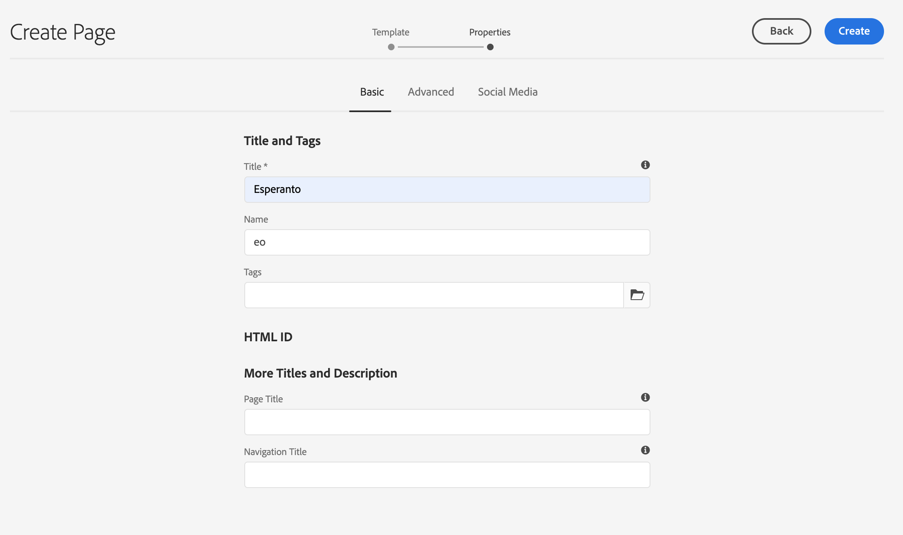

# 準備翻譯內容 {#preparing-content-for-translation}

多語言網站通常以多種語言提供一定數量的內容。 網站以一種語言編寫，然後翻譯成其他語言。 通常，多語言站點由頁面的分支組成，其中每個分支包含以不同語言表示的站點頁面。

>[!TIP]
>
>如果您是翻譯內容的新手，請參閱我們的 [網站翻譯之旅，](/help/journey-sites/translation/overview.md) 它是指通過使用功能強大的翻譯工具AEM翻譯您的AEM Sites內容的指導路AEM徑，是那些沒有翻譯經驗的人的理想選擇。

的 [WKND教程站點](/help/implementing/developing/introduction/develop-wknd-tutorial.md) 包括多個語言分支，並使用以下結構：

```text
/content
    |- wknd
        |- language-masters
            |- en
            |- de
            |- es
            |- fr
            |- it
        |- us
            |- en
            |- es
        |- ca
            |- en
            |- fr
        |- ch
            |- de
            |- fr
            |- it
        |- de
            |- de
        |- fr
            |- fr
        |- es
            |- es
        |- it
            |- it
```

您最初為其創作網站內容的語言副本是語言母版。 語言母版是翻譯成其他語言的源。

站點的每個語言分支都稱為語言副本。 語言副本的根頁（稱為語言根）標識語言副本中內容的語言。 比如說， `/content/wknd/fr` 是法文語言副本的語言根。 語言副本必須使用 [正確配置的語言根](preparation.md#creating-a-language-root) 這樣，當執行源站點的翻譯時，就會針對正確的語言。

使用以下步驟準備您的站點進行翻譯：

1. 建立語言母版的語言根。 例如，英語WKND演示站點的語言根為 `/content/wknd/language-masters/en`。 確保根據中的資訊正確配置語言根 [建立語言根](preparation.md#creating-a-language-root)。
1. 編寫您的語言母版的內容。
1. 為站點建立每種語言副本的語言根。 例如，WKND示例站點的法語語言副本為 `/content/wknd/language-masters/fr`。

在準備翻譯內容後，您可以在語言副本和相關翻譯項目中自動建立丟失的頁面。 (請參閱 [建立翻譯項目](managing-projects.md)。) 有關中的內容翻譯過程的概AEM述，請參見 [翻譯多語言網站的內容](overview.md)。

## 建立語言根 {#creating-a-language-root}

建立語言根作為標識內容語言的語言副本的根頁。 建立語言根後，可以建立包含語言副本的翻譯項目。

要建立語言根，請建立頁面並使用ISO語言代碼作為 **名稱** 屬性。 語言代碼必須採用以下格式之一：

* `<language-code>`  — 支援的語言代碼是ISO-639-1定義的雙字母代碼，例如 `en`。
* `<language-code>_<country-code>` 或 `<language-code>-<country-code>`  — 支援的國家代碼是ISO 3166定義的小寫或大寫雙字母代碼 `en_US`。 `en_us`。 `en_GB`。 `en-gb`。

您可以根據為全局站點選擇的結構使用兩種格式。  例如，WKND站點的法語語言副本的根頁具有 `fr` 的 **名稱** 屬性。 請注意 **名稱** 屬性用作儲存庫中頁節點的名稱，因此確定頁的路徑(`http://<host>:<4502>/content/wknd/language-masters/fr.html`)。

1. 導航到站點。
1. 按一下或點擊要為其建立語言副本的站點。
1. 按一下或點擊 **建立**，然後按一下或點擊 **頁面**。

   

1. 選擇頁面模板，然後按一下或點擊 **下一個**。
1. 在 **名稱** 欄位鍵入格式為 `<language-code>` 或 `<language-code>_<country-code>`，例如 `en`。 `en_US`。 `en_us`。 `en_GB`。 `en_gb`。 鍵入頁面標題。

   

1. 按一下或點擊 **建立**。 在確認對話框中，按一下或點擊 **完成** 返回到站點控制台，或 **開啟** 開啟語言副本。

## 語言根的地位 {#seeing-the-status-of-language-roots}

提AEM供 **引用** 顯示已建立的語言根的清單。


使用以下過程查看使用 [軌道選擇器。](/help/sites-cloud/authoring/getting-started/basic-handling.md#rail-selector)

1. 在站點控制台上，選擇站點的頁面，然後按一下或點擊 **引用**。

   

1. 在參照滑軌中，按一下或點擊 **語言副本**。 鐵軌顯示網站的語言副本。

## 多級語言副本 {#multiple-levels}

語言根也可以分組在節點下，例如按區域，同時仍被識別為語言副本的根。

```text
/content
    |- wknd
        |- language-masters
            |- europe
                |- de
                |- fr
                |- it
                |- es
                ]- pt
            |- americas
                |- en
                |- es
                |- fr
                |- pt
            |- asia
                |- ...
            |- africa
                |- ...
            |- oceania
                |- ...
        |- europe
        |- americas
        |- asia
        |- africa
        |- oceania            
```

>[!NOTE]
>
>只允許一個級別。 例如，以下項將不允許 `es` 要解析為語言副本的頁面：
>
>* `/content/wknd/language-masters/en`
>* `/content/wknd/language-masters/americas/central-america/es`
>
> 此 `es` 不會檢測到語言副本，因為它是2級(`americas/central-america`)遠離 `en` 的下界。

>[!TIP]
>
>在這種設定中，語言根可以具有任何頁名，而不是僅具有語言的ISO代碼。 將AEM始終先檢查路徑和名稱，但如果頁名不標識語言，AEM將檢查 `cq:language` 用於語言標識的頁面的屬性。
