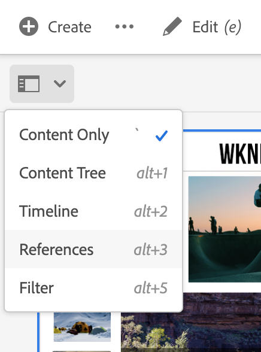

# 準備翻譯內容 {#preparing-content-for-translation}

多語言網站通常提供多種語言的內容。 網站以一種語言編寫，然後翻譯成其他語言。 一般而言，多語言網站是由頁面的分支所組成，每個分支都包含不同語言的網站頁面。

[WKND教學課程網站](/help/implementing/developing/introduction/develop-wknd-tutorial.md)包含數個語言分支，並使用下列結構：

```text
/content
    |- wknd
        |- language-masters
            |- en
            |- de
            |- es
            |- fr
            |- it
        |- us
            |- en
            |- es
        |- ca
            |- en
            |- fr
        |- ch
            |- de
            |- fr
            |- it
        |- de
            |- de
        |- fr
            |- fr
        |- es
            |- es
        |- it
            |- it
```

您最初製作網站內容的語言副本是語言主版。 語言主版是翻譯成其他語言的源。

網站的每個語言分支都稱為語言副本。 語言副本的根頁面（稱為語言根）標識語言副本中內容的語言。 例如， `/content/wknd/fr`是法文語言副本的語言根。 語言副本必須使用[正確配置的語言根](preparation.md#creating-a-language-root)，以便在執行源站點的翻譯時定位正確的語言。

使用下列步驟準備您的網站以進行翻譯：

1. 建立語言主版的語言根。 例如，英文WKND演示網站的語言根目錄為`/content/wknd/language-masters/en`。 確保根據[建立語言根](preparation.md#creating-a-language-root)中的資訊正確配置語言根。
1. 編寫您的語言主版的內容。
1. 為網站建立每個語言副本的語言根目錄。 例如，WKND示例站點的法文語言副本為`/content/wknd/language-masters/fr`。

在準備翻譯內容後，您可以自動在語言副本和相關翻譯專案中建立遺漏的頁面。 （請參閱[建立翻譯專案](managing-projects.md)。） 如需AEM中內容翻譯程式的概觀，請參閱[多語言網站的翻譯內容](overview.md)。

## 建立語言根 {#creating-a-language-root}

建立語言根作為標識內容語言的語言副本的根頁。 建立語言根後，您可以建立包含語言副本的翻譯專案。

要建立語言根，請建立一個頁，並使用ISO語言代碼作為&#x200B;**Name**&#x200B;屬性的值。 語言代碼必須為以下格式之一：

* `<language-code>`  — 支援的語言代碼是由ISO-639-1定義的雙字母代碼，例如 `en`。
* `<language-code>_<country-code>` 或 `<language-code>-<country-code>`  — 支援的國家/地區代碼是ISO 3166定義的小寫或大寫雙字母代碼， `en_US`例如 `en_us`、 `en_GB`、 `en-gb`。

您可以根據您為全域網站選擇的結構，使用任一格式。  例如，WKND站點的法文語言副本的根頁具有`fr`作為&#x200B;**Name**&#x200B;屬性。 請注意， **Name**&#x200B;屬性用作儲存庫中頁面節點的名稱，因此會決定頁面的路徑(`http://<host>:<4502>/content/wknd/language-masters/fr.html`)。

1. 導覽至網站。
1. 按一下或點選您要建立語言副本的網站。
1. 按一下或點選「**建立**」，然後按一下或點選「**頁面**」。

   

1. 選取頁面範本，然後按一下或點選&#x200B;**Next**。
1. 在&#x200B;**Name**&#x200B;欄位中，以`<language-code>`或`<language-code>_<country-code>`格式鍵入國家代碼，例如`en`、`en_US`、`en_us`、`en_GB`、`en_gb`。 輸入頁面標題。

   

1. 按一下或點選&#x200B;**建立**。 在確認對話方塊中，按一下或點選&#x200B;**Done**&#x200B;以返回Sites主控台，或點選&#x200B;**Open**&#x200B;以開啟語言副本。

## 看語言根的狀態 {#seeing-the-status-of-language-roots}

AEM提供&#x200B;**參考**&#x200B;邊欄，顯示已建立的語言根清單。


使用[邊欄選取器，使用下列程式檢視頁面的語言副本。](/help/sites-cloud/authoring/getting-started/basic-handling.md#rail-selector)

1. 在網站主控台中，選取網站的頁面，然後按一下或點選&#x200B;**References**。

   

1. 在參考邊欄中，按一下或點選「語言復本&#x200B;**」。**&#x200B;邊欄會顯示網站的語言副本。

## 多級語言副本 {#multiple-levels}

語言根也可以分組在節點下，例如按區域分組，同時仍被識別為語言副本的根。

```text
/content
    |- wknd
        |- language-masters
            |- europe
                |- de
                |- fr
                |- it
                |- es
                ]- pt
            |- americas
                |- en
                |- es
                |- fr
                |- pt
            |- asia
                |- ...
            |- africa
                |- ...
            |- oceania
                |- ...
        |- europe
        |- americas
        |- asia
        |- africa
        |- oceania            
```

>[!NOTE]
>
>只允許一個級別。 例如，下列項目不允許`es`頁面解析為語言副本：
>
>* `/content/wknd/language-masters/en`
>* `/content/wknd/language-masters/americas/central-america/es`

>
> 
此`es`語言副本將不被檢測，因為它是離`en`節點2個級別(`americas/central-america`)。

>[!TIP]
>
>在此設定中，語言根可以有任何頁面名稱，而不只是語言的ISO代碼。 AEM一律會先檢查路徑和名稱，但如果頁面名稱未識別語言，AEM會檢查頁面的`cq:language`屬性以識別語言。
