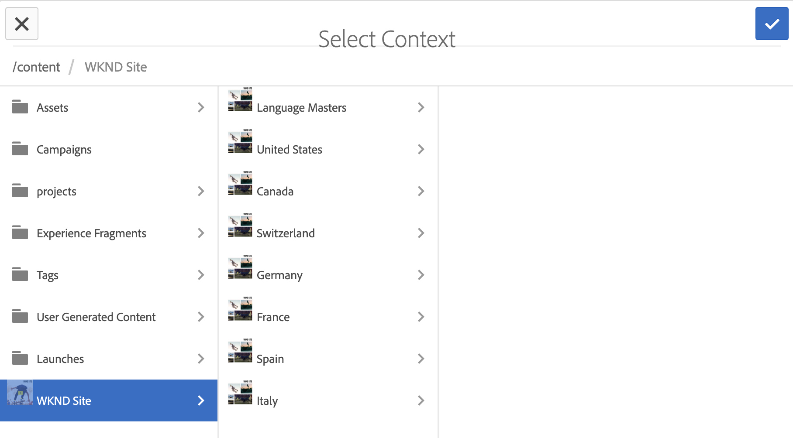
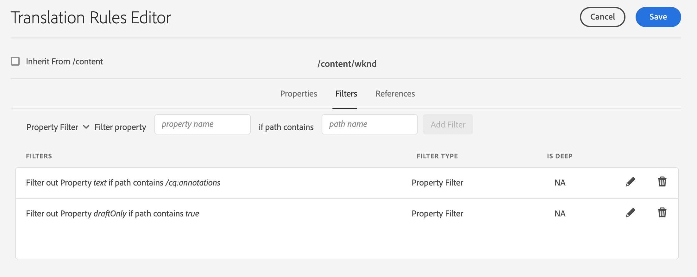
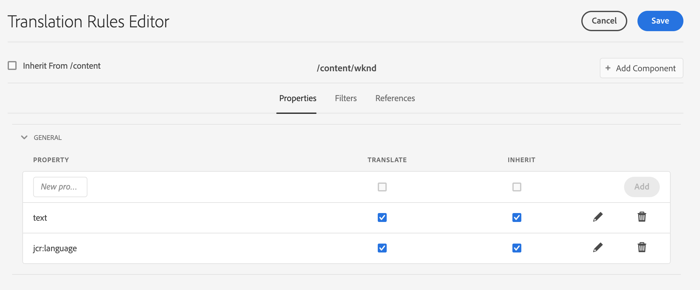

# 確定要翻譯的內容 {#identifying-content-to-translate}

翻譯規則標識要翻譯的內容，這些內容包括在翻譯項目中或從翻譯項目中排除。 當正在翻譯頁面或資產時，AEM請提取此內容，以便將其發送到翻譯服務。

>[!TIP]
>
>如果您是翻譯內容的新手，請參閱我們的 [網站翻譯之旅，](/help/journey-sites/translation/overview.md) 它是指通過使用功能強大的翻譯工具AEM翻譯您的AEM Sites內容的指導路AEM徑，是那些沒有翻譯經驗的人的理想選擇。

頁面和資產在JCR儲存庫中以節點表示。 提取的內容是節點的一個或多個屬性值。 轉換規則標識包含要提取內容的屬性。

翻譯規則以XML格式表示並儲存在以下可能的位置：

* `/libs/settings/translation/rules/translation_rules.xml`
* `/apps/settings/translation/rules/translation_rules.xml`
* `/conf/global/settings/translation/rules/translation_rules.xml`

該檔案適用於所有翻譯項目。

規則包括以下資訊：

* 應用規則的節點的路徑
   * 該規則也適用於節點的後代。
* 包含要翻譯的內容的節點屬性的名稱
   * 該屬性可以特定於特定資源類型或所有資源類型。

例如，您可以建立一個規則，該規則將作者添加到頁面上的所有文本元件中的內容進行翻譯。 該規則可識別 `/content` 和 `text` 屬性 `core/wcm/components/text/v2/text` 元件。

有 [控制台](#translation-rules-ui) 已添加的用於配置轉換規則的轉換。 UI中的定義將為您填充檔案。

有關中的內容翻譯功能的概AEM述，請參見 [翻譯多語言站點的內容](overview.md)。

>[!NOTE]
>
>支AEM持資源類型和引用屬性之間的一對一映射，以翻譯頁面上引用的內容。

## 頁面、元件和資產的規則語法 {#rule-syntax-for-pages-components-and-assets}

規則是 `node` 一個或多個子元素 `property` 元素和零個或多個子項 `node` 元素：

```xml
<node path="content path">
          <property name="property name" [translate="false"]/>
          <node resourceType="component path" >
               <property name="property name" [translate="false"]/>
          </node>
</node>
```

每個 `node` 元素具有以下特徵：

* 的 `path` 屬性包含規則所應用的分支的根節點的路徑。
* 子 `property` 元素標識要轉換的所有資源類型的節點屬性：
   * 的 `name` 屬性包含屬性名稱。
   * 可選 `translate` 屬性等於 `false` 的子菜單。 預設情況下，值為 `true`。 此屬性在覆蓋以前的規則時非常有用。
* 子 `node` 元素標識要轉換特定資源類型的節點屬性：
   * 的 `resourceType` 屬性包含解析為實現資源類型的元件的路徑。
   * 子 `property` 元素標識要轉換的節點屬性。 以與子節點相同的方式使用此節點 `property` 節點規則的元素。

以下示例規則將導致所有 `text` 要翻譯的屬性 `/content` 的下界。 該規則對於儲存內容的任何元件都有效 `text` 屬性，如text元件。

```xml
<node path="/content">
          <property name="text"/>
</node>
```

下面的示例翻譯所有內容 `text` 屬性，還轉換影像元件的其他屬性。 如果其他元件具有同名屬性，則規則不適用於這些屬性。

```xml
<node path="/content">
      <property name="text"/>
      <node resourceType="core/wcm/components/image/v2/image">
         <property name="image/alt"/>
         <property name="image/jcr:description"/>
         <property name="image/jcr:title"/>
      </node>
</node>
```

## 用於從頁面中提取資產的規則語法  {#rule-syntax-for-extracting-assets-from-pages}

使用以下規則語法包括嵌入元件或從元件引用的資產：

```xml
<assetNode resourceType="path to component" assetReferenceAttribute="property that stores asset"/>
```

每個 `assetNode` 元素具有以下特徵：

* 一 `resourceType` 與解析到元件的路徑相等的屬性
* 一 `assetReferenceAttribute` 與儲存資產二進位檔案（對於嵌入資產）的屬性的名稱或引用資產的路徑相等的屬性

下面的示例從影像元件中提取影像：

```xml
<assetNode resourceType="core/wcm/components/image/v2/image" assetReferenceAttribute="fileReference"/>
```

## 覆蓋規則 {#overriding-rules}

的 `translation_rules.xml` 檔案由 `nodelist` 元素具有多個子項 `node` 元素。 從AEM上到下讀取節點清單。 當多個規則針對同一節點時，將使用檔案中較低的規則。 例如，以下規則導致 `text` 要轉換的屬性， `/content/mysite/en` 頁的分支：

```xml
<nodelist>
     <node path="/content”>
           <property name="text" />
     </node>
     <node path=“/content/mysite/en”>
          <property name=“text” translate=“false" />
     </node>
<nodelist>
```

## 篩選屬性 {#filtering-properties}

可以使用 `filter` 的子菜單。

例如，以下規則導致 `text` 要轉換的屬性，但具有該屬性的節點除外 `draft` 設定為 `true`。

```xml
<nodelist>
    <node path="/content”>
     <filter>
   <node containsProperty="draft" propertyValue="true" />
     </filter>
        <property name="text" />
    </node>
<nodelist>
```

## 翻譯規則UI {#translation-rules-ui}

還有一個控制台可用於配置轉換規則。

要訪問它：

1. 導航到 **工具** 然後 **常規**。

1. 選擇 **翻譯配置**。

在翻譯規則UI中，您可以：

1. **添加上下文**，允許您添加路徑。

   

1. 使用路徑瀏覽器選擇所需的上下文，點擊或按一下 **確認** 按鈕。

   

1. 然後，您需要選擇上下文，然後按一下 **編輯**。 這將開啟翻譯規則編輯器。

   

您可以通過UI更改以下四個屬性：

* `isDeep`
* `inherit`
* `translate`
* `updateDestinationLanguage`

### 深 {#isdeep}

**`isDeep`**  適用於節點篩選器，預設為true。 它將檢查節點（或其祖先）是否包含篩選器中具有指定屬性值的屬性。 如果為false，則只檢查當前節點。

例如，子節點被添加到翻譯作業中，即使父節點具有該屬性 `draftOnly` 設定為true以標籤草稿內容。 這裡 `isDeep` 開始播放並檢查父節點是否具有屬性 `draftOnly` 並排除這些子節點。

在編輯器中，可以選中/取消選中 **深** 的 **篩選器** 頁籤。



以下是生成的XML的示例 **深** 在UI中未選中：

```xml
 <filter>
    <node containsProperty="draftOnly" isDeep="false" propertyValue="true"/>
</filter>
```

### 繼承 {#inherit}

**`inherit`** 適用於屬性。 預設情況下，每個屬性都是繼承的，但如果希望某些屬性不由子代繼承，則可以將此屬性標籤為false，以便它僅應用於該特定節點。

在UI中，您可以選中/取消選中 **繼承** 的 **屬性** 頁籤。

### 翻譯 {#translate}

**`translate`** 僅用於指定是否轉換屬性。

在UI中，您可以選中/取消選中 **翻譯** 的 **屬性** 頁籤。

### updateDestinationLanguage {#updatedestinationlanguage}

**`updateDestinationLanguage`** 用於沒有文本但語言代碼的屬性，例如 `jcr:language`。 用戶不是在翻譯文本，而是在從源到目標的語言區域設定。 這些屬性不會發送到翻譯。

在UI中，您可以選中/取消選中 **翻譯** 的 **屬性** 頁籤，修改此值，但是對於將語言代碼作為值的特定屬性。

幫助澄清 `updateDestinationLanguage` 和 `translate`，下面是只有兩個規則的上下文的簡單示例：



xml的結果將如下所示：

```xml
<property inherit="true" name="text" translate="true" updateDestinationLanguage="false"/>
<property inherit="true" name="jcr:language" translate="false" updateDestinationLanguage="true"/>
```

## 手動編輯規則檔案 {#editing-the-rules-file-manually}

的 `translation_rules.xml` 隨之安裝的文AEM件包含一組預設轉換規則。 您可以編輯檔案以支援翻譯項目的要求。 例如，您可以添加規則，以便翻譯自定義元件的內容。

如果編輯 `translation_rules.xml` 檔案，將備份副本保留在內容包中。 重新安AEM裝某些軟體包可以替換 `translation_rules.xml` 檔案。 要在這種情況下恢復規則，可以安裝包含備份副本的包。

>[!NOTE]
>
>建立內容包後，每次編輯檔案時都重新生成包。

## 翻譯規則檔案示例 {#example-translation-rules-file}

```xml
<?xml version="1.0" encoding="UTF-8"?><nodelist>
  <node path="/content">
    <property name="addLabel"/>
    <property name="allowedResponses"/>
    <property name="alt"/>
    <property name="attachFileLabel"/>
    <property name="benefits"/>
    <property name="buttonLabel"/>
    <property name="chartAlt"/>
    <property name="confirmationMessageToggle"/>
    <property name="confirmationMessageUntoggle"/>
    <property name="constraintMessage"/>
    <property name="contentLabel"/>
    <property name="denyText"/>
    <property name="detailDescription"/>
    <property name="emptyText"/>
    <property name="helpMessage"/>
    <property name="image/alt"/>
    <property name="image/jcr:description"/>
    <property name="image/jcr:title"/>
    <property name="jcr:description"/>
    <property name="jcr:title"/>
    <property name="heading"/>
    <property name="label"/>
    <property name="main"/>
    <property name="listLabel"/>
    <property name="moreText"/>
    <property name="pageTitle"/>
    <property name="placeholder"/>
    <property name="requiredMessage"/>
    <property name="resetTitle"/>
    <property name="subjectLabel"/>
    <property name="subtitle"/>
    <property name="tableData"/>
    <property name="text"/>
    <property name="title"/>
    <property name="navTitle"/>
    <property name="titleDivContent"/>
    <property name="toggleLabel"/>
    <property name="transitionLabel"/>
    <property name="untoggleLabel"/>
    <property name="name"/>
    <property name="occupations"/>
    <property name="greetingLabel"/>
    <property name="signInLabel"/>
    <property name="signOutLabel"/>
    <property name="pretitle"/>
    <property name="cq:panelTitle"/>
    <property name="actionText"/>
    <property name="cq:language" updateDestinationLanguage="true"/>
    <node pathContains="/cq:annotations">
      <property name="text" translate="false"/>
    </node>
    <node path="/content/wknd"/>
  </node>
  <node path="/content/forms">
    <property name="text" translate="false"/>
  </node>
  <node path="/content/dam">
    <property name="dc:description"/>
    <property name="dc:rights"/>
    <property name="dc:subject"/>
    <property name="dc:title"/>
    <property name="defaultContent"/>
    <property name="jcr:description"/>
    <property name="jcr:title"/>
    <property name="pdf:Title"/>
    <property name="xmpRights:UsageTerms"/>
    <property name="main"/>
    <property name="adventureActivity"/>
    <property name="adventureDescription"/>
    <property name="adventureDifficulty"/>
    <property name="adventureGearList"/>
    <property name="adventureGroupSize"/>
    <property name="adventureItinerary"/>
    <property name="adventurePrice"/>
    <property name="adventureTitle"/>
    <property name="adventureTripLength"/>
    <property name="adventureType"/>
    <node pathContains="/jcr:content/metadata/predictedTags">
      <property name="name"/>
    </node>
  </node>
  <assetNode assetReferenceAttribute="fragmentPath" resourceType="cq/experience-fragments/editor/components/experiencefragment"/>
  <assetNode assetReferenceAttribute="fragmentVariationPath" resourceType="core/wcm/components/experiencefragment/v1/experiencefragment"/>
  <assetNode assetReferenceAttribute="fileReference" resourceType="dam/cfm/components/contentfragment"/>
  <assetNode resourceType="docs/components/download"/>
  <assetNode resourceType="docs/components/image"/>
  <assetNode assetReferenceAttribute="fileReference" resourceType="foundation/components/image"/>
  <assetNode assetReferenceAttribute="asset" resourceType="foundation/components/video"/>
  <assetNode assetReferenceAttribute="fileReference" resourceType="foundation/components/download"/>
  <assetNode assetReferenceAttribute="fileReference" resourceType="core/wcm/components/download/v1/download"/>
  <assetNode assetReferenceAttribute="fileReference" resourceType="wcm/foundation/components/image"/>
  <assetNode assetReferenceAttribute="fragmentPath" resourceType="core/wcm/components/contentfragment/v1/contentfragment"/>
  <assetNode assetReferenceAttribute="fileReference" resourceType="core/wcm/components/image/v2/image"/>
</nodelist>
```
