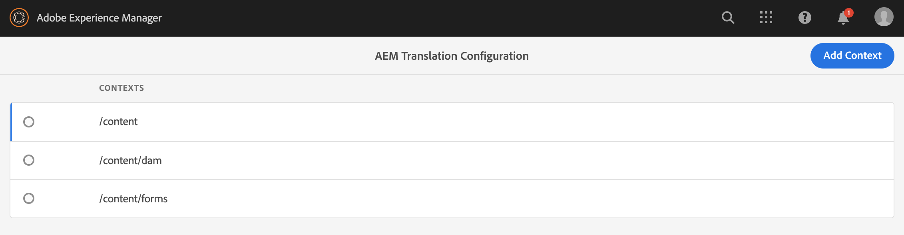

# 識別要翻譯的內容{#identifying-content-to-translate}

翻譯規則可識別翻譯專案中包含或排除的頁面、元件和資產的翻譯內容。 當翻譯頁面或資產時，AEM請擷取此內容，以便將其傳送至翻譯服務。

頁面和資產在JCR儲存庫中以節點表示。 提取的內容是節點的一個或多個屬性值。 翻譯規則可識別包含要提取內容的屬性。

翻譯規則以XML格式表示，並儲存在以下可能的位置：

* `/libs/settings/translation/rules/translation_rules.xml`
* `/apps/settings/translation/rules/translation_rules.xml`
* `/conf/global/settings/translation/rules/translation_rules.xml`

該檔案適用於所有翻譯項目。

規則包含下列資訊：

* 應用規則的節點路徑
   * 該規則也適用於節點的後代。
* 包含要翻譯的內容的節點屬性的名稱
   * 屬性可以特定於特定資源類型或所有資源類型。

例如，您可以建立規則，將作者新增的內容轉譯至頁面上的所有文字元件。 該規則可標識`/content`節點和`core/wcm/components/text/v2/text`元件的`text`屬性。

已添加[控制台](#translation-rules-ui)用於配置轉換規則。 UI中的定義將為您填入檔案。

有關中的內容翻譯功能的概AEM述，請參閱[多語言站點的翻譯內容](overview.md)。

>[!NOTE]
>
>支AEM持資源類型和引用屬性之間的一對一映射，以轉換頁面上的引用內容。

## 頁面、元件和資產的規則語法{#rule-syntax-for-pages-components-and-assets}

規則是`node`元素，包含一個或多個子`property`元素，以及零個或多個子`node`元素：

```xml
<node path="content path">
          <property name="property name" [translate="false"]/>
          <node resourceType="component path" >
               <property name="property name" [translate="false"]/>
          </node>
</node>
```

這些`node`元素中的每個都具有以下特徵：

* `path`屬性包含規則所應用分支的根節點路徑。
* 子`property`元素標識要轉換所有資源類型的節點屬性：
   * `name`屬性包含屬性名稱。
   * 如果屬性未翻譯，則可選的`translate`屬性等於`false`。 預設值為`true`。 此屬性在覆寫先前的規則時很有用。
* 子`node`元素標識要針對特定資源類型轉換的節點屬性：
   * `resourceType`屬性包含解析到實現資源類型的元件的路徑。
   * 子`property`元素標識要轉換的節點屬性。 使用此節點的方式與節點規則的子`property`元素相同。

下列範例規則會針對`/content`節點下的所有頁面轉換所有`text`屬性的內容。 此規則對於將內容儲存在`text`屬性中的任何元件（例如文字元件）都有效。

```xml
<node path="/content">
          <property name="text"/>
</node>
```

以下示例將轉換所有`text`屬性的內容，還將轉換影像元件的其他屬性。 如果其他元件具有相同名稱的屬性，則規則不適用於這些元件。

```xml
<node path="/content">
      <property name="text"/>
      <node resourceType="core/wcm/components/image/v2/image">
         <property name="image/alt"/>
         <property name="image/jcr:description"/>
         <property name="image/jcr:title"/>
      </node>
</node>
```

## 從頁面{#rule-syntax-for-extracting-assets-from-pages}擷取資產的規則語法

使用下列規則語法，以包含內嵌在元件中或從元件參考的資產：

```xml
<assetNode resourceType="path to component" assetReferenceAttribute="property that stores asset"/>
```

每個`assetNode`元素具有以下特性：

* 一個`resourceType`屬性，等於解析到元件的路徑
* 一個`assetReferenceAttribute`屬性，等於儲存資產二進位檔（針對內嵌資產）或參考資產路徑之屬性的名稱

下列範例從影像元件擷取影像：

```xml
<assetNode resourceType="core/wcm/components/image/v2/image" assetReferenceAttribute="fileReference"/>
```

## 覆蓋規則{#overriding-rules}

`translation_rules.xml`檔案由`nodelist`元素及數個子`node`元素組成。 AEM從上到下讀取節點清單。 當多個規則指向相同節點時，會使用檔案中較低的規則。 例如，下列規則會導致翻譯`text`屬性中的所有內容，但頁面的`/content/mysite/en`分支除外：

```xml
<nodelist>
     <node path="/content”>
           <property name="text" />
     </node>
     <node path=“/content/mysite/en”>
          <property name=“text” translate=“false" />
     </node>
<nodelist>
```

## 篩選屬性{#filtering-properties}

您可以使用`filter`元素來篩選具有特定屬性的節點。

例如，下列規則會導致翻譯`text`屬性中的所有內容，但屬性`draft`設為`true`的節點除外。

```xml
<nodelist>
    <node path="/content”>
     <filter>
   <node containsProperty="draft" propertyValue="true" />
     </filter>
        <property name="text" />
    </node>
<nodelist>
```

## 翻譯規則UI {#translation-rules-ui}

控制台也可用於配置翻譯規則。

若要存取：

1. 導覽至&#x200B;**工具**，然後導覽至&#x200B;**一般**。

1. 選擇&#x200B;**翻譯配置**。

在翻譯規則UI中，您可以：

1. **新增內容**，可讓您新增路徑。

   

1. 使用路徑瀏覽器選擇所需的上下文，點選或按一下&#x200B;**確認**&#x200B;按鈕保存。

   

1. 然後，您需要選取您的內容，然後按一下「編輯」**。**&#x200B;這將開啟翻譯規則編輯器。

   

您可透過UI變更4個屬性：

* `isDeep`
* `inherit`
* `translate`
* `updateDestinationLanguage`

### isDeep {#isdeep}

**`isDeep`**  適用於節點篩選器，且預設為true。它會檢查節點（或其祖先）是否包含篩選器中具有指定屬性值的屬性。 如果為false，則只會檢查目前節點。

例如，即使父節點具有設定為true的屬性，為了標籤草稿內容，子節點也會添加到轉譯作業。 `draftOnly`此處`isDeep`將開始運行，並檢查父節點是否具有`draftOnly`屬性，並排除這些子節點。

在編輯器中，可以在&#x200B;**Filters**&#x200B;頁籤中選中／取消選中&#x200B;**Is Deep**。


以下是在UI中取消勾選&#x200B;**Is Deep**&#x200B;時產生的XML範例：

```xml
 <filter>
    <node containsProperty="draftOnly" isDeep="false" propertyValue="true"/>
</filter>
```

### 繼承 {#inherit}

**`inherit`** 適用於屬性。預設情況下，每個屬性都會繼承，但如果您希望某些屬性不由子代繼承，則可以將此屬性標籤為false，以便僅將其應用於該特定節點。

在UI中，您可以在&#x200B;**屬性**&#x200B;標籤中選中／取消選中&#x200B;**繼承**。

### 翻譯{#translate}

**`translate`** 僅用於指定是否翻譯屬性。

在UI中，您可以在&#x200B;**屬性**&#x200B;標籤中選中／取消選中&#x200B;**翻譯**。

### updateDestinationLanguage {#updatedestinationlanguage}

**`updateDestinationLanguage`** 用於沒有文本但沒有語言代碼的屬性，例如 `jcr:language`。用戶不是在翻譯文本，而是在從源到目標的語言區域設定。 這些屬性不會發送用於翻譯。

在UI中，您可以勾選／取消勾選&#x200B;**屬性**&#x200B;標籤中的&#x200B;**翻譯**，以修改此值，但是對於具有語言代碼作為值的特定屬性。

為協助釐清`updateDestinationLanguage`和`translate`之間的差異，以下是僅包含兩個規則之上下文的簡單範例：


xml的結果如下所示：

```xml
<property inherit="true" name="text" translate="true" updateDestinationLanguage="false"/>
<property inherit="true" name="jcr:language" translate="false" updateDestinationLanguage="true"/>
```

## 手動編輯規則檔案{#editing-the-rules-file-manually}

隨安裝的`translation_rules.xml`檔案包含一AEM組預設的轉換規則。 您可以編輯檔案以支援翻譯項目的要求。 例如，您可以新增規則，以便翻譯自訂元件的內容。

如果編輯`translation_rules.xml`檔案，請將備份副本保留在內容包中。 重新安AEM裝某些軟體包可以用原始檔案替換當前`translation_rules.xml`檔案。 要在這種情況下恢復規則，可以安裝包含備份副本的軟體包。

>[!NOTE]
>
>建立內容套件後，請在每次編輯檔案時重建該套件。

## 翻譯規則檔案{#example-translation-rules-file}示例

```xml
<?xml version="1.0" encoding="UTF-8"?><nodelist>
  <node path="/content">
    <property name="addLabel"/>
    <property name="allowedResponses"/>
    <property name="alt"/>
    <property name="attachFileLabel"/>
    <property name="benefits"/>
    <property name="buttonLabel"/>
    <property name="chartAlt"/>
    <property name="confirmationMessageToggle"/>
    <property name="confirmationMessageUntoggle"/>
    <property name="constraintMessage"/>
    <property name="contentLabel"/>
    <property name="denyText"/>
    <property name="detailDescription"/>
    <property name="emptyText"/>
    <property name="helpMessage"/>
    <property name="image/alt"/>
    <property name="image/jcr:description"/>
    <property name="image/jcr:title"/>
    <property name="jcr:description"/>
    <property name="jcr:title"/>
    <property name="heading"/>
    <property name="label"/>
    <property name="main"/>
    <property name="listLabel"/>
    <property name="moreText"/>
    <property name="pageTitle"/>
    <property name="placeholder"/>
    <property name="requiredMessage"/>
    <property name="resetTitle"/>
    <property name="subjectLabel"/>
    <property name="subtitle"/>
    <property name="tableData"/>
    <property name="text"/>
    <property name="title"/>
    <property name="navTitle"/>
    <property name="titleDivContent"/>
    <property name="toggleLabel"/>
    <property name="transitionLabel"/>
    <property name="untoggleLabel"/>
    <property name="name"/>
    <property name="occupations"/>
    <property name="greetingLabel"/>
    <property name="signInLabel"/>
    <property name="signOutLabel"/>
    <property name="pretitle"/>
    <property name="cq:panelTitle"/>
    <property name="actionText"/>
    <property name="cq:language" updateDestinationLanguage="true"/>
    <node pathContains="/cq:annotations">
      <property name="text" translate="false"/>
    </node>
    <node path="/content/wknd"/>
  </node>
  <node path="/content/forms">
    <property name="text" translate="false"/>
  </node>
  <node path="/content/dam">
    <property name="dc:description"/>
    <property name="dc:rights"/>
    <property name="dc:subject"/>
    <property name="dc:title"/>
    <property name="defaultContent"/>
    <property name="jcr:description"/>
    <property name="jcr:title"/>
    <property name="pdf:Title"/>
    <property name="xmpRights:UsageTerms"/>
    <property name="main"/>
    <property name="adventureActivity"/>
    <property name="adventureDescription"/>
    <property name="adventureDifficulty"/>
    <property name="adventureGearList"/>
    <property name="adventureGroupSize"/>
    <property name="adventureItinerary"/>
    <property name="adventurePrice"/>
    <property name="adventureTitle"/>
    <property name="adventureTripLength"/>
    <property name="adventureType"/>
    <node pathContains="/jcr:content/metadata/predictedTags">
      <property name="name"/>
    </node>
  </node>
  <assetNode assetReferenceAttribute="fragmentPath" resourceType="cq/experience-fragments/editor/components/experiencefragment"/>
  <assetNode assetReferenceAttribute="fragmentVariationPath" resourceType="core/wcm/components/experiencefragment/v1/experiencefragment"/>
  <assetNode assetReferenceAttribute="fileReference" resourceType="dam/cfm/components/contentfragment"/>
  <assetNode resourceType="docs/components/download"/>
  <assetNode resourceType="docs/components/image"/>
  <assetNode assetReferenceAttribute="fileReference" resourceType="foundation/components/image"/>
  <assetNode assetReferenceAttribute="asset" resourceType="foundation/components/video"/>
  <assetNode assetReferenceAttribute="fileReference" resourceType="foundation/components/download"/>
  <assetNode assetReferenceAttribute="fileReference" resourceType="core/wcm/components/download/v1/download"/>
  <assetNode assetReferenceAttribute="fileReference" resourceType="wcm/foundation/components/image"/>
  <assetNode assetReferenceAttribute="fragmentPath" resourceType="core/wcm/components/contentfragment/v1/contentfragment"/>
  <assetNode assetReferenceAttribute="fileReference" resourceType="core/wcm/components/image/v2/image"/>
</nodelist>
```
