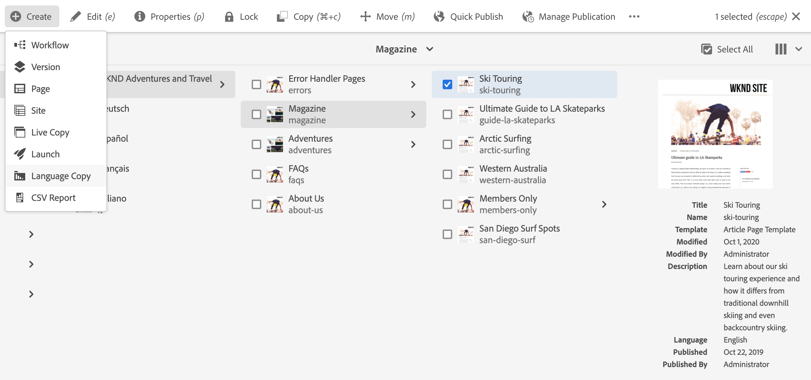
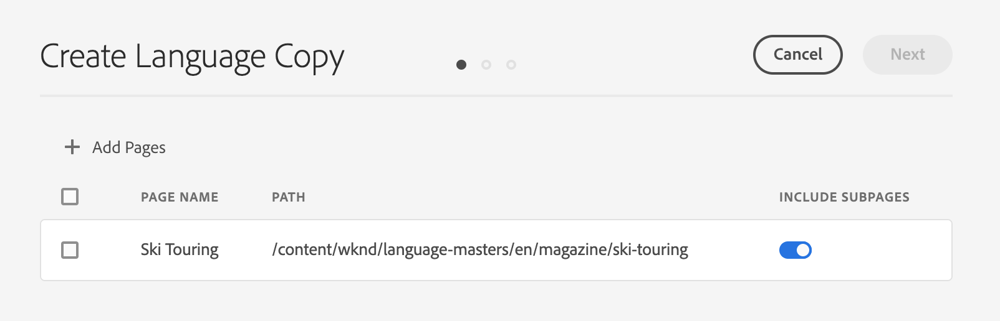
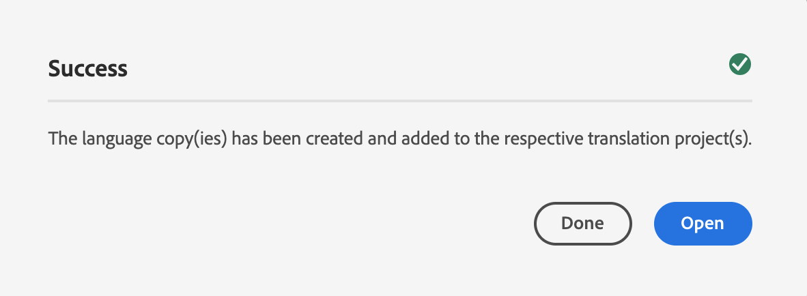

# 語言副本嚮導 {#language-copy-wizard}

「語言復本精靈」是建立和檢測多語言內容結構的引導式體驗。 該嚮導使建立語言副本變得簡單而快速。

>[!NOTE]
>
>用戶必須是`project-administrators`組的成員，才能建立站點的語言副本。

要訪問嚮導：

1. 在網站主控台中，選取頁面，點選或按一下「**建立**」，然後選取「語言副本&#x200B;**」。**

   

1. 精靈會開啟至&#x200B;**選取來源**&#x200B;步驟，讓您新增/移除頁面。 您也可以選擇包含或排除子頁面。 選取您要包含的頁面，然後點選或按一下「**Next**」。

   

1. 嚮導的&#x200B;**配置**&#x200B;步驟允許您添加/刪除語言並選擇翻譯方法。 點選或按一下「**Next**」。

   

   >[!NOTE]
   >
   >依預設，只有一個翻譯設定。 若要選取其他設定，您必須先設定雲端設定。 請參閱[配置翻譯整合框架](integration-framework.md)。

1. 在嚮導的&#x200B;**翻譯**&#x200B;步驟中，您可以選擇僅建立結構、建立新翻譯項目或添加到現有翻譯項目。

   >[!NOTE]
   >
   >如果您在上一步驟中選取多種語言，則會建立多個翻譯專案。

   

1. **Create**&#x200B;按鈕結束嚮導。 點選或按一下&#x200B;**Done**&#x200B;以關閉精靈，或點選&#x200B;**Open**&#x200B;以檢視產生的翻譯專案。

   
