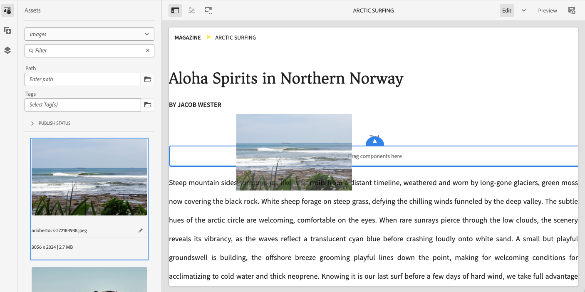

# 在AEM中創作內容的方法 {#authoring-methods}

瞭解您可以在AEM中編寫內容的不同方式、其差異，以及您何時可以使用其中一種工具取代另一種工具。

## AEM編寫彈性 {#authoring-flexibility}

AEMas a Cloud Service提供數種不同的編輯器，可編輯不同型別的內容並支援不同的編寫使用案例。

* [使用頁面編輯器進行AEM式製作](#page-editor)  — 頁面編輯器是在AEM中編寫內容的傳統編輯器，已嘗試並在數千個網站上受到信任。
* [使用通用編輯器進行AEM式製作](#universal-editor)  — 通用編輯器是現代化的UI，可讓您以不受內容限制的方式編寫AEM內容，可用於利用Edge Delivery Services的AEM專案。
* [檔案式製作](#document-based)  — 如果您使用Edge Delivery服務，您可以選擇在AEM主控台之外將內容製作為傳統檔案，例如Microsoft Word或Google Docs。
* [AEM內容片段編輯器](#cf-editor)  — 這是建立Headless內容的首選編輯器。

由於AEM的整合與可擴充性質，這些方法可依據您的專案需求專門使用或相互組合。

如果您不確定哪些撰寫選項可供您使用，或您想要探索新的內容撰寫選項，請洽詢您的系統管理員或專案經理。

## 使用頁面編輯器進行AEM式製作 {#page-editor}

這是在AEM中編寫內容的傳統編輯器，在數千個網站上受到成千上萬人的嘗試和信任。

AEM頁面編輯器提供整合式環境，讓您可使用「所見即所得」(WYSIWYG)介面創作內容。 拖放預先定義的元件，就地建置頁面及編輯內容。

若要瞭解有關AEM頁面編輯器的詳細資訊，請參閱檔案 [AEM頁面編輯器。](/help/sites-cloud/authoring/page-editor/introduction.md)

## 使用通用編輯器進行AEM式製作 {#universal-editor}

Universal Editor是現代化的UI，可讓您以不受內容限制的方式創作AEM內容，並且是利用Edge Delivery Services的AEM專案的第一個選擇。

通用編輯器可透過AEM內的Sites主控台存取，但提供強大且與內容無關的靈活性，不僅可編寫您的AEM內容，還可編寫正確儀表化的外部內容。

若要深入瞭解通用編輯器，請參閱本檔案 [使用通用編輯器製作內容。](/help/sites-cloud/authoring/universal-editor/authoring.md)

## 以文件為主的製作  {#document-based}

Microsoft Google如果您使用Edge Delivery Services，您可以選擇在 [AEM **網站** 主控台。](/help/sites-cloud/authoring/sites-console/introduction.md)

透過檔案式撰寫，作者可以使用他們已有的工具，並且仍可受益於AEMEdge Delivery Services的速度和效能來發佈其內容。 檔案式撰寫不需要使用AEM主控台。

若要深入瞭解檔案式撰寫，請參閱檔案 [製作與發佈內容。](/help/edge/docs/authoring.md)

## AEM內容片段編輯器 {#cf-editor}

AEM內容片段編輯器是建立Headless內容的首選編輯器。

AEM內容片段編輯器提供用於建立和管理結構化內容的清晰介面，適用於Headless傳送。

若要瞭解有關AEM內容片段編輯器的詳細資訊，請參閱檔案 [管理內容片段](/help/sites-cloud/administering/content-fragments/managing.md) 和 [製作內容片段](/help/sites-cloud/administering/content-fragments/managing.md).

>[!NOTE]
>
>此 *新* 針對AEMas a Cloud Service在本機開發時，無法使用本節醒目提示的編輯器。
>
>此 [*原始* 內容片段編輯器](/help/assets/content-fragments/content-fragments-variations.md) 也可供使用。
