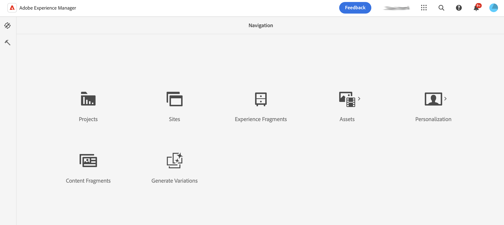

# 基本處理 {#basic-handling}

本檔案旨在概述使用AEM製作環境時的基本處理方式。

>[!TIP]
>
>在整個AEM環境中都可以使用鍵盤快速鍵。 尤其是當 [使用網站主控台](/help/sites-cloud/authoring/sites-console/keyboard-shortcuts.md) 和 [頁面編輯器](/help/sites-cloud/authoring/page-editor/keyboard-shortcuts.md).

{{edge-delivery-authoring}}

## 觸控式UI {#a-touch-enabled-ui}

AEM使用者介面已啟用觸控功能。 觸控式介面可讓您使用觸控功能，透過點選、點選並按住及輕掃之類的手勢與軟體互動。 由於AEM UI支援觸控功能，因此您可以在手機或平板電腦等觸控裝置上使用觸控手勢。 不過，您也可以使用傳統案頭裝置上的滑鼠動作，靈活選擇內容撰寫方式。

## 首要步驟 {#first-steps}

登入後立即到達 [導覽面板](#navigation-panel). 選取其中一個選項會開啟個別主控台。

為了更清楚瞭解AEM的基本用法，本檔案根據 **網站** 主控台。 選擇於 **網站** 以開始使用。

## 產品導覽 {#product-navigation}

每當使用者首次存取主控台時，就會啟動產品導覽教學課程。 請花上一分鐘時間選取，以取得AEM基本處理的良好概觀。

選取 **下一個** 以進入概覽的下一頁。 選取 **關閉** 或在「概述」對話方塊外部選取以關閉。

除非您檢視所有投影片或核取選項，否則概觀將會在您下次存取主控台時重新啟動 **不要再顯示**.

## 全域導覽 {#global-navigation}

您可以使用全域導覽面板在主控台之間導覽。 當您選取「 」時，這會以全熒幕下拉式清單的形式觸發 **Adobe Experience Manager** 畫面左上角的連結。

您可以按一下或點選以關閉全域導覽面板 **關閉** 以返回您之前的位置。

全域導覽有兩個面板，由畫面左側的圖示表示：

* **[導覽](#navigation-panel)**  — 當您登入AEM時，以指南針和預設面板表示
* **[工具](#tools-panel)**  — 以槌子表示

這些面板上可用的選項說明如下。

### 導覽面板 {#navigation-panel}

此 **導覽** 面板：

當您瀏覽控制檯和內容時，瀏覽器索引標籤的標題將會更新以反映您的位置。

在「導覽」中，可用的主控台有：

| 主控台 | 用途 |
|---|---|
| 專案 | 「專案」主控台可讓您直接存取專案。 [專案是虛擬儀表板](/help/sites-cloud/authoring/projects/overview.md) 可用來建立團隊的資訊。 然後，您可以授予該團隊存取資源、工作流程和任務的許可權，從而讓人們朝著共同目標努力。 |
| Sites | [Sites主控台](/help/sites-cloud/authoring/sites-console/introduction.md) 可讓您建立、檢視及管理在您的AEM執行個體上執行的網站。 透過此主控台，您可以建立、編輯、複製、移動和刪除頁面、啟動工作流程以及發佈頁面。 |
| 體驗片段 | 一個 [體驗片段](/help/sites-cloud/authoring/fragments/content-fragments.md) 是獨立的體驗，可以跨管道重複使用，也可以具有變數，省去重複複製和貼上體驗或體驗片段的麻煩。 |
| Assets | 「資產」主控台可讓您匯入及管理 [數位資產，例如影像、影片、檔案和音訊檔案](/help/assets/overview.md). 這些資產隨後便可由同一AEM例項上執行的任何網站使用。 您也可以建立和管理 [內容片段](/help/assets/content-fragments/content-fragments.md) 從「資產」主控台。 |
| 個人化 | 此主控台提供工具的架構，適用於 [編寫鎖定內容及呈現個人化體驗](/help/sites-cloud/authoring/personalization/overview.md). |
| 內容片段 | [內容片段](/help/sites-cloud/administering/content-fragments/overview.md) 可讓您設計、建立、策劃和發佈不受頁面影響的內容。 它們可讓您準備結構化內容，以準備用於多個位置/多個管道，並適用於頁面製作和headless傳送。 |

## 「工具」面板 {#tools-panel}

在 **工具** 面板有一個側面板，其中包含一系列類別，這些類別將類似的控制檯群組在一起。 此 **工具** 主控台可讓您存取多種特殊工具和控制檯，協助您管理網站、數位資產和內容存放庫的其他方面。 <!--The [Tools consoles](/help/sites-administering/tools-consoles.md) provide access to several specialized tools and consoles that help you administer your websites, digital assets, and other aspects of your content repository.-->

## 標頭 {#the-header}

標題一律會顯示在畫面頂端。 雖然無論您在系統中的何處，標題中的大部分選項都保持不變，但有些選項是上下文特定的。

* [全域導覽](#global-navigation)  — 選取 **Adobe Experience Manager** 連結可在主控台之間導覽。

  

* 意見回饋

  

* 您的IMS組織 — 視需要選取以變更。

* [解決方案](https://www.adobe.com/experience-cloud.html)  — 選取此項以存取您的其他Adobe解決方案。

  

* [搜尋](/help/sites-cloud/authoring/search.md)  — 您也可以使用 [快速鍵](/help/sites-cloud/authoring/sites-console/keyboard-shortcuts.md) `/` （正斜線）從任何主控台叫用搜尋。

  

* [說明](#accessing-help)

  

* [通知](/help/sites-cloud/authoring/inbox.md)  — 此圖示會標籤目前指派的未完成通知數目。

  

* [使用者屬性](/help/sites-cloud/authoring/account-environment.md)  — 選取此項以變更您的使用者設定。

  

## 存取說明 {#accessing-help}

有許多可用的說明資源，以及存取這些資源的一些方法。

* **工具列**  — 視您的位置而定， **說明** 圖示會開啟適當的資源：

  

* **主控台**  — 第一次瀏覽系統時， [一連串投影片介紹AEM導覽](#product-navigation).

  

* **頁面編輯器**  — 第一次編輯頁面時，系統會以一系列幻燈片介紹頁面編輯器。

  

   * 瀏覽此概觀，如同操作 [產品導覽概觀](#product-navigation) 首次存取任何主控台時。
   * 從 [**頁面資訊** 功能表您可以選取 **說明**](#accessing-help) 以隨時再次顯示。

* **工具主控台**  — 從 **工具** 主控台您也可以存取外部 **資源**：

   * **檔案**  — 檢視網站體驗管理檔案
   * **開發人員資源**  — 開發人員資源和下載

>[!TIP]
>
>您可以隨時使用快速鍵來存取可用快速鍵的概觀 `?` （問號）。
>
>如需所有鍵盤快速鍵的概觀，請參閱下列檔案：
>
>* [用於編輯頁面的鍵盤快速鍵](/help/sites-cloud/authoring/page-editor/keyboard-shortcuts.md)
>* [主控台的鍵盤快速鍵](/help/sites-cloud/authoring/sites-console/keyboard-shortcuts.md)
