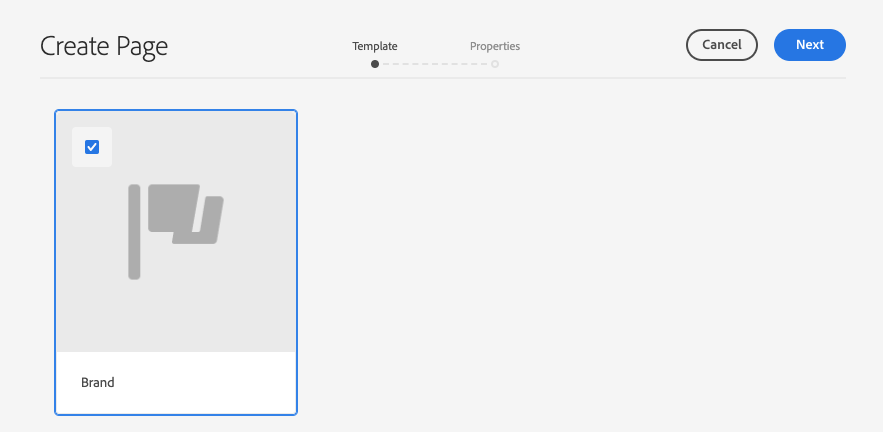
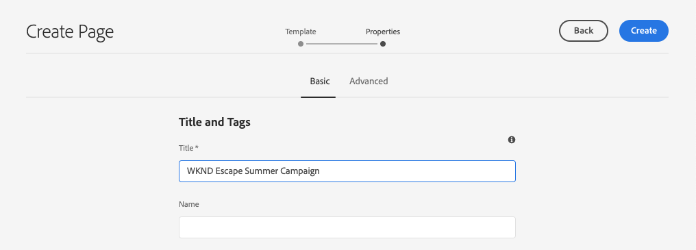
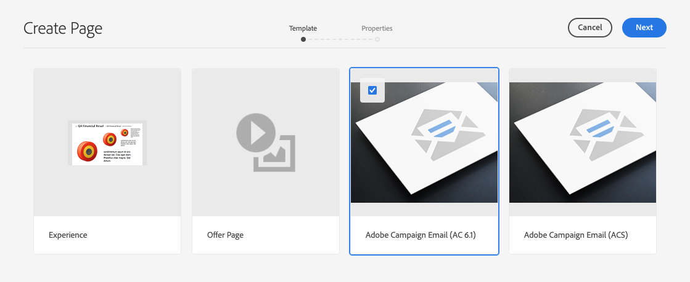
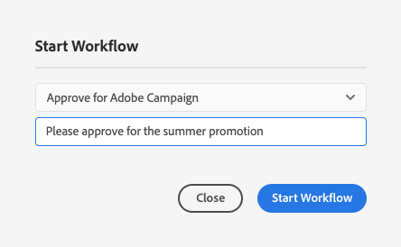
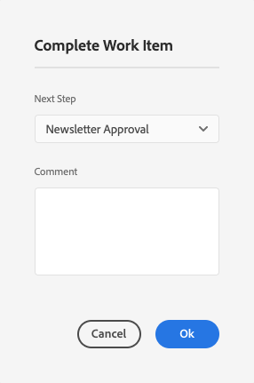
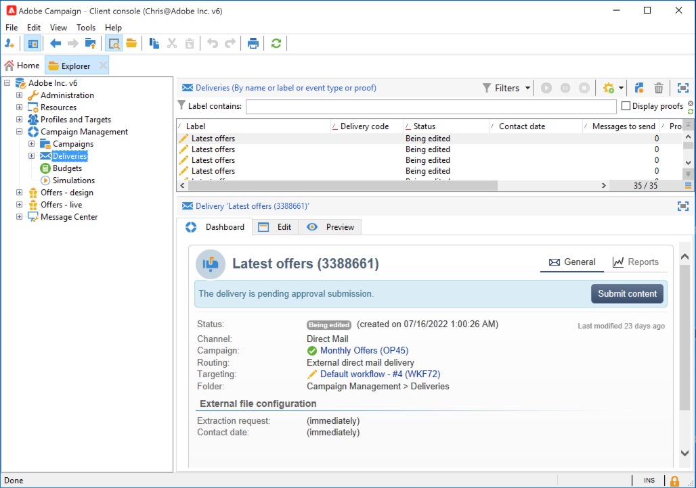

# 使用建立市場活動新聞AEM稿 {#creating-newsletters}

在本文檔中，您將學習如何AEM使用as a Cloud Service建立可與Adobe Campaign Classic一起發送的新聞稿。

通過利用as a Cloud Service和AEMAdobe Campaign Classic之間的整合，您可以使用功能強大的創AEM作工具建立新聞稿。 然後，當您準備好發送時事通訊時，您可以使用市場活動的收件人管理和分發功能來發送。

## 必備條件 {#prerequisites}

您必須先建立新聞稿，AEM然後使用市場活動發送 [整合Adobe Campaign ClassicAEM和as a Cloud Service。](/help/sites-cloud/integrating/integrating-campaign-classic.md)

## 建立新聞稿結構 {#create-structure}

新聞稿內容的管AEM理方式與您管理網站內容非常相似。 您首先建立一個「站點」來保存您的內容。 在此「站點」中，您可以按品牌收集新聞稿。

1. 登錄您的作AEM者實例。

1. 從主導航頁面，開啟 **站點** 控制台。

1. 在的標準安AEM裝中， **活動** 的子菜單。 選擇它並按一下 **建立** 按鈕 **頁面**。

   

1. 選擇 **品牌** 作為站點模板，按一下 **下一個**。

   

1. 輸入 **標題** 按一下 **建立** 然後 **完成**。

   

現在，您有了建立活動的基本內容結構。

## 建立市場活動 {#create-campaign}

現在，您已擁有市場活動的基本內容結構，您可以建立市場活動本身。 該活動將用於組織可能多份新聞稿。

1. 使用 [列視圖](/help/sites-cloud/authoring/getting-started/basic-handling.md#viewing-and-selecting-resources) 在站點控制台中，選擇您以前建立的品牌(在本例中， **WKND Escapes**)，然後選擇 **主區域**，它是為您自動建立的，然後按一下 **建立** 按鈕 **頁面**。

   

1. 選擇 **活動** ，然後按一下 **下一個** 和 **完成**。

   

1. 輸入 **標題** 的 **建立** 和 **完成**。

   

您現在有一個活動，您可以在其中建立新聞稿。

## 選擇市場活動配置 {#campaign-configuration}

可支AEM持多種整合配置。 對於新的活動，您必須定義用於發送新聞稿內容的配置。

1. 使用 [列視圖](/help/sites-cloud/authoring/getting-started/basic-handling.md#viewing-and-selecting-resources) 在站點控制台中，查找您以前建立的市場活動(在本例中， **WKND逃避夏季運動**)，然後使用複選框選中它，然後按一下 **屬性** 按鈕。

   

1. 在 **屬性** ，選擇 **Cloud Service** 頁籤，以定義要與此市場活動一起使用的整合。

   * 選擇 **Adobe Campaign** 從 **Cloud Service配置** 的子菜單。
   * 從中選擇所需的Adobe Campaign整合配置 **Adobe Campaign** 的子菜單。
   * 按一下&#x200B;**「儲存並關閉」**。

   

您的活動現在與您的Adobe Campaign整合有關。 您已準備好在中建立新聞AEM稿，並隨Adobe Campaign發送。

## 建立新聞稿 {#create-newsletter}

您可以在已建立和配置的市場活動內容結構下建立和管理新聞稿。

1. 使用 [列視圖](/help/sites-cloud/authoring/getting-started/basic-handling.md#viewing-and-selecting-resources) 在站點控制台中，查找您以前配置的市場活動(在本例中， **WKND逃避夏季運動**)，然後按一下 **建立** 按鈕 **頁面**。

   

1. 在「建立頁面」嚮導中，選擇 **Adobe Campaign電郵(AC 6.1)** 按一下 **下一個**。

   

1. 對於 **屬性** 在嚮導的步驟中，輸入 **標題** 要獲得新聞稿，請按一下 **建立** 和 **開啟**。

   

1. 編輯新聞稿頁面，以滿足您AEM的要求。

您現在有一份隨Adobe Campaign發送的新聞稿。

## 發佈新聞稿 {#publishing-newsletter}

您必須發佈新聞稿，以便Adobe Campaign可以發送。

1. 使用 [列視圖](/help/sites-cloud/authoring/getting-started/basic-handling.md#viewing-and-selecting-resources) 在站點控制台中，查找您以前建立的新聞稿(在本例中， **WKND逃生暑期活動首份新聞簡報**)，然後按一下 **頁面資訊** 按鈕，然後按一下 **發佈頁面**。

1. 選擇應發佈頁面的配置，然後按一下 **發佈**。

   

新聞稿頁面現已發佈到發AEM布實例，在Adobe Campaign Classic可見。 要能在Adobe Campaign內選擇它，必須獲得批准。

1. 按一下 **頁面資訊** 按鈕，然後選擇 **啟動工作流**。

1. 選擇 **批准Adobe Campaign** 作為工作流模型（可選地提供說明），然後按一下 **啟動工作流** 按鈕

   

1. 新聞稿頁面編輯器頂部出現一個標題，提供審批流程中的後續步驟。 按一下 **完成**。

   

1. 在 **完成工作項** 對話框，選擇 **新聞稿審查（管理員）** 的 **下一步** 按一下 **確定** 按鈕

   

1. 在新聞簡訊頁面編輯器頂部的標題中，再次按一下 **完成**。

1. 在 **完成工作項** 對話框，選擇 **新聞稿審批** 的 **下一步** 按一下 **確定** 按鈕

   

1. 對話框關閉後，由於審批工作流已完成，出現在新聞簡報頁面編輯器頂部的橫幅將消失。

該通訊現已在Adobe CampaignAEM出版並獲准使用。

>[!TIP]
>
>此處簡化了描述的工作流步驟，以說明該過程。 在正常工作流中，建立新聞稿並批准其工作通常是不同的角色
>
>查看文檔 [使用工作流](/help/sites-cloud/authoring/workflows/overview.md) 的子菜單。

## 建立收件人 {#creating-recipient}

要能夠發送您在中建立的新聞稿，AEM您必須先在Adobe Campaign Classic定義收件人。

1. 使用客戶端控制台登錄Adobe Campaign Classic。

1. 選擇 **工具** -> **瀏覽器** 的上界。

1. 在瀏覽器中，導航到 **配置檔案和目標** -> **收件人** 的下界。

   

1. 按一下 **新建** 的子菜單。

   * 名字
   * 姓氏
   * 電子郵件地址

1. 按一下「**儲存**」。

您現在有一個收件人，您可以通過Adobe Campaign Classic向其發送新聞稿。

## 建立電子郵件傳遞 {#create-delivery}

最後一步是將您建立的新聞稿發AEM送給您在Adobe Campaign Classic添加的收件人。

1. 使用客戶端控制台登錄Adobe Campaign Classic。

1. 選擇 **工具** -> **瀏覽器** 的上界。

1. 在瀏覽器中，導航到 **Campaign Management** -> **交貨** 按一下 **新建**。

   

1. 在 **交貨** 對話框，選擇 **帶內容的電子郵AEM件傳遞** 的 **交貨模板** 從下拉清單中按一下 **繼續**。

   

1. 在 **電子郵件參數** 的 **從** 連結並輸入發件人的資訊，然後按一下 **確定**。

   * 發件人地址
   * 從欄位

   

1. 在 **電子郵件參數** 的 **至** 連結以開啟 **選擇目標** 對話框，然後按一下 **添加**。

   

1. 在 **選擇目標元素** 對話框，選擇 **收件人** 按一下 **下一個**。

   

1. 使用篩選器，選擇您的收件人 [建立以前](#creating-recipient) 按一下 **完成**。

   

1. 回到 **選擇目標** 對話框，按一下 **確定**。

1. 在交貨窗口中，按一下 **同步**。

   

1. 在 **與內容同AEM步** 對話框，從清單中選擇您以前建立的新聞稿，按一下 **確定**。

1. Adobe Campaign的電子郵件內容與您在中建立的新聞稿內容同AEM步。

   * 按一下 **刷新內容** 的子菜單。

1. 按一下 **發送** 發送電子郵件。

1. 在 **發送到主傳遞目標** 對話框，選擇 **盡快交付** 然後按一下 **分析**。

   

1. 分析步驟構建傳送，將內容與接收者組合。 建立交貨後，按一下 **確認交貨** 發郵件。 按一下 **是** 確認。

1. 已開始傳送。 按一下&#x200B;**關閉**。

   

1. 按一下 **保存** 保存交貨。

您的新聞稿已發送！

>[!TIP]
>
>此示例顯示了將新聞稿發送給單個收件人的簡化交付過程。 當然，正常的送達方式會包含許多不同的接收者，而Adobe Campaign讓這些接收者管理起來更簡單。 請參閱 [Adobe Campaign Classic文檔](https://experienceleague.adobe.com/docs/campaign-classic.html) 的子菜單。
