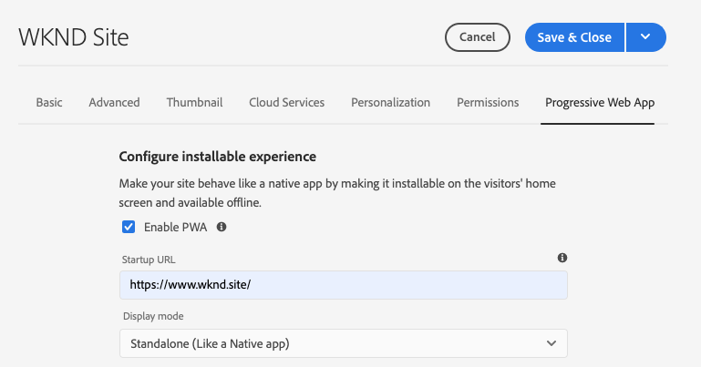
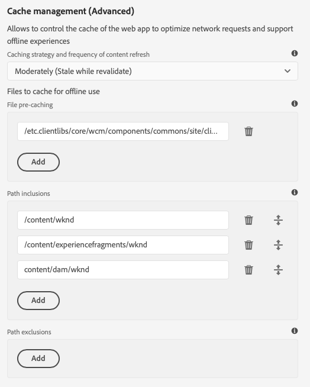

# 啟用漸進式Web App功能 {#enabling-pwa}

通過簡單的配置，內容作者現在可以為在AEM Sites建立的體驗啟用漸進式Web應用(PWA)功能。

>[!CAUTION]
>
>這是一項高級功能，它要求：
>
>* PWA知識
>* 瞭解您的站點和內容結構
>* 對快取策略的理解
>* 您的開發團隊提供的支援
>
>在使用此功能之前，建議您與開發團隊討論此功能，以定義將其用於項目的最佳方法。

## 簡介 {#introduction}

[漸進式Web應用(PWA)](https://developer.mozilla.org/en-US/docs/Web/Progressive_web_apps) 通過允許站點在用戶電腦AEM上本地儲存並離線訪問，為站點啟用沈浸式應用程式樣的體驗。 即使丟失了Internet連接，用戶也可以在移動中瀏覽網站。 PWA即使網路丟失或不穩定，也能提供無縫體驗。

內容作者無需對站點進行任何重新編碼，而是可以將PWA屬性配置為 [頁屬性](/help/sites-cloud/authoring/fundamentals/page-properties.md) 一個網站。

* 保存或發佈時，此配置將觸發一個事件處理程式，該事件處理程式將 [清單檔案](https://developer.mozilla.org/en-US/docs/Web/Manifest) 和 [服務員](https://developer.mozilla.org/en-US/docs/Web/API/Service_Worker_API) 在站點上啟用PWA功能。
* 還維護Sling映射以確保服務工作程式從應用程式的根提供服務，以啟用允許應用程式內離線功能的代理內容。

通過PWA，用戶擁有該網站的本地副本，即使沒有網際網路連接，也能提供類似應用的體驗。

>[!NOTE]
>
>漸進式Web應用是一種不斷發展的技術，支援本地應用安裝和其他功能 [取決於您使用的瀏覽器。](https://developer.mozilla.org/en-US/docs/Web/Progressive_web_apps/Installable_PWAs#Summary)

## 必備條件 {#prerequisites}

為了能夠為您的站點使用PWA功能，您的項目環境有兩項要求：

1. [使用核心元件](#adjust-components) 利用此功能
1. [調整調度程式](#adjust-dispatcher) 公開所需檔案的規則

這些是作者需要與開發團隊協調的技術步驟。 每個站點只需執行一次這些步驟。

### 使用核心元件 {#adjust-components}

核心元件2.15.0及更高版本完全支援站點的PWAAEM功能。 由於AEMaaCS始終包括最新版本的核心元件，因此您可以利用現成的PWA功能。 您的AEMaaCS項目自動滿足此要求。

>[!NOTE]
>
>Adobe不建議在自定義元件或元件上使用PWA功能 [從核心元件擴展。](https://experienceleague.adobe.com/docs/experience-manager-core-components/using/developing/customizing.html)
<!--
Your components need to include the [manifest files](https://developer.mozilla.org/en-US/docs/Web/Manifest) and [service worker,](https://developer.mozilla.org/en-US/docs/Web/API/Service_Worker_API) which supports the PWA features.

 To do this, the developer will need to add the following link to the `customheaderlibs.html` file of your page component.

```xml
<link rel="manifest" href="/content/<projectName>/manifest.webmanifest" crossorigin="use-credentials"/>
```

The developer will also need to add the following link to the `customfooterlibs.html` file of your page component.

```xml
<script>
        // Check that service workers are supported
        if ('serviceWorker' in navigator) {
            // Use the window load event to make sure the page load performs well
            window.addEventListener('load', () => {
                let serviceWorker = '/<projectName>sw.js';
                navigator.serviceWorker.register(serviceWorker);
            });
        }
</script>
```
-->

### 調整調度程式 {#adjust-dispatcher}

PWA特徵生成和使用 `/content/<sitename>/manifest.webmanifest` 的子菜單。 預設情況下， [調度員](/help/implementing/dispatcher/overview.md) 不公開這些檔案。 要公開這些檔案，開發人員必須將以下配置添加到您的站點項目。

```text
File location: [project directory]/dispatcher/src/conf.dispatcher.d/filters/filters.any >

# Allow webmanifest files
/0102 { /type "allow" /extension "webmanifest" /path "/content/*/manifest" }
```

根據您的項目，您可能希望包括重寫規則的不同類型的擴展。 的 `webmanifest` 在引入規則時，擴展可以在重寫條件中包括，該規則將請求隱藏和重定向到 `/content/<projectName>`。

```text
RewriteCond %{REQUEST_URI} (.html|.jpe?g|.png|.svg|.webmanifest)$
```

## 為您的站點啟用PWA {#enabling-pwa-for-your-site}

與 [先決條件](#prerequisites) met ，內容作者很容易將功能PWA到站點。 以下是如何執行此操作的基本概要。 各個選項的詳細資訊見 [詳細選項。](#detailed-options)

1. 登錄AEM。
1. 在主菜單中，點擊或按一下 **導航** -> **站點**。
1. 選擇您的站點項目，點擊或按一下 [**屬性**](/help/sites-cloud/authoring/fundamentals/page-properties.md) 或使用熱鍵 `p`。
1. 選擇 **漸進式Web應用** 頁籤並配置適用的屬性。 您至少要：
   1. 選擇選項 **啟用PWA**。
   1. 定義 **啟動URL**。

      

   1. 將512x512 png表徵圖上載到DAM，並將其作為應用的表徵圖引用。

      

   1. 配置希望服務工作人員離線的路徑。 典型路徑為：
      * `/content/<sitename>`
      * `/content/experiencefragements/<sitename>`
      * `/content/dam/<sitename>`
      * 任何第三方字型引用
      * `/etc/clientlibs/<sitename>`

      


1. 點擊或按一下 **保存並關閉**。

您的站點現在已配置，您可以 [將其作為本地應用安裝。](#using-pwa-enabled-site)

## 使用啟用PWA的站點 {#using-pwa-enabled-site}

既然你 [將您的站點配置為支援PWA,](#enabling-pwa-for-your-site) 你可以親身體驗。

1. 訪問 [支援的瀏覽器。](https://developer.mozilla.org/en-US/docs/Web/Progressive_web_apps/Installable_PWAs#Summary)
1. 您將在瀏覽器的地址欄中看到一個新表徵圖，表示該站點可以作為本地應用安裝。
   * 視瀏覽器而定，該表徵圖可能有所不同，並且瀏覽器還可能顯示一條通知（例如橫幅或對話框），指示它可以作為本地應用進行安裝。
1. 安裝應用。
1. 應用將安裝在設備的主螢幕上。
1. 開啟應用，瀏覽一下，然後看到頁面離線可用。

## 詳細選項 {#detailed-options}

以下部分提供了在以下情況下可用選項的詳細資訊： [配置您的站點以進行PWA。](#enabling-pwa-for-your-site)

### 配置可安裝的體驗 {#configure-installable-experience}

這些設定允許您的站點像本地應用一樣運行，因為它可安裝在訪問者的主螢幕上，並可離線使用。

* **啟用PWA**  — 這是啟用站點PWA的主切換。
* **啟動URL**  — 這是 [首選起始URL](https://developer.mozilla.org/en-US/docs/Web/Manifest/start_url) 當用戶載入本地安裝的應用時，該應用將開啟。
   * 這可以是內容結構中的任何路徑。
   * 這不必是根目錄，通常是應用程式的專用歡迎頁。
   * 如果此URL是相對的，則清單URL將用作解析該URL的基URL。
   * 如果為空，則該功能將使用我們應用從中安裝的網頁地址。
   * 建議設定值。
* **顯示模式**  — 啟用PWA的應用仍是通過AEM瀏覽器提供的站點。 [這些顯示選項](https://developer.mozilla.org/en-US/docs/Web/Manifest/display) 定義瀏覽器應如何隱藏或以其他方式呈現給本地設備上的用戶。
   * **獨立**  — 瀏覽器完全隱藏在用戶面前，它看起來像本地應用。 這是預設值。
      * 使用此選項，應用程式導航必須完全通過您的內容進行，而無需使用瀏覽器的導航控制項，即可使用站點頁面上的連結和元件。
   * **瀏覽器**  — 瀏覽器在訪問站點時的顯示方式與通常相同。
   * **最小UI**  — 瀏覽器大多隱藏，就像本機應用一樣，但基本導航控制項已暴露。
   * **全屏**  — 瀏覽器完全隱藏，就像本機應用一樣，但以全屏模式呈現。
      * 使用此選項，應用程式導航必須完全通過您的內容進行，而無需使用瀏覽器的導航控制項，即可使用站點頁面上的連結和元件。
* **螢幕方向**  — 作為本地應用，PWA需要知道如何處理 [設備方向。](https://developer.mozilla.org/en-US/docs/Web/Manifest/orientation)
   * **任意**  — 應用根據用戶設備的方向進行調整。 這是預設值。
   * **縱向**  — 這會強制應用以縱向佈局開啟，而不管用戶設備的方向如何。
   * **橫向**  — 這會強制應用程式以橫向佈局開啟，而不管用戶設備的方向如何。
* **主題顏色**  — 此定義 [應用的顏色](https://developer.mozilla.org/en-US/docs/Web/Manifest/theme_color) 影響本地用戶的作業系統顯示本機UI工具欄和導航控制項的方式。 根據瀏覽器的不同，它可能會影響其他應用程式演示文稿元素。
   * 使用顏色井彈出窗口選擇顏色。
   * 顏色也可以由十六進位或RGB值定義。
* **背景顏色**  — 此定義 [應用的背景顏色，](https://developer.mozilla.org/en-US/docs/Web/Manifest/background_color) 顯示為應用程式載入。
   * 使用顏色井彈出窗口選擇顏色。
   * 顏色也可以由十六進位或RGB值定義。
   * 某些瀏覽器 [自動生成閃屏](https://developer.mozilla.org/en-US/docs/Web/Manifest#Splash_screens) 表徵圖。
* **表徵圖**  — 此定義 [表徵圖](https://developer.mozilla.org/en-US/docs/Web/Manifest/icons) 表示用戶設備上的應用。
   * 該表徵圖必須是大小為512x512像素的png檔案。
   * 表徵圖必須為 [儲存在DAM中。](/help/assets/overview.md)

### 快取管理（高級） {#offline-configuration}

這些設定使此站點的部分部分離線可用，並可在訪問者設備上本地使用。 這允許控制Web應用的快取以優化網路請求和支援離線體驗。

* **快取策略和內容刷新頻率**  — 此設定定義PWA的快取模型。
   * **適度** - [此設定](https://web.dev/stale-while-revalidate/) 是大多數站點的情況，是預設值。
      * 通過此設定，用戶首先查看的內容將從快取中載入，當用戶使用該內容時，將重新驗證快取中的其餘內容。
   * **頻繁**  — 對於像拍賣行這樣需要快速更新的網站來說，情況就是如此。
      * 使用此設定，應用將首先通過網路查找最新內容，如果不可用，則返回本地快取。
   * **很少**  — 對於幾乎是靜態的站點，如參考頁。
      * 使用此設定，應用程式將首先查找快取中的內容，如果不可用，將返回網路以檢索內容。
* **檔案預快取**  — 服務工作人AEM員安裝時和使用前，這些托管在上的檔案將保存到本地瀏覽器快取中。 這可確保Web應用在離線時完全正常工作。
* **路徑包含**  — 對已定義路徑的網路請求被截取，並根據配置的 **快取策略和內容刷新頻率**。
* **快取排除**  — 無論下面的設定如何，這些檔案將永遠不會被快取 **檔案預快取** 和 **路徑包含**。

>[!TIP]
>
>您的開發人員團隊可能在如何設定離線配置方面有寶貴的資訊。

## 限制和Recommendations {#limitations-recommendations}

並非所有PWA功能都可用於AEM Sites。 這些是一些顯著的局限。

* 如果用戶未使用該應用，則不會自動同步或更新頁面。

Adobe在實施PWA時還會提出以下建議。

### 最小化要預快取的資源數。 {#minimize-precache}

Adobe建議您限制要預快取的頁數。

* 嵌入庫以減少預快取時要管理的條目數。
* 將映像變化數限制為預快取。

### 在項目指令碼和樣式表穩定後啟用PWA。 {#pwa-stabilized}

客戶端庫隨著快取選擇器的添加而傳遞，該選擇器遵循以下模式 `lc-<checksumHash>-lc`。 每次組成庫的檔案（和依賴項）中的一個更改時，此選擇器都會更改。 如果列出了要由服務員預快取的客戶端庫，並且要引用新版本，則需要手動檢索和更新該條目。 因此，我們建議您在項目指令碼和樣式表穩定後將站點配置為PWA。

### 最小化影像變化數。 {#minimize-variations}

核心元件的圖AEM像元件確定前端是讀取的最佳格式副本。 此機制還包括與上次修改該資源的時間對應的時間戳。 此機制使PWA預快取的配置複雜化。

配置預快取時，用戶需要列出可讀取的所有路徑變化。 這些變化由質量和寬度等參陣列成。 強烈建議將這些變化的數目減少到最多三個 — 小、中、大。 您可以通過的 [影像元件。](https://experienceleague.adobe.com/docs/experience-manager-core-components/using/components/image.html)

如果未仔細配置，記憶體和網路消耗會嚴重影響PWA的效能。 此外，如果您打算預快取（例如50個影像），並且每個影像有3個寬度，則維護站點的用戶必須在頁面屬性的PWA預快取部分中維護最多150個條目的清單。

Adobe還建議您在項目使用映像穩定後將站點配置為PWA。
