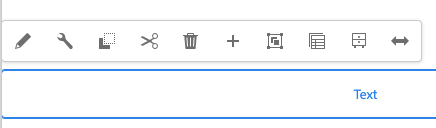

# 使用AEM頁面編輯器編輯頁面內容 {#edit-content}

AEM頁面編輯器是製作頁面內容的強大工具。 瞭解如何使用它來就地拖放內容及編輯內容。

## 概觀 {#overview}

您可以在頁面編輯器中執行三個基本動作來編輯內容：

1. [將元件拖放到頁面上以新增元件](#adding-components)。
1. [將新資產拖放到頁面上以新增資產](#adding-asset)。
1. [就地編輯頁面中已存在的元件](#edit-in-place)。

AEM頁面編輯器除了可存取更進階的功能外，還提供直覺式UI來執行這些工作。

此外，編輯器可讓您組織頁面上的現有內容，方法是允許您

* [移動元件](#moving-components)
* [編輯元件配置](#editing-component-layout)
* [編輯元件繼承](#inherited-components)

>[!NOTE]
>
>您的專案團隊可視需要自訂編輯器。 如需詳細資訊，請參閱[自訂頁面製作](/help/implementing/developing/extending/page-authoring.md)。

## 新增元件 {#adding-components}

您可以從側面板[的](/help/sites-cloud/authoring/page-editor/editor-side-panel.md#components-browser)元件瀏覽器中選取新元件，並將它們拖放到元件預留位置中，藉此將元件拖放到頁面上。

### 元件預留位置 {#component-placeholder}

元件預留位置是一個指示器，可顯示放置元件時元件的放置位置。 它有兩個外觀。

* 將新元件新增至頁面時（從元件瀏覽器拖曳），將顯示為灰色方塊，內含您放置之元件的詳細資訊。

  將新元件新增至頁面時的

* 當[移動現有元件](#movging-components)時，它將顯示為藍色正方形。

  在頁面預留位置

在這兩種情況下，所選的目標都會以藍色外框顯示在您正在拖曳的元件下方。 釋放元件時元件將放置到的目標。

### 從元件瀏覽器新增元件 {#adding-a-component-from-the-components-browser}

您可以使用[元件瀏覽器](/help/sites-cloud/authoring/page-editor/editor-side-panel.md#components-browser)來新增元件。 [元件預留位置](#component-placeholder)會顯示您放置元件的位置。

1. 確定頁面編輯器處於&#x200B;[**編輯**&#x200B;模式](/help/sites-cloud/authoring/page-editor/introduction.md#mode-selector)。
1. 開啟[元件瀏覽器](/help/sites-cloud/authoring/page-editor/editor-side-panel.md#components-browser)。
1. 將必要的元件拖曳到[必要的位置](#component-placeholder)並釋放。
1. [編輯](#edit-content)新放置的元件。

>[!NOTE]
>
>在行動裝置上，元件瀏覽器會填滿整個畫面。 開始拖曳元件後，瀏覽器將關閉並再次顯示頁面，以便您放置元件。

### 從段落系統新增元件 {#adding-a-component-from-the-paragraph-system}

您可以使用段落系統的&#x200B;**將元件拖曳到這裡**&#x200B;預留位置來新增元件：

1. 確定頁面編輯器處於&#x200B;[**編輯**&#x200B;模式](/help/sites-cloud/authoring/page-editor/introduction.md#mode-selector)。
1. 有兩種方式可以從段落系統選取和新增元件：

   * 從現有元件的工具列或&#x200B;**拖曳元件到此處**&#x200B;方塊中選取&#x200B;**插入元件**&#x200B;選項(+)。

     

   * 如果您使用案頭裝置，可以按兩下&#x200B;**將元件拖曳到這裡**&#x200B;方塊。

1. **插入新元件**&#x200B;對話方塊開啟，讓您選取所需的元件。 點選或按一下您要新增的元件。

   * 使用搜尋篩選器來尋找您的元件。
   * 使用元件名稱旁的資訊圖示來瞭解有關元件的更多資訊。

   

1. 選取的元件會新增至您選取的目標。 [視需要編輯](#edit-content)元件。

## 新增資產 {#adding-asset}

您也可以從[資產瀏覽器](/help/sites-cloud/authoring/page-editor/editor-side-panel.md#assets-browser)拖曳資產，將新元件新增至頁面。 這會自動建立適當型別的元件（並包含資產）。

您可針對您的安裝設定此行為。 如需詳細資訊，請參閱檔案[元件參考指南](/help/implementing/developing/components/reference.md#component-placeholders)。

若要拖曳上述任一資產型別來建立元件：

1. 確定您的頁面處於&#x200B;[**編輯**&#x200B;模式](/help/sites-cloud/authoring/page-editor/introduction.md#mode-selector)。
1. 開啟[資產瀏覽器](/help/sites-cloud/authoring/page-editor/editor-side-panel.md#assets-browser)。
1. 將所需的資產拖曳至所需的位置。 [元件預留位置](#component-placeholder)會顯示元件的放置位置，而目標會顯示插入後的位置。
1. 將資產發佈至目標。 適合資產型別的元件會在包含所選資產的所需位置建立。
1. 如有必要，請[編輯](#edit-content)元件。

>[!NOTE]
>
>在行動裝置上，資產瀏覽器會填滿整個畫面。 開始拖曳資產後，瀏覽器將關閉並再次顯示頁面，以便您放置資產。

如果您在瀏覽資產時發現需要對資產進行快速變更，可以按一下資產名稱旁的編輯圖示，直接從瀏覽器啟動[資產編輯器](/help/assets/manage-digital-assets.md)。

## 就地編輯元件 {#edit-in-place}

選取元件會開啟元件工具列。 這可讓您存取可在元件上執行的各種動作。

元件工具列中的可用動作適用於所選的元件。 根據您選取的元件，您可能會看到更多或更少的資訊，此處也可能沒有說明這些資訊。

* **編輯**&#x200B;可讓您修改元件的內容，通常是就地修改。 其行為取決於元件。

  

* **設定**&#x200B;可讓您變更元件與其內容不直接相關的部分引數，通常是在對話方塊中。 其行為取決於元件。

  

* **複製**&#x200B;會將元件複製到剪貼簿，以貼到其他位置。 原始元件保持不變。

  

* **剪下**&#x200B;會將元件複製到剪貼簿。 原始元件即被移除。

  

* **刪除**&#x200B;會從含有您確認的頁面中刪除元件。

  

* **插入元件**&#x200B;開啟對話方塊以[新增元件](#adding-a-component-from-the-paragraph-system)。

  

* **貼上**&#x200B;將元件從剪貼簿貼到頁面。 是否保留原稿，取決於您是使用&#x200B;**Copy**&#x200B;還是&#x200B;**Cut**。

   * 您可以貼至相同頁面或不同頁面。
   * 如果您在剪下/復製作業前將頁面貼到已開啟的其他頁面，則必須重新整理頁面以檢視貼上的內容。
   * 貼上的專案會貼在您選取貼上動作的專案上方。
   * 唯有剪貼簿上有內容時，才會顯示「貼上」動作。

  

* **群組**&#x200B;可讓您一次選取多個元件。 透過&#x200B;**Control+Click**&#x200B;或&#x200B;**Command+Click**，桌上型電腦裝置也能達到相同效果。

  

* **Parent**&#x200B;選取所選元件的父元件。

  

* **配置**&#x200B;可讓您修改所選元件的[配置](#editing-component-layout)。

   * 這僅適用於選取的元件，而且不會啟動整個頁面的[配置模式](/help/sites-cloud/authoring/page-editor/introduction.md#mode-selector)。

  

* **轉換成體驗片段變數**&#x200B;可讓您從選取的元件建立[體驗片段](/help/sites-cloud/authoring/fragments/content-fragments.md)，或將其新增至現有的體驗片段。

  

### 元件編輯對話方塊 {#component-edit-dialog}

某些元件提供就地可用以外的其他編輯選項。 您可以開啟元件的編輯對話方塊，開啟元件工具列[的](#component-toolbar)編輯（鉛筆）圖示以存取其他組態選項。

確切的編輯選項取決於元件。 對於某些元件[某些動作將只能在全熒幕模式](#edit-content-full-screen-mode)下使用。 例如：

* 文字元件

  

* 影像元件

  

### 以全熒幕模式編輯元件 {#edit-content-full-screen-mode}

許多元件都提供全熒幕模式供您編輯，您可以使用此按鈕存取這些元件。

全熒幕編輯可顯示比就地編輯器（例如影像元件）更多的編輯選項。

全熒幕中的

使用&#x200B;**最小化**&#x200B;按鈕以存在全熒幕模式。

## 移動元件 {#moving-components}

若要移動元件：

1. 選取要以點選並按住或點選並按住來移動的元件。
1. 將元件拖曳至新位置。

   * 頁面編輯器會指出具有[預留位置](#component-placeholder)的元件位置，以及段落可以與目標一起放置的位置。

   

1. 將其拖曳至所需位置。

>[!TIP]
>
>您也可以使用[剪下並貼上](#component-toolbar)來移動元件。

## 編輯元件版面 {#editing-component-layout}

您可以選取元件的 [Layout](/help/sites-cloud/authoring/page-editor/responsive-layout.md)**&#x200B;**  (配置) 動作，以變更元件的配置，並節省時間，而不需離開編輯模式，而不需重複從編輯切換到配置模式來調整元件。

1. 當處於網站主控台的&#x200B;**編輯**&#x200B;模式時，請選取元件以顯示元件的工具列。

1. 選取&#x200B;**配置**&#x200B;動作以調整元件的配置。

   ![元件工具列的[配置]按鈕](assets/edit-content-layout.png)

1. 選取「配置」動作後，您可以修改元件的配置，就像在[配置模式](/help/sites-cloud/authoring/page-editor/responsive-layout.md#defining-layouts-layout-mode)中一樣。

   * 元件顯示的調整大小控點。
   * 模擬器工具列會顯示在畫面頂端。
   * 元件工具列上會顯示「配置」動作，而非標準編輯動作。

   

1. 進行必要的版面配置變更後，點選或按一下元件動作功能表中的&#x200B;**關閉**&#x200B;按鈕以停止修改元件的版面，而元件的工具列會回到其正常的編輯狀態。

   

>[!TIP]
>
>「配置」動作僅限於選定元件的範圍。 例如，如果您正在編輯一個元件的版面，然後按一下另一個元件，則會為新選取的元件顯示標準編輯工具列（而非版面工具列），而調整大小操作框和模擬器工具列會消失。
>
>如果您需要編輯頁面的整體版面配置（會影響多個元件），請切換至[版面配置模式](/help/sites-cloud/authoring/page-editor/responsive-layout.md)。

## 編輯元件繼承 {#inherited-components}

繼承是可連結內容的機制，如此一來變更一個會自動變更另一個。 繼承的元件可能是各種情況的產物，包括：

* [多網站管理](/help/sites-cloud/administering/msm/overview.md)
* [啟動](/help/sites-cloud/authoring/launches/overview.md)

您可以取消並重新啟用繼承。 如果元件為即時副本或啟動的一部分，則可根據元件從元件工具列使用這些選項。

* **取消繼承**

  

* 如果繼承已取消，**重新啟用繼承**

  

* **轉出**&#x200B;也適用於Blueprint或即時副本來源

  
