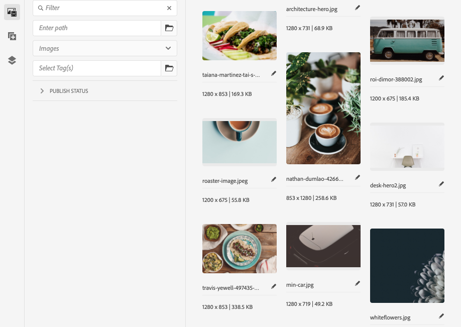

# 頁面編輯器側面板 {#side-panel}

瞭解如何使用AEM網站編輯器中的側面板，將元件和資產新增至您的頁面。

## 側面板模式 {#modes}

在頁面編輯器的工具列中點選或按一下&#x200B;**切換側面板**&#x200B;圖示，即可隨時在頁面編輯器中存取側面板。

當您開啟側面板時，它會從左側滑開，然後您可以從三個重要標籤中選取：

* [元件瀏覽器](#components-browser)，可新增內容至您的頁面
* [資產瀏覽器](#assets-browser)，用於將新資產新增至您的頁面
* [內容樹狀結構](#content-tree)以瀏覽頁面的結構

## 元件瀏覽器 {#components-browser}

[元件](/help/implementing/developing/components/overview.md)是用來使用AEM頁面編輯器建立內容的建置區塊。 您可以在頁面上放置多個元件，並設定其選項以建置您的內容頁面。

元件瀏覽器會顯示目前頁面上可用的所有元件。 這些檔案可以拖曳至適當位置，然後編輯以新增您的內容。

點選或按一下側面板中的&#x200B;**元件**&#x200B;索引標籤以存取&#x200B;**元件**&#x200B;瀏覽器。

側面板中的

實際外觀和處理方式取決於您使用的裝置型別。

### 行動裝置 {#mobile-device-components-browser}

在行動裝置上開啟元件瀏覽器時，瀏覽器會完全覆蓋正在編輯的頁面。

若要將元件新增至頁面，請選取並拖曳元件，然後將其向右移動。 元件瀏覽器將關閉以再次顯示頁面，您可以在其中放置元件。

行動裝置上的

>[!NOTE]
>
>當寬度小於1024畫素時會偵測到行動裝置。

### 案頭裝置 {#desktop-device-components-browser}

在案頭裝置上開啟元件瀏覽器時，該瀏覽器會出現在視窗左側。

若要將元件新增至頁面，請按一下所需元件，並將其拖曳至所需位置。

### 使用元件瀏覽器 {#using-component-browser}

**元件**&#x200B;瀏覽器中的元件由下列專案表示：

* 元件名稱
* 元件群組（灰色）
* 圖示或縮寫
   * 標準元件的圖示為單色。
   * 縮寫一律為元件名稱的前兩個字元。

從&#x200B;**元件**&#x200B;瀏覽器的頂端工具列，您可以：

* 依名稱篩選元件。
* 使用下拉式選取範圍，將顯示限製為特定群組。

如需元件的詳細說明，您可以在&#x200B;**元件**&#x200B;瀏覽器（如果有的話）中選取元件旁的資訊圖示。 例如，對於&#x200B;**內容片段**：

如需有關可用元件的詳細資訊，請參閱[元件主控台](/help/sites-cloud/authoring/components-console.md)

## Assets瀏覽器 {#assets-browser}

**Assets**&#x200B;瀏覽器會顯示目前頁面上可用的所有[資產](/help/assets/overview.md)。

點選或按一下側面板上的&#x200B;**Assets**&#x200B;索引標籤，即可瀏覽資產。

無限捲動可在捲動時視需要擴充資產清單。

實際外觀和處理方式取決於您使用的裝置型別：

### 行動裝置 {#mobile-device-assets-browser}

在行動裝置上開啟資產瀏覽器時，瀏覽器會完全覆蓋正在編輯的頁面。

若要將資產新增至您的頁面，請選取並拖曳所需的資產，然後將其向右移動。 資產瀏覽器將關閉並重新顯示頁面，您可以在其中將資產新增到所需的元件。

行動裝置上的

>[!NOTE]
>
>當寬度小於1024畫素時會偵測到行動裝置。

### 案頭裝置 {#desktop-device-assets-browser}

在案頭裝置上開啟資產瀏覽器時，瀏覽器會在視窗左側開啟。

若要將資產新增至頁面，請選取所需的資產，並將其拖曳至所需的元件或位置。

案頭上的

### 使用Assets瀏覽器 {#using-assets-browser}

若要將資產新增至頁面，請選取並拖曳至所需位置。 這可以是：

* 適當型別的現有元件。
   * 例如，您可以將影像型別的資產拖曳至影像元件上。
* 段落系統中用來建立適當型別元件的[預留位置](/help/sites-cloud/authoring/page-editor/edit-content.md#component-placeholder)。
   * 例如，您可以將影像型別的資產拖曳至段落系統，以建立「影像」元件。

>[!NOTE]
>
>資產拖放適用於特定資產和元件型別。 如需詳細資訊，請參閱[使用Assets瀏覽器插入元件](/help/sites-cloud/authoring/page-editor/edit-content.md#adding-a-component-from)。

從資產瀏覽器頂端的工具列，您可以依以下方式篩選資產：

* 名稱
* 路徑
* 資產型別，例如，影像、影片、檔案、段落、內容片段和體驗片段
* 資產特性，例如方向與樣式
   * 僅適用於特定資產型別

如果您需要快速變更資產，可以直接從資產瀏覽器啟動[資產編輯器](/help/assets/manage-digital-assets.md)，方法是按一下資產名稱旁邊顯示的編輯圖示。

## 內容樹狀結構 {#content-tree}

**內容樹狀結構**&#x200B;提供階層中頁面上所有元件的概觀，讓您一眼就能看到頁面的構成。

>[!NOTE]
>
>如果您在行動裝置上編輯頁面（如果瀏覽器寬度小於1024畫素），則無法使用內容樹。

點選或按一下&#x200B;**內容樹狀結構**&#x200B;索引標籤，以存取內容樹狀結構。

開啟時，您可以看到頁面或範本的樹狀檢視表示法，因此更容易瞭解其內容如何階層架構。 此外，在複雜頁面上，它可讓您更輕鬆地在頁面元件之間跳轉。

頁面可以輕鬆地由許多相同型別的元件組成，因此內容樹狀結構會在元件型別名稱（黑色）後面顯示描述性文字（灰色）。 描述性文字來自元件的常見屬性，例如標題或文字。

元件型別會以使用者語言顯示，而元件說明文字則來自頁面語言。

按一下元件旁的>形箭號將會收合或展開該層級。

按一下元件即可在頁面編輯器中醒目顯示元件。 可用的動作取決於頁面狀態。 例如：

## 基本頁面 {#basic-page}

基本頁面的元件會有常用選項。

如果按一下樹狀結構中的元件可編輯，則名稱右側會出現扳手圖示。 按一下此圖示會啟動元件的編輯對話方塊。

### 即時副本 {#live-copy}

屬於[livecopy](/help/sites-cloud/administering/msm/overview.md)的一部分（元件繼承自其他頁面）的頁面將具有不同的選項。

## 關聯的內容瀏覽器 {#associated-content-browser}

如果您的頁面包含內容片段，您也可以存取關聯內容的[瀏覽器](/help/sites-cloud/authoring/fragments/content-fragments.md#using-associated-content)。
