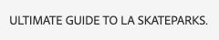
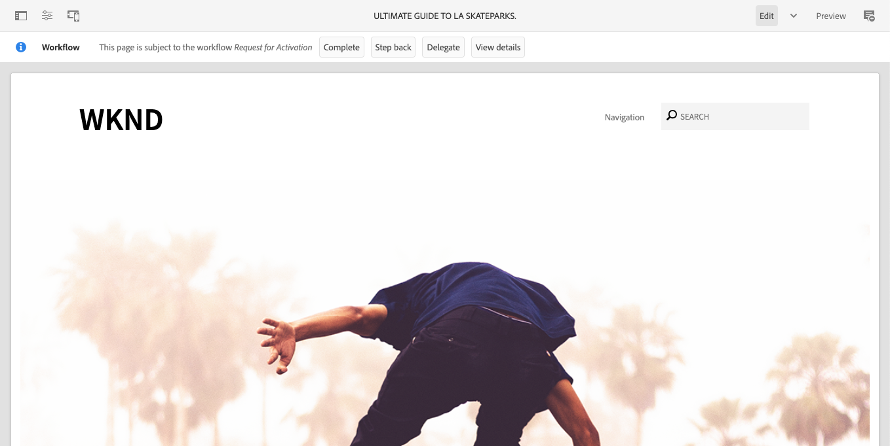

# AEM頁面編輯器 {#editing-page-content}

在&#x200B;[**網站**&#x200B;主控台](/help/sites-cloud/authoring/sites-console/introduction.md)中建立頁面後，您就可以使用AEM頁面編輯器來編輯頁面的內容，這是製作內容的強大工具。

>[!NOTE]
>
>在&#x200B;[**網站**&#x200B;主控台](/help/sites-cloud/authoring/sites-console/introduction.md)中編輯頁面時，主控台將開啟適合頁面[範本](/help/sites-cloud/authoring/page-editor/templates.md)的編輯器，可以是本檔案中說明的頁面編輯器，或[通用編輯器](/help/sites-cloud/authoring/universal-editor/authoring.md)。

>[!NOTE]
>
>您的帳戶需要適當的存取許可權才能編輯頁面。 如果您沒有許可權，請聯絡您的系統管理員。

{{traditional-aem}}

## 方向 {#orientation}

AEM頁面編輯器主要由三個區段組成：

1. [工具列](#toolbar) — 工具列可讓您快速變更頁面模式並存取其他頁面設定。
1. [側面板](#side-panel) — 側面板可讓您存取頁面元件和資產以及其他編寫工具。
1. [編輯器](#editor) — 您可在編輯器變更內容並預覽。

使用可拖曳至頁面的[元件](/help/sites-cloud/authoring/components-console.md) （適合內容型別）新增內容。 接著，您就可以就地編輯、移動或刪除這些專案。

### 工具列 {#page-toolbar}

視頁面設定而定，頁面工具列會提供內容相關功能的存取權。

#### 側面板 {#side-panel-button}

這會開啟/關閉[側面板](/help/sites-cloud/authoring/page-editor/editor-side-panel.md)，其中包含資產瀏覽器、元件瀏覽器和內容樹狀結構。

#### 頁面資訊 {#page-information}

這可讓您存取詳細的頁面資訊，包括頁面詳細資訊以及可在頁面上採取的動作，包括檢視和編輯頁面資訊、檢視頁面屬性以及發佈/取消發佈頁面。

**頁面資訊**&#x200B;會開啟一個下拉式功能表，提供有關所選頁面上次編輯和上次發佈的詳細資訊。 根據頁面、其網站和您的執行個體的特性，會有其他動作可用。

* [開啟屬性](/help/sites-cloud/authoring/sites-console/page-properties.md)
* [轉出頁面](/help/sites-cloud/administering/msm/overview.md#msm-from-the-ui)
* [啟動工作流程](/help/sites-cloud/authoring/workflows/applying.md#starting-a-workflow-from-the-page-editor)
* [鎖定頁面](/help/sites-cloud/authoring/page-editor/introduction.md#locking-unlocking)
* [發佈頁面](/help/sites-cloud/authoring/sites-console/publishing-pages.md#publishing-pages-1)
* [取消發佈頁面](/help/sites-cloud/authoring/sites-console/publishing-pages.md#unpublishing-pages)
* [編輯範本](/help/sites-cloud/authoring/page-editor/templates.md)
* [以已發佈狀態檢視](/help/sites-cloud/authoring/page-editor/introduction.md#view-as-published)
* [在 Admin 中檢視](/help/sites-cloud/authoring/basic-handling.md#viewing-and-selecting-resources)
* [說明](/help/sites-cloud/authoring/basic-handling.md#accessing-help)
* [提升啟動項](/help/sites-cloud/authoring/launches/promoting.md) （僅限該頁面為啟動項時）

此外，**頁面資訊**&#x200B;可讓您在適當時存取分析和建議。

#### 模擬器 {#emulator}

這會切換[模擬器工具列](/help/sites-cloud/authoring/page-editor/responsive-layout.md#selecting-a-device-to-emulate)，此工具列可用來模擬其他裝置上的頁面外觀。 這會在版面配置模式中自動啟用。

#### ContextHub {#context-hub}

這會開啟[ContextHub](/help/sites-cloud/authoring/personalization/contexthub.md)。 它僅適用於&#x200B;**預覽**&#x200B;模式。

#### 頁面標題 {#page-title}

這是網頁的標題，以大寫字母呈現作為資訊。

#### 模式選擇器 {#mode-selector}

模式選取器會顯示目前的[模式](/help/sites-cloud/authoring/page-editor/introduction.md#mode-selector)，並讓您選取其他模式，例如編輯、配置、時間扭曲或定位。

編輯頁面時，有多種模式可允許不同的動作：

* [編輯](/help/sites-cloud/authoring/page-editor/edit-content.md) — 編輯頁面內容時所使用的模式
* [配置](/help/sites-cloud/authoring/page-editor/responsive-layout.md) — 讓您建立並編輯相依於裝置的回應式配置（如果頁面是以配置容器為基礎）
* [鎖定目標](/help/sites-cloud/authoring/personalization/targeted-content.md) — 透過所有管道的鎖定目標和測量，改善內容關聯性
* [時間扭曲](/help/sites-cloud/authoring/sites-console/page-versions.md#timewarp) — 在特定時間點檢視頁面狀態
* [即時副本狀態](/help/sites-cloud/authoring/page-editor/introduction.md#live-copy-status) — 可讓您快速概略瞭解即時副本狀態，以及哪些元件是/不繼承的
* [開發人員模式](/help/implementing/developing/tools/developer-mode.md)
* [預覽](/help/sites-cloud/authoring/page-editor/introduction.md#previewing-pages) — 檢視在發佈環境中顯示的頁面；或使用內容中的連結進行瀏覽
* [註釋](/help/sites-cloud/authoring/page-editor/annotations.md) — 在頁面上新增或檢視註釋

>[!NOTE]
>
>* 視頁面的特性而定，某些模式可能無法使用。
>* 存取某些模式需要適當的許可權。
>* 由於空間限制，開發人員模式不適用於行動裝置。
>* 有[鍵盤快速鍵](/help/sites-cloud/authoring/sites-console/keyboard-shortcuts.md) ( `Ctrl-Shift-M`)可在&#x200B;**預覽**&#x200B;和目前選取的模式（例如，**編輯**、**配置**&#x200B;等）之間切換。

#### 預覽 {#preview}

**預覽**&#x200B;按鈕啟用[預覽模式](#preview-mode)，顯示發佈時顯示的頁面。

#### 注釋 {#annotate}

**註釋**&#x200B;模式可讓您在檢閱頁面時新增[註釋](/help/sites-cloud/authoring/page-editor/annotations.md)至頁面。 在第一個註解後，圖示會切換為指示頁面上註解數量的數字。

### 側面板 {#side-panel}

側面板可讓您存取三個不同的標籤。

* 新增內容至頁面的元件瀏覽器
* 用於將新資產新增至頁面的資產瀏覽器
* 瀏覽頁面結構的內容樹狀結構

如需詳細資訊，請參閱檔案[頁面編輯器側面板](/help/sites-cloud/authoring/page-editor/editor-side-panel.md)。

### 編輯器 {#editor}

在編輯器中，您可以直接變更頁面內容。 頁面會依您看到的方式呈現，您可以使用側面板中的資產或元件瀏覽器來拖放新內容，就地編輯內容。

## 編輯內容 {#editing-content}

現在您已瞭解頁面編輯器，您已準備好編輯您的內容。

如需詳細資訊，請參閱檔案[使用AEM頁面編輯器編輯內容](/help/sites-cloud/authoring/page-editor/edit-content.md)。

## 狀態通知 {#status-notification}

如果頁面是[工作流程](/help/sites-cloud/authoring/workflows/overview.md)或多個工作流程的一部分，則在編輯頁面時，此資訊會顯示在工具列下方的通知列中。

>[!NOTE]
>
>狀態列只對具有適當許可權的使用者帳戶可見。

通知會列出針對頁面執行的工作流程。 如果使用者參與目前的工作流程步驟，則[的選項會影響工作流程狀態](/help/sites-cloud/authoring/workflows/participating.md)，並可取得更多有關工作流程的資訊，例如：

* **完成** — 開啟&#x200B;**完成工作專案**&#x200B;對話方塊
* **代理人** — 開啟&#x200B;**完成工作專案**&#x200B;對話方塊
* **檢視詳細資料** — 開啟工作流程的&#x200B;**詳細資料**&#x200B;視窗

透過通知列完成及委派工作流程步驟，其運作方式與從[通知]收件匣參與[工作流程](/help/sites-cloud/authoring/workflows/participating.md)時的運作方式相同。

如果頁面受限於多個工作流程，則在通知的右端會顯示工作流程數量，並附上箭頭按鈕，讓您捲動瀏覽工作流程。

## 即時副本狀態 {#live-copy-status}

**即時副本狀態**&#x200B;頁面模式可讓您快速總覽即時副本狀態以及哪些元件是/不是繼承的：

* 綠色邊框：繼承
* 粉紅色邊框：繼承已取消

例如：

## 預覽頁面 {#previewing-pages}

預覽頁面有兩個選項：

* [預覽模式](#preview-mode) — 快速就地預覽
* [以發佈的形式檢視](#view-as-published) — 在新索引標籤中開啟頁面的完整預覽

>[!TIP]
>
>* 內容中的連結可見，但在&#x200B;**編輯**&#x200B;模式中無法存取。
>* 如果您想要使用連結來導覽，請使用任一預覽選項。
>* 使用[鍵盤快速鍵](/help/sites-cloud/authoring/sites-console/keyboard-shortcuts.md) `Ctrl-Shift-M`，在預覽和上次選取的模式之間切換。

>[!NOTE]
>
>這兩個預覽選項都會設定WCM模式Cookie。

### 預覽模式 {#preview-mode}

編輯內容時，您可以使用預覽模式來預覽頁面。 此模式：

* 隱藏各種編輯機制，讓您快速檢視頁面在發佈時的顯示方式。
* 可讓您使用連結來導覽。
* **不會**&#x200B;重新整理頁面內容。

製作時，使用頁面編輯器右上角的圖示即可使用預覽模式：

### 以已發佈狀態檢視 {#view-as-published}

**以發佈的形式檢視**&#x200B;選項可從[頁面資訊](#page-information)功能表取得。 這會在新索引標籤中開啟頁面、重新整理內容，並完全依照頁面在發佈環境中的顯示方式顯示頁面。

## 鎖定和解鎖頁面 {#locking-unlocking}

AEM可讓您鎖定頁面，不讓其他人編輯內容。 當您對某個特定頁面進行大量編輯，或需要凍結頁面一段時間時，鎖定功能會很有用。

1. 選取&#x200B;**頁面資訊**&#x200B;圖示以開啟功能表。
1. 選取&#x200B;**鎖定頁面**&#x200B;選項。

鎖定後，頁面編輯器的工具列中會顯示鎖定符號。

解除鎖定頁面與[鎖定頁面](#locking-a-page)非常類似。 鎖定頁面後，鎖定選項就會被解鎖動作取代。

>[!CAUTION]
>
>* 模擬使用者身份時可以執行鎖定頁面。 但是以這種方式鎖定的頁面只能由（客戶）使用被模擬的使用者解除鎖定。
>* 無法透過模擬鎖定頁面的使用者來解鎖頁面。
>* 如果鎖定頁面的使用者無法解鎖頁面，請聯絡客戶支援評估移除鎖定的選項。

## 復原和重做頁面編輯 {#undoing-and-redoing-page-edits}

下列圖示可讓您還原或重做動作。 這些會在適當時顯示在工具列中：

>[!TIP]
>
>* [鍵盤快速鍵](/help/sites-cloud/authoring/sites-console/keyboard-shortcuts.md) `Ctrl-Z`也可用於復原頁面編輯動作。
>* 也可使用鍵盤快速鍵`Ctrl-Y`重做頁面編輯動作。

>[!NOTE]
>
>有關復原和重做頁面編輯時可執行操作的完整詳細資訊，請參閱檔案[復原和重做限制](/help/sites-cloud/authoring/page-editor/undo-redo.md)。
