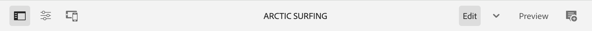

# AEM頁面編輯器 {#editing-page-content}

一旦您的頁面在 [**網站** 主控台，](/help/sites-cloud/authoring/sites-console/introduction.md) 您可以使用AEM頁面編輯器來編輯頁面的內容，這是用於編寫內容的強大工具。

>[!NOTE]
>
>在中編輯頁面時 [**網站** 主控台，](/help/sites-cloud/authoring/sites-console/introduction.md) 主控台將開啟適合頁面的編輯器 [範本：](/help/sites-cloud/authoring/sites-console/templates.md) 本檔案所述的頁面編輯器，或 [通用編輯器。](/help/sites-cloud/authoring/universal-editor/authoring.md)

>[!NOTE]
>
>您的帳戶需要適當的存取許可權才能編輯頁面。 如果您沒有許可權，請聯絡您的系統管理員。

## 方向 {#orientation}

AEM頁面編輯器主要由三個區段組成：

1. [工具列](#toolbar)  — 工具列可讓您快速存取以變更頁面模式並存取其他頁面設定。
1. [側面板](#side-panel)  — 側面板可讓您存取頁面元件和資產，以及其他編寫工具。
1. [編輯器](#editor)  — 編輯器是您變更內容並預覽內容的位置。

內容新增方式： [元件](/help/sites-cloud/authoring/components-console.md) （適用於內容型別）可拖曳至頁面上的物件。 接著，您就可以就地編輯、移動或刪除這些專案。

### 工具列 {#page-toolbar}

視頁面設定而定，頁面工具列會提供內容相關功能的存取權。

#### 側面板 {#side-panel-button}

這將會開啟/關閉 [側面板，](/help/sites-cloud/authoring/page-editor/editor-side-panel.md) 其中包含「資產瀏覽器」、「元件瀏覽器」和「內容樹」。

#### 頁面資訊 {#page-information}

這可讓您存取詳細的頁面資訊，包括頁面詳細資訊以及可在頁面上採取的動作，包括檢視和編輯頁面資訊、檢視頁面屬性以及發佈/取消發佈頁面。

**頁面資訊** 開啟一個下拉式功能表，提供有關所選頁面上次編輯和上次發佈的詳細資訊。 根據頁面、其網站和您的執行個體的特性，會有其他動作可用。

* [開啟屬性](/help/sites-cloud/authoring/sites-console/page-properties.md)
* [轉出頁面](/help/sites-cloud/administering/msm/overview.md#msm-from-the-ui)
* [啟動工作流程](/help/sites-cloud/authoring/workflows/applying.md#starting-a-workflow-from-the-page-editor)
* [鎖定頁面](/help/sites-cloud/authoring/page-editor/introduction.md#locking-unlocking)
* [發佈頁面](/help/sites-cloud/authoring/sites-console/publishing-pages.md#publishing-pages-1)
* [取消發佈頁面](/help/sites-cloud/authoring/sites-console/publishing-pages.md#unpublishing-pages)
* [編輯範本](/help/sites-cloud/authoring/sites-console/templates.md)
* [以已發佈狀態檢視](/help/sites-cloud/authoring/page-editor/introduction.md#view-as-published)
* [在 Admin 中檢視](/help/sites-cloud/authoring/basic-handling.md#viewing-and-selecting-resources)
* [說明](/help/sites-cloud/authoring/basic-handling.md#accessing-help)
* [提升啟動](/help/sites-cloud/authoring/launches/promoting.md) （僅限頁面為啟動時）

此外， **頁面資訊** 適時提供對analytics和建議的存取權。

#### 模擬器 {#emulator}

如此可切換 [模擬器工具列](/help/sites-cloud/authoring/page-editor/responsive-layout.md#selecting-a-device-to-emulate)，用來模擬頁面在其他裝置上的外觀。 這會在版面配置模式中自動啟用。

#### ContextHub {#context-hub}

如此將可開啟 [ContextHub。](/help/sites-cloud/authoring/personalization/contexthub.md) 它僅適用於 **預覽** 模式。

#### 頁面標題 {#page-title}

這是網頁的標題，以大寫字母呈現作為資訊。

#### 模式選擇器 {#mode-selector}

模式選取器會顯示目前的 [模式](/help/sites-cloud/authoring/page-editor/introduction.md#mode-selector) 並可讓您選取其他模式，例如編輯、版面、時間扭曲或定位。

編輯頁面時，有多種模式可允許不同的動作：

* [編輯](/help/sites-cloud/authoring/page-editor/edit-content.md)  — 編輯頁面內容時所使用的模式
* [版面](/help/sites-cloud/authoring/page-editor/responsive-layout.md)  — 讓您根據裝置建立及編輯回應式配置（如果頁面以配置容器為基礎）
* [目標定位](/help/sites-cloud/authoring/personalization/targeted-content.md)  — 透過所有管道的目標定位和測量，改善內容關聯性
* [時間扭曲](/help/sites-cloud/authoring/sites-console/page-versions.md#timewarp)  — 檢視特定時間點的頁面狀態
* [即時副本狀態](/help/sites-cloud/authoring/page-editor/introduction.md#live-copy-status)  — 可讓您快速概略瞭解即時副本狀態以及不會繼承哪些元件
* [開發人員模式](/help/implementing/developing/tools/developer-mode.md)
* [預覽](/help/sites-cloud/authoring/page-editor/introduction.md#previewing-pages)  — 檢視發佈環境中顯示的頁面；或使用內容中的連結進行導覽
* [註解](/help/sites-cloud/authoring/page-editor/annotations.md)  — 新增或檢視頁面上的註解

>[!NOTE]
>
>* 視頁面的特性而定，某些模式可能無法使用。
>* 存取某些模式需要適當的許可權。
>* 由於空間限制，開發人員模式不適用於行動裝置。
>* 有一個 [鍵盤快速鍵](/help/sites-cloud/authoring/sites-console/keyboard-shortcuts.md) ( `Ctrl-Shift-M`)以在 **預覽** 和目前選取的模式(例如， **編輯**， **版面**、等等)。

#### 預覽 {#preview}

此 **預覽** 按鈕啟用 [預覽模式。](#preview-mode)，顯示發佈時顯示的頁面。

#### 注釋 {#annotate}

**註解** 模式可讓您新增 [註解](/help/sites-cloud/authoring/page-editor/annotations.md) 在檢閱頁面時移至頁面。 在第一個註解後，圖示會切換為指示頁面上註解數量的數字。

### 側面板 {#side-panel}

側面板可讓您存取三個不同的標籤。

* 新增內容至頁面的元件瀏覽器
* 用於將新資產新增至頁面的資產瀏覽器
* 瀏覽頁面結構的內容樹狀結構

請參閱檔案 [頁面編輯器側面板](/help/sites-cloud/authoring/page-editor/editor-side-panel.md) 以取得詳細資訊。

### 編輯者 {#editor}

在編輯器中，您可以直接變更頁面內容。 頁面會依您看到的方式呈現，您可以使用側面板中的資產或元件瀏覽器來拖放新內容，就地編輯內容。

## 編輯內容 {#editing-content}

現在您已瞭解頁面編輯器，您已準備好編輯您的內容。

請參閱檔案 [使用AEM頁面編輯器編輯內容](/help/sites-cloud/authoring/page-editor/edit-content.md) 以取得詳細資訊。

## 狀態通知 {#status-notification}

如果頁面是的一部分 [工作流程](/help/sites-cloud/authoring/workflows/overview.md) 或多個工作流程時，此資訊會顯示在編輯頁面時工具列下方的通知列中。

>[!NOTE]
>
>狀態列只對具有適當許可權的使用者帳戶可見。

通知會列出針對頁面執行的工作流程。 如果使用者涉及目前工作流程步驟，則選項為 [影響工作流程狀態](/help/sites-cloud/authoring/workflows/participating.md) 並取得更多工作流程的相關資訊，例如：

* **完成**  — 開啟 **完成工作專案** 對話方塊
* **委派**  — 開啟 **完成工作專案** 對話方塊
* **檢視詳細資料**  — 開啟 **詳細資料** 工作流程視窗

透過通知列完成及委派工作流程步驟的運作方式 [參與工作流程](/help/sites-cloud/authoring/workflows/participating.md) 從「通知」收件匣。

如果頁面受限於多個工作流程，則在通知的右端會顯示工作流程數量，並附上箭頭按鈕，讓您捲動瀏覽工作流程。

## 即時副本狀態 {#live-copy-status}

此 **即時副本狀態** 頁面模式可讓您快速概略瞭解即時副本狀態，以及不會繼承哪些元件：

* 綠色邊框：繼承
* 粉紅色邊框：繼承已取消

例如：

## 預覽頁面 {#previewing-pages}

預覽頁面有兩個選項：

* [預覽模式](#preview-mode)  — 快速就地預覽
* [以發佈的形式檢視](#view-as-published)  — 在新標籤中開啟頁面的完整預覽

>[!TIP]
>
>* 內容中的連結可檢視，但在中無法存取 **編輯** 模式。
>* 如果您想要使用連結來導覽，請使用任一預覽選項。
>* 使用 [鍵盤快速鍵](/help/sites-cloud/authoring/sites-console/keyboard-shortcuts.md) `Ctrl-Shift-M` 在預覽和上次選取的模式之間切換。

>[!NOTE]
>
>這兩個預覽選項都會設定WCM模式Cookie。

### 預覽模式 {#preview-mode}

編輯內容時，您可以使用預覽模式來預覽頁面。 此模式：

* 隱藏各種編輯機制，讓您快速檢視頁面在發佈時的顯示方式。
* 可讓您使用連結來導覽。
* 會 **非** 重新整理頁面內容。

製作時，使用頁面編輯器右上角的圖示即可使用預覽模式：

### 以已發佈狀態檢視 {#view-as-published}

此 **以發佈的形式檢視** 選項可從以下網址取得： [頁面資訊](#page-information) 功能表。 這會在新索引標籤中開啟頁面、重新整理內容，並完全依照頁面在發佈環境中的顯示方式顯示頁面。

## 鎖定和解鎖頁面 {#locking-unlocking}

AEM可讓您鎖定頁面，不讓其他人編輯內容。 當您對某個特定頁面進行大量編輯，或需要凍結頁面一段時間時，鎖定功能會很有用。

1. 選取 **頁面資訊** 圖示以開啟功能表。
1. 選取 **鎖定頁面** 選項。

鎖定後，頁面編輯器的工具列中會顯示鎖定符號。

解鎖頁面的方法非常類似於 [鎖定頁面](#locking-a-page). 鎖定頁面後，鎖定選項就會被解鎖動作取代。

>[!CAUTION]
>
>* 模擬使用者身份時可以執行鎖定頁面。 但是以這種方式鎖定的頁面只能由（客戶）使用被模擬的使用者解除鎖定。
>* 無法透過模擬鎖定頁面的使用者來解鎖頁面。
>* 如果鎖定頁面的使用者無法解鎖頁面，請聯絡客戶支援評估移除鎖定的選項。

## 復原和重做頁面編輯 {#undoing-and-redoing-page-edits}

下列圖示可讓您還原或重做動作。 這些會在適當時顯示在工具列中：

>[!TIP]
>
>* 此 [鍵盤快速鍵](/help/sites-cloud/authoring/sites-console/keyboard-shortcuts.md) `Ctrl-Z` 也可用來還原頁面編輯動作。
>* 鍵盤快速鍵 `Ctrl-Y` 也可用來重做頁面編輯動作。

>[!NOTE]
>
>請參閱檔案 [還原和重做限制](/help/sites-cloud/authoring/page-editor/undo-redo.md) 以取得復原和重做頁面編輯時可行功能的完整細節。
