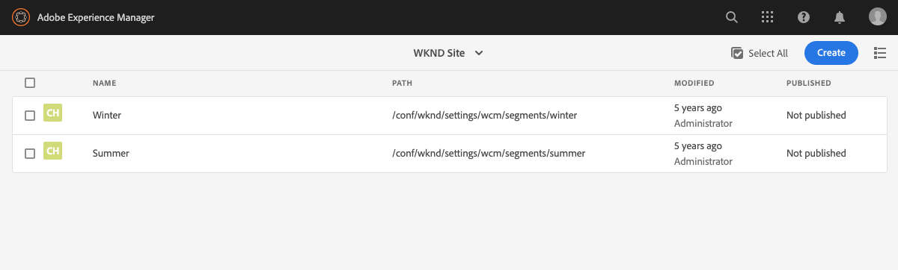
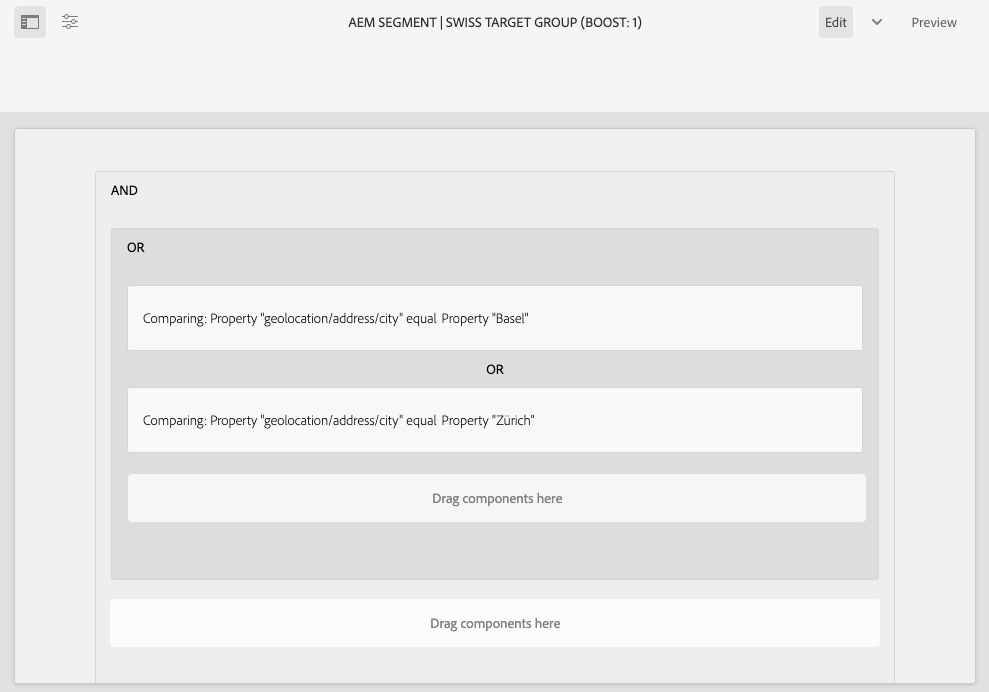
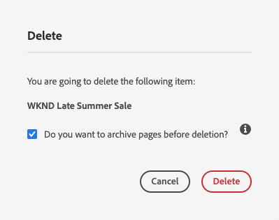

# 使用ContextHub配置分段{#configuring-segmentation-with-contexthub}

細分是建立市場活動時的一個關鍵考慮因素。 請參閱 [瞭解分段](segmentation.md) 分段的工作原理和關鍵術語。

根據您已經收集到的有關站點訪問者的資訊以及您想要實現的目標，您需要定義目標內容所需的段和策略。

然後，這些段被用於向訪問者提供特定的目標內容。 [活動](activities.md) 此處定義的內容可以包含在任何頁面上，並定義專用內容適用的訪問者段。

AEM讓您輕鬆個性化用戶體驗。 它還允許您驗證段定義的結果。

## 訪問段 {#accessing-segments}

的 [觀眾](audiences.md) 控制台用於管理ContextHub的網段以及您的Adobe Target帳戶的受眾。 本文檔介紹ContextHub的管理段。

要訪問網段，請在全局導航中選擇 **導航>個性化>受眾**。



## 區段編輯器 {#segment-editor}

<!--The **Segment Editor** allows you to easily modify a segment. To edit a segment, select a segment in the [list of segments](/help/sites-administering/segmentation.md#accessing-segments) and click the **Edit** button.-->
的 **段編輯器** 允許您輕鬆修改段。 要編輯段，請在段清單中選取段，然後按一下 **編輯** 按鈕


使用可添加的元件瀏覽器 **和** 和 **或** 容器以定義段邏輯，然後添加其他元件以比較屬性和值，或引用指令碼和其他段以定義選擇標準(請參閱 [建立新段](#creating-a-new-segment))，以定義選擇段的確切方案。

當整個語句的計算結果為true時，段即已解析。 倘多個分段適用，則 **提升** 也使用因子。 請參閱 [建立新段](#creating-a-new-segment) 關於助推因子的細節。

>[!CAUTION]
>
>段編輯器不檢查是否有任何循環引用。 例如，段A參照另一段B，該段B又參照段A。必須確保段不包含任何循環參照。

### 容器 {#containers}

以下容器是現成的，允許您將比較和引用分組在一起進行布爾值計算。 可將它們從元件瀏覽器拖到編輯器。 請參閱以下部分 [使用AND和OR容器](#using-and-and-or-containers) 的子菜單。

|  |  |
|---|---|
| 容器 AND | 布爾AND運算子 |
| 容器 OR | 布爾OR運算子 |

### 比較 {#comparisons}

以下段比較是現成的，可用於評估段屬性。 可將它們從元件瀏覽器拖到編輯器。

|  |  |
|---|---|
| 屬性值 | 將儲存的屬性與定義的值進行比較 |
| 屬性 — 屬性 | 將儲存的一個屬性與另一個屬性進行比較 |
| 屬性段引用 | 將儲存的屬性與另一個引用的段進行比較 |
| 屬性 — 指令碼引用 | 將儲存的屬性與指令碼的結果進行比較 |
| 段引用 — 指令碼引用 | 將引用的段與指令碼的結果進行比較 |

>[!NOTE]
>
>在比較值時，如果未設定比較的資料類型（即設定為自動檢測），則ContextHub的分段引擎將簡單地按照javascript的方式比較值。 它不會將值轉換為其預期類型，這可能導致誤導性結果。 例如：
>
>`null < 30 // will return true`
>
>因此，當 [建立段](#creating-a-new-segment)，您應選擇 **資料類型** 只要已知比較值的類型。 例如：
>
>比較屬性時 `profile/age`，您已經知道比較類型將 **數**&#x200B;如果 `profile/age` 未設定，比較 `profile/age` 不到30個將返回 **假**&#x200B;如你所料。

### 引用 {#references}

以下引用是現成的，可直接連結到指令碼或其他段。 可將它們從元件瀏覽器拖到編輯器。

|  |  |
|---|---|
| 區段引用 | 評估引用的段 |
| 指令碼引用 | 評估引用的指令碼。 請參閱以下部分 [使用指令碼引用](#using-script-references) 的子菜單。 |

## 建立新段 {#creating-a-new-segment}

要定義新段，請執行以下操作：

1. 之後 [訪問段](#accessing-segments)。 [導航到資料夾](#organizing-segments) 要建立段的位置，或將其保留在根中。

1. 點擊或按一下 **建立** 按鈕 **建立ContextHub段**。

   

1. 在 **新建ContextHub段**，輸入段的標題和提升值（如果需要），然後點擊或按一下 **建立**。

   

   每個段具有用作加權因子的提升參數。 數值越大，表示在多個段有效的情況下，將優先選擇數值越低的段。

   * 最小值： `0`
   * 最大值： `1000000`

1. 在段控制台中，編輯新建立的段，以在段編輯器中開啟它。
1. 將比較或引用拖到段編輯器中，該編輯器將出現在預設的AND容器中。
1. 按兩下或按一下新參照或段的配置選項以編輯特定參數。 在這個例子中，我們在測試巴塞爾的員工。

   

   始終設定 **資料類型** 確保正確評估比較。 請參閱 [比較](#comparisons) 的子菜單。

1. 按一下 **完成** 保存定義：
1. 根據需要添加更多元件。 可以使用容器元件為AND和OR比較表達布爾表達式(請參見 [使用AND和或容器](#using-and-and-or-containers) )。 使用段編輯器，您可以刪除不再需要的元件，或將它們拖到語句中的新位置。

### 使用AND和OR容器 {#using-and-and-or-containers}

使用AND和OR容器元件，可在中構建複雜段AEM。 在做這些工作時，瞭解以下幾個基本點會有所幫助：

* 定義的頂級始終是最初建立的AND容器。 無法更改，但對段定義的其餘部分沒有影響。
* 確保將容器嵌套是合理的。 容器可以作為布爾表達式的括弧來查看。

以下示例用於選擇在我們的瑞士目標組中被視為訪問者：

```text
 People in Basel

 OR

 People in Zürich
```

首先，將OR容器元件放置在預設的AND容器中。 在「或」(OR)容器中，可以添加屬性或引用元件。



可根據需要嵌套多個AND和OR運算子。

### 使用指令碼引用 {#using-script-references}

通過使用指令碼引用元件，可將段屬性的評估委託給外部指令碼。 正確配置指令碼後，它可以用作段條件的任何其他元件。

#### 定義要引用的指令碼 {#defining-a-script-to-reference}

1. 將檔案添加到 `contexthub.segment-engine.scripts` 客戶端庫。
1. 實現返回值的函式。 例如：

   ```javascript
   ContextHub.console.log(ContextHub.Shared.timestamp(), '[loading] contexthub.segment-engine.scripts - script.profile-info.js');
   
   (function() {
       'use strict';
   
       /**
        * Sample script returning profile information. Returns user info if data is available, false otherwise.
        *
        * @returns {Boolean}
        */
       var getProfileInfo = function() {
           /* let the SegmentEngine know when script should be re-run */
           this.dependOn(ContextHub.SegmentEngine.Property('profile/age'));
           this.dependOn(ContextHub.SegmentEngine.Property('profile/givenName'));
   
           /* variables */
           var name = ContextHub.get('profile/givenName');
           var age = ContextHub.get('profile/age');
   
           return name === 'Joe' && age === 123;
       };
   
       /* register function */
       ContextHub.SegmentEngine.ScriptManager.register('getProfileInfo', getProfileInfo);
   
   })();
   ```

1. 註冊指令碼 `ContextHub.SegmentEngine.ScriptManager.register`。

如果指令碼依賴於其他屬性，則指令碼應調用 `this.dependOn()`。 例如，如果指令碼依賴 `profile/age`:

```javascript
this.dependOn(ContextHub.SegmentEngine.Property('profile/age'));
```

#### 引用指令碼 {#referencing-a-script}

1. 建立ContextHub段。
1. 添加 **指令碼引用** 元件。
1. 開啟 **指令碼引用** 元件。 如果 [正確配置](#defining-a-script-to-reference)，指令碼應在 **指令碼名稱** 下拉。

## 組織段 {#organizing-segments}

如果您有許多段，它們將變得難以作為平面清單進行管理。 在這種情況下，建立資料夾來管理段會非常有用。

### 建立新資料夾 {#create-folder}

1. 之後 [訪問段](#accessing-segments)，按一下或點擊 **建立** 按鈕 **資料夾**。

   

1. 提供 **標題** 和 **名稱** 資料夾。
   * 的 **標題** 應該是描述性的。
   * 的 **名稱** 將成為儲存庫中的節點名稱。
      * 根據標題自動生成並根據 [命AEM名約定。](/help/implementing/developing/introduction/naming-conventions.md)
      * 必要時可進行調整。

   

1. 點擊或按一下 **建立**。

   

1. 資料夾將出現在段清單中。
   * 對列的排序方式將影響新資料夾在清單中的顯示位置。
   * 您可以點擊或按一下列標題來調整排序。
      

### 修改現有資料夾 {#modify-folders}

1. 之後 [訪問段](#accessing-segments)，按一下或點擊要修改的資料夾以選擇它。

   

1. 點擊或按一下 **更名** 的子菜單。

1. 提供新 **資料夾標題** 點擊並按一下 **保存**。

   

>[!NOTE]
>
>更名資料夾時，只能更改標題。 無法更改名稱。

### 刪除資料夾

1. 之後 [訪問段](#accessing-segments)，按一下或點擊要修改的資料夾以選擇它。

   

1. 點擊或按一下 **刪除** 的子菜單。

1. 對話框顯示選定要刪除的資料夾清單。

   

   * 點擊或按一下 **刪除** 確認。
   * 點擊或按一下 **取消** 中止。

1. 如果任何選定資料夾包含子資料夾或段，則必須確認刪除。

   

   * 點擊或按一下 **強制刪除** 確認。
   * 點擊或按一下 **取消** 中止。

>[!NOTE]
>
> 無法將段從一個資料夾移動到另一個資料夾。

## 測試段的應用 {#testing-the-application-of-a-segment}

定義該段後，可借助 **[上下文中心](contexthub.md)。**

1. 預覽頁面
1. 按一下ContextHub表徵圖以顯示ContextHub工具欄
1. 選擇與您建立的段匹配的角色
1. ContextHub將解析所選角色的適用段

例如，我們在巴塞爾中識別用戶的簡單段定義是基於用戶的位置。 載入符合這些條件的特定角色將顯示該段是否成功解析：


或者，如果沒有解決：


>[!NOTE]
>
>所有特徵都會立即解析，儘管大多數情況只在重新載入頁面時更改。

這種test也可以在內容頁面上和與目標內容和相關內容組合執行 **活動** 和 **體驗**。

如果您已設定活動和體驗，則可以輕鬆將段與活動test。 有關設定活動的詳細資訊，請參閱相關 [創作目標內容的文檔](targeted-content.md)。

1. 在已設定目標內容的頁面的編輯模式下，您可以通過內容上的箭頭表徵圖看到內容是目標的。
1. 切換到預覽模式並使用上下文中心，切換到與為體驗配置的分段不匹配的角色。
1. 切換到與為體驗配置的分段相匹配的個人角色，並查看體驗會相應地改變。

## 使用段 {#using-your-segment}

段用於控制特定目標受眾看到的實際內容。 請參閱 [管理受眾](audiences.md) 以獲取有關觀眾和網段的詳細資訊 [創作目標內容](targeted-content.md) 關於使用受眾和片段來目標內容。
