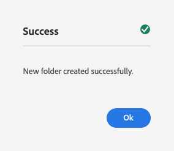

# 使用ContextHub設定區段{#configuring-segmentation-with-contexthub}

區段是建立促銷活動時的主要考量。 請參閱 [了解區段](segmentation.md) 以了解分段的運作方式和主要術語。

根據您已收集的網站訪客相關資訊以及您要達成的目標，您需要定義目標內容所需的區段和策略。

然後，這些區段會用來為訪客提供特定目標內容。 [活動](activities.md) 可在任何頁面上納入此處定義，並定義專用內容適用的訪客區段。

AEM可讓您輕鬆個人化使用者的體驗。 也可讓您驗證區段定義的結果。

## 存取區段 {#accessing-segments}

此 [對象](audiences.md) console可用來管理ContextHub的區段，以及Adobe Target帳戶的對象。 本檔案涵蓋管理ContextHub的區段。

若要存取區段，請在全域導覽中選取 **導覽>個人化>對象**.


## 區段編輯器 {#segment-editor}

<!--The **Segment Editor** allows you to easily modify a segment. To edit a segment, select a segment in the [list of segments](/help/sites-administering/segmentation.md#accessing-segments) and click the **Edit** button.-->
此 **區段編輯器** 可讓您輕鬆修改區段。 若要編輯區段，請在區段清單中選取區段，然後按一下 **編輯** 按鈕。


使用可新增的元件瀏覽器 **和** 和 **或** 容器來定義區段邏輯，然後新增其他元件來比較屬性和值，或參考指令碼和其他區段來定義選取標準(請參閱 [建立新區段](#creating-a-new-segment))來定義選取區段的確切案例。

當整個陳述式評估為true時，區段便已解析。 若適用多個區段，則 **提升** 也會使用因素。 請參閱 [建立新區段](#creating-a-new-segment) 關於提升因子的細節。

>[!CAUTION]
>
>區段編輯器不會檢查任何循環參照。 例如，區段A會參照另一個區段B，而這反過來又會參照區段A。您必須確定您的區段不含任何循環參照。

### 容器 {#containers}

下列容器是現成可用的，可讓您將比較和參考群組在一起以進行布林值評估。 可將元件從元件瀏覽器拖曳至編輯器。 請參閱下節 [使用AND和OR容器](#using-and-and-or-containers) 以取得更多資訊。

|  |  |
|---|---|
| 容器 AND | 布林值AND運算子 |
| 容器 OR | 布林值OR運算子 |

### 比較 {#comparisons}

下列區段比較是現成可用的評估區段屬性。 可將元件從元件瀏覽器拖曳至編輯器。

|  |  |
|---|---|
| Property-Value | 將儲存的屬性與定義值比較 |
| Property-Property | 將儲存的一個屬性與另一個屬性比較 |
| 屬性區段參考資料 | 將商店的屬性與其他參考區段比較 |
| 屬性指令碼參考 | 將儲存的屬性與指令碼的結果進行比較 |
| 區段參考指令碼參考 | 將參考的區段與指令碼的結果比較 |

>[!NOTE]
>
>比較值時，如果未設定比較的資料類型（即設為自動偵測）,ContextHub的分段引擎只會像Javascript一樣比較值。 它不會將值轉換為其預期類型，而可能導致誤導結果。 例如：
>
>`null < 30 // will return true`
>
>因此，當 [建立區段](#creating-a-new-segment)，您應選取 **資料類型** 只要已知比較值的類型。 例如：
>
>比較屬性時 `profile/age`，您已知比較類型將 **數字**，因此，即使 `profile/age` 未設定，則會比較 `profile/age` 將返回少於30個 **false**，如您預期。

### 引用 {#references}

下列參考資料是現成可用的，可直接連結至指令碼或其他區段。 可將元件從元件瀏覽器拖曳至編輯器。

|  |  |
|---|---|
| 區段引用 | 評估參考區段 |
| 指令碼引用 | 評估引用的指令碼。 請參閱下節 [使用指令碼參考](#using-script-references) 以取得更多資訊。 |

## 建立新區段 {#creating-a-new-segment}

若要定義新區段：

1. 之後 [存取區段](#accessing-segments), [導覽至資料夾](#organizing-segments) 建立區段或將其保留在根目錄中的位置。

1. 點選或按一下 **建立** 按鈕並選取 **建立ContextHub區段**.

   

1. 在 **新的ContextHub區段**，視需要輸入區段的標題以及提升值，然後點選或按一下 **建立**.

   

   每個區段都有一個提升參數，用作加權因數。 數字越高，表示在多個區段有效的情況下，會優先選取區段，而選取的數字越低。

   * 最小值： `0`
   * 最大值： `1000000`

1. 在區段控制台中，編輯新建立的區段，以在區段編輯器中開啟。
1. 將比較或參考拖曳至區段編輯器，該編輯器會顯示在預設的AND容器中。
1. 按兩下或點選新參照或區段的設定選項，以編輯特定參數。 在此範例中，我們正在測試巴塞爾中的人員。

   

   一律設定 **資料類型** 以確保對比結果進行正確評估。 請參閱 [比較](#comparisons) 以取得更多資訊。

1. 按一下 **完成** 若要儲存定義：
1. 視需要新增更多元件。 您可以使用容器元件來制定布林運算式，以用於AND和OR比較(請參閱 [使用AND和Or容器](#using-and-and-or-containers) )。 使用區段編輯器，您可以刪除不再需要的元件，或將其拖曳至陳述式內的新位置。

### 使用AND和OR容器 {#using-and-and-or-containers}

您可以使用AND和OR容器元件，在AEM中建立複雜的區段。 執行此作業時，請注意以下幾個基本要點：

* 定義的頂層一律為最初建立的AND容器。 無法變更，但對其餘的區段定義沒有影響。
* 確保容器的巢狀有意義。 容器可以視為布林運算式的方括弧。

以下範例用於選取在我們的瑞士目標群組中被視為的訪客：

```text
 People in Basel

 OR

 People in Zürich
```

首先，將OR容器元件放在預設的AND容器內。 在OR容器內，您可以新增屬性或參照元件。


您可以視需要巢狀內嵌多個AND和OR運算子。

### 使用指令碼參考 {#using-script-references}

使用指令碼參考元件，可將區段屬性的評估委派給外部指令碼。 指令碼正確設定後，即可作為區段條件的任何其他元件使用。

#### 定義要參考的指令碼 {#defining-a-script-to-reference}

1. 將檔案添加到 `contexthub.segment-engine.scripts` clientlib 。
1. 實作可傳回值的函式。 例如：

   ```javascript
   ContextHub.console.log(ContextHub.Shared.timestamp(), '[loading] contexthub.segment-engine.scripts - script.profile-info.js');
   
   (function() {
       'use strict';
   
       /**
        * Sample script returning profile information. Returns user info if data is available, false otherwise.
        *
        * @returns {Boolean}
        */
       var getProfileInfo = function() {
           /* let the SegmentEngine know when script should be re-run */
           this.dependOn(ContextHub.SegmentEngine.Property('profile/age'));
           this.dependOn(ContextHub.SegmentEngine.Property('profile/givenName'));
   
           /* variables */
           var name = ContextHub.get('profile/givenName');
           var age = ContextHub.get('profile/age');
   
           return name === 'Joe' && age === 123;
       };
   
       /* register function */
       ContextHub.SegmentEngine.ScriptManager.register('getProfileInfo', getProfileInfo);
   
   })();
   ```

1. 向註冊指令碼 `ContextHub.SegmentEngine.ScriptManager.register`.

如果指令碼依賴其他屬性，指令碼應呼叫 `this.dependOn()`. 例如，如果指令碼依賴 `profile/age`:

```javascript
this.dependOn(ContextHub.SegmentEngine.Property('profile/age'));
```

#### 參考指令碼 {#referencing-a-script}

1. 建立ContextHub區段。
1. 新增 **指令碼參考** 元件。
1. 開啟 **指令碼參考** 元件。 若 [正確配置](#defining-a-script-to-reference)，指令碼應可在 **指令碼名稱** 下拉式清單。

## 組織區段 {#organizing-segments}

如果您有許多區段，可能會變得難以作為平面清單管理。 在這種情況下，建立資料夾以管理區段會很實用。

### 建立新資料夾 {#create-folder}

1. 之後 [存取區段](#accessing-segments)，按一下或點選 **建立** 按鈕並選取 **資料夾**.

   

1. 提供 **標題** 和 **名稱** 的URL。
   * 此 **標題** 應是描述性的。
   * 此 **名稱** 會成為存放庫中的節點名稱。
      * 根據標題自動產生並根據 [AEM命名慣例。](/help/implementing/developing/introduction/naming-conventions.md)
      * 如有需要，可加以調整。

   

1. 點選或按一下 **建立**.

   

1. 資料夾會出現在區段清單中。
   * 欄的排序方式會影響清單中出現新資料夾的位置。
   * 您可以點選或按一下欄標題來調整排序。
      

### 修改現有資料夾 {#modify-folders}

1. 之後 [存取區段](#accessing-segments)，按一下或點選您要修改的資料夾以選取它。

   

1. 點選或按一下 **重新命名** ，以更名資料夾。

1. 提供新 **資料夾標題** 點選或按一下 **儲存**.

   

>[!NOTE]
>
>重新命名資料夾時，只能變更標題。 無法更改名稱。

### 刪除資料夾

1. 之後 [存取區段](#accessing-segments)，按一下或點選您要修改的資料夾以選取它。

   

1. 點選或按一下 **刪除** ，刪除資料夾。

1. 對話框顯示選定刪除的資料夾清單。

   

   * 點選或按一下 **刪除** 確認。
   * 點選或按一下 **取消** 中止。

1. 如果任何選取的資料夾包含子資料夾或區段，則必須確認刪除。

   

   * 點選或按一下 **強制刪除** 確認。
   * 點選或按一下 **取消** 中止。

>[!NOTE]
>
> 無法將區段從一個資料夾移至另一個資料夾。

## 測試區段的應用程式 {#testing-the-application-of-a-segment}

定義區段後，即可在 **[ContextHub](contexthub.md).**

1. 預覽頁面
1. 按一下ContextHub圖示以顯示ContextHub工具列
1. 選取符合您建立之區段的角色
1. ContextHub將解析所選角色的適用區段

例如，我們在巴塞爾中用來識別使用者的簡單區段定義，是根據使用者的位置而定。 載入符合這些條件的特定角色會顯示區段是否已成功解析：


或者，如果尚未解決：


>[!NOTE]
>
>所有特徵都會立即解析，不過大部分只會在頁面重新載入時變更。

此類測試也可以在內容頁面上執行，並與目標內容及相關內容結合 **活動** 和 **體驗**.

如果您已設定活動和體驗，則可以使用活動輕鬆測試您的區段。 如需設定活動的詳細資訊，請參閱相關 [製作目標內容的檔案](targeted-content.md).

1. 在您已設定目標內容之頁面的編輯模式中，您可以透過內容上的箭頭圖示看到內容已成為目標。
1. 切換至預覽模式，並使用內容中樞，切換至不符合為體驗設定之分段的角色。
1. 切換至符合為體驗設定的分段的角色，並查看體驗會隨之變更。

## 使用您的區段 {#using-your-segment}

區段可用來控制特定目標對象所檢視的實際內容。 請參閱 [管理對象](audiences.md) 如需關於對象和區段的詳細資訊，請參閱 [製作目標內容](targeted-content.md) 關於使用對象和區段來鎖定內容。
