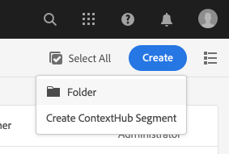

# 使用 ContextHub 設定分段{#configuring-segmentation-with-contexthub}

細分是建立行銷活動時的關鍵考量。 請參閱[瞭解分段](segmentation.md)，瞭解分段運作方式和重要術語的相關資訊。

根據您已收集到的網站訪客相關資訊以及您想要達成的目標，定義目標內容所需的區段和策略。

接著，這些區段可用來向訪客提供明確鎖定的目標內容。 此處定義的[活動](activities.md)可包含在任何頁面上，並定義專用內容適用的訪客區段。

AEM可讓您輕鬆個人化您的使用者體驗。 它也可讓您驗證區段定義的結果。

## 存取區段 {#accessing-segments}

[Audiences](audiences.md)主控台是用來管理ContextHub的區段和Adobe Target帳戶的對象。 本檔案說明如何管理ContextHub的區段。

若要存取您的區段，請在全域導覽中選取&#x200B;**導覽> Personalization >對象**。 選取您的設定（例如WKND Site）以檢視您的區段：


## 區段編輯器 {#segment-editor}

<!--The **Segment Editor** lets you easily modify a segment. To edit a segment, select a segment in the [list of segments](/help/sites-administering/segmentation.md#accessing-segments) and click the **Edit** button.-->
**區段編輯器**&#x200B;可讓您輕鬆修改區段。 若要編輯區段，請在區段清單中選取區段，然後按一下&#x200B;**編輯**&#x200B;按鈕。


使用元件瀏覽器，您可以新增&#x200B;**AND**&#x200B;和&#x200B;**OR**&#x200B;容器來定義區段邏輯，然後新增其他元件來比較屬性和值，或參考指令碼和其他區段來定義選取條件（請參閱[建立新區段](#creating-a-new-segment)），以定義選取區段的確切案例。

當整個陳述式評估為true時，表示區段已解析。 在適用多個區段的情況下，也會使用&#x200B;**提升**&#x200B;係數。 請參閱[建立新區段](#creating-a-new-segment)，以取得有關提升因子的詳細資訊。

>[!CAUTION]
>
>區段編輯器不會檢查任何循環參照。 例如，區段A參照另一個區段B，而後者又參照區段A。您必須確保區段不包含任何循環參照。

### 容器 {#containers}

下列容器是現成可用的容器，可讓您將比較和參照群組在一起，以進行布林值評估。 它們可從元件瀏覽器拖曳至編輯器。 如需詳細資訊，請參閱下列章節[使用AND和OR容器](#using-and-and-or-containers)。

|  |  |
|---|---|
| 容器 AND | 布林值AND運運算元 |
| 容器 OR | 布林值OR運運算元 |

### 比較 {#comparisons}

下列區段比較是現成可用的功能，可供評估區段屬性。 它們可從元件瀏覽器拖曳至編輯器。

|  |  |
|---|---|
| 屬性 — 值 | 將存放區的屬性與定義的值比較 |
| Property-Property | 比較存放區的一個屬性與另一個屬性 |
| Property-Segment參考 | 將存放區的屬性與另一個參照的區段比較 |
| Property-Script參考 | 比較存放區的屬性與指令碼的結果 |
| 區段Reference指令碼引用 | 將參照的區段與指令碼的結果進行比較 |

>[!NOTE]
>
>在比較值時，如果未設定比較的資料型別（亦即設為自動偵測），ContextHub的區段引擎會像javascript一樣簡單地比較值。 它不會將值轉換為預期型別，這可能導致誤導性的結果。 例如：
>
>`null < 30 // will return true`
>
>因此，當[建立區段](#creating-a-new-segment)時，只要比較值的型別是已知的，您就應該選取&#x200B;**資料型別**。 例如：
>
>比較屬性`profile/age`時，您已知道比較的型別是&#x200B;**number**，因此即使未設定`profile/age`，比較小於30的`profile/age`會如您預期傳回&#x200B;**false**。

### 參考 {#references}

下列是現成可用的參考，可直接連結至指令碼或其他區段。 它們可從元件瀏覽器拖曳至編輯器。

|  |  |
|---|---|
| 區段引用 | 評估引用的區段 |
| 指令碼引用 | 評估參照的指令碼。 如需詳細資訊，請參閱下列章節[使用指令碼參考](#using-script-references)。 |

## 建立新區段 {#creating-a-new-segment}

若要定義新區段，請執行下列動作：

1. 在[存取區段](#accessing-segments)後，[導覽至您要建立區段的資料夾](#organizing-segments)。

1. 選取&#x200B;**建立**&#x200B;按鈕，然後選取&#x200B;**建立ContextHub區段**。

   

1. 在&#x200B;**新ContextHub區段**&#x200B;中，輸入區段的標題及提升值（如有需要），然後選取&#x200B;**建立**。

   

   每個區段都有boost引數，可當作加權係數使用。 數字越大，表示選取區段時優先選取數字較小的區段，因為有多個區段有效。

   * 最小值： `0`
   * 最大值： `1000000`

1. 在區段控制檯中，編輯您建立的區段以在區段編輯器中開啟該區段。
1. 將比較或參考拖曳至區段編輯器，該比較或參考會出現在預設的AND容器中。
1. 連按兩下新參照或區段的設定選項，即可編輯特定引數。 在此範例中，我們正在測試巴塞爾的人員。

   

   一律設定&#x200B;**資料型別** （如果可能），以確保正確評估您的比較。 如需詳細資訊，請參閱[比較](#comparisons)。

1. 按一下&#x200B;**完成**&#x200B;以儲存您的定義：
1. 視需要新增更多元件。 您可以使用AND和OR比較的容器元件來制定布林運算式（請參閱下方的[使用AND和OR容器](#using-and-and-or-containers)）。 使用區段編輯器，您可以刪除不再需要的元件，或將其拖曳至陳述式中的新位置。

### 使用AND和OR容器 {#using-and-and-or-containers}

您可以使用AND和OR容器元件，在AEM中建構複雜的區段。 在執行此操作時，瞭解一些基本要點會有所幫助：

* 定義的最上層永遠是最初建立的AND容器。 這無法變更，但不會影響區段定義的其餘部分。
* 確定容器的巢狀內嵌有意義。 容器可視為布林運算式的括弧。

下列範例是用來選取被視為在瑞士目標群組中的訪客：

```text
 People in Basel

 OR

 People in Zürich
```

首先，請將OR容器元件放入預設的AND容器中。 在OR容器中，您可以新增屬性或參照元件。

的區段

您可以視需要巢狀內嵌多個AND和OR運運算元。

### 使用指令碼參照 {#using-script-references}

透過使用指令碼參考元件，區段屬性的評估可委派給外部指令碼。 正確設定指令碼後，即可當成區段條件的任何其他元件使用。

#### 定義要參考的指令碼 {#defining-a-script-to-reference}

1. 新增檔案至`contexthub.segment-engine.scripts` clientlib。
1. 實作會傳回值的函式。 例如：

   ```javascript
   ContextHub.console.log(ContextHub.Shared.timestamp(), '[loading] contexthub.segment-engine.scripts - script.profile-info.js');
   
   (function() {
       'use strict';
   
       /**
        * Sample script returning profile information. Returns user info if data is available, false otherwise.
        *
        * @returns {Boolean}
        */
       var getProfileInfo = function() {
           /* let the SegmentEngine know when script should be re-run */
           this.dependOn(ContextHub.SegmentEngine.Property('profile/age'));
           this.dependOn(ContextHub.SegmentEngine.Property('profile/givenName'));
   
           /* variables */
           var name = ContextHub.get('profile/givenName');
           var age = ContextHub.get('profile/age');
   
           return name === 'Joe' && age === 123;
       };
   
       /* register function */
       ContextHub.SegmentEngine.ScriptManager.register('getProfileInfo', getProfileInfo);
   
   })();
   ```

1. 向`ContextHub.SegmentEngine.ScriptManager.register`註冊指令碼。

如果指令碼相依於其他屬性，指令碼應該呼叫`this.dependOn()`。 例如，如果指令碼相依於`profile/age`：

```javascript
this.dependOn(ContextHub.SegmentEngine.Property('profile/age'));
```

#### 參照指令碼 {#referencing-a-script}

1. 建立ContextHub區段。
1. 在區段的所需位置新增&#x200B;**指令碼參考**&#x200B;元件。
1. 開啟&#x200B;**指令碼參考**&#x200B;元件的編輯對話方塊。 如果[已正確設定](#defining-a-script-to-reference)，則應該可在&#x200B;**指令碼名稱**&#x200B;下拉式清單中取得指令碼。

## 組織區段 {#organizing-segments}

如果您有許多區段，將很難以平面清單形式管理。 在這種情況下，建立資料夾來管理區段會很有用。

### 建立新資料夾 {#create-folder}

1. 在[存取區段](#accessing-segments)之後，請選取&#x200B;**建立**&#x200B;按鈕，然後選取&#x200B;**資料夾**。

   

1. 為您的資料夾提供 **標題**&#x200B;和&#x200B;**名稱**。
   * **標題** 應該是描述性的。
   * **名稱**&#x200B;會成為存放庫中的節點名稱。
      * 它會根據標題自動產生，並根據 [AEM 命名慣例](/help/implementing/developing/introduction/naming-conventions.md)進行調整。
      * 如有需要，可加以調整。

   

1. 選取「**建立**」。

   

1. 資料夾會出現在區段清單中。
   * 排序欄的方式將影響新資料夾在清單中的顯示位置。
   * 您可以選取欄標題來調整您的排序。
     

### 修改現有資料夾 {#modify-folders}

1. 在[存取區段](#accessing-segments)之後，請選取您要修改的資料夾以選取它。

   

1. 選取工具列中的&#x200B;**重新命名**&#x200B;以重新命名資料夾。

1. 提供新的&#x200B;**資料夾標題**&#x200B;並選取&#x200B;**儲存**。

   

>[!NOTE]
>
>重新命名資料夾時，只能變更標題。 無法變更名稱。

### 刪除資料夾

1. 在[存取區段](#accessing-segments)之後，請選取您要修改的資料夾以選取它。

   

1. 選取工具列中的&#x200B;**刪除**&#x200B;以刪除資料夾。

1. 對話方塊會顯示選取要刪除的資料夾清單。

   

   * 選取&#x200B;**刪除**&#x200B;以進行確認。
   * 選取&#x200B;**取消**&#x200B;以中止。

1. 如果任何選取的資料夾包含子資料夾或區段，則必須確認將其刪除。

   

   * 選取&#x200B;**強制刪除**&#x200B;以確認。
   * 選取&#x200B;**取消**&#x200B;以中止。

>[!NOTE]
>
> 無法將區段從一個資料夾移至另一個資料夾。

## 測試區段的應用 {#testing-the-application-of-a-segment}

定義區段後，可以在&#x200B;**[ContextHub](contexthub.md).**&#x200B;的協助下測試潛在結果

1. 預覽頁面
1. 按一下ContextHub圖示以顯示ContextHub工具列
1. 選取符合您建立之區段的角色
1. ContextHub將為所選角色解析適用的區段

例如，在巴塞爾識別使用者的簡單區段定義是根據使用者的位置而定。 載入符合這些條件的特定角色會顯示是否成功解析該區段：


或者，如果未解析：


>[!NOTE]
>
>所有特徵會立即解析，但大多數只會隨著頁面重新載入而變更。

這類測試也可以在內容頁面上執行，並與目標內容和相關的&#x200B;**活動**&#x200B;和&#x200B;**體驗**&#x200B;相結合。

如果您已設定活動和體驗，您可以使用活動輕鬆測試區段。 如需有關設定活動的詳細資訊，請參閱有關編寫目標內容](targeted-content.md)的[檔案。

1. 在您設定目標內容的頁面的編輯模式中，您可以看到已透過內容上的箭頭圖示目標內容。
1. 切換到預覽模式並使用內容中樞，切換到與為體驗設定的分段不符的角色。
1. 切換至與為體驗設定的分段不符的角色，並檢視體驗的相應變更。

## 使用您的區段 {#using-your-segment}

區段是用來控制特定目標對象所看到的實際內容。 請參閱[管理對象](audiences.md)，以取得有關對象和區段的詳細資訊，並參閱[撰寫鎖定目標內容](targeted-content.md)，瞭解如何使用對象和區段來鎖定內容。
