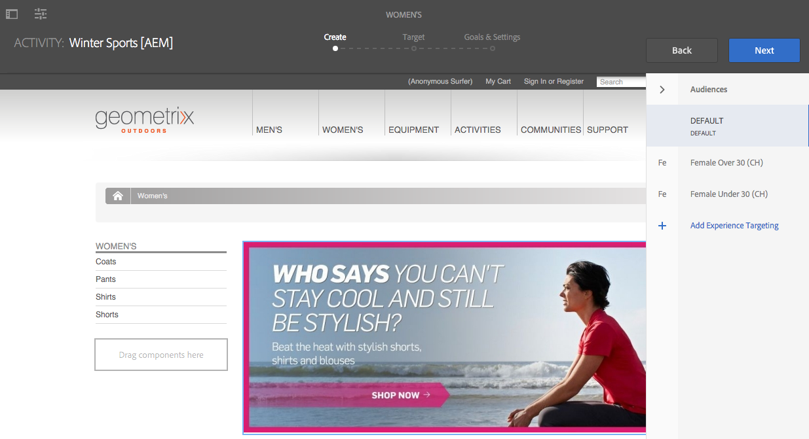

# 使用定位模式製作目標內容 {#authoring-targeted-content-using-targeting-mode}

使用AEM的鎖定模式製作鎖定內容。 目標定位模式和Target元件提供建立體驗內容的工具：

* 輕鬆辨識頁面上的目標內容。 虛線會在所有目標內容周圍形成邊框。
* 選取品牌和活動以檢視體驗。
* 新增體驗至活動或移除體驗。
* 執行A/B測試並轉換獲勝者(僅限Adobe Target)。
* 透過建立選件或使用資料庫中的選件，將選件新增到體驗。
* 設定目標並監控效能。
* 模擬使用者體驗。
* 如需更多自訂內容，請設定Target元件。

>[!NOTE]
>
>定位模式適用於頁面編輯器和體驗片段編輯器。
>
>以下檔案適用於兩者（因為它們都在相同的基礎上運作），儘管它是為頁面編輯器所撰寫。

>[!CAUTION]
>
>在頁面編輯器中鎖定目標時，只能鎖定體驗片段元件。
>
>其他元件型別可使用元件工具列上的&#x200B;**轉換為體驗片段變數**&#x200B;圖示來轉換為體驗片段。

<!--
>Other component types can be converted to an Experience Fragment using the **Convert to experience fragment variation** icon on the component toolbar:
>
>
-->

您可以使用AEM或Adobe Target作為目標定位引擎(您必須具備有效的Adobe Target帳戶才能使用Adobe Target)。 如果您使用Adobe Target，必須先設定整合。 請參閱與Adobe Target](/help/sites-cloud/integrating/integrating-adobe-target.md)整合的[指示。

您在Target模式中看到的活動和體驗會反映[活動主控台](/help/sites-cloud/authoring/personalization/activities.md)：

* 您使用鎖定目標模式對活動和體驗所做的變更，會反映在「活動」主控台中。
* 在「活動」主控台中進行的變更會反映在「鎖定目標」模式中。

>[!NOTE]
>
>當您在Adobe Target中建立行銷活動時，會指派名為`thirdPartyId`的屬性給每個行銷活動。 在Adobe Target中刪除行銷活動時，不會刪除thirdPartyId。 您無法對不同型別(AB、XT)的行銷活動重複使用`thirdPartyId`，也無法手動移除它。 為避免此問題，請為每個行銷活動命名一個唯一的名稱；行銷活動名稱不能在不同行銷活動型別中重複使用。
>
>如果在相同的行銷活動型別中使用相同的名稱，則會覆寫現有的行銷活動。
>
>如果在同步處理時，您遇到「要求失敗」錯誤。 `thirdPartyId`已存在」，請變更行銷活動的名稱，然後重新進行同步。

>[!NOTE]
>
>鎖定目標時，品牌和活動組合會保留在使用者層級，而不是頻道層級。

## 切換至目標定位模式 {#switching-to-targeting-mode}

切換至Target模式以存取用於編寫目標內容的工具。

若要切換至目標模式：

1. 開啟您要為其創作目標內容的頁面。
1. 在頁面頂端的工具列上，選取模式下拉式功能表以顯示可用的模式型別。

   

1. 選取&#x200B;**目標**。 鎖定目標選項會顯示在頁面頂端。

   

## 使用定位模式新增活動 {#adding-an-activity-using-targeting-mode}

使用目標定位模式將活動新增至品牌。 新增活動時，它包含預設體驗。 新增活動後，您就會開始活動的內容鎖定目標程式。

您也可以選擇目標引擎(AEM或Adobe Target)並選取活動型別 — 體驗鎖定目標或A/B測試，從AEM建立和管理Adobe Target活動。

此外，您可以管理所有Adobe Target活動的目標與量度，並管理您的Adobe Target對象。 Adobe Target活動報告也包含在內，包括A/B測試的獲勝者轉換。

新增活動時，活動也會出現在[活動主控台](/help/sites-cloud/authoring/personalization/activities.md)中。

若要新增活動：

1. 使用&#x200B;**品牌**&#x200B;下拉式功能表來選取您要建立活動的品牌。

   >[!NOTE]
   >
   >建議透過活動主控台[建立品牌](/help/sites-cloud/authoring/personalization/activities.md#creating-a-brand-using-the-activities-console)。
   >
   >
   >如果您以任何其他方式建立品牌，請確定節點`/campaigns/<brand>/master`存在，否則在您嘗試建立活動時將產生錯誤。

1. 選取&#x200B;**活動**&#x200B;下拉式功能表旁的+。
1. 輸入活動的名稱。

   >[!NOTE]
   >
   >當您建立活動且已將Adobe Target雲端設定附加至頁面或其其中一個父頁面時，AEM會自動將Adobe Target視為引擎。

1. 在&#x200B;**鎖定目標**&#x200B;引擎下拉式功能表中，選取您的鎖定目標引擎。

   * 如果您選取&#x200B;**ContextHub AEM**，則其餘欄位會變暗且無法使用。 選取「**建立**」。

   * 如果您選取&#x200B;**Adobe Target**，則可以選取設定（預設為您設定帳戶時提供的設定）和活動型別。<!--If you select **Adobe Target**, you can select a configuration (by default, it is the configuration you provided when you [configured the account](/help/sites-administering/opt-in.md)) and Activity Type.-->

1. 在活動功能表中，選取&#x200B;**體驗鎖定目標**&#x200B;或&#x200B;**A/B測試**。

   * 體驗鎖定目標 — 從AEM管理Adobe Target活動。
   * A/B測試 — 從AEM在Adobe Target中建立/管理A/B測試活動。

## 目標定位程式：建立、目標定位、目標與設定 {#the-targeting-process-create-target-and-goals-settings}

鎖定目標模式可讓您設定活動的數個層面。 使用下列三個步驟的流程來建立品牌活動的目標內容：

1. [建立](#create-authoring-the-experiences)：新增或移除體驗，並為每個體驗新增選件。
1. [目標](#target-configuring-the-audiences)：指定每個體驗鎖定的對象。 您可以鎖定特定對象，如果使用A/B測試決定流向哪個體驗的流量百分比。
1. [目標與設定](#goals-settings-configuring-the-activity-and-setting-goals)：排程活動並設定優先順序。 您也可以設定成功量度目標。

使用以下程式，開始活動的內容目標定位程式。

>[!NOTE]
>
>若要使用目標定位程式，您必須是Target活動作者使用者群組的成員。

若要新增活動：

1. 在&#x200B;**品牌**&#x200B;下拉式功能表中，選取包含您正在處理之活動的品牌。
1. 在&#x200B;**活動**&#x200B;下拉式功能表中，選取您要編寫目標內容的活動。
1. 若要顯示引導您完成鎖定目標程式的控制項，請選取&#x200B;**開始鎖定目標**。

   

   >[!NOTE]
   >
   >若要變更您正在使用的活動，請選取&#x200B;**上一步**。

## 建立：編寫體驗 {#create-authoring-the-experiences}

內容目標定位的「建立」步驟涉及建立體驗。 在此步驟中，您可以建立或刪除活動的體驗，並將選件新增至每個體驗。

### 在目標定位模式中檢視體驗選件 {#seeing-experience-offers-in-targeting-mode}

在您[開始鎖定目標程式](#the-targeting-process-create-target-and-goals-settings)之後，請選取一個體驗以檢視為該體驗提供的選件。 當您選取體驗時，頁面上的目標元件會變更，顯示該體驗的選件。

>[!CAUTION]
>
>當您停用編寫執行個體中已鎖定目標的元件目標定位時，請務必小心。 個別活動也會自動從發佈執行個體中刪除。

>[!NOTE]
>
>選件是目標元件的內容。

體驗會顯示在「對象」窗格中。在下列範例中，體驗包 **括Default**、 **Femole**、 **Femole 30歲以上，******&#x200B;以及Femole 30歲以下。此範例顯示目標影像元件的「預設 **」選件** 。

選取不同體驗時，影像元件會顯示該體驗的選件。

當選取體驗且目標元件不包含該體驗的選件時，元件會顯示疊加在半透明預設選件上的「新增選件 **** 」。當未建立任何體驗的選件時，會針對對應至 **體驗的區段顯示** 「預設」選件。

當訪客屬性不符合對應至體驗的任何區段時，也會顯示預設體驗。 請參閱[使用鎖定目標模式新增體驗](#adding-and-removing-experiences-using-targeting-mode)。

### 自訂選件和資料庫選件 {#custom-offers-and-library-offers}

[在頁面](#adding-a-custom-offer)上編寫並用於單一體驗的選件稱為自訂選件。 下列影像重疊在自訂選件的內容上：

從選件資料庫](#adding-an-offer-from-an-offer-library)新增的[選件會與下列影像重疊：

如果您決定要重複使用自訂優惠方案，可以將自訂優惠方案儲存至優惠方案程式庫。 如果您想要修改體驗的內容，也可以將資料庫選件轉換為自訂選件。 編輯後，您可以再次將選件儲存回程式庫。

### 使用定位模式新增和移除體驗 {#adding-and-removing-experiences-using-targeting-mode}

使用[目標定位程式](#the-targeting-process-create-target-and-goals-settings)的建立步驟，您可以新增和移除體驗。 此外，您可以複製體驗並重新命名。

#### 使用定位模式新增體驗 {#adding-experiences-using-targeting-mode}

若要新增體驗：

1. 若要新增體驗，請選取&#x200B;**對象**&#x200B;窗格中現有體驗下方顯示的&#x200B;**+** **新增體驗鎖定目標**。
1. 選取和對象。 依預設，該名稱是體驗的名稱。 如有需要，您可以輸入其他名稱。 選取&#x200B;**確定**。

#### 使用定位模式移除體驗 {#removing-experiences-using-targeting-mode}

若要刪除體驗：

1. 選取體驗名稱旁的箭頭。

   

1. 按一下&#x200B;**刪除**。

#### 使用定位模式重新命名體驗 {#renaming-experiences-using-targeting-mode}

若要使用定位模式重新命名體驗：

1. 選取體驗名稱旁的箭頭。
1. 按一下&#x200B;**重新命名體驗**，然後輸入新名稱。
1. 選取畫面上的其他位置以儲存變更。

#### 使用定位模式編輯對象 {#editing-audiences-using-targeting-mode}

若要使用定位模式編輯對象：

1. 選取體驗名稱旁的箭頭。
1. 按一下&#x200B;**編輯對象**&#x200B;並選取新對象。
1. 按一下&#x200B;**「確定」**。

#### 使用定位模式複製體驗 {#duplicating-experiences-using-targeting-mode}

若要使用定位模式複製體驗：

1. 選取體驗名稱旁的箭頭。
1. 按一下&#x200B;**複製**&#x200B;並選擇對象。
1. 如有需要，請重新命名體驗，然後按一下[確定]。****

### 使用定位模式建立選件 {#creating-offers-using-targeting-mode}

將元件設為目標，以建立體驗的選件。 目標元件會提供當作體驗選件使用的內容。

* [鎖定現有元件](#creating-a-default-offer-by-targeting-an-existing-component)。 內容會成為預設體驗的選件。
* [新增Target元件](#creating-an-offer-by-adding-a-target-component)，然後將內容新增至元件。

將元件設為目標後，您就可以為每個體驗新增選件：

* [新增自訂優惠方案](#adding-a-custom-offer)。
* [從程式庫新增選件](#adding-an-offer-from-an-offer-library)。

可使用下列工具處理選件：

* [新增自訂優惠方案至優惠方案庫](#adding-a-custom-offer-to-a-library)。
* [將資料庫選件轉換為自訂選件](#converting-a-library-offer-to-a-custom-library)。
* [開啟資料庫選件並編輯內容](#editing-a-library-offer)。

#### 透過定位現有元件來建立預設選件 {#creating-a-default-offer-by-targeting-an-existing-component}

在頁面上定位元件，以將其作為活動的預設體驗的選件。 當您鎖定某個元件時，它會封裝在Target元件中，而且其內容會成為預設體驗的選件。

當您鎖定元件為目標時，選件中只能使用該元件。 您無法從選件移除元件，或新增其他元件至選件。

在[啟動鎖定目標程式](#the-targeting-process-create-target-and-goals-settings)之後，執行下列程式。

1. 選取要定位的元件。 元件工具列隨即出現，類似於以下範例。

   

1. 選取Target圖示。

   

   元件內容是預設體驗的選件。 鎖定元件為目標時，會為每個體驗復寫其預設節點。 在體驗特定撰寫期間，需要此動作來編輯正確的內容節點。 針對這些非預設體驗，請[新增自訂選件](#adding-a-custom-offer)或[新增資料庫選件](#adding-an-offer-from-an-offer-library)。

#### 透過新增Target元件建立選件 {#creating-an-offer-by-adding-a-target-component}

新增Target元件以建立預設體驗的選件。 Target元件是其他元件的容器，放置在其中的元件會成為目標。 使用Target元件時，您可以新增數個元件以建立選件。 此外，您也可以在每個體驗中使用不同元件，以建立不同的選件。

如需自訂此元件的詳細資訊，請參閱[設定Target元件選項](#configuring-target-component-options)。

>[!NOTE]
>
>您使用[優惠方案主控台](/help/sites-cloud/authoring/personalization/offers.md)建立的優惠方案也可以包含數個元件。 這些選件屬於一個選件程式庫，且可用於多個體驗。

由於Target元件是容器，因此會顯示為其他元件的放置區域。

在Target模式中，Target元件具有藍色邊框，而置放目標訊息會指出目標特性。

在「編輯」模式中，Target元件會有一個靶心圖示。

目標拖放區域的

將元件拖曳至Target元件時，這些元件即為目標元件。

將元件新增至Target元件時，會提供特定體驗的內容。 若要指定體驗，請在新增元件之前選取體驗。

您可以在編輯模式或目標模式中將Target元件新增至頁面。 您只能在Target模式中將元件新增到Target元件。 Target元件屬於Personalization元件群組。

如果編輯目標內容，您必須先選取&#x200B;**開始目標**，然後才能進行編輯。

1. 將Target元件拖曳至您要顯示選件的頁面。
1. 預設情況下不會設定位置ID。 選取設定齒輪來設定位置。

   >[!NOTE]
   >
   >如果管理員設定，您可能需要明確設定位置。
   >
   >管理員可以決定是否需要在`https://<host>:<port>/system/console/configMgr/com.day.cq.personalization.impl.servlets.TargetingConfigurationServlet`設定此組態
   >
   >要要求用戶輸入位置，請選中「強制 **位置** 」複選框。

1. 選取您要建立選件的體驗。
1. 建立選件：

   * 對於預設體驗，請將元件拖曳至目標拖放區域，並照常編輯元件屬性以建立選件的內容。
   * 針對非預設體驗，[新增自訂選件](#adding-a-custom-offer)或[新增資料庫選件](#adding-an-offer-from-an-offer-library)。

#### 新增自訂選件 {#adding-a-custom-offer}

在「鎖定目標」模式中編寫目標元件的內容，以建立選件。 當您建立自訂選件時，會將其用作單一體驗的選件。

如果您決定選件可用於其他體驗，則可建立自訂選件並[將其新增至資料庫](#adding-a-custom-offer-to-a-library)。 如需使用「選件」主控台建立可重複使用選件的相關資訊，請參閱[將選件新增至選件資料庫](/help/sites-cloud/authoring/personalization/offers.md#add-an-offer-to-an-offer-library)。

1. 選取您要新增選件的體驗。
1. 若要顯示元件功能表，請選取要新增選件的目標元件。

   

1. 選取+圖示。

   預設選件的內容會用作目前體驗的選件。

1. 選取選件以顯示選件功能表，然後選取編輯圖示。

   

1. 編輯元件的內容。

#### 從選件資料庫新增選件 {#adding-an-offer-from-an-offer-library}

從[選件資料庫](/help/sites-cloud/authoring/personalization/offers.md)新增選件至體驗。 您可以從目前鎖定目標的品牌庫新增任何選件。

您無法將資料庫選件新增至預設體驗。

1. 選取您要新增選件的體驗。
1. 若要顯示元件功能表，請選取要新增選件的目標元件。

   

1. 選取資料夾圖示。

   

1. 從資料庫中選取選件，然後選取核取記號圖示。

   

   選件選擇器可讓您瀏覽或篩選選件。 瀏覽或篩選時，您可能也會想要排序選件並變更其檢視方式。 右上方的數字表示目前資料庫中有多少選件可用。

   * 選取&#x200B;**瀏覽**&#x200B;以瀏覽至其他資料夾。 導覽窗格隨即開啟，按一下箭頭可向下展開資料夾。 再次選取&#x200B;**瀏覽**&#x200B;以關閉導覽窗格。

   

   * 選取&#x200B;**篩選器**&#x200B;以根據關鍵字或標籤篩選選件。 您可以輸入關鍵字，然後從下拉式選單中選取標籤。 再次選取&#x200B;**篩選器**&#x200B;以關閉篩選窗格。

   

   * 按一下或點選「**最新到最舊**」旁的箭頭，以變更您排序選件的方式。 選件可依最新到最舊或最舊到最新的順序排序。

   

   選取&#x200B;**以**&#x200B;檢視旁的圖示，以圖磚或清單形式檢視選件。

   

#### 新增自訂選件至程式庫 {#adding-a-custom-offer-to-a-library}

當您想要重複使用自訂選件做為多個體驗的選件時，請將自訂選件新增至[選件資料庫](/help/sites-cloud/authoring/personalization/offers.md)。 您可以將選件新增至您鎖定目標的目前品牌資料庫。

如需使用「選件」主控台建立可重複使用選件的相關資訊，請參閱[將選件新增至選件資料庫](/help/sites-cloud/authoring/personalization/offers.md#add-an-offer-to-an-offer-library)。

1. 選取體驗以顯示自訂選件。
1. 選取自訂選件以顯示選件功能表，然後選取&#x200B;**將選件儲存至選件資料庫**&#x200B;圖示。

   

1. 輸入選件的名稱，並選取您要新增選件的程式庫，然後選取核取記號圖示。

#### 將資料庫選件轉換為自訂資料庫 {#converting-a-library-offer-to-a-custom-library}

將資料庫選件轉換為自訂選件，以變更目前體驗的選件，而不變更其他體驗中的選件。

1. 選取要顯示資料庫選件的體驗。
1. 選取程式庫選件以顯示選件功能表，然後選取「轉換為內嵌選件」圖示。

   

#### 編輯程式庫選件 {#editing-a-library-offer}

在「已鎖定目標」模式中，從體驗開啟資料庫選件以編輯選件。 您所做的變更會顯示在使用該選件的所有體驗中。

1. 選取要顯示資料庫選件的體驗。
1. 將資料庫選件轉換為本機/自訂選件。 請參閱[將資料庫選件轉換為自訂資料庫](#converting-a-library-offer-to-a-custom-library)。
1. 編輯選件的內容。

1. 將其儲存回程式庫。 請參閱[新增自訂選件至程式庫](#adding-a-custom-offer-to-a-library)。

## Target：設定對象 {#target-configuring-the-audiences}

[目標程式](#the-targeting-process-create-target-and-goals-settings)的目標步驟包括將對象與您在「建立」步驟中使用的體驗對應。 Target頁面會顯示每個體驗鎖定目標的對象。 您可以指定或變更每個體驗的對象。 如果您使用Adobe Target，也可以建立A/B測試，好讓您鎖定特定體驗的對象流量百分比。

### 如果您正在使用AEM鎖定目標或Adobe Target （體驗鎖定目標） {#if-you-are-using-aem-targeting-or-adobe-target-experience-targeting}

對象會出現在對應圖表的左側，而體驗則會出現在右側。

使用區段定義對象。 頁面的雲端設定會決定您可以使用的區段。 當頁面未與Adobe Target雲端設定關聯時，AEM區段可用於定義對象。 當頁面與Adobe Target雲端設定相關聯時，您會使用Target區段。

如需鎖定引擎的資訊，請參閱[鎖定引擎](/help/sites-cloud/authoring/personalization/overview.md#targeting-engine)。

對象不可由多個體驗使用。 當體驗對應至已對應至其他體驗的受眾時，其旁邊會出現警告符號。

### 將體驗與受眾建立關聯(AEM或Adobe Target) {#associating-experiences-with-audiences-aem-or-adobe-target}

使用AEM鎖定目標(或Adobe Target體驗鎖定目標)時，請使用以下程式將體驗與對象建立關聯：

1. 在已對應至體驗的對象方塊中，選取旁邊的下拉式箭頭。
1. （選擇性）選取&#x200B;**編輯**，然後輸入關鍵字以搜尋所需的區段。
1. 在對象清單中，選取對象並選取&#x200B;**確定**。

### 如果您使用A/B測試(Adobe Target) {#if-you-are-using-a-b-testing-adobe-target}

如果您有A/B測試活動，受眾會位於您的左側，每個體驗的檢視百分比會位於中間，而體驗則會位於右側。

只要百分比的總和達到100%，您就可以變更百分比。 A/B測試中有多個體驗可以使用一個對象。

### 將對象和流量百分比與A/B測試建立關聯 {#associating-audiences-and-traffic-percentages-with-a-b-testing}

1. 選取對應至體驗之對象旁的下拉式方塊。
1. （選擇性）按一下&#x200B;**編輯**，然後輸入關鍵字以搜尋所需的區段。
1. 選取&#x200B;**確定。**
1. 輸入百分比以設定將受眾流量路由至每個體驗的方式。 總數必須等於100。
1. （選用）按一下體驗名稱旁的下拉式功能表，以編輯體驗名稱。

## 目標與設定：設定活動與設定目標 {#goals-settings-configuring-the-activity-and-setting-goals}

[目標定位程式](#the-targeting-process-create-target-and-goals-settings)的目標與設定步驟涉及設定品牌活動的行為。 指定活動何時開始和結束，以及活動優先順序。 此外，您也可以追蹤目標。 具體來說，您可以決定要與活動一起測量哪些專案。

目標量度僅在您將Adobe Target用於定位引擎時才能使用。 您必須定義至少一個目標量度。 如果您已設定Adobe Analytics且已有A4T Analytics雲端設定，您可以選取想要將報表來源設為Adobe Target或Adobe Analytics。

系統只會針對已發佈的行銷活動測量目標量度。

如果使用AEM做為定位引擎：

如果使用Adobe Target做為定位引擎：

如果使用Adobe target做為定位引擎，而您已為帳戶設定了A4T Analytics，則您會有其他的「 **Reporting Source** 」下拉式選單：

下列成功量度可供使用（僅用於發佈）：

| 量度 | 說明 | 選項 |
|---|---|---|
| 轉換 | 訪客點按正在測試的體驗的任何部分的百分比。 每個訪客或每次訪客完成轉換時，都可計算一次轉換。 轉換量度會設定為下列其中一項 | 已檢視頁面 — 您可以透過選取URL然後定義URL或多個URL來定義對象已檢視的頁面，或是透過選取URL包含然後新增路徑或關鍵字來定義對象。 已檢視mbox — 您可以透過輸入mbox的名稱來定義對象已檢視的mbox。 您可以按一下「新增Mbox」來輸入多個Mbox。 |
| 收入 | 造訪產生的收入。 您可以從列出的收入量度中選擇。 對於這些選項中的任一項，是否已檢視mbox表示是否已達到目標。 您可以定義一或多個mbox。 | 每位訪客帶來的收入(RPV)、平均訂購值(AOV)、銷售總額、訂單 |
| 參與 | 您可以測量三種型別的參與 | 頁面檢視、自訂評分、網站逗留時間 |

此外，進階設定可讓您決定如何計算成功量度。 選項包括計算每次曝光或每位訪客一次的量度，並選擇讓使用者留在活動中或移除活動。

使用進階設定來判斷使用者在&#x200B;**遇到目標量度**&#x200B;之後會發生什麼情況。 下表顯示可用的選項。

| 使用者遇到此目標量度後…… | 您選取下列專案…… |
|---|---|
| 增加計數並讓使用者留在活動中 | 指定計數的遞增方式：每位加入者遞增一次、每次曝光時遞增（不包括頁面重新整理）、每次曝光時遞增 |
| 增加計數、釋出使用者並允許重新進入 | 選取訪客重新進入活動時看到的體驗：相同體驗、隨機體驗、未見的體驗 |
| 增加計數、釋出使用者以及禁止重新進入 | 決定使用者看到的內容而非活動內容：相同的體驗（沒有追蹤）、預設內容或其他活動內容 |

如需成功量度的詳細資訊，請參閱[Adobe Target檔案](https://experienceleague.adobe.com/docs/target/using/activities/success-metrics/success-metrics.html)。

### 配置設定(AEM定位) {#configuring-settings-aem-targeting}

若要在使用AEM定位時進行設定：

1. 若要指定活動何時開始，請使用&#x200B;**開始**&#x200B;下拉式功能表來選取下列其中一個值：

   * **啟動時**：活動從包含目標內容的頁面啟動時開始。
   * **指定的日期和時間**：特定時間。 選取此選項時，請選取日曆圖示，選取日期，並指定活動開始的時間。

1. 若要指定活動結束的時間，請使用&#x200B;**結束**&#x200B;下拉式功能表來選取下列其中一個值：

   * **停用時**：活動會在包含目標內容的頁面停用時結束。
   * **指定的日期和時間**：特定時間。 選取此選項時，請選取日曆圖示，選取日期，並指定活動結束時間。

1. 若要指定活動的優先順序，請使用滑桿來選取&#x200B;**低**、**正常**&#x200B;或&#x200B;**高**。

### 設定目標與設定(Adobe Target) {#configuring-goals-settings-adobe-target}

若要在使用Adobe Target時設定目標與設定：

1. 若要指定活動何時開始，請使用&#x200B;**開始**&#x200B;下拉式功能表來選取下列其中一個值：

   * **啟動時**：活動從包含目標內容的頁面啟動時開始。
   * **指定的日期和時間**：特定時間。 選取此選項時，請選取日曆圖示，選取日期，並指定活動開始的時間。

1. 若要指定活動結束的時間，請使用&#x200B;**結束**&#x200B;下拉式功能表來選取下列其中一個值：

   * **停用時**：活動會在包含目標內容的頁面停用時結束。
   * **指定的日期和時間**：特定時間。 選取此選項時，請選取日曆圖示，選取日期，並指定活動結束時間。

1. 若要指定活動的優先順序，請使用滑桿來選取&#x200B;**低**、**正常**&#x200B;或&#x200B;**高**。
1. 如果您已使用Adobe target帳戶設定Adobe Analytics，則會看到「報 **告來源** 」下拉式功能表。選取 **Adobe Target****或** Adobe Analytics做為來源。

   如果您選取&#x200B;**Adobe Analytics**，請選取公司與報表套裝。 如果您選取&#x200B;**Adobe Target**，則不需要採取任何動作。

   

1. 在「目 **標量度** 」區域的「我的主要目標 **** 」下方，選取您要追蹤的成功量度——轉換、收入、參與——並輸入量度的測量方式 (或觀眾採取哪些動作來指出已達成目標)。請參閱上表中目標量度的定義，並參閱 [Adobe Target成功量度的相關檔案](https://experienceleague.adobe.com/docs/target/using/activities/success-metrics/success-metrics.html) 。

   您可以按一下右上角的三個點並選取「重新命名」，以重新命名目 **標**。

   如果您需要清除所有欄位，請按一下右上角的三個點，然後選取「清除所 **有欄位」**。

   所有量度都有您可以定義的進階設定。 選取&#x200B;**進階設定**&#x200B;以存取這些設定。 請參閱上一個表格中成功量度計數方式的定義以及[Adobe Target檔案](https://experienceleague.adobe.com/docs/target/using/activities/success-metrics/success-metrics.html)。

   >[!NOTE]
   >
   >您必須至少定義一個目標。

   

   >[!NOTE]
   >
   >如果您的量度中遺漏資訊，則會在量度周圍加上紅線。

1. 按一下&#x200B;**新增量度**&#x200B;以設定其他成功量度。

   

   >[!NOTE]
   >
   >您可以按一下或點選三個點，然後按一下或點選「**刪除**」，以移除其他目標。 AEM要求您至少定義一個目標。

1. 如果您想要進一步控制成功量度的計數方式，請選取&#x200B;**進階設定**&#x200B;以存取這些設定。
1. 按一下「**儲存**」。

設定之後，您可以[檢視使用Adobe Target （體驗或A/B測試鎖定目標）之活動的效能](/help/sites-cloud/authoring/personalization/activities.md#viewing-performance-and-converting-winning-experiences-a-b-test)。 此外，透過A/B測試鎖定目標，您可以[轉換獲勝者](/help/sites-cloud/authoring/personalization/activities.md#viewing-performance-and-converting-winning-experiences-a-b-test)。

## 模擬體驗 {#simulating-an-experience}

模擬訪客的體驗，以確認頁面內容會根據目標內容的設計如預期般顯示。 模擬時，載入不同的使用者設定檔，然後檢視該使用者的目標內容。

下列條件會決定模擬訪客體驗時顯示的內容：

* 使用者工作階段存放區中的資料（透過Context Hub）。
* 在](/help/sites-cloud/authoring/personalization/activities.md)上的[活動。
* 定義區段](/help/sites-cloud/authoring/personalization/segmentation.md)的[規則。
* Target元件中的體驗內容。
* 定位引擎](/help/sites-cloud/authoring/personalization/activities.md)的[設定。

如果您在載入設定檔時頁面上出現非預期的內容，請檢查此清單中每個專案的設定。

>[!NOTE]
>
>如果您使用A/B測試，模擬體驗時會根據流量百分比顯示。 這項作業由Adobe Target控制，可能會對作者造成非預期的結果。 （_author活動會與特定設定同步，以便在模擬期間重新評估。） 作者可能需要重新整理，才能根據其流量設定檢視其他體驗。

若要模擬訪客體驗，請使用下列工具：

* 鎖定目標模式中的模擬活動：頁面會顯示目前在Context Hub中選取之使用者的選件。 您可以編輯以使用者為目標的選件。
* 預覽模式：使用Context Hub選取符合您的體驗所根據之區段准則的使用者和位置。 當您的Context Hub選擇變更時，目標內容會隨之變更。

1. 若要切換到預覽模式，請在工具列上選取&#x200B;**預覽**。
1. 在工具列上，選取Context Hub圖示。

   

1. 使用Context Hub變更內容屬性。 例如，選取Persona屬性以選取其他使用者。

   

   頁面會變更為顯示目前內容所定位的內容。

1. 若要變更顯示的選件，請切換至鎖定目標模式。 選取模擬活動後，編輯您在「預覽」模式中設定的內容選件。

## 設定Target元件選項 {#configuring-target-component-options}

您可以透過以下兩種方式之一存取元件的選項來自訂Target元件：

1. 將元件設為目標後，在Target元件中，選取元件，然後選取設定圖示（齒輪）。

   

   AEM會顯示Target元件選項視窗。

   

1. 或者，若要以全熒幕模式存取這些設定，請在Target元件選項視窗中，選取全熒幕圖示。

   

   AEM會顯示全熒幕Target元件選項視窗。

   

1. 依照下清單格中的說明，設定Target元件設定。

| 選項 | 說明 |
|---|---|
| 位置 | 位置是一個字串，可為目標內容位置命名，並連線選件與頁面上應放置這些選件的位置（或元件）。 此欄位是通用值。 如果您將選件放入元件中，選件會記住位置ID。 執行頁面時，引擎會評估使用者的區段，並據此解析應顯示的作用中行銷活動的體驗。 接著，系統會檢查頁面上的位置ID，並嘗試將選件與對應的位置ID比對。 |
| 引擎 | 視您要使用的引擎而定，在使用者端規則（不含追蹤）、Adobe Target、ContextHub和Adobe Campaign之間選取。 |

如果您選取Adobe Target作為引擎：

| 選項 | 說明 |
|---|---|
| 準確定位 | 啟用「準確定位」可告訴元件等到使用者端內容或內容中心資料可用後，再將請求傳送至Adobe Target。 這可能會增載入入時間。 製作時，一律會啟用準確定位。 如果您選取「準確定位」核取方塊，在資料可用時，mbox會先執行mboxDefine，稍後再執行mboxUpdate，從而產生Ajax請求。 如果您未選取「準確定位」核取方塊，mbox會執行mboxCreate，並立即產生同步請求（在此情況下，並非所有內容資料都可用）。 注意：對特定元件啟用或停用準確定位不會影響您已全域設定的設定。 您一律可以透過選取元件中的「準確定位」來覆寫全域設定。 |
| 包括已解析的區段 | 選取此核取方塊會包含mbox呼叫中的所有已解析區段，以及頁面和框架中設定的任何引數。 這僅適用於使用XML API同步AEM區段的情況。 如果您的AEM中有未由Adobe Target處理的區段（例如指令碼區段），則此選項可讓您解析AEM中的區段，並傳送資訊至Adobe Target以確定該區段為作用中。 |
| 繼承的內容參數 | 列出從Adobe Target架構繼承而來的內容引數（如果有的話），這些引數與選取的頁面相關聯。 |
| 內容引數 | 選取「新增」欄位以設定其他內容引數（與Target框架中可用的引數相同）。 新增至元件的內容引數只會套用至元件，不會套用至其他元件，如果您直接將內容引數新增至架構，就會發生這種情況。 |
| 靜態引數 | 選取新增欄位以設定其他靜態引數（與Target框架中可用的引數相同）。 新增至元件的靜態引數只會套用至元件，不會套用至其他元件，如果您直接新增靜態引數至架構，就會發生這種情況。 靜態引數並非來自內容（內容中樞的使用者端內容）。 |

>[!NOTE]
>
>當您選取元件並將其設定為可鎖定目標時，AEM也會取代該元件並插入Adobe Target元件。 (Adobe Target元件不僅會在您手動新增至頁面時使用，也會用於鎖定現有元件為目標時。)
>
>如果您要將AEM與Adobe Campaign整合，請選取&#x200B;**Adobe Campaign**&#x200B;作為引擎。 如需詳細資訊，請參閱整合AEM與Adobe Campaign 。
>
>如果您使用ContextHub進行目標定位，請選取&#x200B;**ContextHub**作為引擎。 如需詳細資訊，請參閱設定ContextHub 。
<!--You select **Adobe Campaign** as the engine if you are integrating AEM with Adobe Campaign. See [Integrating AEM with Adobe Campaign](/help/sites-administering/campaign.md) for more information.-->
<!--Select **ContextHub** as the engine if you are using ContextHub for targeting. See [Configuring ContextHub](/help/sites-administering/contexthub-config.md).-->
