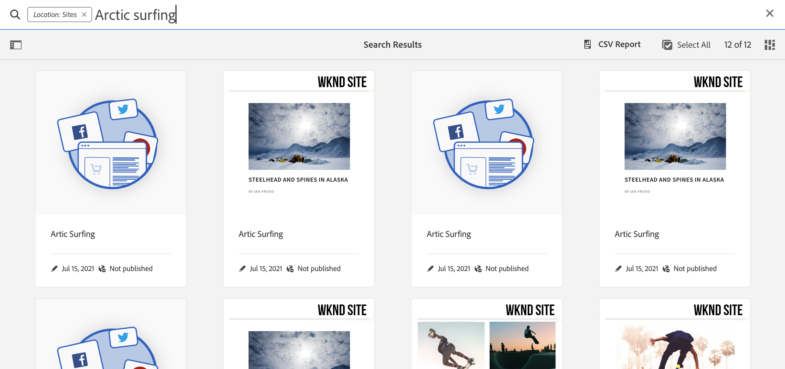

# 製作快速入門手冊 {#quick-guide-to-authoring}

從這裡開始，快速瞭解高層級指南，以開始使用編寫內容 **網站** 主控台。

>[!TIP]
>
>本快速入門手冊主要說明Sites製作，不過大部分的概念皆廣泛適用於其他主控台。

## 一切都從網站主控台開始。 {#sites-console}

無論您是要建立新內容，還是要檢視及管理現有內容，您的中心概覽為 **網站** 主控台。

第一次登入AEM時，您會進入全域導覽畫面。 只要點選或按一下 **網站** 以開啟 **網站** 主控台。

若要從AEM中的任何其他位置存取全域導覽，請點選或按一下 **Adobe Experience Manager** 任一AEM畫面左上角的連結，開啟全域導覽的下拉式覆蓋圖。

一旦在 **網站** 控制檯中，您的內容會輕鬆導覽，並預設以欄檢視顯示。

## 檢視 {#views}

根據預設 **網站** 主控台開啟於 **欄** 檢視。 每個階層層級都會顯示為欄，因此非常適合使用以Web為基礎的階層式組織內容。

在欄中點選或按一下專案以選取或開啟階層中的下一個層級。 選取的專案會以勾號表示。

另外提供兩種檢視：

* **卡片檢視**  — 此檢視將每個專案顯示為可輕鬆操作的卡片，讓您輕鬆存取其他選項。
* **清單檢視**  — 這會將階層的單一層級顯示為單一清單，提供個別專案的詳細資訊。

使用畫面左上角的檢視切換器，在檢視之間切換。 此檔案使用預設欄檢視。

## 導覽內容 {#navigating}

**欄檢視** 將內容顯示為一系列階層式欄。 選取目前欄中的專案時，若該專案是檔案，其詳細資訊會顯示在右側的下一欄，若該專案是資料夾，其內容會顯示下一個階層層級的內容。

如此一來，您就可以上下移動內容結構。

若要在層級之間快速跳轉，您可以使用頁面頂端的階層連結。

您也可以隨時使用畫面右上角的搜尋圖示來尋找特定內容。

搜尋顯示為整個主控台的下拉式覆蓋圖。 輸入搜尋字詞以尋找您的內容。

## 建立內容 {#creating}

若要建立新頁面，只要導覽至內容階層中您想要的位置，然後點選或按一下 **建立** 按鈕。

可用的選項取決於前後關聯。 如果您處於內容結構的根目錄，便能建立全新的網站。 否則，您可以建立新頁面或其他頁面相關內容。

根據您選取要建立的專案，適當的精靈將開始引導您完成建立流程。

## 編輯內容 {#editing}

若要編輯頁面，請點選或按一下以在 **網站** 主控台。 然後在出現的工具列中，點選或按一下 **編輯** 圖示。

這會在適合內容的編輯器中開啟頁面。

如果您只想更新頁面的屬性（例如標籤或其名稱），您可以點選或按一下 **屬性** 圖示加以儲存。

## 組織內容 {#organizing}

若要移動或複製頁面，請在主控台中選取頁面，然後在工具列中點選或按一下 **移動** 或 **複製**. 這會啟動精靈，引導您完成移動或複製、定義產生頁面的名稱和位置的步驟。

## 發佈內容 {#publishing}

當您完成您想對內容進行的變更時，請使用 **網站** 主控台，您可以發佈內容。 選取您要發佈的內容，然後點選或按一下 **快速發佈** 圖示加以儲存。

再點選或按一下，以確認出版物 **發佈** 在對話方塊中。

## 其他資源 {#additional-resources}

這只是編寫Sites內容的功能的簡短介紹，因此並未涵蓋每個主題或每個選項。

以下是一些深入瞭解主控台所有功能的更多資源，並討論有關一般內容製作的主題。

* [基本處理](/help/sites-cloud/authoring/basic-handling.md)
* [製作概念](/help/sites-cloud/authoring/author-publish.md)
* [Sites 主控台](/help/sites-cloud/authoring/sites-console/introduction.md)
* [頁面編輯器](/help/sites-cloud/authoring/page-editor/introduction.md)
* [發佈頁面](/help/sites-cloud/authoring/sites-console/publishing-pages.md)
