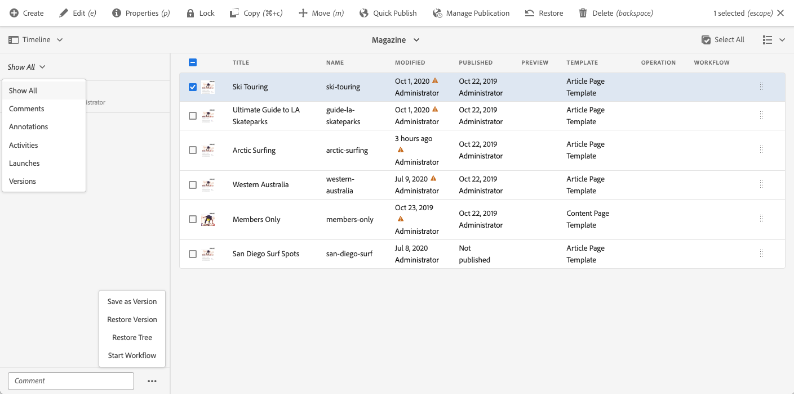
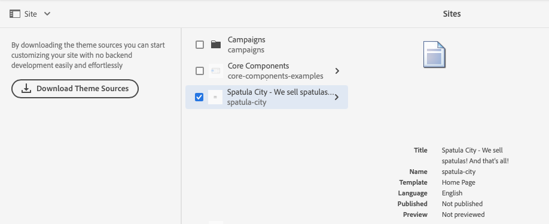
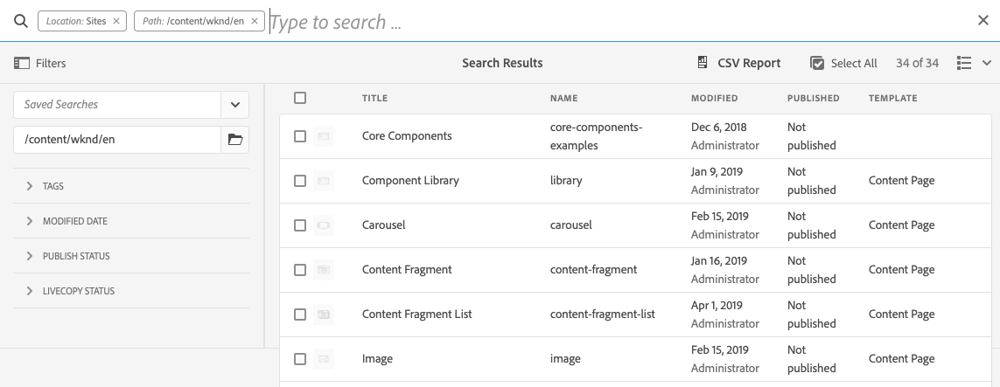

# 網站主控台側面板 {#side-panel}

瞭解如何使用AEM **Sites**&#x200B;主控台中的側面板，以更清楚瞭解並導覽您的內容。

## 方向 {#orientation}

當您進入&#x200B;**Sites**&#x200B;主控台時，側面板預設為關閉。 如此一來，畫面就會完全專用於您的內容。

在&#x200B;**網站**&#x200B;主控台工具列中，點選或按一下&#x200B;**側面板**&#x200B;圖示，以啟動側面板並選擇您內容的檢視。

* [僅限內容](#content-only)
* [內容樹狀結構](#content-tree)
* [時間軸](#timeline)
* [參照](#references)
* [網站](#site)
* [篩選](#filter)
* [設定 Analytics](#setup-analytics)

目前選取的檢視在下拉式清單中以藍色核取記號表示，而工具列中的側面板圖示會以所選檢視的名稱更新。

## 僅限內容 {#content-only}

這個側面板的檢視實際上是關閉它，也就是它只會顯示您網站的內容。

>[!TIP]
>
>使用抑音符號/反勾號`´`鍵盤快速鍵，切換到側面板的僅內容檢視。

## 內容樹狀結構 {#content-tree}

側面板的這個檢視以樹狀階層顯示您的內容。 內容樹可用來快速導覽側面板中的網站階層，並檢視目前資料夾中頁面的許多相關資訊。

樹狀結構中專案旁的右側V形箭號表示可以展開以顯示其子項的節點。 點選或按一下>形箭號以顯示子系。

主控台會顯示內容樹中目前選取專案的內容。

使用內容樹側面板搭配清單檢視或卡片檢視，您可以輕鬆檢視專案的階層結構，並使用內容樹側面板輕鬆瀏覽內容結構，並在清單檢視中檢視詳細的頁面資訊。

>[!TIP]
>
>* 使用`Alt+1`鍵盤快速鍵切換到側面板的內容樹狀檢視。
>* 選取階層檢視中的專案後，可使用方向鍵來快速瀏覽階層。
>* 如需詳細資訊，請參閱[鍵盤快速鍵](/help/sites-cloud/authoring/sites-console/keyboard-shortcuts.md)。

## 時間軸 {#timeline}

時間軸可用於檢視影響所選資源的事件。 您也可以用它來啟動某些事件，例如工作流程或版本。

**時間軸**&#x200B;側面板可讓您檢視與選取專案相關的各種事件，這些選取專案可從下拉式清單中選取為型別：

* 評論
* [註解](/help/sites-cloud/authoring/page-editor/annotations.md)
* [活動](/help/sites-cloud/authoring/personalization/activities.md)
* [啟動](/help/sites-cloud/authoring/launches/overview.md)
* [版本](/help/sites-cloud/authoring/sites-console/page-versions.md)
* [工作流程](/help/sites-cloud/authoring/workflows/overview.md)
   * 請注意，不會顯示暫時性工作流程的資訊，因為沒有儲存這些工作流程的歷程記錄資訊。<!--With the exception of [transient workflows](/help/sites-developing/workflows.md#transient-workflows) as no history information is saved for these-->
* 顯示全部

此外，您可以使用事件清單底部顯示的&#x200B;**註解**&#x200B;方塊，新增/檢視有關選取專案的註解。 輸入註解後接著輸入`Return`將註冊註解。 當選取「注 **釋** 」或「 **全部顯示** 」時顯示。

在&#x200B;**Sites**&#x200B;主控台中，您也可以透過&#x200B;**註解**&#x200B;欄位旁的省略符號按鈕存取其他功能。

* [儲存版本](/help/sites-cloud/authoring/sites-console/page-versions.md)
* [啟動工作流程](/help/sites-cloud/authoring/workflows/applying.md)

>[!TIP]
>
>* 使用`Alt+2`鍵盤快速鍵切換到側面板的時間表檢視。
>* 如需詳細資訊，請參閱[鍵盤快速鍵](/help/sites-cloud/authoring/sites-console/keyboard-shortcuts.md)。

## 參照 {#references}

**參考**&#x200B;檢視會顯示與主控台中選取的資源之間的參考型別清單。

選取適當的參照型別以取得詳細資訊。 在某些情況下，當您選取特定參照時，可使用進一步的動作，包括：

* **傳入連結**，提供直接參照選取頁面的頁面清單，以及直接存取選取特定連結時其中一個頁面的&#x200B;**編輯**。
   * 這只會顯示靜態連結，不會顯示動態產生的連結，例如來自清單元件的連結。
* [啟動](/help/sites-cloud/authoring/launches/overview.md)，提供相關啟動的存取權
* [即時副本](/help/sites-cloud/administering/msm/overview.md)會顯示以選取的資源為基礎之所有即時副本的路徑。
* [Blueprint](/help/sites-cloud/administering/msm/best-practices.md)，提供詳細資訊和各種動作
* [語言副本](/help/sites-cloud/administering/translation/managing-projects.md#creating-translation-projects-using-the-references-panel)，提供詳細資訊和各種動作

## 網站 {#site}

側面板的&#x200B;**網站**&#x200B;檢視會顯示使用網站範本[建立的網站](/help/sites-cloud/administering/site-creation/create-site.md)的詳細資料。

請參閱檔案[使用網站面板管理您的網站主題](/help/sites-cloud/administering/site-creation/site-rail.md)，以取得有關如何使用面板管理網站[主題](/help/sites-cloud/administering/site-creation/site-themes.md)的詳細資訊。

如果您尚未設定前端管道以啟用主題型網站建立，側面板將提供該選項。

>[!TIP]
>
>您可以在[快速網站建立歷程](/help/journey-sites/quick-site/overview.md)中找到從範本建立網站並自訂其主題的程式的端對端說明。

## 篩選 {#filter}

**篩選器**&#x200B;面板類似於[搜尋功能](/help/sites-cloud/authoring/search.md)，已設定適當的位置篩選器，可讓您進一步篩選您要檢視的內容。

不同於側面板的其他檢視，若要切換到其他檢視，請點選或按一下搜尋欄位中的`X`。

## 設定 Analytics {#setup-analytics}

此檢視可讓您為選取的網站快速設定Adobe Analytics。

