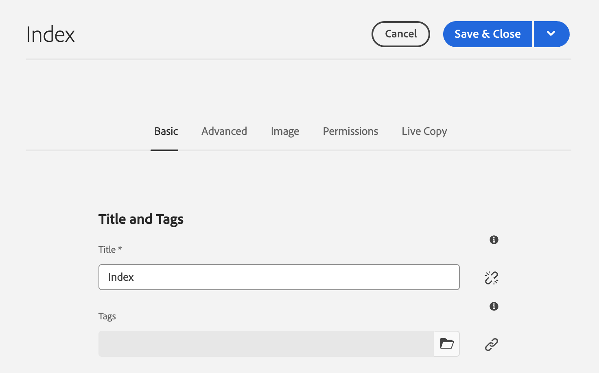

# 編輯頁面屬性 {#page-properties}

瞭解如何編輯頁面](/help/sites-cloud/authoring/sites-console/page-properties.md)的[屬性並變更頁面的行為以及其管理方式。

>[!TIP]
>
>如需個別可用頁面屬性的詳細資訊，請參閱檔案[頁面屬性。](/help/sites-cloud/authoring/sites-console/page-properties.md)

## 在何處編輯頁面屬性 {#where}

您可以在AEM中的多個位置編輯頁面屬性。

* [從 ](#from-the-sites-console)
* [從頁面編輯器](#from-the-page-editor)
* [從通用編輯器](#from-the-universal-editor)

使用Sites Console，您也可以[一次編輯多個頁面的屬性。](#editing-multiple-pages)

### 從Sites主控台 {#from-the-sites-console}

在&#x200B;**網站**&#x200B;主控台中瀏覽內容時，您可以使用工具列中的&#x200B;**屬性**&#x200B;按鈕來編輯頁面屬性：

1. 使用&#x200B;[**網站**&#x200B;主控台，](/help/sites-cloud/authoring/sites-console/introduction.md)瀏覽至您要檢視及編輯屬性的頁面位置。
1. 使用以下其中一種方式，為必要頁面選取&#x200B;**屬性**&#x200B;選項：
   * [快速動作](/help/sites-cloud/authoring/basic-handling.md#quick-actions)
   * [選擇模式](/help/sites-cloud/authoring/basic-handling.md#selecting-resources)
   * 頁面屬性會使用適當的索引標籤顯示。
1. 視需要檢視或編輯屬性。
1. 然後使用&#x200B;**儲存**&#x200B;儲存您的更新，接著使用&#x200B;**關閉**&#x200B;返回主控台。

### 從頁面編輯器 {#from-the-page-editor}

使用頁面編輯器編輯頁面時，您可以使用&#x200B;**頁面資訊**&#x200B;來定義頁面屬性：

1. 在[頁面編輯器](/help/sites-cloud/authoring/page-editor/introduction.md)中，開啟您要編輯屬性的頁面。
1. 選取&#x200B;**頁面資訊**&#x200B;圖示以開啟選取功能表：
1. 選取「**開啟屬性**」，並開啟一個對話方塊讓您編輯屬性（依適當的索引標籤排序）。 工具列右側提供下列按鈕：
   * **取消**
   * **儲存並關閉**
1. 使用&#x200B;**儲存並關閉**&#x200B;按鈕來儲存變更。

## 從通用編輯器 {#from-the-universal-editor}

使用通用編輯器編輯頁面時，您可以使用&#x200B;**頁面屬性**&#x200B;圖示來編輯屬性：

1. 在[通用編輯器](/help/sites-cloud/authoring/universal-editor/authoring.md#page-properties)中，開啟您要編輯屬性的頁面。
1. 選取工具列中的&#x200B;**頁面屬性**&#x200B;圖示。
1. AEM的頁面屬性視窗會在新的瀏覽器標籤中開啟，就像您從[頁面編輯器編輯頁面屬性一樣。](#from-the-page-editor)工具列右側提供下列按鈕：
   * **取消**
   * **儲存並關閉**
1. 使用&#x200B;**儲存並關閉**&#x200B;按鈕來儲存變更。
1. 返回通用編輯器的瀏覽器標籤。

## 編輯多個頁面的屬性 {#editing-multiple-pages}

從&#x200B;[**網站**&#x200B;主控台](/help/sites-cloud/authoring/sites-console/introduction.md)中，您可以選取數個頁面，然後使用&#x200B;**檢視屬性**&#x200B;來檢視和/或編輯頁面屬性。 這稱為頁面屬性的大量編輯。

您可以選取多個頁面以透過各種方法進行大量編輯，包括：

* 瀏覽&#x200B;**網站**&#x200B;主控台時
* 使用&#x200B;**搜尋**&#x200B;尋找一組頁面之後

選取頁面，然後按一下或點選「**屬性**」選項，就會顯示大量屬性：

您只能大量編輯符合以下條件的頁面：

* 共用相同的資源型別
* 不屬於即時副本
   * 如果有任何選取的頁面屬於即時副本，則屬性開啟時會顯示訊息。

大量編輯視窗會垂直分成兩半：

* 左側是您選取要大量編輯的頁面的清單。
   * 您可以視需要選取/取消選取頁面。
   * 依預設，會選取全部。
* 右側是可大量編輯的[屬性清單。](/help/implementing/developing/extending/bulk-editor.md)
   * 和檢視單一頁面屬性時一樣，屬性會依索引標籤排序。
   * 會顯示所有選定頁面上可用的屬性，這些屬性已明確定義為可大量編輯。
   * 如果您將頁面選取範圍縮小至一頁，則會顯示所有屬性。
   * 只會顯示具有相同值的屬性。
   * 當欄位有多個值時（例如Tags），只有在&#x200B;*所有*&#x200B;為通用時，才會顯示值。 如果只有部分相同，則僅在編輯時顯示。
* 不同頁面中相同但值不同的欄位會以特殊值（例如文字`<Mixed Entries>`）表示。

您可以更新所選頁面上可用欄位中的值。 當您選取&#x200B;**完成**&#x200B;時，新值會套用至所有選取的頁面。 當欄位有多個值時（例如「標籤」），您可以附加新值或移除通用值。

## 屬性繼承 {#inheritance}

如果頁面是根據Blueprint或繼承其他頁面的內容，繼承會反映在個別欄位的&#x200B;**頁面屬性**&#x200B;視窗中。

繼承的屬性無法編輯。 點選或按一下特定欄位旁的&#x200B;**取消繼承**&#x200B;圖示以中斷其繼承。

在&#x200B;**取消繼承**&#x200B;強制回應視窗中確認取消。

取消欄位的繼承後，該欄位就會變成可編輯。

若要恢復繼承，請點選或按一下欄位旁的&#x200B;**還原繼承**&#x200B;圖示。

在&#x200B;**還原繼承**&#x200B;強制回應中確認重新版本。

在恢復繼承&#x200B;**後選取「**&#x200B;同步頁面」以使用Blueprint中的最新值更新欄位。 否則，下次同步化LiveCopy時將會更新值。

>[!TIP]
>
>如需繼承的詳細資訊，請參閱檔案[多網站管理員與翻譯](/help/sites-cloud/administering/msm-and-translation.md)
