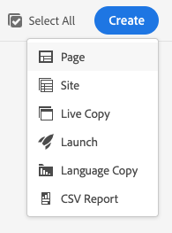

# Sites 主控台 {#sites-console}

瞭解如何使用&#x200B;**Sites**&#x200B;主控台來管理和組織您的AEM頁面。

## 方向 {#orientation}

**Sites**&#x200B;主控台可讓您檢視您的頁面階層。

已選取專案的Sites主控台的

它提供不同的檢視和工具列，協助您管理和組織頁面。

* [主控台工具列](#toolbar)會一直出現，協助您瀏覽。
* [三種不同的檢視](#views)可讓您輕鬆找到並選取您的頁面。
* [當您選取要對其採取動作的專案時，動作工具列](#action-toolbar)就會出現。
* [側面板](#side-panel)有多個選項，可在選取的頁面上顯示詳細資訊。

## 主控台工具列 {#console-toolbar}

主控台工具列一律會顯示在主控台上，協助您定位內容並導覽內容。

### 側面板選擇器 {#side-panel-selector}

側面板選擇器可讓您在主控台中顯示所選專案的其他資訊。

顯示的選項取決於您目前的主控台。 例如，在&#x200B;**Sites**&#x200B;中，您可以選取僅限內容（預設）、時間軸、參照或篩選器側面板。

如需側面板的詳細資訊，請參閱[網站主控台側面板](/help/sites-cloud/authoring/sites-console/console-side-panel.md)。

### 導覽列 {#breadcrumbs}

階層連結位於邊欄中間，且一律顯示目前所選專案的說明，可讓您導覽網站的各個層級。

導覽列中的

點選或按一下階層連結文字，以顯示下拉式清單，列出目前所選專案的階層層次。 點選或按一下專案以跳至該位置。

### 全選 {#select-all}

點選或按一下&#x200B;**全選**&#x200B;按鈕會選取您目前主控台檢視中的所有專案。

當您選取了所有專案時，選取專案的計數會顯示在工具列的右上角，其中會顯示&#x200B;**全選**&#x200B;按鈕。

您可以取消選取所有專案並結束選取模式，方法如下：

* 按一下或點選計數旁的&#x200B;**X**。
* 使用&#x200B;**ESC**&#x200B;機碼。

### 建立按鈕 {#create-button}

**建立**&#x200B;按鈕可讓您新增頁面至您的網站，以及建立其他網站物件，例如即時副本或啟動。

按一下後，顯示的選項即適用於主控台/前後關聯。 最常見的是：

* [頁面](/help/sites-cloud/authoring/sites-console/creating-pages.md)
* [網站](/help/sites-cloud/administering/site-creation/create-site.md)
* [Live Copy](/help/sites-cloud/administering/msm/overview.md)
* [啟動](/help/sites-cloud/authoring/launches/overview.md)
* [語言副本](/help/sites-cloud/administering/translation/overview.md)
* [CSV 報表](/help/sites-cloud/authoring/sites-console/csv-export.md)

請參閱這些功能的連結，以瞭解其運作方式的詳細資訊。

## 檢視和選取頁面 {#views}

**Sites**&#x200B;主控台提供您內容階層的三種不同檢視。 您可以透過任何可用檢視來檢視、瀏覽及選取（供進一步動作）您的資源。

* [欄檢視](#column-view)
* [卡片檢視](#card-view)
* [清單檢視](#list-view)

AEM工具列最右邊的&#x200B;**檢視**&#x200B;圖示表示目前選取的檢視。

點選或按一下它可讓您選取不同的檢視。

您可以在欄檢視、卡片檢視和清單檢視之間切換。 在清單檢視中，它也會顯示檢視設定。

>[!NOTE]
>
>「 **檢視設定** 」選項僅在「清單檢視」 **模式中可用** 。

從概念上講，所有檢視中的檢視、導覽和選取操作都相同，只是處理方式根據您使用的檢視而略有差異。

>[!NOTE]
>
>依預設，AEM Assets不會在任何檢視中將資產的原始轉譯顯示為縮圖。 如果您是管理員，則可以使用覆蓋圖將AEM Assets設定為將原始轉譯顯示為縮圖。

### 選取資源 {#selecting-resources}

選取特定資源取決於檢視和裝置的組合：

| 檢視 | 選取觸控 | 選取案頭 | 取消選取觸控 | 取消選取案頭 |
|---|---|---|---|---|
| 欄 | 選取縮圖 | 按一下縮圖 | 選取縮圖 | 按一下縮圖 |
| 卡片 | 選取並按住卡片 | 將滑鼠移到上方，然後使用核取記號快速動作 | 選取卡片 | 按一下卡片 |
| 清單 | 選取縮圖 | 按一下縮圖 | 選取縮圖 | 按一下縮圖 |

#### 選取範例 {#selecting-example}

1. 例如在卡片檢視中：

   

1. 選取資源後，[動作工具列](#actions-toolbar)會覆蓋頂端標頭，提供目前適用於選取資源的動作存取權。

1. 若要結束選取模式，請選取右上方的&#x200B;**X**，或使用&#x200B;**ESCAPE**。

### 欄檢視 {#column-view}

欄檢視允許透過一系列階層式欄對內容樹進行視覺導覽。 此檢視可讓您視覺化並周遊網站的樹狀結構。

在最左邊的欄中選取資源，會在右邊的欄中顯示子資源。 在右側欄中選取資源，會在右側另一欄中顯示子資源，依此類推。

* 您可以點選或按一下資源名稱或資源名稱右側的>形箭號，在樹狀結構中向上和向下導覽。

   * 點選或按一下時，資源名稱和>形箭號會反白顯示。
   * 已點按/已點按資源的子項會顯示在已點按/已點按資源右側的欄中。
   * 如果您選取沒有子系的資源名稱，其詳細資訊會顯示在最後一欄。

* 點選或按一下縮圖會選取資源。

   * 選取時，縮圖上會覆蓋勾號，資源名稱也會反白顯示。
   * 所選資源的詳細資訊會顯示在最後一欄。
   * 動作工具列隨即可用。

* 在欄檢視中選取頁面時，選取的頁面會連同下列詳細資料顯示在最終欄中：

   * 頁面標題
   * 頁面名稱（頁面URL的一部分）
   * 頁面所依據的範本
   * 修改詳細資料
   * 頁面語言
   * 發佈和預覽詳細資料

### 卡片檢視 {#card-view}

在卡片檢視中，階層中目前層級的每個專案都會顯示為大型卡片。

* 卡片可提供下列資訊：

   * 頁面內容的視覺化表示法。
   * 頁面標題。
   * 重要日期（例如上次編輯、上次發佈）。
   * 如果頁面已鎖定、隱藏或是LiveCopy的一部分。
   * 指示器，表示您是否需要在工作流程中對專案執行動作。

卡片檢視也提供專案的[快速動作](#quick-actions)，例如選取範圍與常見的動作，例如編輯。

您可以點選/按一下卡片來向下瀏覽樹狀結構（注意避免點選快速動作），或使用標頭[中的](#the-header)階層連結來再次向上瀏覽。

### 清單檢視 {#list-view}

清單檢視提供清單中目前層級之每項資源的資訊。

* 您可以點選/按一下資源名稱，在樹狀結構中向下導覽，並使用標頭[中的](#the-header)階層連結進行備份。
* 若要輕鬆選取清單中的所有專案，請使用工具列&#x200B;[**中的**&#x200B;全選](#select-all)核取方塊。

* 使用位於[檢視]按鈕下方的&#x200B;**檢視設定**&#x200B;選項來選取要顯示的欄。 下列欄可供顯示：

   * **名稱** — 頁面名稱，在多語言撰寫環境中很有用，因為它是頁面URL的一部分，無論使用何種語言，都不會變更
   * **修改日期** — 上次修改日期和上次修改的使用者
   * **已發佈** — 發佈狀態
   * **預覽** — 預覽狀態
   * **範本** — 頁面所依據的範本
   * **作業**
   * **工作流程** — 目前已套用至頁面的工作流程。 將滑鼠移至上方或開啟「時間軸」時，可以取得更多資訊。
   * **已翻譯**
   * **頁面檢視次數**
   * **不重複訪客**
   * 第&#x200B;**頁上的**&#x200B;時間

預設會顯示&#x200B;**Name**&#x200B;欄，它構成了頁面URL的一部分。 在某些情況下，作者可能需要存取不同語言的頁面，如果作者不知道頁面的語言，檢視頁面名稱（通常不會變更）會很有幫助。

* 使用清單中每個專案最右側的點狀垂直列，變更專案的順序。

選取垂直選取列並將專案拖曳到清單中的新位置。

>[!NOTE]
>
>變更順序僅適用於具有`jcr:primaryType`值為`sling:OrderedFolder`的已排序資料夾。

## 動作工具列 {#actions-toolbar}

每當選取資源時，您都可以對選取的專案執行各種動作。 這些動作會顯示在動作工具列中。

唯有在主控台中選取資源時，動作工具列才會出現。 動作工具列中的可用動作會變更，以反映您可對所選特定專案執行的動作。 最常見的動作包括：

* [**建立**](#create-action) — 建立新內容或內容相關動作
* **編輯** — 視選取頁面的建立方式而定，**編輯**&#x200B;動作會開啟適當的編輯器。
   * [頁面編輯器](/help/sites-cloud/authoring/page-editor/introduction.md) — 適用於使用AEM頁面編輯器建立的頁面
   * [通用編輯器](/help/sites-cloud/authoring/universal-editor/authoring.md) — 針對使用通用編輯器建立的頁面
* [**屬性**](/help/sites-cloud/authoring/sites-console/edit-page-properties.md) — 開啟頁面屬性視窗
* [**鎖定**](/help/sites-cloud/authoring/sites-console/managing-pages.md#locking-a-page) — 鎖定頁面以防止其他人變更它
* [**複製**](/help/sites-cloud/authoring/sites-console/managing-pages.md#copying-and-pasting-a-page) — 複製頁面
* [**移動**](/help/sites-cloud/authoring/sites-console/managing-pages.md#moving-or-renaming-a-page) — 移動或重新命名頁面
* [**快速發佈**](/help/sites-cloud/authoring/sites-console/publishing-pages.md#quick-publish) — 立即發佈一或多個頁面
* [**管理出版物**](/help/sites-cloud/authoring/sites-console/publishing-pages.md#manage-publication) — 排程要發佈的頁面
* [**還原**](/help/sites-cloud/authoring/sites-console/page-versions.md#restore-version) — 還原頁面或頁面樹狀結構的版本
* [**刪除**](/help/sites-cloud/authoring/sites-console/managing-pages.md#deleting-a-page) — 刪除一個或多個頁面

由於某些視窗的空間限制，工具列可能會很快變得比可用的空間長。發生此情況時，會出現其他選項。按一下或點選省略符號（三個點或&#x200B;**...**）會開啟一個下拉式選取器，其中包含所有剩餘的動作。

### 建立動作 {#create-action}

建立動作提供類似於&#x200B;[**建立**&#x200B;工具列按鈕](#create-button)的選項，可用來建立新頁面和類似專案。

此外，它提供建立頁面相關動作的功能。

* [**工作流程**](/help/sites-cloud/authoring/workflows/overview.md) — 將工作流程套用至頁面
* [**版本**](/help/sites-cloud/authoring/sites-console/page-versions.md) — 建立頁面的版本

## 範本

在「欄檢視」或「清單檢視」中選取頁面時，您可輕鬆查看該頁 [**面所依據**](/help/sites-cloud/authoring/basic-handling.md#column-view)[**的範本**](/help/sites-cloud/authoring/basic-handling.md#list-view)。

## AEM中的AI助理

對於具有[已完成必要條件](/help/implementing/cloud-manager/ai-assistant-in-aem.md#get-access)的客戶，其組織的使用者可以使用AEM中的AI助理。 檢視AEM[中的](/help/implementing/cloud-manager/ai-assistant-in-aem.md)AI小幫手。

