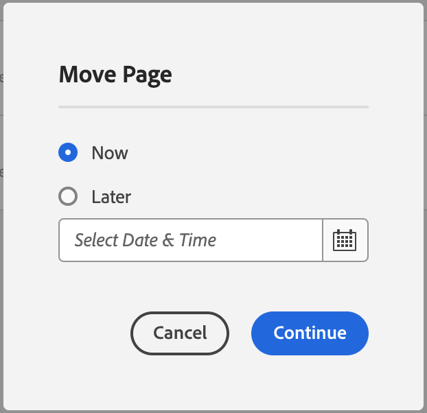

# 管理頁面 {#managing-pages}

瞭解如何在AEM中管理您的網站頁面，包括移動、複製和刪除。

>[!TIP]
>
>開始管理頁面之前，請熟悉[AEM中頁面的組織方式](/help/sites-cloud/authoring/sites-console/organizing-pages.md)。

>[!TIP]
>
>您可從網站主控台使用數個[鍵盤快速鍵](/help/sites-cloud/authoring/sites-console/keyboard-shortcuts.md)，以更有效率地組織您的頁面。

## 存取許可權 {#access-privileges}

您的帳戶需要適當的存取許可權才能在頁面上執行動作，例如建立、複製、移動、編輯和刪除。

如果您遇到任何問題，我們建議您連絡系統管理員。

## 開啟頁面進行編輯 {#opening-a-page-for-editing}

在[建立頁面](/help/sites-cloud/authoring/sites-console/creating-pages.md)或使用[Sites **主控台**&#x200B;導覽至現有頁面之後，您可以開啟它以進行編輯。](/help/sites-cloud/authoring/sites-console/introduction.md)

1. 開啟[ **網站**&#x200B;主控台](/help/sites-cloud/authoring/sites-console/introduction.md)。
1. 導覽以尋找您要編輯的頁面。
1. 使用下列任一專案選取您的頁面：

   * [快速動作](/help/sites-cloud/authoring/basic-handling.md#quick-actions)
   * [選擇模式](/help/sites-cloud/authoring/basic-handling.md#selecting-resources)和工具列

1. 點選或按一下&#x200B;**編輯**&#x200B;圖示。

   

1. 頁面隨即開啟，您可以視需要編輯頁面。 根據所選頁面的建立方式，**編輯**&#x200B;動作將開啟適當的編輯器。
   * [頁面編輯器](/help/sites-cloud/authoring/page-editor/introduction.md) — 適用於使用AEM頁面編輯器建立的頁面
   * [通用編輯器](/help/sites-cloud/authoring/universal-editor/authoring.md) — 針對使用通用編輯器建立的頁面

## 複製和貼上頁面 {#copying-and-pasting-a-page}

您可以將頁面及其所有子頁面複製到新位置：

1. 開啟[ **網站**&#x200B;主控台](/help/sites-cloud/authoring/sites-console/introduction.md)。
1. 導覽以尋找您要複製的頁面。
1. 使用以下其中一種方式選取您的頁面：

   * [快速動作](/help/sites-cloud/authoring/basic-handling.md#quick-actions)
   * [選擇模式](/help/sites-cloud/authoring/basic-handling.md#selecting-resources)和工具列

1. 點選或按一下「**複製**」頁面圖示。

   

1. 導覽至頁面新復本的位置。
1. 選取已變為可用的&#x200B;**貼上**&#x200B;圖示。

   

1. 「貼上」對話方塊會顯示貼上交易的摘要，以及執行下列功能的功能：
   * **新網站名稱：**&#x200B;變更貼上頁面的名稱
   * **貼上不含子系：**&#x200B;貼上時省略選取頁面的子頁面（預設會貼上子頁面）

   

1. 選取&#x200B;**貼上**&#x200B;按鈕以確認貼上交易並建立新頁面。

>[!NOTE]
>
>如果您將頁面複製到某個位置，而該位置已經存在名稱與原始名稱相同的頁面，則系統將藉由附加一個編號來自動產生名稱的變體。 例如，如果`beach`已經存在，名稱為`beach`的新頁面會變成`beach1`。

>[!NOTE]
>
>如果您在選擇模式中啟動貼上動作，這會在頁面複製後立即自動結束。

## 移動或重新命名頁面 {#moving-or-renaming-a-page}

移動或重新命名頁面的程式基本相同，這兩個動作都由「移動頁面」精靈處理。 使用此精靈，您可以：

* 重新命名頁面而不移動頁面。
* 移動頁面而不重新命名。
* 同時移動和重新命名。

AEM提供可更新任何內部連結的功能，這些連結會參照正在重新命名/移動的頁面。 您可以逐頁進行，提供完整的彈性。

1. 開啟[ **網站**&#x200B;主控台](/help/sites-cloud/authoring/sites-console/introduction.md)。
1. 導覽以尋找您要移動的頁面。
1. 使用以下其中一種方式選取您的頁面：

   * [快速動作](/help/sites-cloud/authoring/basic-handling.md#quick-actions)
   * [選擇模式](/help/sites-cloud/authoring/basic-handling.md#selecting-resources)和工具列

1. 點選或按一下&#x200B;**移動**&#x200B;頁面圖示以開啟移動頁面精靈。

   

1. 精靈的&#x200B;**重新命名**&#x200B;步驟提供您&#x200B;**頁面相關資訊**，包括建立日期、路徑和直接參照數目。 您可從這裡：

   * 指定移動頁面後您要使用的名稱，然後選取[下一步] **以繼續。**
   * **取消**&#x200B;以中止程式。

   

   * 如果您只移動頁面，頁面名稱可以維持不變。

   >[!NOTE]
   >
   >如果您將頁面移至相同名稱的頁面已經存在的位置，系統將藉由附加編號來自動產生名稱的變體。 例如，如果`beach`已經存在，名稱為`beach`的新頁面會變成`beach1`。

1. 在精靈的&#x200B;**選取目的地**&#x200B;步驟中，您可以：

   * 使用[欄檢視](/help/sites-cloud/authoring/basic-handling.md#column-view)瀏覽至頁面的新位置：

      * 按一下目的地的縮圖，以選取目的地。
      * 按一下[下一步]&#x200B;**&#x200B;**&#x200B;繼續。

   * 使用&#x200B;**上一步**&#x200B;返回頁面名稱規格。

   >[!NOTE]
   >
   >依照預設，您正在移動或重新命名的頁面的父頁面會選取為目的地。

   

   >[!NOTE]
   >
   >如果您將頁面移至相同名稱的頁面已經存在的位置，系統將藉由附加編號來自動產生名稱的變體。 例如，如果`winter`已經存在，`winter`會變成`winter1`。

1. 如果頁面已連結或參考，或已發佈，則詳細資料會列在&#x200B;**調整/重新發佈**&#x200B;步驟中。

   * 您可以指出哪些頁面應適當地調整及/或重新發佈。

   >[!NOTE]
   >
   >* 如果頁面既未連結也未參考，則無法使用此步驟。
   >* 此步驟會列出直接和間接參照。 這可能與在精靈的&#x200B;**重新命名**&#x200B;步驟上報告的數量以及參考邊欄報告的參考不同，兩者都僅報告基於效能原因的直接參考。

   

1. 點選或按一下&#x200B;**移動**&#x200B;以定義何時應該發生移動動作。

   * **現在**&#x200B;將觸發[非同步作業](#asynchronous-actions)以立即移動頁面。
   * **稍後**&#x200B;可讓您排程處理移動的日期。

   

1. 點選或按一下「**繼續**」以完成頁面移動。

>[!NOTE]
>
>如果頁面已發佈，移動頁面會自動將其取消發佈。 依預設，移動完成時會重新發佈它，但是這可透過取消勾選&#x200B;**調整/重新發佈**&#x200B;步驟中的&#x200B;**重新發佈**&#x200B;欄位來變更。

>[!NOTE]
>
>在指定新頁面名稱時，重新命名頁面也需遵循[頁面命名慣例](#page-naming-conventions)。

>[!NOTE]
>
>只能將頁面移至允許該頁面所依據的範本位置。 如需詳細資訊，請參閱[範本可用性](/help/implementing/developing/components/templates.md#template-availability)。

### 非同步動作 {#asynchronous-actions}

頁面移動動作一律會以非同步方式處理，讓使用者能不受阻礙地繼續在UI中編寫。

可在&#x200B;[**全域導覽** > ](/help/operations/asynchronous-jobs.md#monitor-the-status-of-asynchronous-operations)工具&#x200B;**>**&#x200B;作業&#x200B;**>**&#x200B;作業&#x200B;**的**&#x200B;非同步作業狀態&#x200B;**儀表板**&#x200B;中檢查非同步作業的狀態

>[!TIP]
>
>如需有關非同步作業處理以及如何設定頁面移動/重新命名動作限制的詳細資訊，請參閱「操作」使用指南中的[非同步作業](/help/operations/asynchronous-jobs.md)檔案。

### 刪除頁面 {#deleting-a-page}

1. 開啟[ **網站**&#x200B;主控台](/help/sites-cloud/authoring/sites-console/introduction.md)。
1. 導覽至您要刪除的頁面。
1. 使用[選取模式](/help/sites-cloud/authoring/basic-handling.md#viewing-and-selecting-resources)來選取必要的頁面，然後使用工具列中的&#x200B;**刪除**：

   

1. 對話方塊將會要求確認。

   

   * **您要在刪除前先封存頁面嗎？** — 如果勾選，刪除時會建立選取要刪除之頁面的版本。
      * [日後可以還原版本](/help/sites-cloud/authoring/sites-console/page-versions.md)。
      * 沒有舊版刪除的頁面無法還原。
1. 點選或按一下&#x200B;**取消**&#x200B;以中止動作，或點選或按一下&#x200B;**刪除**&#x200B;以確認動作。
   * 如果頁面沒有參考，則會刪除頁面。
   * 如果頁面有參照，訊息方塊會通知您&#x200B;**已參照一或多個頁面。**&#x200B;您可以選取&#x200B;**強制刪除**&#x200B;或&#x200B;**取消**。

>[!NOTE]
>
>如果頁面已發佈，則在刪除前會自動取消發佈。

### 鎖定頁面 {#locking-a-page}

您可以從主控台或編輯個別頁面時[鎖定/解除鎖定頁面](/help/sites-cloud/authoring/page-editor/edit-content.md#locking-a-page)。 有關頁面是否已鎖定的資訊也會顯示在這兩個位置。

### 建立新資料夾 {#creating-a-new-folder}

您可以建立資料夾來協助組織您的檔案和頁面。

1. 開啟[ **網站**&#x200B;主控台](/help/sites-cloud/authoring/sites-console/introduction.md)。
1. 導覽至所需位置。
1. 若要開啟選項清單，請從工具列選取&#x200B;**建立**
1. 選取&#x200B;**資料夾**&#x200B;以開啟對話方塊。 您可以在這裡輸入&#x200B;**名稱**&#x200B;和&#x200B;**標題**：

   

1. 選取&#x200B;**建立**&#x200B;以建立資料夾。

>[!NOTE]
>
>* 指定新資料夾名稱時，資料夾也須遵守[頁面命名慣例](#page-naming-conventions)。
>* 資料夾只能直接在&#x200B;**網站**&#x200B;或其他資料夾下建立。 無法在頁面下建立縮圖。
>* 您可以在資料夾上執行移動、複製、貼上、刪除、發佈、取消發佈和檢視/編輯屬性的標準動作。
>* 無法在即時副本中選取資料夾。
