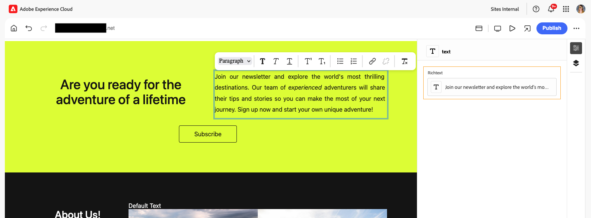
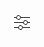

# 使用 Universal Editor 編寫內容 {#authoring}

了解內容作者使用 Universal Editor 建立內容有多簡單和直覺。

## 簡介 {#introduction}

通用編輯器可讓您編輯任何實作中任何內容的任何方面，因此您可以提供卓越的體驗並提高內容速度。

為此，Universal Editor 為內容作者提供直觀的 UI，只需要最基本的培訓就能立即進入狀況並開始編輯內容。本文件說明了 Universal Editor 的編寫體驗。

>[!NOTE]
>
>本檔案假設您已熟悉如何存取和導覽通用編輯器。 如果沒有，請參閱[存取及導覽通用編輯器。](/help/sites-cloud/authoring/universal-editor/navigation.md)

>[!TIP]
>
>如需Universal Editor的詳細介紹，請參閱[Universal Editor簡介。](/help/implementing/universal-editor/introduction.md)

## 編輯內容 {#editing-content}

編輯內容很簡單又直覺。當您將滑鼠移至編輯器中的內容上時，可編輯的內容會以淡藍色外框反白顯示。

>[!TIP]
>
>依預設，點選或按一下內容會選取內容以進行編輯。 如果您想透過下列連結導覽內容，請切換至[預覽模式。](/help/sites-cloud/authoring/universal-editor/navigation.md#preview-mode)

根據您選取的內容，您可能有不同的就地編輯選項，而且您可能會針對[屬性面板中的內容提供其他資訊和選項。](/help/sites-cloud/authoring/universal-editor/navigation.md#properties-rail)

每一段可編輯內容都標示其內容型別。 根據內容，您可以按一下此徽章以快速存取以編輯動作。

### 編輯純文字 {#edit-plain-text}

您可以按兩下或點兩下元件，就地編輯文字。

薄的藍色輪廓會變成粗的藍色輪廓來指示選取，並且會出現游標。 進行變更，然後按下Enter/Return或在文字方塊外選取，以儲存變更。

當您選取文字元件時，其詳細資訊會顯示在[屬性面板中。](/help/sites-cloud/authoring/universal-editor/navigation.md#properties-rail)您也可以在面板中編輯文字。

此外，「屬性」面板中也提供您文字的詳細資料。 一旦焦點離開屬性面板中已編輯的欄位，變更會自動儲存。

### 編輯 RTF 文字 {#edit-rich-text}

您可以按兩下或點兩下元件，就地編輯文字。

為方便起見，您可在兩個位置找到文字的格式選項和詳細資訊。

#### 內容功能表 {#context-menu}

快顯選單會在RTF區塊上方開啟，並在快顯選單中提供基本的格式選項。 由於空間限制，某些選項可能會隱藏在省略符號按鈕後面。

一旦焦點離開已編輯的欄位，變更會自動儲存。

#### 屬性面板 {#properties-rail}

[屬性面板](/help/sites-cloud/authoring/universal-editor/navigation.md#properties-rail)會顯示所選RTF元件的專案。

屬性面板中的

點選專案以開啟對話方塊，顯示較大的畫布以編輯RTF文字。

點選或按一下「**取消**」或「**完成**」，分別捨棄或儲存變更。 您也可以按下ESC鍵以儲存變更並關閉對話方塊。

#### RTF格式選項 {#formatting-options}

通用編輯器的RTF編輯器(RTE)可讓作者套用標準文字格式。 依預設，可使用下列選項。

* 段落（h1、h2、h3等）
* 粗體
* 斜體
* 底線
* 上標
* 下標
* 專案符號清單
   * 使用Tab鍵以縮排，並使用Shift+Tab鍵以縮排
* 排序清單
   * 使用Tab鍵以縮排，並使用Shift+Tab鍵以縮排
* 連結
* 取消連結
* 影像
* 移除所有格式設定

可以使用RTE編輯現有表格，但無法建立新表格。

RTE可設定為根據作者需求隱藏選項或顯示其他選項。 如需詳細資訊，請參閱檔案[為通用編輯器設定RTE](/help/implementing/universal-editor/configure-rte.md)。

### 編輯媒體 {#edit-media}

您可以在[屬性面板中檢視其詳細資料。](/help/sites-cloud/authoring/universal-editor/navigation.md#properties-rail)

1. 在屬性面板中，點選或按一下所選影像的預覽。
1. [資產選擇器](/help/assets/overview-asset-selector.md#using-asset-selector)視窗會開啟，讓您可選取資產。
1. 選取「 」以選取新資產。
1. 選取&#x200B;**選取**&#x200B;以返回取代資產的屬性面板。

變更會自動儲存到您的內容中。

### 編輯內容片段 {#edit-content-fragment}

如果您選取[內容片段](/help/sites-cloud/administering/content-fragments/overview.md)，您可以在[屬性面板中編輯其詳細資料。](/help/sites-cloud/authoring/universal-editor/navigation.md#properties-rail)

在所選內容片段的內容模型中定義的欄位會在屬性面板中顯示和編輯。

如果您選取與內容片段相關的欄位，內容片段會載入元件面板中，且欄位會自動捲動到。

一旦焦點離開屬性面板中已編輯的欄位，變更會自動儲存。

如果您想改用[內容片段編輯器](/help/sites-cloud/administering/content-fragments/authoring.md)編輯您的內容片段，請點選或按一下屬性面板中的&#x200B;[**在CF編輯器中開啟**&#x200B;按鈕](/help/sites-cloud/authoring/universal-editor/navigation.md#edit)。

>[!TIP]
>
>使用快速鍵`e`在內容片段編輯器中編輯選取的內容片段。

根據工作流程的需求，您可能會想要在通用編輯器中或直接在內容片段編輯器中編輯內容片段。

>[!NOTE]
>
>通用編輯器[根據其模型驗證內容片段欄位](/help/assets/content-fragments/content-fragments-models.md#validation)，讓您能夠強制執行資料完整性規則，例如規則運算式模式和唯一條件限制。
>
>這可在發佈之前確保您的內容符合特定業務需求。

### 新增元件到容器中 {#adding-components}

1. 在[內容樹狀結構](/help/sites-cloud/authoring/universal-editor/navigation.md#content-tree-mode)或編輯器中選取容器元件。

   

1. 然後，在「屬性」面板中選取「新增」圖示。

   

1. 如果容器允許多個元件，請從下拉式清單中選取您要插入的元件。 如果只允許一個元件，則會自動插入該元件。

該元件會被插入到容器中並可在編輯器中對其進行編輯。

>[!TIP]
>
>使用快速鍵 `a` 將元件新增到選取的容器中。

### 在容器中複製元件 {#duplicating-components}

1. 使用[內容樹狀結構](/help/sites-cloud/authoring/universal-editor/navigation.md#content-tree-mode)或編輯器選取容器中的元件。
1. 然後在屬性面板中選取&#x200B;**複製**&#x200B;圖示。

   
1. 元件會複製並插入選取元件的下方。

該元件會被插入到容器中並可在編輯器中對其進行編輯。

### 從容器中刪除元件 {#deleting-components}

1. 在[內容樹狀結構](/help/sites-cloud/authoring/universal-editor/navigation.md#content-tree-mode)或編輯器中選取容器元件。
1. 選取容器的>形箭號圖示，展開內容樹狀結構中的內容。
1. 然後，在內容樹中，選取容器內的元件。
1. 在「屬性」面板中選取「刪除」圖示。

   

選取的元件已刪除。

>[!TIP]
>
>使用快速鍵 `Shift+Backspace` 從容器中刪除選取的元件。

### 重新排序元件 {#reordering-components}

1. 如果尚未處於[內容樹狀結構模式](/help/sites-cloud/authoring/universal-editor/navigation.md#content-tree-mode)，請切換至該模式。
1. 在內容樹或編輯器中選取容器元件。
1. 選取容器的>形箭號圖示，展開內容樹狀結構中的內容。
1. 拖曳容器內的元件旁的手柄圖示證明您可以將它們重新排序。拖曳元件，在容器內將它們重新排序。

   

1. 拖曳的元件在內容樹狀結構中會呈現灰色，而您的插入點會以藍線表示。 將元件鬆開並放在新位置中。

元件會在內容樹和編輯器中重新排序。

>[!NOTE]
>
>如果目標容器[元件篩選器](/help/implementing/universal-editor/filtering.md)允許選取的元件，則元件只能在容器之間移動。

### 還原與重做 {#undo-redo}

選取「復原」或「重做」按鈕，以復原或重做編輯器中上次的編輯。

* 還原和取消復原的執行範圍包括：在內容中完成的編輯、透過屬性面板完成的編輯，以及新增 (複製)、移動及刪除區塊。
* 還原和取消復原僅限於目前瀏覽器工作階段。

>[!TIP]
>
>分別使用快速鍵`Command-Z`或`Shift-Command-Z`來復原或重做。

### 複製並貼上 {#copy-paste}

您可以複製並貼上[容器內的元件。](/help/implementing/universal-editor/field-types.md#container)只有在目標容器未設定[篩選器](/help/implementing/universal-editor/filtering.md)，或篩選器允許貼上元件時，才可以執行此操作。

如果標籤已經開啟，複製和貼上可在相同的瀏覽器標籤上或瀏覽器標籤之間。 您不能複製專案然後開啟新的瀏覽器標籤以貼上。

1. 在編輯器或內容樹中選取元件。
1. **複製**&#x200B;圖示會出現在[屬性面板中。](/help/sites-cloud/authoring/universal-editor/navigation.md#properties-panel)點選或按一下它。
1. 屬性面板中會顯示&#x200B;**貼上**&#x200B;圖示。
1. 選取您要貼上複製元件的元件&#x200B;_after_。
1. 點選或按一下「貼上」。
1. 複製的元件會在&#x200B;_之後貼上_&#x200B;選取的元件。

>[!TIP]
>
>分別使用快速鍵`Command-C`或`Command-V`來複製或貼上。

## 內容選項 {#context-options}

就地編輯時，編輯器將透過按一下滑鼠右鍵提供內容相關的選項，例如複製、刪除或複製元件。

## 預覽內容 {#previewing-content}

內容編輯完成後，您通常會希望瀏覽其內容，以查看它在其他頁面內容中的樣子。在[預覽模式](/help/sites-cloud/authoring/universal-editor/navigation.md#preview-mode)中，您可以點選連結，像讀者一樣瀏覽您的內容。內容在編輯器中呈現的樣子就是將會發佈的樣子。

在預覽模式中，點選或按一下內容的反應就像對內容的讀者一樣。 若要選取要編輯的內容，請切換出[預覽模式。](/help/sites-cloud/authoring/universal-editor/navigation.md#preview-mode)

## 編輯元件繼承 {#inheritance}

繼承是可連結內容的機制，如此一來變更一個會自動變更另一個。

使用通用編輯器，您只需更新內容即可取消內容的繼承。 編輯器會自動停用該頁面上作者所做所有變更的繼承，以確保在從Blueprint同步更新時保留修改的內容。

如果您的程式已啟用&#x200B;**AEM多網站管理(MSM)擴充功能**，您就有[額外的工具列選項](#inheritance-extension)可檢視和變更通用編輯器中個別元件的繼承狀態。

如需有關使用通用編輯器繼承如何運作的詳細資訊，請參閱[通用編輯器中的內容繼承。](/help/sites-cloud/authoring/universal-editor/inheritance.md)

## 選用的工具列功能 {#toolbar-options}

其他功能可作為通用編輯器的擴充功能使用，協助您進一步管理頁面和內容。 [這些擴充功能必須由系統管理員在程式中啟用](/help/implementing/universal-editor/extending.md)，您才能在[通用編輯器工具列](/help/sites-cloud/authoring/universal-editor/navigation.md#universal-editor-toolbar)中以內容作者身分看到它們。

### 繼承 {#inheritance-extension}

**AEM多網站管理(MSM)擴充功能**&#x200B;會顯示所選元件的目前繼承狀態，並可讓您[中斷或復原繼承。](/help/sites-cloud/authoring/universal-editor/inheritance.md)

「通用編輯器」工具列中的&#x200B;**已安裝繼承**&#x200B;圖示顯示，所選元件的繼承仍然有效。

點選或按一下圖示以中斷所選元件的繼承。 如果您編輯元件，繼承會自動中斷。

**繼承中斷**&#x200B;圖示顯示所選元件的繼承已中斷。

點選或按一下圖示，以恢復所選元件的繼承。 您需要重新載入頁面以重新整理內容，才能顯示繼承的內容。

如需如何啟用此擴充功能的詳細資訊，[請參閱Extension Manager檔案。](https://developer.adobe.com/uix/docs/extension-manager/feature-highlights/#enablingdisabling-extensions)

>[!NOTE]
>
>**已安裝繼承**&#x200B;和&#x200B;**繼承中斷**&#x200B;圖示只有在選取元件且頁面以Blueprint為基礎時才會顯示。

>[!NOTE]
>
>**AEM Multi-Site-Management (MSM) Extension**&#x200B;僅適用於頁面，不適用於內容片段。

### 存取頁面屬性 {#page-properties}

**AEM頁面屬性擴充功能**&#x200B;可讓您快速存取目前編輯之頁面的[頁面屬性視窗](/help/sites-cloud/authoring/sites-console/page-properties.md)。

在通用編輯器工具列中點選或按一下&#x200B;**頁面屬性**&#x200B;圖示，以在新的瀏覽器標籤中開啟頁面的頁面屬性。

如需如何啟用此擴充功能的詳細資訊，[請參閱Extension Manager檔案。](https://developer.adobe.com/uix/docs/extension-manager/feature-highlights/#enablingdisabling-extensions)

>[!NOTE]
>
>**AEM頁面屬性擴充功能**&#x200B;僅適用於頁面，不適用於內容片段。

### 存取網站主控台 {#sites-console}

**AEM網站管理擴充功能**&#x200B;可讓您快速存取AEM的[網站主控台](/help/sites-cloud/authoring/sites-console/introduction.md)中正在編輯的頁面，讓您在主控台中導覽網站樹狀結構或執行頁面層級的動作。

點選或按一下圖示，在新的瀏覽器標籤中開啟「網站主控台」，並導覽至目前位於編輯器中的頁面。

如需如何啟用此擴充功能的詳細資訊，[請參閱Extension Manager檔案。](https://developer.adobe.com/uix/docs/extension-manager/feature-highlights/#enablingdisabling-extensions)

### 鎖定和解鎖頁面 {#locking-pages}

**AEM頁面鎖定擴充功能**&#x200B;會在編輯器中顯示頁面的目前鎖定狀態，並可讓您[鎖定或解除鎖定頁面。](/help/sites-cloud/authoring/sites-console/managing-pages.md#locking-a-page)

通用編輯器工具列中的&#x200B;**解除鎖定**&#x200B;圖示顯示編輯器中目前沒有鎖定頁面。

點選或按一下圖示以鎖定頁面。

通用編輯器工具列中的&#x200B;**已鎖定**&#x200B;圖示顯示編輯器中目前的頁面已鎖定。 將滑鼠停留在圖示上，就會顯示工具提示，指出鎖定頁面的使用者。

如果您是鎖定頁面的使用者，請點選或按一下圖示以解除鎖定頁面。

如需如何啟用此擴充功能的詳細資訊，[請參閱Extension Manager檔案。](https://developer.adobe.com/uix/docs/extension-manager/feature-highlights/#enablingdisabling-extensions)

>[!NOTE]
>
>**AEM頁面鎖定擴充功能**&#x200B;僅適用於頁面，不適用於內容片段。

### 工作流程 {#workflows}

**AEM工作流程擴充功能**&#x200B;可讓您[在目前編輯器的頁面上啟動工作流程](/help/sites-cloud/authoring/workflows/overview.md)。

在Universal Editor工具列中點選或按一下&#x200B;**工作流程**&#x200B;圖示，以開啟&#x200B;**啟動工作流程**&#x200B;強制回應視窗。 此視窗會列出您可以套用工作流程的可能內容。

1. 在&#x200B;**工作流程模型**&#x200B;下拉式清單中，選取要套用的工作流程。
1. 在&#x200B;**名稱**&#x200B;欄位中提供工作流程的說明。
1. 在要包含在工作流程&#x200B;**清單中的**&#x200B;內容中，使用核取方塊來定義要包含在工作流程中的內容。
1. 點選或按一下&#x200B;**開始工作流程**&#x200B;以開始工作流程，或點選或按一下&#x200B;**關閉**&#x200B;以中止。

如需如何啟用此擴充功能的詳細資訊，[請參閱Extension Manager檔案。](https://developer.adobe.com/uix/docs/extension-manager/feature-highlights/#enablingdisabling-extensions)

### 開發人員登入 {#developer-login}

**AEM Universal Editor Dev Login Extension**&#x200B;對於在本機開發的開發人員很有用，可讓您以方便的方式驗證本機AEM SDK以進行測試。

在Universal Editor工具列中，點選或按一下&#x200B;**開發人員登入**&#x200B;圖示，提供您的本機登入認證，以登入您本機的AEM SDK。

如需如何啟用此擴充功能的詳細資訊，[請參閱Extension Manager檔案。](https://developer.adobe.com/uix/docs/extension-manager/feature-highlights/#enablingdisabling-extensions)

## 選用的屬性面板功能 {#properties-panel-options}

其他功能可作為通用編輯器的擴充功能使用，協助您進一步管理頁面內容。 [這些擴充功能必須由系統管理員在程式中啟用](/help/implementing/universal-editor/extending.md)，您才能在[通用編輯器屬性面板](/help/sites-cloud/authoring/universal-editor/navigation.md#properties-rail)中以內容作者身分看到它們。

### 產生變化版本 {#generate-variations}

**產生變數**&#x200B;擴充功能可讓您使用產生式人工智慧(AI)，直接在屬性面板中建立內容的變數。

在Universal Editor屬性面板中，點選或按一下&#x200B;**產生變化**&#x200B;圖示，以接收建議並建立變化。 請參閱檔案[產生變數 — 整合在AEM編輯器中](/help/generative-ai/generate-variations-integrated-editor.md)，以取得有關產生變數如何運作的詳細資訊。

如需如何啟用此擴充功能的詳細資訊，[請參閱Extension Manager檔案。](https://developer.adobe.com/uix/docs/extension-manager/feature-highlights/#enablingdisabling-extensions)

## 其他資源 {#additional-resources}

若要瞭解如何使用通用編輯器發佈內容，請參閱本檔案。

* [使用通用編輯器發佈內容](publishing.md) - 了解通用編輯器如何發佈內容，以及您的應用程式如何處理已發佈的內容。

若要了解更多關於通用編輯器的技術細節，請參閱這些開發人員文件。

* [通用編輯器簡介](/help/implementing/universal-editor/introduction.md) — 瞭解通用編輯器如何在任何實作中啟用編輯任何內容的任何方面，以便您提供卓越的體驗並提高內容速度。
* [AEM 中 Universal Editor 快速入門](/help/implementing/universal-editor/getting-started.md) - 了解如何存取 Universal Editor，以及如何開始檢測您的第一個 AEM 應用程式以使用它。
* [Universal Editor 架構](/help/implementing/universal-editor/architecture.md) - 了解 Universal Editor 的架構，以及資料如何在其服務和階層之間流動。
* [屬性和類型](/help/implementing/universal-editor/attributes-types.md) - 了解 Universal Editor 需要的資料屬性和類型。
* [Universal Editor 驗證](/help/implementing/universal-editor/authentication.md) - 了解 Universal Editor 如何進行驗證。
