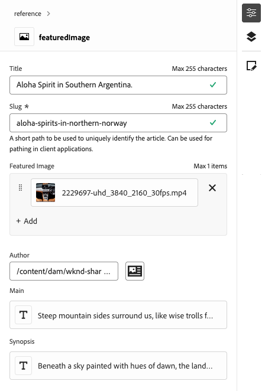

# 存取及導覽通用編輯器 {#navigating}

瞭解存取和導覽Universal Editor的基本知識。

## 簡介 {#introduction}

Universal Editor 支援在任意實作中編輯任何方面的內容，以便提供卓越的體驗、提高內容速度並提供最先進的開發人員體驗。

為此，Universal Editor 為內容作者提供直觀的 UI，只需要最基本的培訓就能立即進入狀況並開始編輯內容。本檔案說明如何導覽通用編輯器。

>[!TIP]
>
>* 如需有關使用通用編輯器編寫的詳細資訊，請參閱檔案[使用通用編輯器編寫內容](/help/sites-cloud/authoring/universal-editor/authoring.md)。
>* 如需Universal Editor的詳細介紹，請參閱[Universal Editor簡介](/help/implementing/universal-editor/introduction.md)。

## 準備應用程式 {#prepare-app}

為了使用 Universal Editor 編寫應用程式的內容，應用程式必須由開發人員進行檢測以支援編輯器。

>[!TIP]
>
>請參閱 [AEM 中 Universal Editor 快速入門](/help/implementing/universal-editor/getting-started.md)，了解設定 AEM 應用程式以使用 Universal Editor 的範例。

## 存取通用編輯器 {#accessing}

一旦將應用程式檢測為可使用通用編輯器後，您便可在AEM as a Cloud Service記憶體取通用編輯器，且無需存取AEM即可直接存取。

### 在AEM as a Cloud Service中存取 {#accessing-aem}

1. 登入您的AEM as a Cloud Service編寫執行個體。
1. 使用&#x200B;[**Sites**&#x200B;主控台](/help/sites-cloud/authoring/sites-console/introduction.md)瀏覽至與您要編輯的通用編輯器一起使用的頁面。
1. 編輯頁面。
1. 「通用編輯器」會開啟以編輯所選頁面。

>[!NOTE]
>
>在&#x200B;[**網站**&#x200B;主控台](/help/sites-cloud/authoring/sites-console/introduction.md)中編輯頁面時，主控台將開啟適合頁面[範本](/help/sites-cloud/authoring/page-editor/templates.md)的編輯器，可以是本檔案中說明的通用編輯器，或[頁面編輯器](/help/sites-cloud/authoring/page-editor/introduction.md)。

### 直接存取 {#accessing-directly}

1. 登入通用編輯器。 您需要Adobe ID才能登入，[才能存取通用編輯器](/help/implementing/universal-editor/getting-started.md#request-access)。

1. 登入後，請在[位置列](#location-bar)中輸入您要編輯的頁面URL，以便開始編輯文字內容或媒體內容等內容。

## 了解 UI {#ui}

UI分為以下幾個主要區域。

* [Experience Platform頂端導覽列](#experience-cloud-header)
* [通用編輯器工具列](#universal-editor-toolbar)
* [編輯器](#editor)
* [屬性面板](#properties-rail)

>[!TIP]
>
>通用編輯器提供許多[自訂選項](/help/implementing/universal-editor/customizing.md)和[擴充點](/help/implementing/universal-editor/extending.md)，可修改並新增至編輯器的功能。 因此，您可能會看到不同於此處記錄的標準選項。

### Experience Platform頂端導覽列 {#experience-cloud-header}

Experience Platform頂端導覽列一律會顯示在畫面頂端。 這是一個錨點，說明您在 Experience Cloud 中的位置，並幫助您導覽到其他 Experience Cloud 應用程式。

如需Experience Platform頂端導覽列的詳細資訊，請參閱[Adobe Experience Platform UI指南](https://experienceleague.adobe.com/zh-hant/docs/experience-platform/landing/platform-ui/ui-guide#top-navigation-bar)

#### 帳戶 {#user-properties}

點選或按一下帳戶圖示會開啟包含您使用者設定的功能表。

對於Universal Editor，在&#x200B;**Product Settings**&#x200B;標題下，有一個選項可在目前的Universal Editor生產版本和即將推出的預覽版本之間切換。

### 通用編輯器工具列 {#universal-editor-toolbar}

Universal Editor工具列永遠出現在熒幕頂端[Experience Cloud標題](#experience-cloud-header)的正下方。 它可讓您快速瀏覽至其他頁面以編輯及發佈目前頁面。

根據您的程式組態，它也可以呈現已由您的管理員啟用為擴充功能的[額外功能。](#additional-toolbar-buttons)

#### 首頁按鈕 {#home-button}

首頁按鈕可帶您回到通用編輯器的起始頁

在開始頁面上，您可以輸入要用通用編輯器編輯的網站URL。

>[!NOTE]
>
>您要使用通用編輯器編輯的任何頁面都必須進行[檢測以支援通用編輯器](/help/implementing/universal-editor/getting-started.md)。

「**快速連結**」區段提供您說明資源，「**最近**」區段提供您最近使用Universal Editor開啟之頁面的連結。

#### 位置列 {#location-bar}

位置列會顯示您正在編輯頁面的網址。選取「 」即可輸入其他頁面要編輯的位址。

>[!TIP]
>
>使用快速鍵`l` （字母l）開啟位址列。

>[!NOTE]
>
>您要使用通用編輯器編輯的任何頁面都必須進行[檢測以支援通用編輯器](/help/implementing/universal-editor/getting-started.md)。

#### 還原與重做 {#undo-redo}

選取「復原」或「重做」按鈕，以復原或重做編輯器中上次的編輯。 如需詳細資訊，請參閱檔案[使用通用編輯器編寫內容](/help/sites-cloud/authoring/universal-editor/authoring.md#undo-redo)。

>[!TIP]
>
>分別使用快速鍵`Command-Z`或`Shift-Command-Z`來復原或重做。

#### 本機開發人員登入 {#local-developer-login}

如果您需要在本機開發時輕鬆驗證本機的AEM SDK [，請選取本機開發人員登入圖示。](/help/implementing/universal-editor/local-dev.md)

#### 回應式模式 {#emulator}

選取回應式模式圖示以定義通用編輯器轉譯頁面的方式。

點選或按一下回應式模式圖示會顯示選項。

依預設，編輯器會在案頭版面配置中開啟，其中高度和寬度會由瀏覽器自動定義。

您也可以選擇在 Universal Editor 中模擬行動裝置：

* 定義其方向
* 定義寬度和高度
* 變更方向

#### 預覽 {#preview-mode}

在預覽模式下，在編輯器中呈現的頁面就是發佈服務所顯示的樣子。這可讓內容作者按一下連結等方式來導覽內容。

>[!TIP]
>
>使用快速鍵`p`切換至預覽模式，或切換自預覽模式。

#### 開啟頁面 {#open-page}

選取開啟頁面圖示，以在其本身的瀏覽器標籤中開啟您目前編輯的頁面，無須使用編輯器即可預覽您的內容。

>[!TIP]
>
>使用快速鍵`o` （字母o）開啟應用程式預覽。

>[!TIP]
>
>您應用程式[的預覽URL可以自訂](/help/implementing/universal-editor/customizing.md#custom-preview-urls)。

>[!NOTE]
>
>開啟頁面按鈕[可以停用](/help/implementing/universal-editor/customizing.md#open-page)，因此可能不會出現在您的編輯器中。

#### 發佈 {#publish}

選取發佈按鈕，以便將變更發佈到內容上線以供讀者使用或發佈到預覽環境以供稽核。

>[!TIP]
>
>請參閱檔案[使用通用編輯器發佈內容](publishing.md)，以取得使用通用編輯器發佈的詳細資訊。

>[!NOTE]
>
>發佈按鈕[可以停用](/help/implementing/universal-editor/customizing.md#disable-publish)，因此可能不會出現在您的編輯器中。

#### 省略符號 {#ellipsis}

可使用省略符號按鈕存取其他標準選項。

例如，可透過省略符號按鈕存取取消發佈頁面的功能（亦即反轉&#x200B;[**發佈**&#x200B;按鈕](#publish)的動作）。

#### 其他按鈕 {#additional-toolbar-buttons}

Universal Editor提供可自訂且可擴充的撰寫體驗。 如果您在工具列中看到其他按鈕，表示您的通用編輯器已擴展。

* 如需個別擴充功能如何運作的詳細資訊，[請參閱通用編輯器編寫檔案。](/help/sites-cloud/authoring/universal-editor/authoring.md#toolbar-options)
* 如需擴充功能的詳細資訊，請參閱[擴充通用編輯器。](/help/implementing/universal-editor/extending.md)
* 如需如何安裝個別擴充功能的詳細資訊，請參閱[Extension Manager檔案。](https://developer.adobe.com/uix/docs/extension-manager/extension-developed-by-adobe/)

### 編輯器 {#editor}

編輯器會佔據大部分視窗，而且是[位置列](#location-bar)中指定之頁面的呈現位置。

依預設，編輯器會開啟，以便您可以[就地或使用](/help/sites-cloud/authoring/universal-editor/authoring.md)屬性面板[編寫內容。](#properties-rail)

如果編輯器處於[預覽模式](#preview-mode)，內容將可供瀏覽，您可以關注連結，但您無法編輯內容。

### 屬性面板 {#properties-rail}

屬性面板會一直沿著編輯器的右側顯示。 視其模式而定，可能會顯示在內容或頁面內容之階層中選取的元件詳細資訊。

根據您的程式組態，它也可以呈現已由您的管理員啟用為擴充功能的[額外功能。](#additional-properties-panel-buttons)

#### 屬性模式 {#properties-mode}

在屬性模式中，面板會顯示編輯器中目前所選元件的屬性。 這是載入頁面時屬性面板的預設模式。

根據您選取的元件型別，詳細資訊可在「屬性」面板中顯示和修改。

並非所有元件都有可顯示及/或編輯的詳細資料。

>[!TIP]
>
>使用快速鍵 `d` 可切換至屬性模式。

#### 內容樹模式 {#content-tree-mode}

在內容樹狀結構模式中，面板會顯示頁面內容的階層。

* 在內容樹中選取一個項目時，編輯器會捲動到該內容並予以選取。
* 按兩下內容樹狀結構中的專案時，編輯器會捲動至該內容並選取它，同時在[屬性模式中開啟關聯的屬性。](#properties-mode)
* 在樹狀結構中的專案上按一下滑鼠右鍵時，將會開啟前後關聯功能表，其中包含該專案的適當動作。

>[!TIP]
>
>使用快速鍵 `f` 可切換至內容樹模式。

##### 在 CF 編輯器中開啟 {#edit}

編輯時，所選元件的選項會顯示在「屬性」面板中，您可以在此編輯所選元件。 如果選取的元件是內容片段，您也可以選取&#x200B;**在CF編輯器中開啟**&#x200B;按鈕。

點選或按一下&#x200B;**在CF編輯器中開啟**&#x200B;按鈕，在新索引標籤中開啟[內容片段編輯器](/help/assets/content-fragments/content-fragments-managing.md#opening-the-fragment-editor)。 這可讓您存取內容片段編輯器的完整功能，以編輯相關聯的內容片段。

根據工作流程的需求，您可能會想要在通用編輯器中或直接在內容片段編輯器中編輯內容片段。

>[!TIP]
>
>使用快速鍵`e`在內容片段編輯器中開啟選取的內容片段。

##### 新增 {#add}

如果您在內容樹或編輯器中選取容器元件，「屬性」面板上就會顯示「新增」選項。

點選或按一下新增按鈕會開啟元件的下拉式功能表，這些元件可用於[新增至選取的容器](/help/sites-cloud/authoring/universal-editor/authoring.md#adding-components)。

>[!TIP]
>
>使用快速鍵`a`將元件新增到選取的容器元件中。

##### 重複項目 {#duplicate}

如果在內容樹或編輯器中選取容器元件內的元件，屬性面板上會顯示重複選項。

點選或按一下重複按鈕[會重複選取的元件](/help/sites-cloud/authoring/universal-editor/authoring.md#duplicating-components)。

>[!TIP]
>
>使用快速鍵`Command+d`從容器中刪除選取的元件。

##### 刪除 {#delete}

如果在內容樹或編輯器中選取容器元件內的元件，屬性面板上會顯示刪除選項。

點選或按一下刪除按鈕[會刪除元件](/help/sites-cloud/authoring/universal-editor/authoring.md#deleting-components)。

>[!TIP]
>
>使用快速鍵`Shift+Backspace`從容器中刪除選取的元件。

##### 複製並貼上 {#copy-paste}

您可以複製並貼上[容器內的元件。](/help/implementing/universal-editor/field-types.md#container)

>[!TIP]
>
>分別使用快速鍵`Command-C`或`Command-V`來複製或貼上。

如需詳細資訊，請參閱檔案[使用通用編輯器編寫內容](/help/sites-cloud/authoring/universal-editor/authoring.md#copy-paste)。

#### 其他按鈕 {#additional-properties-panel-buttons}

Universal Editor提供可自訂且可擴充的撰寫體驗。 如果您在屬性面板中看到其他按鈕，表示您的通用編輯器已擴充。

* 如需個別擴充功能如何運作的詳細資訊，[請參閱通用編輯器編寫檔案。](/help/sites-cloud/authoring/universal-editor/authoring.md#properties-panel-options)
* 如需擴充功能的詳細資訊，請參閱[擴充通用編輯器。](/help/implementing/universal-editor/extending.md)
* 如需如何安裝個別擴充功能的詳細資訊，請參閱[Extension Manager檔案。](https://developer.adobe.com/uix/docs/extension-manager/extension-developed-by-adobe/)

## 後續步驟 {#next-steps}

現在您已經知道如何存取和瀏覽通用編輯器，您已經準備好可以使用它[編寫內容](/help/sites-cloud/authoring/universal-editor/authoring.md)。
