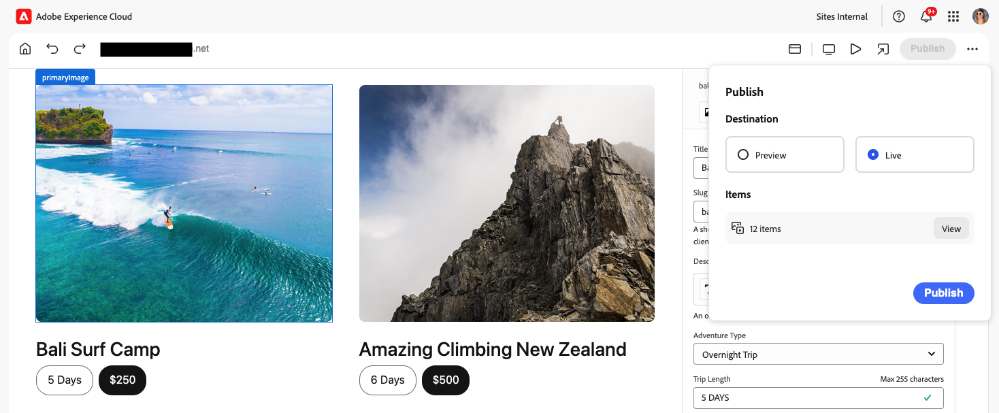

# 使用通用編輯器發佈內容 {#publishing}

了解 Universal Editor 如何發佈內容以及您的應用程式如何處理已發佈的內容。

>[!TIP]
>
>此處說明的發佈程式是Universal Editor的標準現成功能。
>
>通用編輯器也支援[擴充功能和UI擴充功能](/help/implementing/universal-editor/extending.md)，讓工作流程支援您的發佈程式，因此您的發佈流程可能會有所不同。

## 從通用編輯器發佈內容 {#publishing-content}

當您作為內容作者準備發佈您的內容時，您只需要點選或按一下通用編輯器工具列中的&#x200B;**發佈**&#x200B;圖示。

1. 在Universal Editor中，點選或按一下Universal Editor工具列中的[ **Publish**&#x200B;圖示。](/help/sites-cloud/authoring/universal-editor/navigation.md#publish)
1. 如果您有可用的[預覽服務](/help/sites-cloud/authoring/sites-console/previewing-content.md)，您可以選擇將內容發佈到的位置： **[預覽](/help/sites-cloud/authoring/sites-console/previewing-content.md)** （如果有的話）或&#x200B;**發佈**。
1. **專案**&#x200B;區段列出包含在出版物中的內容，包括：
   * **新的**&#x200B;專案尚未發佈。
   * 已發佈&#x200B;**已修改的**&#x200B;內容，但自上次發佈後已修改。
   * **已發佈**&#x200B;自該發佈以來未曾修改的內容。

   視需要點選或按一下這些專案旁的核取方塊，以包含/排除它們。 點選或按一下「延伸&#x200B;****」，檢視三個類別總計中包含的個別專案，以及能夠個別加入/排除它們。

   

   點選或按一下&#x200B;**專案**&#x200B;標題旁的返回箭頭可返回概觀。

1. 點選或按一下&#x200B;**發佈**&#x200B;以進行發佈，或點選或按一下&#x200B;**取消**&#x200B;以中止。

>[!NOTE]
>
>發佈到預覽[的選項可以停用](/help/implementing/universal-editor/customizing.md#publish-preview)，因此可能不會顯示在您的編輯器中。

## 從通用編輯器中取消發佈內容 {#unpublishing-content}

取消發佈內容的運作方式與發佈內容類似。 當您作為內容作者準備從出版物中移除內容時，請點選或按一下通用編輯器工具列中的省略符號圖示，然後&#x200B;**取消發佈**。

然後，您可以使用與[發佈內容時相同的選項來取消發佈內容。](#publishing-content)包括從預覽執行個體取消發佈（如果可用），以及要包含在取消發佈中的專案。

## 從網站主控台發佈與取消發佈 {#publishing-sites-console}

您也可以從Sites主控台](/help/sites-cloud/authoring/sites-console/publishing-pages.md)發佈[，當您想要發佈多個內容頁面，或排程發佈或取消發佈時，這會很有用。

## 其他資源 {#additional-resources}

若要瞭解如何使用通用編輯器編寫內容，請參閱本檔案。

* [使用 Universal Editor 編寫內容](authoring.md) - 了解內容作者使用 Universal Editor 建立內容有多簡單和直覺。

若要深入瞭解通用編輯器的技術細節，請參閱這些開發人員檔案。

* [Universal Editor 簡介](/help/implementing/universal-editor/introduction.md) - 了解 Universal Editor 如何在任意實作中編輯任何方面的內容，以便提供卓越的體驗、提高內容速度並提供最先進的開發人員體驗。
* [AEM 中 Universal Editor 快速入門](/help/implementing/universal-editor/getting-started.md) - 了解如何存取 Universal Editor，以及如何開始檢測您的第一個 AEM 應用程式以使用它。
* [Universal Editor 架構](/help/implementing/universal-editor/architecture.md) - 了解 Universal Editor 的架構，以及資料如何在其服務和階層之間流動。
* [屬性和類型](/help/implementing/universal-editor/attributes-types.md) - 了解 Universal Editor 需要的資料屬性和類型。
* [Universal Editor 驗證](/help/implementing/universal-editor/authentication.md) - 了解 Universal Editor 如何進行驗證。
