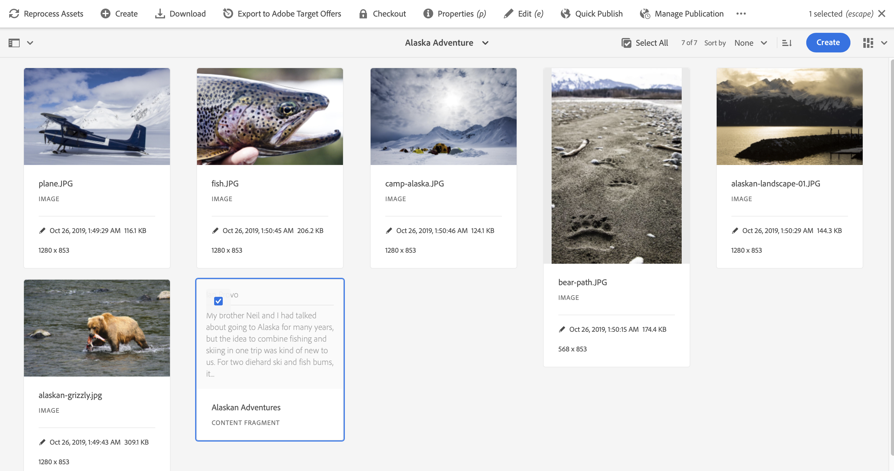

# 將內容片段匯出到 Adobe Target {#exporting-content-fragments-to-adobe-target}

>[!CAUTION]
>
>根據[與Adobe Target整合](/help/sites-cloud/integrating/integrating-adobe-target.md)下的指示，AEM必須與Adobe Target整合。

您可以在Adobe Experience Manager as a Cloud Service (AEM)中建立的[內容片段](/help/sites-cloud/authoring/fragments/content-fragments.md)匯出至Adobe Target (Target)。 然後，它們可以當作Target活動中的選件，以大規模測試並個人化體驗。

有一個選項可用於將內容片段匯出至Adobe Target：

* JSON：支援Headless內容傳送

<!-- * GraphQL query ??? -->

若要準備您的執行個體以將AEM內容片段匯出至Adobe Target，您需要：

* [整合Adobe Target](/help/sites-cloud/integrating/integrating-adobe-target.md)
* [新增雲端設定](#add-the-cloud-configuration)
* [新增舊組態](#add-the-legacy-configuration)

之後，您可以：

* [將內容片段匯出至Adobe Target](#exporting-a-content-fragment-to-adobe-target)
* [在Adobe Target中使用您的內容片段](#using-your-content-fragments-in-adobe-target)
* 以及[刪除已匯出至Adobe Target的內容片段](#deleting-a-content-fragment-already-exported-to-adobe-target)

內容片段可以匯出至Adobe Target中的預設工作區，或匯出至Adobe Target的使用者定義工作區。

>[!NOTE]
>
>Adobe Target本身並不存在Adobe Target工作區。 這些區段是在Adobe IMS (Identity Management系統)中定義和管理，然後使用Adobe Developer Console來選取用於各種解決方案。

>[!NOTE]
>
>Adobe Target工作區可用來允許組織（群組）的成員僅針對此組織建立和管理優惠方案及活動，不將存取權授予其他使用者。 例如，全球關注的國家/地區特定組織。

## 先決條件 {#prerequisites}

需要下列動作：

1. 您必須[整合AEM與Adobe Target](/help/sites-cloud/integrating/integrating-adobe-target.md)。

<!-- link rewriter - targets in content-fragments-customizing do not exist yet

1. Content Fragments are exported from the AEM author instance, so you need to [Configure the AEM Link Externalizer](/help/implementing/developing/extending/content-fragments-customizing.md#configuring-the-aem-link-externalizer) on the author instance to ensure that any references within the Content Fragment are externalized for web delivery.

   >[!NOTE]
   >
   >For link rewriting not covered by the default, the [Content Fragment Link Rewriter Provider](/help/implementing/developing/extending/content-fragments-customizing.md#the-content-fragment-link-rewriter-provider-html) is available. With this, customized rules can be developed for your instance.
-->

## 新增雲端設定 {#add-the-cloud-configuration}

在匯出片段之前，您需要將&#x200B;**Adobe Target**&#x200B;的&#x200B;**雲端設定**&#x200B;新增到片段或資料夾。 這也可讓您：

* 指定要用於匯出的格式選項
* 選取Target工作區作為目的地

可以在必要資料夾的&#x200B;**屬性**&#x200B;中選取必要選項；必要時會繼承規格。

1. 導覽至&#x200B;**Assets**&#x200B;主控台。

1. 開啟適當資料夾的&#x200B;**屬性**。

   >[!NOTE]
   >
   >如果您將雲端設定新增至內容片段父資料夾，設定將由所有子系繼承。

1. 選取「**雲端服務**」標籤。

1. 在「**Cloud Service設定**」下方，從下拉式清單中選取您的目標設定。

1. 選取您的Adobe Target工作區。

   例如：

   

1. **儲存並關閉**。

## 新增舊組態 {#add-the-legacy-configuration}

<!-- This is effectively the Manually Integrating with Adobe Target {#manually-integrating-with-adobe-target} section from 6.5 -->

>[!IMPORTANT]
>
>新增舊版設定是一種特殊情況，僅支援匯出內容片段。

在[新增雲端設定](#add-the-cloud-configuration)以使用Adobe Launch之後，若要將AEM與Adobe Target整合，您還需要使用舊版設定手動與Adobe Target整合。

### 建立Target雲端設定 {#creating-a-target-cloud-configuration}

若要啟用AEM以與Adobe Target互動，請建立Target雲端設定。 若要建立設定，您必須提供Adobe Target使用者端代碼和使用者認證。

您只會建立一次Target雲端設定，因為您可以將此設定與多個AEM行銷活動建立關聯。 如果您有多個Adobe Target使用者端代碼，請為每個使用者端代碼建立一個設定。

您可以設定雲端設定，以從Adobe Target同步區段。 如果您啟用同步，儲存雲端設定後，會立即在背景從Target匯入區段。

使用以下程式，在AEM中建立Target雲端設定：

1. 透過&#x200B;**AEM標誌** > **工具** > **雲端服務** > **舊版雲端服務**&#x200B;瀏覽至&#x200B;**舊版雲端服務**。
例如： ([http://localhost:4502/libs/cq/core/content/tools/cloudservices.html](http://localhost:4502/libs/cq/core/content/tools/cloudservices.html))

   **Adobe Experience Cloud**&#x200B;總覽頁面隨即開啟。

1. 在&#x200B;**Adobe Target**&#x200B;區段中，按一下&#x200B;**立即設定**。
1. 在&#x200B;**建立組態**&#x200B;對話方塊中：

   1. 為設定提供&#x200B;**標題**。
   1. 選取&#x200B;**Adobe Target設定**&#x200B;範本。
   1. 按一下「**建立**」。

您現在可以選取要編輯的新設定。

1. 編輯對話方塊隨即開啟。

   

   <!-- Can this still occur?

   >[!NOTE]
   >
   >When configuring A4T with AEM, you may see a Configuration reference missing entry. To be able to select the analytics framework, do the following:
   >
   >1. Navigate to **Tools** &gt; **General** &gt; **CRXDE Lite**.
   >1. Navigate to **/libs/cq/analytics/components/testandtargetpage/dialog/items/tabs/items/tab1_general/items/a4tAnalyticsConfig**
   >1. Set the property **disable** to **false**.
   >1. Select **Save All**.

   -->

1. 在&#x200B;**Adobe Target設定**&#x200B;對話方塊中，提供這些屬性的值。

   * **驗證**：此預設為IMS （已棄用使用者認證）

   * **使用者端代碼**： Target帳戶使用者端代碼

   * **租使用者識別碼**：租使用者識別碼

   * **IMS設定**：從下拉式清單中選取所需的設定

   * **API型別**：預設為REST （已棄用XML）

   * **A4T Analytics Cloud設定**：選取用於Target活動目標和量度的Analytics雲端設定。 如果您在鎖定目標內容時使用Adobe Analytics作為報表來源，則需要此專案。

     <!-- Is this needed?
     If you do not see your cloud configuration, see note in [Configuring A4T Analytics Cloud Configuration](#configuring-a-t-analytics-cloud-configuration).
     -->

   * **使用準確定位：**&#x200B;預設會選取此核取方塊。 如果選取，雲端服務設定將等待內容載入後再載入內容。 請參閱下列備註。

   * **從Adobe Target同步區段：**&#x200B;選取此選項可下載Target中定義的區段，以便在AEM中使用它們。 當「API型別」屬性為REST時，選取此選項，因為內嵌區段不受支援，而且您一律需要使用來自Target的區段。 ( AEM術語「區段」等同於Target「對象」。)

   * **使用者端資料庫：**&#x200B;此預設為AT.js （已棄用mbox.js）

     >[!NOTE]
     >
     >Target程式庫檔案[AT.JS](https://experienceleague.adobe.com/docs/target-dev/developer/client-side/at-js-implementation/at-js/how-atjs-works.html)是新的Adobe Target實作程式庫，專為典型Web實作和單頁應用程式而設計。
     >
     >mbox.js已過時，並將在稍後階段移除。
     >
     >Adobe建議您使用AT.js而非mbox.js作為使用者端資料庫。
     >
     >AT.js對mbox.js資料庫提供數項改善專案：
     >
     >* 改善Web實施的頁面載入時間
     >* 提升安全性
     >* 單頁應用程式的更佳實作選項
     >* AT.js包含target.js所包含的元件，因此不再需要呼叫target.js
     >
     >您可以在&#x200B;**使用者端資料庫**&#x200B;下拉式功能表中選取AT.js或mbox.js。

   * **使用Tag Management System來提供使用者端程式庫** — 選取此選項，即可使用Adobe Launch或其他標籤管理系統（或DTM，它已被取代）的使用者端程式庫。

   * **自訂AT.js**：瀏覽以上傳您的自訂AT.js。 留空將使用預設程式庫。

     >[!NOTE]
     >
     >依預設，當您選擇加入Adobe Target設定精靈時，會啟用「準確定位」 。
     >
     >準確定位表示雲端服務設定會等待內容載入後再載入內容。 因此，就效能而言，準確定位可能會在載入內容前造成幾毫秒的延遲。
     >
     >作者例項上一律會啟用「準確定位」 。 不過，在發佈執行個體上，您可以清除雲端服務設定(**http://localhost:4502/etc/cloudservices.html**)中「準確定位」旁的勾號，來選擇全域關閉準確定位。 無論您在雲端服務設定中的設定為何，您仍可開啟和關閉個別元件的準確定位。
     >
     >如果您有&#x200B;***已***&#x200B;建立的目標元件，而且您變更此設定，您的變更不會影響這些元件。 您必須直接對這些元件進行任何變更。

1. 按一下&#x200B;**連線至Adobe Target**&#x200B;以初始化與Target的連線。 如果連線成功，會顯示訊息&#x200B;**連線成功**。 在訊息上按一下&#x200B;**[確定]**，然後在對話方塊上按一下&#x200B;**[確定]**。

### 新增Target框架 {#adding-a-target-framework}

<!-- Is this section needed? -->

設定Target雲端設定後，請新增Target框架。 此架構會識別從可用的[ContextHub](/help/implementing/developing/personalization/configuring-contexthub.md)元件傳送至Adobe Target的預設引數。 Target會使用引數來決定套用至目前內容的區段。

您可以為單一Target設定建立多個架構。 如果您需要針對網站的不同區段傳送一組不同的引數至Target，則多個架構會很有用。 為您需要傳送的每組引數建立框架。 將網站的每個區段與適當的架構建立關聯。 請注意，一個網頁一次只能使用一個架構。

1. 在您的Target設定頁面上，按一下「可用設定」旁的&#x200B;**+** （加號）。

1. 在[建立架構]對話方塊中，指定&#x200B;**標題**，選取&#x200B;**Adobe Target架構**，然後按一下[建立]****。

   <!--  -->

   框架頁面隨即開啟。 Sidekick提供的元件代表來自[ContextHub](/help/implementing/developing/personalization/configuring-contexthub.md)的資訊，您可以對應這些元件。

   <!--  -->

1. 將代表您要用來對應之資料的「從屬端內容」元件拖曳至放置目標。 或者，將&#x200B;**ContextHub存放區**&#x200B;元件拖曳到架構。

   >[!NOTE]
   >
   >對應時，引數會透過簡單字串傳遞至mbox。 您無法從ContextHub對應陣列。

   例如，若要使用網站訪客的&#x200B;**設定檔資料**&#x200B;來控制Target促銷活動，請將&#x200B;**設定檔資料**&#x200B;元件拖曳至頁面。 可用於對應至Target引數的設定檔資料變數隨即顯示。

   <!--  -->

1. 選取適當欄中的&#x200B;**共用**&#x200B;核取方塊，以選取您要對Adobe Target系統可見的變數。

   <!--  -->

   >[!NOTE]
   >
   >同步引數是唯一方式 — 從AEM到Adobe Target。

您的框架隨即建立。 若要將架構復寫到發佈執行個體，請使用sidekick中的&#x200B;**啟動架構**&#x200B;選項。

<!--
### Associating Activities With the Target Cloud Configuration  {#associating-activities-with-the-target-cloud-configuration}

Associate your [AEM activities](/help/sites-cloud/authoring/personalization/activities.md) with your Target cloud configuration so that you can mirror the activities in [Adobe Target](https://experienceleague.adobe.com/docs/target/using/experiences/offers/manage-content.html).

>[!NOTE]
>
>What types of activities are available is determined by the following:
>
>* If the **xt_only** option is enabled on the Adobe Target tenant (clientcode) used on the AEM side to connect to Adobe Target, then you can create **only** XT activities in AEM.
>
>* If the **xt_only** options is **not** enabled on the Adobe Target tenant (clientcode), then you can create **both** XT and A/B activities in AEM.
>
>**Additional note:** **xt_only** options is a setting applied on a certain Target tenant (clientcode) and can only be modified directly in Adobe Target. You cannot enable or disable this option in AEM.
-->

<!--
### Associating the Target Framework With Your Site {#associating-the-target-framework-with-your-site}

After you create a Target framework in AEM, associate your web pages with the framework. The targeted components on the pages send the framework-defined data to Adobe Target for tracking. (See [Content Targeting](/help/sites-cloud/authoring/personalization/targeted-content.md).)

When you associate a page with the framework, the child pages inherit the association.

1. In the **Sites** console, navigate to the site that you want to configure.
1. Using either [quick actions](/help/sites-cloud/authoring/basic-handling.md#quick-actions) or [selection mode](/help/sites-cloud/authoring/basic-handling.md#selecting-resources), select **View Properties.**
1. Select the **Cloud Services** tab.
1. Select **Edit**.
1. Select **Add Configuration** under **Cloud Service Configurations** and select **Adobe Target**.

  

1. Select the framework you want under **Configuration Reference**.

   >[!NOTE]
   >
   >Make sure that you select the specific **framework** that you created and not the Target cloud configuration under which it was created.

1. Select **Done**.
1. Activate the root page of the website to replicate it to the publish server. (See [How To Publish Pages](/help/sites-cloud/authoring/sites-console/publishing-pages.md).)

   >[!NOTE]
   >
   >If the framework you attached to the page was not activated yet, a wizard opens which lets you publish it as well.
-->

## 將內容片段匯出至Adobe Target {#exporting-a-content-fragment-to-adobe-target}

>[!CAUTION]
>
>對於媒體資產（例如影像），只會將參考匯出至Target。 資產本身仍會儲存在AEM Assets中，並從AEM發佈例項傳送。
>
>因此，在匯出至Target之前，必須發佈包含所有相關資產的內容片段。

若要將內容片段從AEM匯出至Target （在指定雲端設定後）：

1. 在&#x200B;**Assets**&#x200B;主控台中導覽至您的內容片段。
1. 選取您要匯出至Target的內容片段。

1. 選取&#x200B;**匯出至Adobe Target選件**。

   

   <!-- this note does not seem to be accurate for CFs -->

   <!--
   
   >[!NOTE]
   >
   >If the Content Fragment has already been exported, select **Update in Adobe Target**.
   
   -->

1. 視需要選取&#x200B;**匯出而不發佈**&#x200B;或&#x200B;**發佈**。

   >[!NOTE]
   >
   >實際顯示的動作取決於片段和相關資產的狀態。
   >
   >如果所有內容皆已發佈，且之後未進行任何修改，則會略過此步驟。

   >[!NOTE]
   >
   >選取&#x200B;**發佈**&#x200B;將會立即發佈內容片段，並將其傳送至Target。

1. 在確認對話方塊中選取&#x200B;**確定**。

   您的內容片段現在應在Target中。

   >[!NOTE]
   >
   >[匯出的各種詳細資料](/help/sites-cloud/authoring/fragments/content-fragments.md#details-of-your-content-fragment)可在主控台的&#x200B;**清單檢視**&#x200B;和&#x200B;**內容**&#x200B;中看見。

   >[!NOTE]
   >
   >在Adobe Target中檢視內容片段時，看到的&#x200B;*上次修改*&#x200B;日期是上次在AEM中修改片段的日期，而非上次將片段匯出至Adobe Target的日期。

>[!NOTE]
>
>或者，您可以使用[頁面資訊](/help/sites-cloud/authoring/page-editor/introduction.md#page-information)功能表中的類似命令，從頁面編輯器執行匯出。

## 在Adobe Target中使用內容片段 {#using-your-content-fragments-in-adobe-target}

執行先前的工作後，內容片段會顯示在Target的「選件」頁面中。 請參閱[特定的Target檔案](https://experienceleague.adobe.com/docs/target/using/integrate/aem/fragments/content-fragments-aem.html)，瞭解您可以達到的目標。

>[!NOTE]
>
>在Adobe Target中檢視內容片段時，看到的&#x200B;*上次修改*&#x200B;日期是上次在AEM中修改片段的日期，而非上次將片段匯出至Adobe Target的日期。

## 刪除已匯出至Adobe Target的內容片段 {#deleting-a-content-fragment-already-exported-to-adobe-target}

就像匯出一樣，一旦選取片段，您也可以從&#x200B;**Assets**&#x200B;主控台的頂端工具列選取從Adobe Target刪除內容片段：

在Adobe Target

如果片段已用於Target的選件，刪除已匯出至Target的內容片段可能會導致問題。 刪除片段會導致選件無法使用，因為AEM正在傳送片段內容。

<!-- if the information about deleting-if-used correct, or is it not allowed at all? -->

若要避免此類情況：

* 如果內容片段目前未用於活動中，AEM可讓使用者刪除片段而不顯示警告訊息。
* 如果Target中的活動目前正在使用內容片段，則會出現錯誤訊息，警告AEM使用者刪除片段可能會對活動造成的後果。

  AEM中的錯誤訊息不會禁止使用者（強制）刪除內容片段。 如果刪除內容片段：

   * 具有AEM內容片段的Target選件可能會顯示不良行為

      * 由於內容片段已推送至Target，因此選件很可能仍會呈現
      * 如果也在AEM中刪除了參照的資產，內容片段中的任何參照都無法正常運作。

   * 當然，由於內容片段在AEM中已不存在，因此無法再對內容片段進行任何修改。

## 其他資源 {#further-resources}

如需詳細資訊，請參閱下列內容：

<!--
* [Creating a Target Cloud Configuration](/help/sites-cloud/integrating/integrating-adobe-target.md#create-configuration)
-->

* [核心元件 — 內容片段](https://experienceleague.adobe.com/docs/experience-manager-core-components/using/wcm-components/content-fragment-component.html)

* [Adobe Target開發](https://developers.adobetarget.com/)

* [Adobe Target — 在Target活動中使用AEM內容片段，以輔助最佳化或個人化](https://experienceleague.adobe.com/docs/target/using/integrate/aem/fragments/content-fragments-aem.html)

* [Adobe Target - AEM體驗片段和內容片段概觀](https://experienceleague.adobe.com/docs/target/using/integrate/aem/fragments/aem-experience-and-content-fragments.html)
