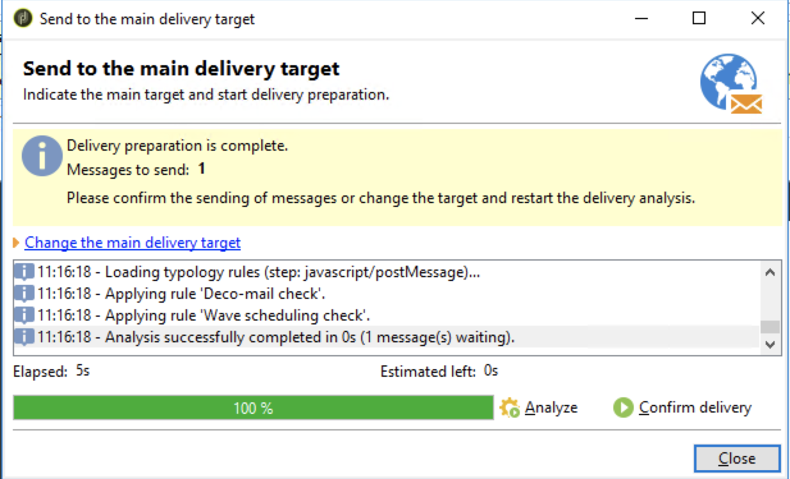

# 建立Adobe Experience Manager通訊 {#creating-newsletter}

在執行下面介紹的步驟之前，首先需要 [整合](/help/sites-cloud/integrating/integrating-campaign-classic.md) Adobe Campaign Classic和AEMas a Cloud Service。 配置了Adobe Campaign Classic和AEMas a Cloud Service後，您現在將學習如何建立Adobe Experience Manager新聞稿。

1. 在作AEM者實例中，按一下頁面左上側的Adobe Experience Manager徽標，然後選擇 **站點**。
1. 選擇市場活動，按一下 **建立→頁**。
   
1. 選擇品牌，然後按一下 **下一個**。
1. 輸入標題並按一下 **建立** 和 **完成**。
1. 要建立「市場活動」頁，請轉到 **市場活→AdobeDemo→Master** 按一下 **建立→頁**。
   
1. 選擇市場活動模板，然後按一下 **下一個** 和 **完成**。
1. 輸入標題，按一下 **建立** 和 **完成**。
1. 轉到 **市場活→AdobeDemo→Master** 並選中「市場活動頁」複選框。 按一下 **屬性** 左上角。
   
1. 轉到 **Cloud Service** 頁籤：
   * 從「Cloud Service配置」下拉清單中選擇「Adobe Campaign」。
   * 選擇所需的Adobe Campaign配置名稱。
   * **保存** 和 **關閉**。
1. 要建立Adobe Campaign Classic電子郵件頁面，請轉到 **市場活→AdobeDemo→Master→CampaignPage** 按一下 **建立→頁**。
1. 選擇Adobe Campaign電子郵件（例如AC 6.1）模板，然後按一下 **下一個**。
1. 在「建立」頁面中，輸入新聞簡報的標題，按一下 **建立** 和 **完成**。
1. 轉到 **市場活→AdobeDemo→Master→CampaignPage**，選中「Campaign Classic」複選框，然後按一下 **編輯** 開啟電子郵件頁面。
1. 根據您的要求編輯Adobe Campaign Classic電子郵件新聞稿頁面。
1. 按一下 **頁面資訊** 按鈕，然後按一下 **發佈頁面**。
1. 選擇必須發佈頁面的配置。 按一下 **發佈**。
   
1. 新聞稿頁面已發佈在發佈實例上，也發佈在AEMAdobe Campaign Classic配置上。
   * 現在，通訊頁面將在Adobe Campaign Classic
1. 按一下「頁面資訊」按鈕，然後按一下 **啟動工作流**。
1. 選擇 **批准Adobe Campaign** 作為工作流模型，然後按一下 **啟動工作流** 按鈕
1. 免責聲明顯示在頁面頂部。 按一下 **完成** 確認審閱，然後再次按一下 **確定**。
1. 按一下 **完成** 選擇 **新聞稿審批** 在「下一步」(Next Step)下拉清單中，按一下 **確定** 按鈕

## 建立收件人 {#creating-recipient}

1. 使用Adobe Campaign Classic客戶端控制台開啟Adobe Campaign Classic伺服器。
1. 轉到「瀏覽器」視圖。
1. 在左側的樹視圖中，轉到「配置檔案」和「目標」，然後選擇 **收件人**。
   
1. 填寫收件人的詳細資訊。
   * 輸入名。
   * 輸入姓氏。
   * 輸入電子郵件。
   * 按一下「**儲存**」。

## 在Adobe Campaign Classic建立電子郵件傳遞 {#create-delivery}

1. 使用Adobe Campaign Classic客戶端控制台開啟Adobe Campaign Classic伺服器。
1. 轉到「瀏覽器」視圖。
1. 在左側的樹視圖中，選擇 **Campaign Management** 選擇 **交貨**。
1. 在右上角，按一下 **新建**。
1. 選擇 **帶內容的電子郵AEM件傳遞** 從「交貨模板」(Delivery template)下拉清單中，按一下 **繼續**。
1. 按一下「電子郵件參數」下的「發件人」連結。
   * 輸入發件人地址。
   * 輸入「自」欄位。
   * 按一下&#x200B;**「確定」**。
1. 按一下 **至** 按一下 **添加** 在「選擇目標」螢幕上。
1. 選擇 **收件人** 按一下 **下一個**。
   
1. 選擇建立的收件人 [先前](#creating-recipient) 按一下 **完成**。
1. 已選擇收件人。 按一下&#x200B;**「確定」**。
1. 按一下 **同春尼澤**。
1. 從清單中選擇電子郵件頁面，按一下 **確定**。
1. 電子郵件模板已同步。 按一下 **刷新內容** 的子菜單。
1. 按一下 **發送** 發送電子郵件。
1. 在下一螢幕上，選擇 **盡快交貨** 然後按一下 **分析**。
   
1. 現在，在建立交貨後，按一下 **確認交貨** 開始發送電子郵件。 按一下 **是** 確認。
   
1. 已開始傳送。 按一下&#x200B;**關閉**。
1. 按一下 **保存** 保存交貨。
