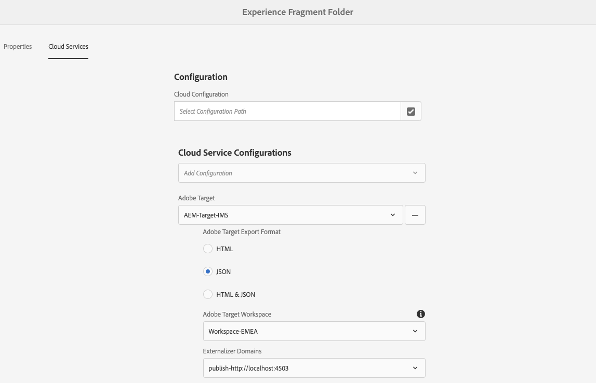

# 將體驗片段導出到Adobe Target{#exporting-experience-fragments-to-adobe-target}

>[!CAUTION]
>
>* 「AEM體驗片段」(Experience Fragments)將導出到Adobe Target的預設工作區。
>* 必AEM須按照Adobe Target [與Adobe Target整合](/help/sites-cloud/integrating/integrating-adobe-target.md)。

可以導出 [體驗片段](/help/sites-cloud/authoring/fundamentals/experience-fragments.md)，建立於Adobe Experience Manager as a Cloud Service(AEM)，建立至Adobe Target（目標）。 然後，它們可以用作目標活動中的優惠，以test和個性化規模體驗。

有三種格式選項可用於將體驗片段導出到Adobe Target:

* HTML（預設）:支援Web和混合內容交付
* JSON:支援無頭內容交付
* HTML 和 JSON

之後 [與Adobe Target整合](/help/sites-cloud/integrating/integrating-adobe-target.md) 可AEM以將「體驗片段」導出到Adobe Target的預設工作區，或導出到Adobe Target的用戶定義的工作區。

>[!NOTE]
>
>Adobe Target工作區在Adobe Target本身不存在。 它們在Adobe IMS(Identity Management系統)中定義和管理，然後使用Adobe I/O整合選擇用於解決方案。

>[!NOTE]
>
>Adobe Target工作區可用於僅允許組織（組）的成員建立和管理此組織的聘用和活動；不允許其他用戶訪問。 例如，全球關注的具體國家組織。

>[!NOTE]
>
>有關詳細資訊，請參閱：
>
>* [Adobe Target開發](https://www.adobe.io/apis/experiencecloud/target.html)
>* [核心元件 — 體驗片段](https://experienceleague.adobe.com/docs/experience-manager-core-components/using/introduction.html?lang=zh-Hant)
>* [Adobe Target — 如何使用Adobe Experience Manager(AEM)體驗碎片？](https://experienceleague.adobe.com/docs/target/using/experiences/offers/aem-experience-fragments.html?lang=en)

## 必備條件 {#prerequisites}

需要執行以下各種操作：

1. 你必須 [與AEMAdobe Target](/help/sites-cloud/integrating/integrating-adobe-target.md)。
2. 從作者實例導出AEM「體驗片段」，因此您需要 [配置鏈AEM接外部化程式](/help/implementing/developing/extending/experience-fragments.md#configuring-the-aem-link-externalizer) 在作者實例上，以確保將體驗片段中的任何引用外部化以用於Web傳遞。

   >[!NOTE]
   >
   >對於預設不覆蓋的連結重寫， [體驗片段連結重寫器提供程式](/help/implementing/developing/extending/experience-fragments.md#the-experience-fragment-link-rewriter-provider-html) 的子菜單。 利用此功能，可以為實例開發自定義規則。

## 添加雲配置 {#add-the-cloud-configuration}

導出片段之前，需要添加 **雲配置** 為 **Adobe Target** 資料夾。 這還允許您：

* 指定要用於導出的格式選項
* 選擇目標工作區作為目標
* 選擇外部化程式域以重寫「體驗片段」中的引用（可選）

可在中選擇所需選項 **頁面屬性** 資料夾和/或片段；將根據需要繼承規範。

1. 導航到 **體驗片段** 控制台。

1. 開啟 **頁面屬性** 資料夾或檔案段。

   >[!NOTE]
   >
   >如果將雲配置添加到「體驗片段」父資料夾，則所有子資料夾都繼承該配置。
   >
   >
   >如果將雲配置添加到體驗片段本身，則所有變數都會繼承該配置。

1. 選擇 **Cloud Services** 頁籤。

1. 下 **Cloud Service配置**&#x200B;選中 **Adobe Target** 從下拉清單中。

   >[!NOTE]
   >
   >可以自定義體驗片段提供的JSON格式。 要執行此操作，請定義客戶體驗片段元件，然後注釋如何在元件Sling模型中導出其屬性。
   >
   >請參閱核心元件：
   >
   >[核心元件 — 體驗片段](https://experienceleague.adobe.com/docs/experience-manager-core-components/using/components/experience-fragment.html)

   下 **Adobe Target** 選擇：

   * 適當的配置
   * 所需格式選項
   * Adobe Target工作區
   * 如果需要 — 外部化程式域

   >[!CAUTION]
   >
   >外部化器域是可選的。
   >
   > 當希AEM望導出的內容指向特定內容時，將配置外部化器 *發佈* 。 有關詳細資訊，請參閱 [配置鏈AEM接外部化器](/help/implementing/developing/extending/experience-fragments.md#configuring-the-aem-link-externalizer)。
   >
   > 另請注意，外部化程式域僅與發送到目標的體驗片段的內容相關，而不與元資料（如查看服務內容）相關。

<!--
   For example, for a folder:

   
-->

1. **儲存並關閉**.

## 將體驗片段輸出到Adobe Target {#exporting-an-experience-fragment-to-adobe-target}

>[!CAUTION]
>
>對於介質資產（如影像），只有引用會導出到目標。 資產本身仍保存在AEM Assets，並從發佈實例AEM交付。
>
>因此，在導出到目標之前，需要發佈包含所有相關資產的「體驗」片段。

要將體驗片段從導AEM出到目標（指定雲配置後）:

1. 導航到「體驗片段」控制台。
1. 選擇要導出到目標的體驗片段。

   >[!NOTE]
   >
   >它必須是體驗片段網頁變體。

1. 點擊/按一下 **對Adobe Target的出口**。

   >[!NOTE]
   >
   >如果已導出體驗片段，請選擇 **更新Adobe Target**。

1. 點擊/按一下 **導出而不發佈** 或 **發佈** 按需要。

   >[!NOTE]
   >
   >選擇 **發佈** 將立即發佈體驗片段並將其發送到目標。

1. 點擊/按一下 **確定** 的子菜單。

   您的體驗片段現在應位於目標中。

   >[!NOTE]
   >
   >[各種詳細資訊](/help/sites-cloud/authoring/fundamentals/experience-fragments.md#details-of-your-experience-fragment) 可在 **清單視圖** 控制台和 **屬性**。

   >[!NOTE]
   >
   >在Adobe Target觀看體驗片段時， *上次修改* 可見的日期是上次修改片段的日期AEM，而不是上次將片段導出到Adobe Target的日期。

>[!NOTE]
>
>或者，也可以使用 [頁面資訊](/help/sites-cloud/authoring/fundamentals/environment-tools.md#page-information) 的子菜單。

## 用你在Adobe Target的經驗片段 {#using-your-experience-fragments-in-adobe-target}

執行上述任務後，體驗片段將顯示在「目標」中的「優惠」頁上。 請看 [特定目標文檔](https://experiencecloud.adobe.com/resources/help/en_US/target/target/aem-experience-fragments.html) 瞭解你能在那裡取得什麼成就。

>[!NOTE]
>
>在Adobe Target觀看體驗片段時， *上次修改* 可見的日期是上次修改片段的日期AEM，而不是上次將片段導出到Adobe Target的日期。

## 刪除已導出到Adobe Target的體驗片段 {#deleting-an-experience-fragment-already-exported-to-adobe-target}

如果刪除已導出到目標的體驗片段，則如果該片段已在目標中的優惠中使用，則可能會導致問題。 如果刪除片段，則當片段內容由傳遞時，將導致提供不可用AEM。

為避免此類情況：

* 如果活動中當前未使用體驗片段，則AEM允許用戶刪除該片段而不顯示警告消息。
* 如果「目標」中的活動當前正在使用「體驗片段」，則會出現一條錯誤消息AEM，警告用戶刪除該片段可能對活動造成的後果。

   中的錯誤AEM消息不禁止用戶（強制）刪除體驗片段。 如果刪除了「體驗」片段：

   * 具有經驗片段的目AEM標產品可能顯示不期望的行為

      * 隨著將「體驗片段」HTML推到「目標」，此報價可能仍將呈現
      * 如果中也刪除了引用的資產，則「體驗」片段中的任何引用可能AEM無法正確工作。
   * 當然，對經驗片段的任何進一步修改都是不可能的，因為經驗片段在中已不存AEM在。
